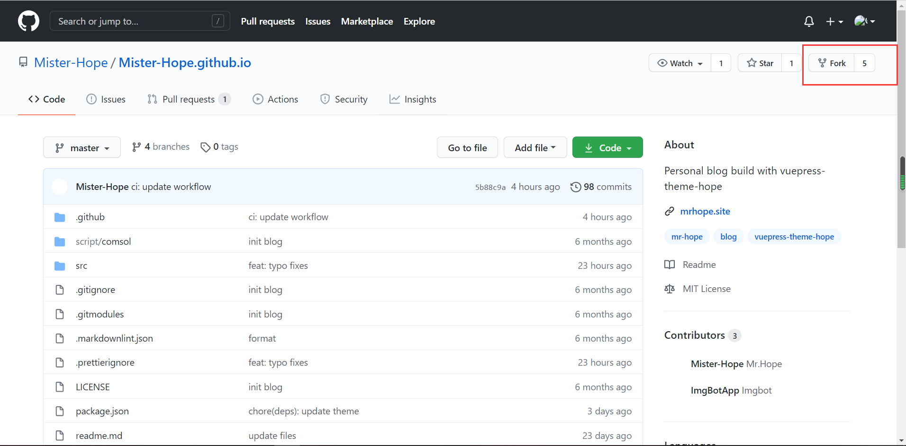
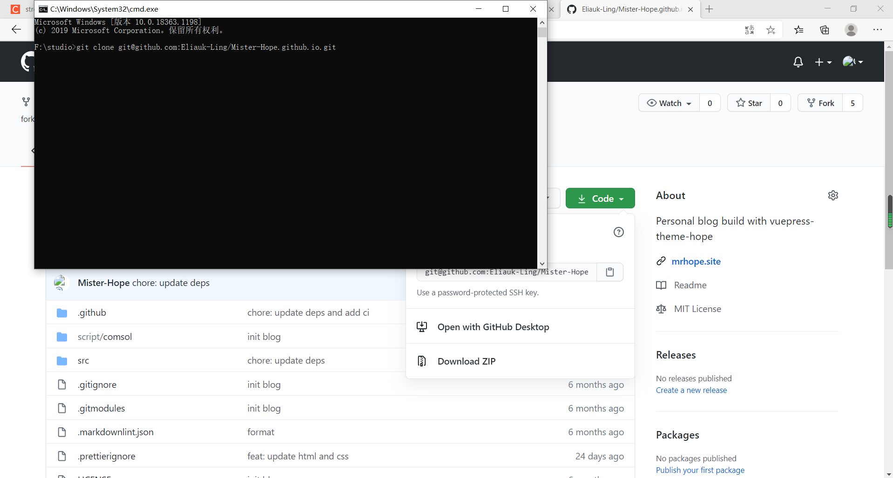
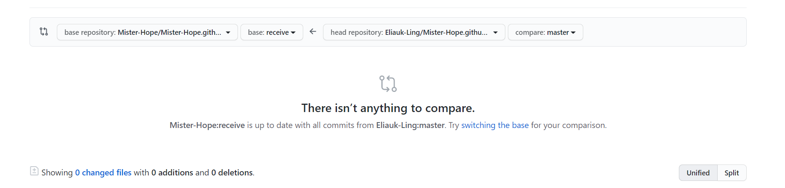
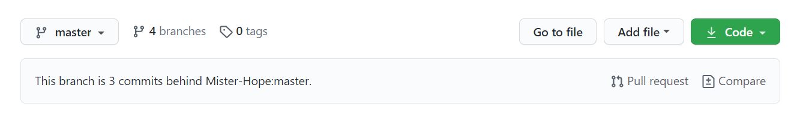

# 关于Fork, pr, commit与semantic的介绍

## Fork与提交pr

### Fork简介

  GitHub中Fork是服务端的代码仓库克隆（即 新克隆出来的代码仓库在远

  程服务端），包含了原来的仓库（即upstream repository，上游仓库）
  
  所有内容，如分支、Tag、提交。代码托管服务（如Github，
  
  BitBucket）提供了方便的完成Fork操作的功能（在仓库页面点一下Fork
  
  按钮）。这样有了一个你自己的可以自由提交的远程仓库，然后可以通过
  
  的 Pull Request 把你的提交贡献回 原仓库。

### Fork与pr的操作

#### 向上游仓库fork与pr操作

  1. 在仓库的右上角点击`fork`，选择自己的仓库，就可以在自己的仓库中建立一个项目；

      

  2. 将fork后的仓库`clone`到本地（在本地文件夹使用`git clone 仓库的SSH`）

      

  3. 在本地更改代码，并同步github的更改，在github上（自己的库）发起 `pull request`

  

#### 从上游仓库更新自己fork的仓库

  1. 注意到类似提示："`This branch is 3 commits behind Mister-Hope:master.`" 表示我们fork的那个分支和我们仓库的当前分支比向前了3个提交。

  如果我们想要和上游仓库的代码保持同步更新的话，可以从上游仓库那里把那个拉过来。

2. 点击`pull request`,交换`base fork`与`head fork`,变成我们拉上游仓库的分支，然后发起一个pr

3. 之后点击`merge pull request`完成更新

### 规范pr title与commit

#### 为什么要规范pr title与commit message

规范的commit信息首先提供了更多的历史信息，方便快速浏览。其次，可以过滤某些commit（比如文档改动），便于快速查找信息。

#### pr title与commit message的格式

`<type> (<scope>) : <subject>`

`<body>`

`<footer>`

分别对应Commit message的三个部分：`Header` `Body` `Footer`

##### Header（pr title）

Header部分只有一行，包括三个字段 `<type>`(必需)、`<scope>`(可选)和`<subject>`(必需)

  1. `type`: 用于说明commit的类型。一般分为以下几个类型：

     1. `feat`: 新增功能
     2. `fix` : 修复bug
     3. `docs`: 仅仅修改了文档，如`readme.md`
     4. `style`: 仅仅是对格式进行修改，如逗号、缩进、空格等，不改变代码逻辑
     5. `refactor`: 代码重构，没有新增功能或修复bug

     6. `perf`: 优化相关，如提升性能、用户体验等
     7. `test`: 测试用例，包括单元测试，集成测试
     8. `chore`: 改变构建流程、或者增加依赖库，工具等
     9. `revert`: 版本回滚

  2. `scope`: 用于说明commit影响的范围，比如：`views,component,utils,test`

  3. `subject`: commit目的的简短描述

##### Body

对本次commit修改内容的具体描述，可以分为多行。

##### Footer

一些备注，通常是`BREAKING CHANGE`(当前代码与上一个版本不兼容)或修复的bug（关闭issue）的链接。

## Semantic库介绍

`Semantic`是一个`Haskell`库，用于解析、对比、解释多种编程语言，目前该库支持`JS`、`TS`、`Python`、`Ruby`、和`Go`等多种语言。

### 解析

该库通过语义解析为路径生成解析数，支持生成`s-expression`解析树、`JSON`解析树、`JSON`邻接表、`JSON`符号表等

### 对比

该库通过语义对比计算路径之间的变化，支持生成`s-expression diff tree`、`JSON diff tree`等。

### Graph

该库用于通过语义图计算目录或顶点入口点模块的图，支持`import graph`、`call graph`、`JSON graph`等

### 技术与架构

从架构上来说，Semantic库可以：

  1. 读`blob`

  2. 用`tree-sitter`生成这些`blob`的解析树，`tree-sitter`是一种用于编程工具的增量解析系统

  3. 将这些树分配至语法的泛型表示中

  4. 执行分析、计算差异或仅返回解析树

  5. 以支持的格式渲染输出
