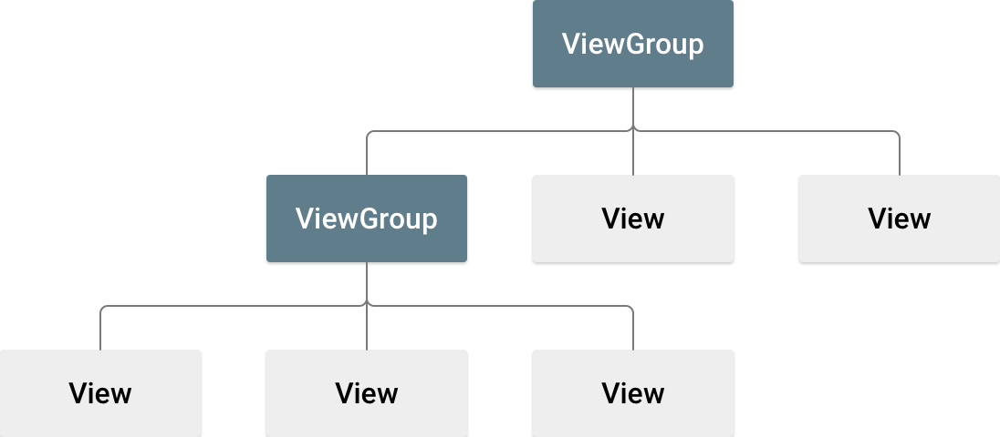
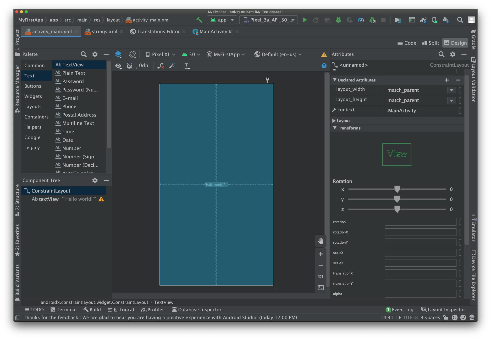
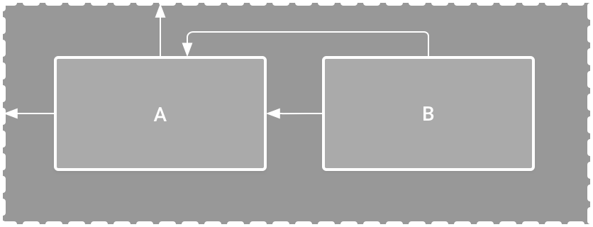

在本节课中，您将学习如何使用 Android Studio 布局编辑器创建包含一个文本框和一个按钮的布局。这将为下一课打下基础，下节课将学习如何在点按该按钮时让应用将文本框的内容发送到其他 activity。

<!-- more -->

Android 应用的界面 (UI) 以布局和微件的层次结构形式构建而成。布局是 ViewGroup 对象，即控制其子视图在屏幕上的放置方式的容器。微件是 View 对象，即按钮和文本框等界面组件。

Android 提供了 ViewGroup 和 View 类的 XML 词汇表，因此界面的大部分内容都在 XML 文件中定义。不过，本节课将向您介绍如何使用 Android Studio 的布局编辑器创建布局，而不是教您编写 XML 代码。布局编辑器会在您拖放视图构建布局时为您编写 XML 代码。

## 打开布局编辑器

首先，请按照以下步骤设置工作区：

1. 在 Project 窗口中，依次打开 app > res > layout > activity_main.xml。
1. 若要给布局编辑器留出空间，请隐藏 Project 窗口。为此，请依次选择 View > Tool Windows > Project，或直接点击 Android Studio 屏幕左侧的 Project。
1. 如果您的编辑器显示 XML 源代码，请点击窗口右上角的 Design 标签页。
1. 点击 (Select Design Surface)，然后选择 Blueprint。
1. 点击布局编辑器工具栏中的 (View Options)，并确保选中 Show All Constraints。
1. 确保 Autoconnect 处于关闭状态。当 Autoconnect 处于关闭状态时，工具栏中的提示会显示 (Enable Autoconnection to Parent)。
1. 点击工具栏中的 (Default Margins)，然后选择 16。如果需要，您可以稍后调整每个视图的外边距。
1. 点击工具栏中的 (Device for Preview)，然后选择 5.5, 1440 × 2560, 560 dpi (Pixel XL)。

您的布局编辑器现在如下图所示。

左下方的 Component Tree 面板显示布局的视图层次结构。在本例中，根视图是 ConstraintLayout，它仅包含一个 TextView 对象。

ConstraintLayout 是一种布局，它根据同级视图和父布局的约束条件定义每个视图的位置。这样一来，使用扁平视图层次结构既可以创建简单布局，又可以创建复杂布局。这种布局无需嵌套布局。嵌套布局是布局内的布局（如图 2 所示），会增加绘制界面所需的时间。

例如，您可以声明以下布局，如下图所示：

- 视图 A 距离父布局顶部 16 dp。
- 视图 A 距离父布局左侧 16 dp。
- 视图 B 距离视图 A 右侧 16 dp。
- 视图 B 与视图 A 顶部对齐。

## 添加文本框

请按照下面的步骤添加文本框：

1. 首先，您需要移除布局中已有的内容。在 Component Tree 面板中点击 TextView，然后按 Delete 键。
1. 在 Palette 面板中，点击 Text 以显示可用的文本控件。
1. 将 Plain Text 拖动到设计编辑器中，并将其放在靠近布局顶部的位置。这是一个接受纯文本输入的 EditText 微件。
1. 点击设计编辑器中的视图。现在，您可以在每个角上看到调整视图大小的正方形手柄，并在每个边上看到圆形约束锚点。为了更好地控制，您可能需要放大编辑器。为此，请使用布局编辑器工具栏中的 Zoom 按钮。
1. 点击并按住顶边上的锚点，将其向上拖动，直至其贴靠到布局顶部，然后将其释放。这是一个约束条件：它会将视图约束在已设置的默认外边距内。在本例中，您将其设置为距离布局顶部 16 dp。
1. 使用相同的过程创建一个从视图左侧到布局左侧的约束条件。

## 添加按钮

1. 在 Palette 面板中，点击 Buttons。
1. 将 Button 微件拖到设计编辑器中，并将其放在靠近右侧的位置。
1. 创建一个从按钮左侧到文本框右侧的约束条件。
1. 如需按水平对齐约束视图，请创建一个文本基线之间的约束条件。为此，请右键点击按钮，然后选择 Show Baseline 在布局编辑器中显示基准操作。基线锚点显示在按钮内部。点击并按住此锚点，然后将其拖动到相邻文本框中显示的基线锚点上。

::: tip

您还可以根据顶边或底边实现水平对齐。但按钮的图片周围有内边距，因此如果以这种方式对齐，那么它们看上去是没有对齐的。

:::

## 更改界面字符串

若要预览界面，请点击工具栏中的 (Select Design Surface)，然后选择 Design。请注意，文本输入和按钮标签应设置为默认值。

若要更改界面字符串，请按以下步骤操作：

1. 打开 Project 窗口，然后打开 app > res > values > strings.xml。

   这是一个字符串资源文件，您可在此文件中指定所有界面字符串。您可以利用该文件在一个位置管理所有界面字符串，使字符串的查找、更新和本地化变得更加容易。

1. 点击窗口顶部的 Open editor。此时将打开 Translations Editor，它提供了一个可以添加和修改默认字符串的简单界面。它还有助于让所有已翻译的字符串井然有序。

1. 点击 (Add Key) 可以创建一个新字符串作为文本框的“提示文本”。此时会打开如图 7 所示的窗口。

   在 Add Key 对话框中，完成以下步骤：

   - 在 Key 字段中输入“edit_message”。
   - 在 Default Value 字段中输入“Enter a message”。
   - 点击 OK。

1. 再添加一个名为“button_send”且值为“Send”的键。

现在，您可以为每个视图设置这些字符串。若要返回布局文件，请点击标签页栏中的 activity_main.xml。然后，添加字符串，如下所示：

1. 点击布局中的文本框。如果右侧还未显示 Attributes 窗口，请点击右侧边栏上的 Attributes。
1. 找到 text 属性（当前设为“Name”）并删除相应的值。
1. 找到 hint 属性，然后点击文本框右侧的 (Pick a Resource)。在显示的对话框中，双击列表中的 edit_message。
1. 点击布局中的按钮，找到其 text 属性（当前设为“Button”）。然后点击 (Pick a Resource)，并选择 button_send。

## 让文本框大小可灵活调整

若要创建一个适应不同屏幕尺寸的布局，您需要让文本框拉伸以填充去除按钮和外边距后剩余的所有水平空间。

继续操作之前，请点击工具栏中的 (Select Design Surface)，然后选择 Blueprint。

若要让文本框大小可灵活调整，请按以下步骤操作：

1. 选择两个视图。若要执行此操作，请点击一个视图，在按住 Shift 键的同时点击另一个视图，然后右键点击任一视图并依次选择 Chains > Create Horizontal Chain。布局随即显示出来，如图 8 所示。

   ::: info

   链是两个或多个视图之间的双向约束条件，可让您采用一致的方式安排链接的视图。

   :::

1. 选择按钮并打开 Attributes 窗口。然后使用 Constraint Widget 将右外边距设为 16 dp。
   点击文本框以查看其属性。然后，点击宽度指示器两次，确保将其设置为锯齿状线 (Match Constraints)，如图 9 中的标注 1 所示。

1. “Match constraints”表示宽度将延长以符合水平约束条件和外边距的定义。因此，文本框将拉伸以填充去除按钮和所有外边距后剩余的水平空间。

## 运行应用

如果已在上一课中将您的应用安装到设备上，只需点击工具栏中的 (Apply Changes)，即可使用新布局更新应用。或者点击 Run 'app' 以安装并运行应用。
