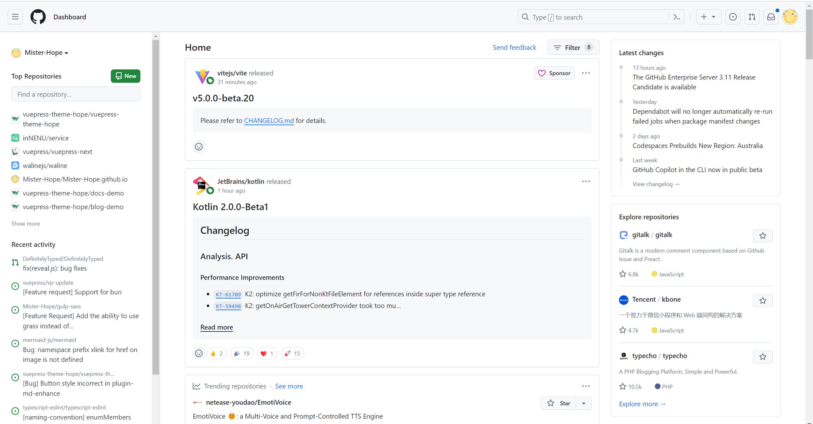
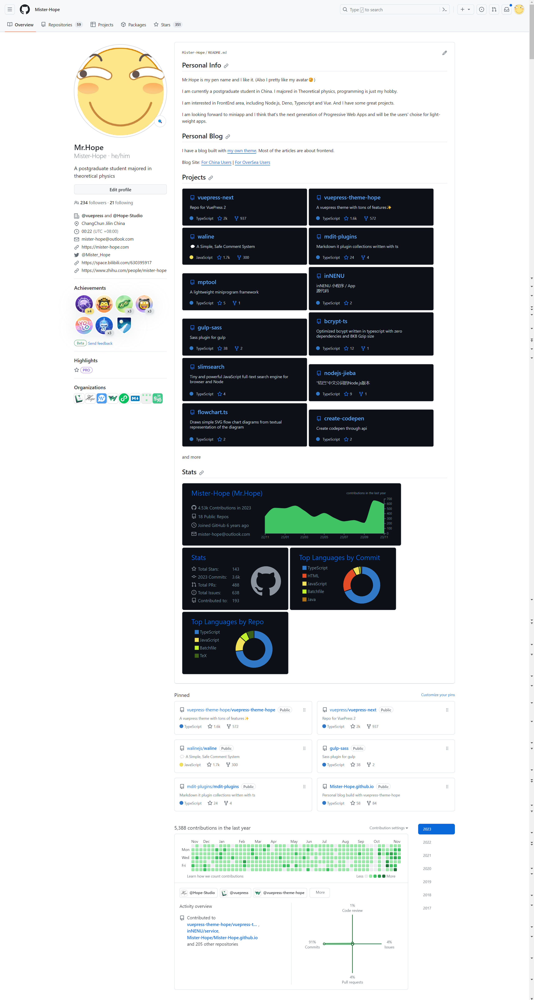
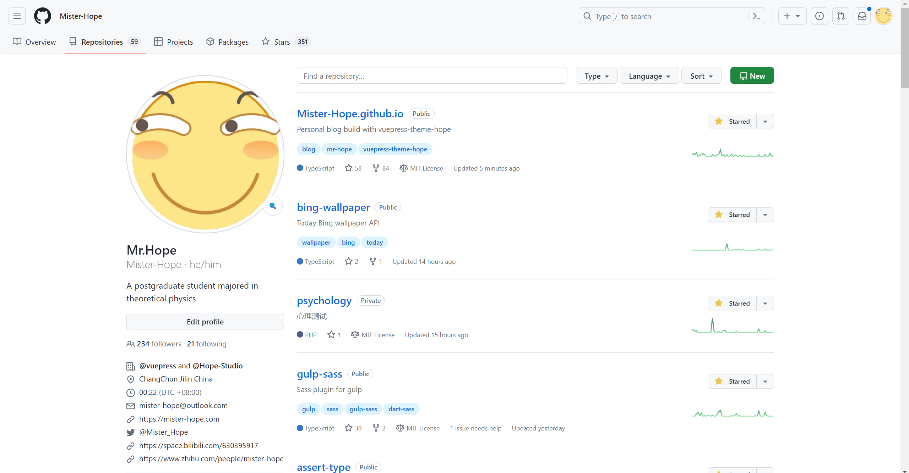
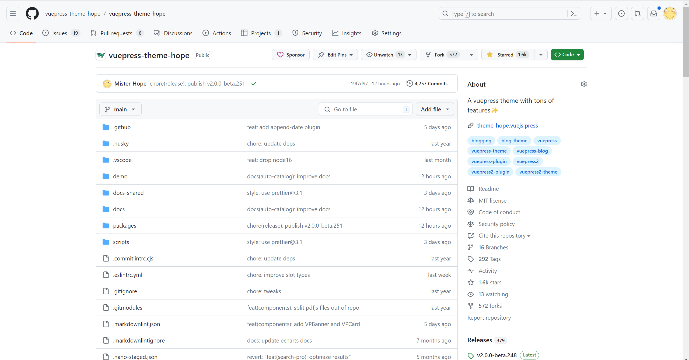

## ~~Gayhub~~ GitHub 是世界上最大的 ~~同性交友~~ 代码托管网站

:yum: 当然在上面交友也是极好的(这是重点，圈起来要考的:sunglasses:)。

## 基本概念

### Repository

仓库。一个仓库即是一个项目。仓库是 GitHub 上的主要内容。每当您新建一个项目并想要在 GitHub。

### Star

收藏。在每一个仓库主页的上方可以看到 star 按钮。其上的数值为收藏该项目的人数。点击星星即可将当前仓库收藏到您的账号上。您可以收藏一些您比较喜欢，或者项目对您来说有很大价值的项目。同时，点击数字可以看到哪些人收藏了这个项目。

### Fork

复刻。在每一个仓库主页的上方可以看到 Fork 按钮。点击该按钮的作用是将当前项目复刻一份到自己的仓库中，这样，您就可以在此仓库仓库上查看当前、历史的版本，切换分支、或者是随心所欲的进行修改。原项目的新的推送、对历史版本的修改、甚至原作者删除了他的 repo，都不会对您 fork 的项目产生任何影响。

### Issue

议题。你可将这里理解为 Bug 汇报区与新功能提交区。

如果您在使用该项目的过程中遇到了问题，可以在相应项目的 Issue 板块按照项目的要求提出 Issue。在 Issue 中可以汇报一个 bug，或者是提出一个 Feature Request (功能请求)。项目的拥有者可以针对您汇报的情况对您做出回复。

同时，项目拥有者还可以:

- 为此 issue 增加 label (标签)，以帮助项目成员或是项目的其他使用者更好的理解这个 issue 的分类
- 将此 issue assign (分派) 给特定的项目成员解决。
- 将此 issue 加入特定的 project (项目) 以安排处理日期与进度。

::: tip

为了 GitHub 的友好交流环境，请在汇报 bug 时永远带上 bug 的一个简易的复现流程，可以直接建立一个简单的 reproduction repo 并把链接放置在您提出的 issue 中。

:::

### Pull Request

发起推送请求，简称 **PR**。如果是您自己的项目，您可以从一个分支向另一个分支发起推送请求。如果您想对别人的(您无权进行推送)项目进行代码的推送请求的化，需要先 fork 这个仓库。在自己 fork 的项目上进行修改，然后提交到自己的项目上，之后，建立一个从自己仓库到对方仓库的 PR。如果对方觉得您的新改动很不错，在经过测试或者 review 后就会接受它，这样原有项目就可拥有这些新的代码了.

### Discussion

GitHub 的讨论区，和 Issue 区主要用于 Bug 和 Feature Request 的追踪不同，通常情况下，你可以在讨论区开帖子询问使用中遇到的问题，以便其他人进行答复。你也可以在 Discussion 区提供项目的看法与建议，比如对某个功能进行改进的方式以及相关理由。你也可以展示你自己使用项目的一些新的或是与项目相关的一些内容。

### Watch

关注，在每一个仓库主页的上方可以看到 Watch 按钮。如果您关注了某个项目,那么这个项目有了变化的时候,您就会得到通知.在您点击关注后，您还可以点击下拉列表进一步设置关注级别。您可以选择接受 Release (新发布) 通知，也可以选择 Watching 来监听所有的通知。当您选择 Ignore 的话，即使有人在这个仓库中 mention (提到) 了您，您也不会得到通知。

### Review

审查。当项目收到 PR 时，项目的拥有成员可以对这份 PR 的代码改动进行审查，在 Review 的过程中，可以对代码的特定行或特定几行通过 comment(评论) 的方式来提出自己对代码改动的意见。

## 主页

<https://github.com>

主页，在您登陆后，屏幕的左侧会展示您和您加入团队的项目，以及您的团队详情。中部会显示您关注的项目、人的动态，右侧会根据算法展示一些您可能会感兴趣的 repo。

## 个人主页

**地址:** `https://github.com/<您的用户名>`

个人主页会有几个主要面板:

### Overview

个人概览，您可以在上方 pin(固定) 最多六个您想要展示给他人的仓库。

下方就是您过去一年里向 GitHub 的提交数量分布图，以及您在 GitHub 上的活动比例。

最下方是近几年您在 GitHub 上的活动记录。

### Repositories

仓库列表，该面板会按照最后更新时间的倒序，展示该用户拥有的所有 repo，同时也会在面板上展示项目的 Description (描述)、Star 数、Fork 数、语言、协议、标签，以及过去一年内项目的 commit 分布数量。这些都能够帮助浏览者在不进入具体仓库页面的情况下大致了解每一个仓库的内容、欢迎程度与维护情况。

### Projects

个人拥有的项目，在管理自己与团队跨仓库的活动日程时很有用。可以设置涉及到的仓库，提出任务、代办、时间表等。

### Packages

个人在 GitHub 上拥有的包。目前较少人在 GitHub 上发布相关的包。

### Stars

和仓库列表完全相同，只不过展示该用户收藏的 repo。

### Followers / Following

关注您的人 / 关注的人。在个人主页的左侧就有 follow 按钮，follow 一个人意味着这个人在 GitHub 的的活动会出现在 GitHub 主页的 Activity List 上。

## 仓库主页

仓库主页主要显示项目的信息。从左到右的面板依次是: Code(代码)，Issues (问题)、Pull Requests (提交请求)、Discussions (讨论)、Actions (自动流程)、 Projects (项目)、 Wiki (项目介绍)、 Security (项目安全)、 Insights (项目数据统计) 与 Settings (项目设置)。

> 仓库可以选择关闭 Issues、Discussions、Wiki 之类的面板。

在下方会展示代码文件以及项目说明 README.md 文件。
