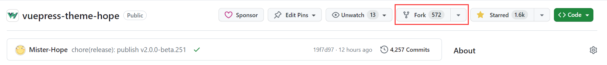

## 简介

对于一个用户的公开仓库，在默认情况下虽然其他用户可以拉取该库的代码，但是他们并不能够直接向这个库进行推送。

GitHub 是一个代码社区，这意味着鼓励大家互相提交与贡献代码。所以这就是 Fork 和 Pull Request 出现的意义。没有人会给一个陌生人添加访问自己仓库的权限，所以我们需要一种方式，能够让大家向仓库所有者发起贡献代码的请求。这就是 pull request 的由来。

## 提交自己贡献的代码

对于代码贡献者来说，他需要用一种方法将自己贡献的代码推送到远程库上，以便发起请求，最好的办法就是 fork 原仓库。

::: info

相关介绍，请见 [GitHub 简介 → fork](intro.md#fork)

:::

这样，贡献者在自己的账号上获得一个和原仓库完全相同的副本。

既然副本已经创建在自己的账号上，贡献者自然可以:

1. 克隆这个项目到本地
1. 在这个项目上贡献自己的代码
1. 将贡献的代码推送到这个副本上

## 发送请求

pull request 是请求仓库所有者拉取指定仓库分支代码的请求。

在贡献自己的代码并推送到自己的 fork 仓库后，贡献者即可到原仓库去选择自己仓库的对应分支发送这个拉取请求。仓库所有者随时可以批准这个更改，使其自动添加到自己的库中，或是拒绝这个请求。

> 这个仓库我已经删了所以显示 `unknown repository`，原为 `Mister-Hope:master`

这个页面允许所有人在主要对话线上交换自己的意见。

在 Pull request 里，一旦请求被创建，仓库所有者应该可以直观地看到哪些文件发生了怎样的改变。

同时，他们也可以对贡献者的代码进行审查，对特定行或片段标注，并陈述自己的意见，同时将这个意见根据程度标注为“探讨”、“改进”或者“必须更改”，以便贡献者进行交流讨论与完善修改。

同时，对于一个大型库来说，仓库所有者应该可以看到贡献的代码是否通过了所有测试。

如果审查者认为没有问题，他可能就会通过这个拉取请求，拉取对应的代码到自己的仓库上。这样您就完成了对这个仓库的贡献。

## 同步原仓库

需要注意的是，fork 创建的是一个时刻副本，也就是自己 fork 产生的仓库，会保持 fork 时的状态，原仓库的任何变动都不会自动同步到 fork 的仓库上。

有些时候，在自己 fork 原仓库、自己编写代码并提交的这段时间里，原仓库已经进行了很多提交。这时，我们就需要同步原仓库的更新到自己的副本上，以确保自己贡献的代码并未和新增代码发生冲突、可以正常工作。

这个时候只需反向拉取，在自己的仓库创建原仓库特定分支到自己仓库特定分支的 Pull request，并批准这个 pull request。这样即可很方便的将原仓库特定分支的更新同步到自己的副本上。

您当然可以在本地添加原仓库的远程库，将最新的更改直接 fetch 到本地，在本地测试通过并完成合并后，由本地推送至自己的 fork 仓库。
