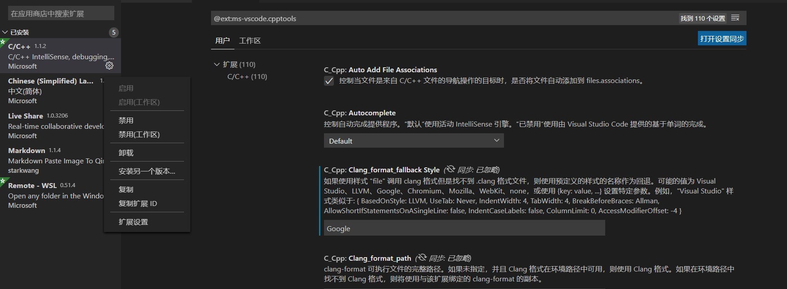
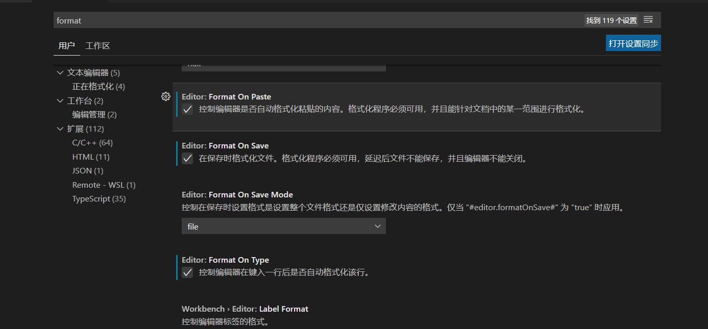
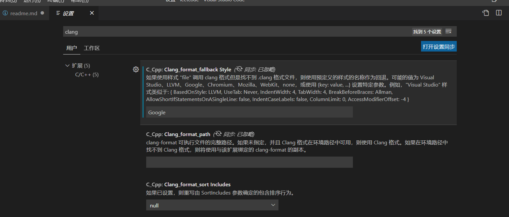

# clang-format 介绍与使用

## clang-format 介绍

### clang-format 是一种代码格式化工具，可用于格式化（排版）多种不同语言的代码

平时团队进行合作的时候需要注意代码的格式，虽然很难统一每个人的编码风格，但是通过工具能够很好的管理代码格式。这里介绍下 clang-format，它是基于 clang 的一个命令行工具，能够自动化格式：C、C++、Object-C 代码，支持多种代码风格：Google、Chromium、LLVM、Mozilla、WebKit；也支持自定义风格（通过编写.clang-format 文件）。

### .clang-format 自定义格式化

基本语法： 在 powershell 中输入 `clang-format -style=格式名 -dump-config > 文件名`

其中，格式名的取值可以为 llvm, google, chromium, mozilla, webkit 中的任一种；文件名可以取任何名字，一般取.clang-format 或\_clang-format，因为自定义的排版格式文件只有取这两种名字之一，才能被 clang-Format 识别。

## 使用 clang-format 格式化 C/C++

安装 C/C++插件时会自动安装 clang-format,因此只需要在 VSCode 中设置

1. `Ctrl + Shift + X` 打开拓展，选择 `C/C++` 栏目中下方的管理，左击并选择拓展设置

   

2. 在设置搜索栏输入 `format`,勾选

   1. **_Format On Paste_**
   2. **_Format On Save_**
   3. **_Format On Type_**

   

3. 在设置搜索栏输入 `clang`, 在第一栏输入 `Google`

   
