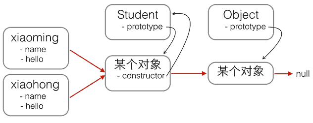

JavaScript 对每个创建的对象都会设置一个原型，指向它的原型对象。

<!-- more -->

当我们用 `obj.xxx` 访问一个对象的属性时，JavaScript 引擎先在当前对象上查找该属性，如果没有找到，就到其原型对象上找，如果还没有找到，就一直上溯到 `Object.prototype` 对象，最后，如果还没有找到，就只能返回 `undefined`。

例如，创建一个 Array 对象:

```js
const arr = [1, 2, 3];
```

其原型链是:

```js
arr---- > Array.prototype---- > Object.prototype---- > null;
```

`Array.prototype` 定义了 `indexOf()`、`shift()` 等方法，因此您可以在所有的 Array 对象上直接调用这些方法。

当我们创建一个函数时:

```js
const foo = () => 0;
```

函数也是一个对象，它的原型链是:

```js
foo---- > Function.prototype---- > Object.prototype---- > null;
```

由于 `Function.prototype` 定义了 `apply()` 等方法，因此，所有函数都可以调用 `apply()` 方法。

很容易想到，如果原型链很长，那么访问一个对象的属性就会因为花更多的时间查找而变得更慢，因此要注意不要把原型链搞得太长。

## 构造函数

除了直接用 `{ ... }` 创建一个对象外，JavaScript 还可以用一种构造函数的方法来创建对象。它的用法是，先定义一个构造函数:

```js
function Student(name) {
  this.name = name;
  this.hello = function () {
    alert(`Hello, ${this.name}!`);
  };
}
```

您会问，咦，这不是一个普通函数吗?

这确实是一个普通函数，但是在 JavaScript 中，可以用关键字 `new` 来调用这个函数，并返回一个对象:

```js
const xiaoming = new Student("小明");

xiaoming.name; // '小明'
xiaoming.hello(); // Hello, 小明!
```

注意，如果不写 `new`，这就是一个普通函数，它返回 `undefined`。但是，如果写了 `new`，它就变成了一个构造函数，它绑定的 `this` 指向新创建的对象，并默认返回 `this`，也就是说，不需要在最后写 `return this;`。

新创建的 `xiaoming` 的原型链是:

```js
xiaoming---- > Student.prototype---- > Object.prototype---- > null;
```

也就是说，`xiaoming` 的原型指向函数 `Student` 的原型。如果您又创建了 `xiaohong`、`xiaojun`，那么这些对象的原型与 `xiaoming` 是一样的:

```js
xiaoming ↘
xiaohong -→ Student.prototype ----> Object.prototype ----> null
xiaojun  ↗
```

用 `new Student()` 创建的对象还从原型上获得了一个 `constructor` 属性，它指向函数 `Student` 本身:

```js
xiaoming.constructor === Student.prototype.constructor; // true
Student.prototype.constructor === Student; // true

Object.getPrototypeOf(xiaoming) === Student.prototype; // true

xiaoming instanceof Student; // true
```

看晕了吧? 用一张图来表示这些乱七八糟的关系就是:



红色箭头是原型链。注意，`Student.prototype` 指向的对象就是 `xiaoming`、`xiaohong` 的原型对象，这个原型对象自己还有个属性 `constructor`，指向 `Student` 函数本身。

另外，函数 `Student` 恰好有个属性 `prototype` 指向 `xiaoming`、`xiaohong` 的原型对象，但是 `xiaoming`、`xiaohong` 这些对象可没有 `prototype` 这个属性，不过可以用 `__proto__` 这个非标准用法来查看。

现在我们就认为 `xiaoming`、`xiaohong` 这些对象“继承”自 `Student`。

不过还有一个小问题，注意观察:

```js
xiaoming.name; // '小明'
xiaohong.name; // '小红'
xiaoming.hello; // function: Student.hello()
xiaohong.hello; // function: Student.hello()
xiaoming.hello === xiaohong.hello; // false
```

`xiaoming` 和 `xiaohong` 各自的 `name` 不同，这是对的，否则我们无法区分谁是谁了。

`xiaoming` 和 `xiaohong` 各自的 `hello` 是一个函数，但它们是两个不同的函数，虽然函数名称和代码都是相同的!

如果我们通过 `new Student()` 创建了很多对象，这些对象的 `hello` 函数实际上只需要共享同一个函数就可以了，这样可以节省很多内存。

要让创建的对象共享一个 `hello` 函数，根据对象的属性查找原则，我们只要把 `hello` 函数移动到 `xiaoming`、`xiaohong` 这些对象共同的原型上就可以了，也就是 `Student.prototype`:


修改代码如下:

```js
function Student(name) {
  this.name = name;
}

Student.prototype.hello = function () {
  alert(`Hello, ${this.name}!`);
};
```

用 `new` 创建基于原型的 JavaScript 的对象就是这么简单!

## 忘记写 new 怎么办

如果一个函数被定义为用于创建对象的构造函数，但是调用时忘记了写 new 怎么办?

在 strict 模式下，`this.name = name` 将报错，因为 `this` 绑定为 `undefined`，在非 `strict` 模式下，`this.name = name` 不报错，因为 `this` 绑定为 `window`，于是无意间创建了全局变量 `name`，并且返回 `undefined`，这个结果更糟糕。

所以，调用构造函数千万不要忘记写 `new`。为了区分普通函数和构造函数，按照约定，构造函数首字母应当大写，而普通函数首字母应当小写，这样，一些语法检查工具如 ESLint 将可以帮您检测到漏写的 `new`。

最后，我们还可以编写一个 `createStudent()` 函数，在内部封装所有的 `new` 操作。一个常用的编程模式像这样:

```js
function Student(props) {
  this.name = props.name || "匿名"; // 默认值为'匿名'
  this.grade = props.grade || 1; // 默认值为1
}

Student.prototype.hello = function () {
  alert(`Hello, ${this.name}!`);
};

function createStudent(props) {
  return new Student(props || {});
}
```

这个 `createStudent()` 函数有几个巨大的优点: 一是不需要 `new` 来调用，二是参数非常灵活，可以不传，也可以这么传:

```js
const xiaoming = createStudent({
  name: "小明",
});

xiaoming.grade; // 1
```

如果创建的对象有很多属性，我们只需要传递需要的某些属性，剩下的属性可以用默认值。由于参数是一个 `Object`，我们无需记忆参数的顺序。如果恰好从 JSON 拿到了一个对象，就可以直接创建出 `xiaoming`。
