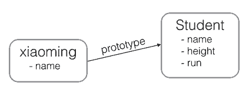

在 JavaScript 的世界里，一切都是对象。

<!-- more -->

但是某些对象还是和其他对象不太一样。为了区分对象的类型，我们用 `typeof` 操作符获取对象的类型，它总是返回一个字符串:

```js
typeof 123; // 'number'
typeof NaN; // 'number'
typeof "str"; // 'string'
typeof true; // 'boolean'
typeof undefined; // 'undefined'
typeof Math.abs; // 'function'
typeof null; // 'object'
typeof []; // 'object'
typeof {}; // 'object'
```

可见，`number`、`string`、`boolean`、`function` 和 `undefined` 有别于其他类型。特别注意 `null` 的类型是 `object`，`Array` 的类型也是 `object`，如果我们用 `typeof` 将无法区分出 `null`、`Array` 和通常意义上的 object —— `{}`。

JavaScript 的所有数据都可以看成对象，那是不是我们已经在使用面向对象编程了呢?

当然不是。如果我们只使用 `Number`、`Array`、`string` 以及基本的 `{...}` 定义的对象，还无法发挥出面向对象编程的威力。

JavaScript 的面向对象编程和大多数其他语言如 Java、C# 的面向对象编程都不太一样。如果您熟悉 Java 或 C#，很好，您一定明白面向对象的两个基本概念:

1. 类: 类是对象的类型模板，例如，定义 `Student` 类来表示学生，类本身是一种类型，`Student` 表示学生类型，但不表示任何具体的某个学生；

1. 实例: 实例是根据类创建的对象，例如，根据 `Student` 类可以创建出 `xiaoming`、`xiaohong`、`xiaojun` 等多个实例，每个实例表示一个具体的学生，他们全都属于 `Student` 类型。

所以，类和实例是大多数面向对象编程语言的基本概念。

不过，在 JavaScript 中，这个概念需要改一改。JavaScript 不区分类和实例的概念，而是通过原型 (`prototype`) 来实现面向对象编程。

原型是指当我们想要创建 `xiaoming` 这个具体的学生时，我们并没有一个 `Student` 类型可用。

于是我们创建对象 `Student`，然后创建出 `xiaoming`:

```js
const Student = {
  name: "studentUnknown",
  height: 1.8,
  run() {
    console.log(`${this.name} is running...`);
  },
};

const xiaoming = {
  name: "小明",
};

xiaoming.__proto__ = Student;
```

注意最后一行代码把 `xiaoming` 的原型指向了对象 `Student`，看上去 `xiaoming` 仿佛是从 `Student` 继承下来的:

```js
xiaoming.name; // '小明'
xiaoming.run(); // 小明 is running...
```

`xiaoming` 有自己的 `name` 属性，但并没有定义 `run()` 方法。不过，由于小明是从 `Student` 继承而来，只要 `Student` 有 `run()` 方法，`xiaoming` 也可以调用:



JavaScript 的原型链和 Java 的 `Class` 区别就在，它没有 “Class” 的概念，所有对象都是实例，所谓继承关系不过是把一个对象的原型指向另一个对象而已。

如果您把 `xiaoming` 的原型指向其他对象:

```js
const Bird = {
  fly() {
    console.log(`${this.name} is flying...`);
  },
};

xiaoming.__proto__ = Bird;
```

现在 `xiaoming` 已经无法 `run()` 了，他已经变成了一只鸟:

```js
xiaoming.fly(); // 小明 is flying...
```

在 JavaScrip 代码运行时期，您可以把 `xiaoming` 从 `Student` 变成 `Bird`，或者变成任何对象。

请注意，上述代码仅用于演示目的。在编写 JavaScript 代码时，不要直接用 `obj.__proto__` 去改变一个对象的原型，并且，低版本的 IE 也无法使用 `__proto__。Object.create()` 方法可以传入一个原型对象，并创建一个基于该原型的新对象，但是新对象什么属性都没有，因此，我们可以编写一个函数来创建 `xiaoming`:

```js
// 原型对象:
const Student = {
  name: "Robot",
  height: 1.2,
  run() {
    console.log(`${this.name} is running...`);
  },
};

const createStudent = (name) => {
  // 基于Student原型创建一个新对象:
  const s = Object.create(Student);

  // 初始化新对象:
  s.name = name;

  return s;
};

const xiaoming = createStudent("小明");

xiaoming.run(); // 小明 is running...
xiaoming.__proto__ === Student; // true
```

这是创建原型继承的一种方法，JavaScript 还有其他方法来创建对象，我们在后面会一一讲到。
