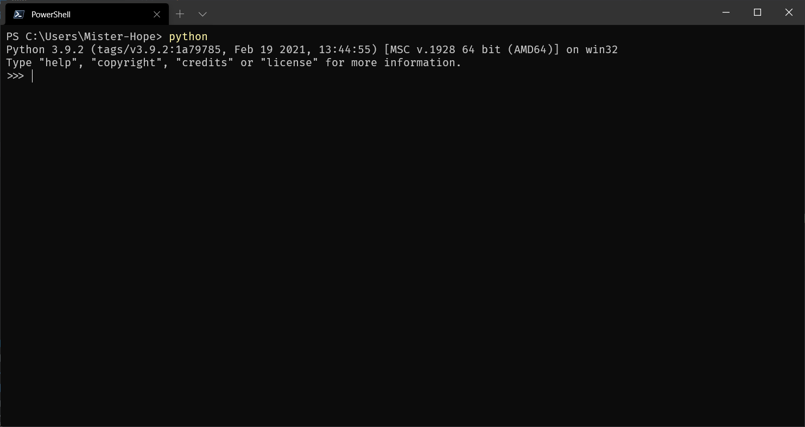

要开始学习 Python 编程，首先就得把 Python 安装到您的电脑里。安装后，您会得到 Python 解释器(就是负责运行 Python 程序的)，一个命令行交互环境，还有一个简单的集成开发环境。本节将指导您如何安装 Python。

## 在 Mac 上安装 Python

如果您正在使用 Mac，系统是 OS X>=10.9，那么系统自带的 Python 版本是 2.7。要安装最新的 Python 3.9，有两个方法:

方法一:从 Python 官网下载 Python 3.9 的安装程序，下载后双击运行并安装；

方法二:如果安装了 Homebrew，直接通过命令 brew install python3 安装即可。

## 在 Linux 上安装 Python

用 Linux 的人自行安装 Python 3 应该没有问题，否则，请换回 Windows 系统。

## 在 Windows 上安装 Python

首先，从 Python 的官方网站下载 Python 3.9 对应的 64 位安装程序，然后，运行下载的 exe 安装包。

> 这年头应该没人用 32 位的系统了吧 :smirk:

特别要注意勾上 `Add Python 3.9 to PATH`，然后点 “Install Now” 即可完成安装。

## 运行 Python

安装成功后，打开命令提示符窗口，敲入 `python` 后，会出现两种情况:

情况一:



看到上面的画面，就说明 Python 安装成功!

您看到提示符 `>>>` 就表示我们已经在 Python 交互式环境中了，可以输入任何 Python 代码，回车后会立刻得到执行结果。现在，输入 `exit()` 并回车，就可以退出 Python 交互式环境(直接关掉命令行窗口也可以)。

情况二:

```sh
'python' is not recognized as an internal or external command, operable program or batch file.
```

这是因为 Windows 会根据一个 Path 的环境变量设定的路径去查找 python.exe，如果没找到，就会报错。如果在安装时漏掉了勾选 "Add Python 3.9 to PATH"，那就要手动把 python.exe 所在的路径添加到 Path 中。

如果您不知道怎么修改环境变量，建议把 Python 安装程序重新运行一遍，务必记得勾上 "Add Python 3.9 to PATH"。

::: warning 注意

需要注意的是:

- 在 Windows 上运行 Python 时，请先启动命令行，然后运行 `python`。

- 在 Mac 和 Linux 上运行 Python 时，请打开终端，然后运行 `python3`。

:::
