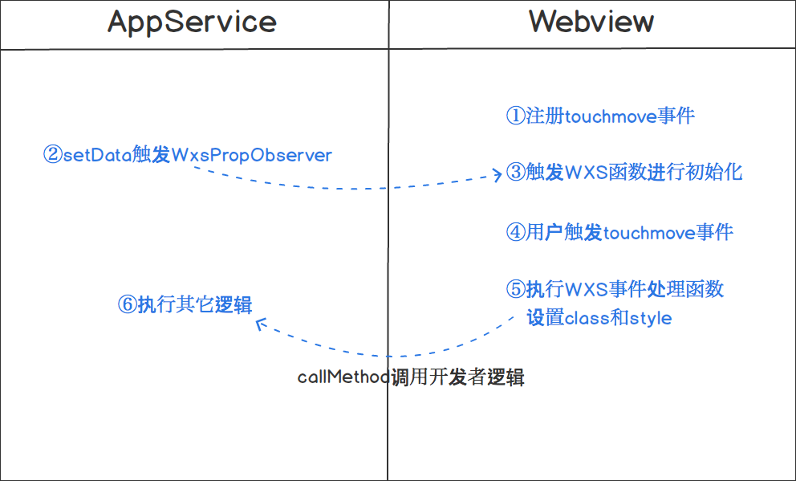

::: tip

此部分在初步学习小程序的时候直接略过即可。

:::

## 背景

有频繁用户交互的效果在小程序上表现是比较卡顿的，例如页面有 2 个元素 A 和 B，用户在 A 上做 `touchmove` 手势，要求 B 也跟随移动，[movable-view](https://developers.weixin.qq.com/miniprogram/dev/component/movable-view.html) 就是一个典型的例子。一次 `touchmove` 事件的响应过程为:

1. touchmove 事件从视图层(Webview)抛到逻辑层(App Service)

1. 逻辑层(App Service)处理 touchmove 事件，再通过 setData 来改变 B 的位置

一次 touchmove 的响应需要经过 2 次的逻辑层和渲染层的通信以及一次渲染，通信的耗时比较大。此外 `setData` 渲染也会阻塞其它脚本执行，导致了整个用户交互的动画过程会有延迟。

## 实现方案

本方案基本的思路是减少通信的次数，让事件在视图层(Webview)响应。小程序的框架分为视图层(Webview)和逻辑层(App Service)，这样分层的目的是管控，开发者的代码只能运行在逻辑层(App Service)，而这个思路就必须要让开发者的代码运行在视图层(Webview)，如下图所示的流程:



使用 WXS 函数用来响应小程序事件，目前只能响应内置组件的事件，不支持自定义组件事件。WXS 函数的除了纯逻辑的运算，还可以通过封装好的 `ComponentDescriptor` 实例来访问以及设置组件的 class 和样式，对于交互动画，设置 style 和 class 足够了。

WXS 函数的例子如下:

```js
var wxsFunction = function (event, ownerInstance) {
  var instance = ownerInstance.selectComponent(".classSelector"); // 返回组件的实例
  instance.setStyle({
    "font-size": "14px", // 支持 rpx
  });
  instance.getDataset();
  instance.setClass(className);
  // ...
  return false; // 不往上冒泡，相当于调用了同时调用了 stopPropagation 和 preventDefault
};
```

其中入参 `event` 是小程序事件对象基础上多了 `event.instance` 来表示触发事件的组件的 `ComponentDescriptor` 实例。`ownerInstance` 表示的是触发事件的组件所在的组件的 `ComponentDescriptor` 实例，如果触发事件的组件是在页面内的，`ownerInstance` 表示的是页面实例。

## ComponentDescriptor

### 定义

| 方法                           | 参数                           | 描述                                                                                               | 最低版本 |
| ------------------------------ | ------------------------------ | -------------------------------------------------------------------------------------------------- | -------- |
| selectComponent                | selector 对象                  | 返回组件的 ComponentDescriptor 实例。                                                              |          |
| selectAllComponents            | selector 对象数组              | 返回组件的 ComponentDescriptor 实例数组。                                                          |          |
| setStyle                       | Object/string                  | 设置组件样式，支持 rpx。设置的样式优先级比组件 wxml 里面定义的样式高。不能设置最顶层页面的样式。   |          |
| addClass/removeClass/ hasClass | string                         | 设置组件的 class。设置的 class 优先级比组件 wxml 里面定义的 class 高。不能设置最顶层页面的 class。 |          |
| getDataset                     | 无                             | 返回当前组件/页面的 dataset 对象                                                                   |          |
| callMethod                     | (funcName:string, args:object) | 调用当前组件/页面在逻辑层(App Service)定义的函数。funcName 表示函数名称，args 表示函数的参数。     |          |
| requestAnimationFrame          | Function                       | 和原生 requestAnimationFrame 一样。用于设置动画。                                                  |          |
| getState                       | 无                             | 返回一个 object 对象，当有局部变量需要存储起来后续使用的时候用这个方法。                           |          |
| triggerEvent                   | (eventName, detail)            | 和组件的 triggerEvent 一致。                                                                       |          |
| getComputedStyle               | string[]                       | 参数与 SelectorQuery 的 computedStyle 一致。                                                       | 2.11.2   |

### 使用方法

WXML 定义事件:

```xml
<wxs module="test" src="./test.wxs" />
<view change:prop="{{test.propObserver}}" prop="{{propValue}}" bindtouchmove="{{test.touchmove}}" class="movable" />
```

上面的 `change:prop`(属性前面带 `change:` 前缀)是在 prop 属性被设置的时候触发 WXS 函数，值必须用 `{{}}` 括起来。类似 `Component` 定义的 `properties` 里面的 `observer` 属性，在 `setData({propValue: newValue})` 调用之后会触发。

::: warning

WXS 函数必须用 `{{}}` 括起来。当 `prop` 的值被设置 WXS 函数就会触发，而不只是值发生改变，所以在页面初始化的时候会调用一次 WxsPropObserver 的函数。

:::

WXS 文件 test.wxs 里面定义并导出事件处理函数和属性改变触发的函数:

```js
module.exports = {
  touchmove: function (event, instance) {
    console.log("log event", JSON.stringify(event));
  },
  propObserver: function (newValue, oldValue, ownerInstance, instance) {
    console.log("prop observer", newValue, oldValue);
  },
};
```

更多示例请 [在开发者工具中预览效果](https://developers.weixin.qq.com/s/L1G0Dkmc7G8a)

## Tips

1. 目前还不支持原生组件的事件、input 和 textarea 组件的 bindinput 事件
1. 目前在 WXS 函数里面仅支持 `console.log` 方式打日志定位问题，注意连续的重复日志会被过滤掉。
