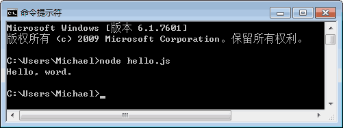

在前面的所有章节中，我们编写的 JavaScript 代码都是在浏览器中运行的，因此，我们可以直接在浏览器中敲代码，然后直接运行。

从本章开始，我们编写的 JavaScript 代码将不能在浏览器环境中执行了，而是在 Node.js 环境中执行，因此，JavaScript 代码将直接在您的计算机上以命令行的方式运行，所以，我们要先选择一个文本编辑器来编写 JavaScript 代码，并且把它保存到本地硬盘的某个目录，才能够执行。

<!-- more -->

那么问题来了: 文本编辑器到底哪家强?

::: warning

千万不要使用 Windows 自带的记事本编辑任何文本文件。

- 具体详情请见 [记事本遗留问题](../windows/notepad.md)

:::

如果您的电脑上已经安装了**Sublime Text**，或者**Notepad++**，也可以用来编写 JavaScript 代码，注意用 UTF-8 格式保存。

最方便的，当然是 Mr.Hope 强力安利的 VS Code 了。

输入以下代码:

```js
"use strict";

console.log("Hello, world.");
```

第一行总是写上 `'use strict';` 是因为我们总是以严格模式运行 JavaScript 代码，避免各种潜在陷阱。

然后，选择一个目录，例如 `C:\Workspace`，把文件保存为 `hello.js`，就可以打开命令行窗口，把当前目录切换到 hello.js 所在目录，然后输入以下命令运行这个程序了:

```bash
C:\Workspace>node hello.js
Hello, world.
```

也可以保存为别的名字，比如 `first.js`，但是必须要以 `.js` 结尾。此外，文件名只能是英文字母、数字和下划线的组合。

如果当前目录下没有 `hello.js` 这个文件，运行 `node hello.js` 就会报错:

```sh
C:\Workspace>node hello.js
module.js:338
    throw err;
          ^
Error: Cannot find module 'C:\Workspace\hello.js'
    at Function.Module._resolveFilename
    at Function.Module._load
    at Function.Module.runMain
    at startup
    at node.js
```

报错的意思就是，没有找到 `hello.js` 这个文件，因为文件不存在。这个时候，就要检查一下当前目录下是否有这个文件了。

## 命令行模式和 Node.js 交互模式

请注意区分命令行模式和 Node.js 交互模式。

看到类似 `C:\>` 是在 Windows 提供的命令行模式:



在命令行模式下，可以执行 Node.js 进入 Node.js 交互式环境，也可以执行 Node.js `hello.js` 运行一个 `.js` 文件。

看到`>` 是在 Node.js 交互式环境下:


在 Node.js 交互式环境下，我们可以输入 JavaScript 代码并立刻执行。

此外，在命令行模式运行.js 文件和在 Node.js 交互式环境下直接运行 JavaScript 代码有所不同。Node.js 交互式环境会把每一行 JavaScript 代码的结果自动打印出来，但是，直接运行 JavaScript 文件却不会。

例如，在 Node.js 交互式环境下，输入:

```sh
> 100 + 200 + 300;
600
```

直接可以看到结果 600。

但是，写一个 `calc.js` 的文件，内容如下:

```js
100 + 200 + 300;
```

然后在命令行模式下执行:

```bash
C:\Workspace>node calc.js
```

发现什么输出都没有。

这是正常的。想要输出结果，必须自己用 `console.log()` 打印出来。把 `calc.js` 改造一下:

```js
console.log(100 + 200 + 300);
```

再执行，就可以看到结果:

```bash
C:\Workspace>node calc.js
600
```

## 使用严格模式

如果在 JavaScript 文件开头写上 `'use strict';`，那么 Node.js 在执行该 JavaScript 时将使用严格模式。但是，在服务器环境下，如果有很多 JavaScript 文件，每个文件都写上 `'use strict';` 很麻烦。我们可以给 Node.js 传递一个参数，让 Node.js 直接为所有 js 文件开启严格模式:

```sh
node --use_strict calc.js
```

后续代码，如无特殊说明，我们都会直接给 Node.js 传递 `--use_strict` 参数来开启严格模式。

## 小结

用文本编辑器写 JavaScript 程序，然后保存为后缀为 `.js` 的文件，就可以用 Node.js 直接运行这个程序了。

Node.js 的交互模式和直接运行 `.js` 文件有什么区别呢?

直接输入 Node.js 进入交互模式，相当于启动了 Node.js 解释器，但是等待您一行一行地输入源代码，每输入一行就执行一行。

直接运行 `node hello.js` 文件相当于启动了 Node.js 解释器，然后一次性把 `hello.js` 文件的源代码给执行了，您是没有机会以交互的方式输入源代码的。

在编写 JavaScript 代码的时候，完全可以一边在文本编辑器里写代码，一边开一个 Node.js 交互式命令窗口，在写代码的过程中，把部分代码粘到命令行去验证，事半功倍! 前提是得有个 27 寸的超大显示器!
