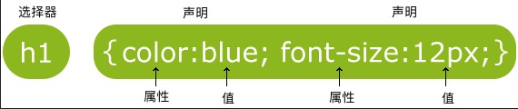

CSS 指层叠样式表 (Cascading Style Sheets)

<!-- more -->

::: tip 样式

- 样式定义如何显示 HTML 元素
- 样式通常存储在样式表中
- 把样式添加到 HTML 4.0 中，是为了解决内容与表现分离的问题

:::

::: tip 优势

- 外部样式表可以极大提高工作效率
- 外部样式表通常存储在 CSS 文件中
- 多个样式定义可层叠为一个

:::

## CSS 语法

CSS 规则由两个主要的部分构成: 选择器，以及一条或多条声明:



- 选择器: 通常是您需要改变样式的 HTML 元素。

- 声明: 每条声明由一个属性和一个值组成。

::: tip 属性
属性 (property) 是您希望设置的样式属性 (style attribute)。每个属性有一个值。属性和值被冒号分开。
:::

CSS 声明总是以分号 `;` 结束，声明总以花括号 `{}` 括起来:

```css
p {
  color: red;
  text-align: center;
}
```

::: warning
CSS 块内的每一条声明都必须以分号结束，否则会报错(最后一条除外)，而每个 CSS 块是不需要以分号结束的！
:::

### CSS 注释

与 HTML 一样，css 也可以包含注释来解释您的代码，浏览器会忽略它。

CSS 注释以 `/*` 开始, 以 `*/` 结束, 示例如下:

```css
/*这是个注释*/
p {
  text-align: center;
  /*这是另一个注释*/
  color: black;
  font-family: arial;
}
```

## CSS 选择器

```html


<p class="paragraph" id="par">lorem</p>
```

```css
p {
  color: red;
}

.paragraph {
  color: red;
}

#par {
  color: red;
}
```

### ID 选择器

id 选择器可以为标有特定 id 的 HTML 元素指定特定的样式。

HTML 可以用 id 属性来设置 id 选择器，CSS 中 id 选择器以 `#` 来定义。

以下的样式规则应用于元素属性 `id="para1"`:

实例:

```css
#para1 {
  text-align: center;
  color: red;
}
```

::: tip
ID 的全称是 Identify，是身份标识的意思。ID 的实际作用是为这个 HTML 标签绑定一个页面内唯一的标识符。因此，每一个 HTML 页面出现的 ID 应该仅被使用一次，以 ID 来代指这个元素。
:::

::: warning
ID 属性不要以数字开头，数字开头的 ID 在 `Mozilla/Firefox` 浏览器中不起作用。
:::

### Class 选择器

class 选择器用于描述一组元素的样式，class 选择器有别于 id 选择器，class 可以在多个元素中使用。

class 选择器在 HTML 中以 class 属性表示, 在 CSS 中，类选择器以句点 (`.`) 显示:

在以下的例子中，所有拥有 center 类的 HTML 元素均为居中。

```css
.center {
  text-align: center;
}
```

### 标签选择器

标签选择器用于指定一个 HTML 标签的样式。通常，浏览器会为每个特定的 HTML 标签指定一个默认样式，但是不同的浏览器的默认样式可能有细微的区别。

有些时候想要覆盖浏览器的默认样式，或者说想在所有浏览器中保持统一样式，即可使用标签选择器指定标签的默认样式。在 CSS 指定的标签样式会覆盖掉浏览器默认指定的样式。

```css
/* 确保所有浏览器的段落标签的字体大小均为16像素。 */
p {
  font-size: 16px;
}
```

### 选择器的混用

常见的选择器主要有三种:

- 后代选择器

  以空格分隔，用于选取某元素的后代元素

- 子元素选择器

  以大于号分隔，只能选择作为某元素子元素的元素

- 相邻兄弟选择器

  加号分隔，选择紧接另一元素后的元素，二者有同一父元素

案例:

- `p{ }`: 为所有 **p** 元素指定一个样式。

- `.marked{ }`: 为所有 **class="marked"** 的元素指定一个样式。

- `.marked p{ }`: 为所有 **class="marked"** 元素内的 **p** 元素指定一个样式。

- `p.marked{ }`: 为所有 **class="marked"** 的 **p** 元素指定一个样式。

::: tip
更多高级选择器，请见 [菜鸟教程](https://www.runoob.com/cssref/css-selectors.html) 或 [MDN](https://developer.mozilla.org/zh-CN/docs/Web/Guide/CSS/Getting_Started/Selectors)
:::

## 引入 CSS

### 外部样式表

保存至 CSS 文件中，在 HTML 中使用 `<link>` 引用，可以根据实际需要放在 `<head>` 标签里或 `<body>` 标签的末尾

如:

```html
<head>
  <link rel="stylesheet" type="text/css" href="mystyle.css" />
</head>
```

浏览器会从文件 mystyle.css 中读到样式声明，并根据它来格式文档。

外部样式表可以在任何文本编辑器中进行编辑。文件不能包含任何的 html 标签。样式表应该以 .css 扩展名进行保存。

### 内部样式表

当单个文档需要特殊的样式时，就应该使用内部样式表。您可以使用 `<style>` 标签定义内部样式表，就像这样:

```html
<head>
  <style>
    hr {
      color: sienna;
    }

    p {
      margin-left: 20px;
    }

    body {
      background-image: url("images/back40.gif");
    }
  </style>
</head>
```

### 内联样式

在 HTML 中使用 style 标签指定。

由于要将表现和内容混杂在一起，内联样式会损失掉样式表的许多优势。请慎用这种方法，例如当样式仅需要在一个元素上应用一次时。

```html
<!-- 改变了这个段落的字体颜色和左外边距 -->
<p style="color:sienna;margin-left:20px">这是一个段落。</p>
```
