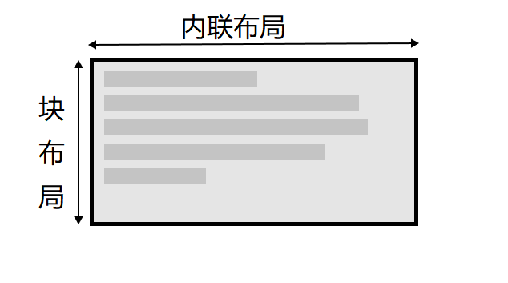
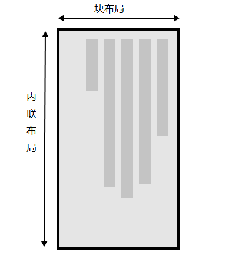

## 书写模式

CSS 中的书写模式是指文本的排列方向是横向还是纵向的。`writing-mode` 属性使我们从一种模式切换到另一种模式。为此，您不必使用一种竖向的语言——您还可以更改部分文字的方向以实现创新性的布局。

可以使用 `writing-mode: vertical-rl` 对一个标题的显示进行设置，将标题文本变为竖向。

竖向文本在平面设计中很常见，也可以为您的网页设计增添更加有趣的外观。

::: normal-demo 竖向标题文本

```html
<h1>Play with writing modes</h1>
```

```css
h1 {
  writing-mode: vertical-rl;
}
```

:::

`writing-mode` 的三个值分别是:

- `horizontal-tb`: 块流向从上至下。对应的文本方向是横向的。
- `vertical-rl`: 块流向从右向左。对应的文本方向是纵向的。
- `vertical-lr`: 块流向从左向右。对应的文本方向是纵向的。

因此，`writing-mode` 属性实际上设定的是页面上块级元素的显示方向——要么是从上到下，要么是从右到左，要么是从左到右。而这决定了文本的方向。

::: warning

没有从下到上的方向。

:::

## 书写模式、块级布局和内联布局

我们已经讨论了块级布局和内联布局(block and inline layout)，也知道外部显示类型元素分为块级元素和内联元素。如上所述，块级显示和内联显示与文本的书写模式(而非屏幕的物理显示)密切相关。如果您使用书写模式的显示是横向的，如英文，那么块在页面上的显示就是从上到下的。

当我们切换书写模式时，我们也在改变块和内联文本的方向。`horizontal-tb` 书写模式下块的方向是从上到下的横向的，而 `vertical-rl` 书写模式下块的方向是从右到左的纵向的。因此，块维度指的总是块在页面书写模式下的显示方向。而内联维度指的总是文本方向。





### 方向

除了书写模式，我们还可以设置文本方向。正如上面所言，有些语言(如阿拉伯语)是横向书写的，但是是从右向左。

由于书写模式和文本方向都是可变的，新的 CSS 布局方法不再定义从左到右和从上到下，而是将这些连同内联元素和块级元素的开头和结尾一起考量。

## 逻辑属性和逻辑值

正常情况下，您可以设置 width 和 height，但是它们并不会跟随书写模式的改编而进行调整。

CSS 的映射属性用逻辑(logical)和相对变化(flow relative)代替了像宽 width 和高 height 一样的物理属性。

横向书写模式下，映射到 width 的属性被称作内联尺寸(inline-size)——内联维度的尺寸。而映射 height 的属性被称为块级尺寸(block-size)，这是块级维度的尺寸。下面的例子展示了替换掉 width 的 inline-size 是如何生效的。

::: normal-demo 映射属性

```html
<div class="wrapper">
  <div class="box horizontal">
    <h2>Heading</h2>
    <p>A paragraph. Demonstrating Writing Modes in CSS.</p>
    <p>These boxes have inline-size.</p>
  </div>
  <div class="box vertical">
    <h2>Heading</h2>
    <p>A paragraph. Demonstrating Writing Modes in CSS.</p>
    <p>These boxes have inline-size.</p>
  </div>
</div>
```

```css
.wrapper {
  display: flex;
}

.box {
  inline-size: 150px;
}

.horizontal {
  writing-mode: horizontal-tb;
}

.vertical {
  writing-mode: vertical-rl;
}
```

:::

### 逻辑外边距、边框和内边距属性

外边距、边框和内边距属性中，物理属性，例如 `margin-top`、`padding-left` 和 `border-bottom`。同样像 `width` 和 `height` 一样不会随着书写模式进行变化，当然这些属性也有相应的映射。

`margin-top` 属性的映射是 `margin-block-start` : 总是指向块级维度开始处的边距。

`padding-left` 属性映射到 `padding-inline-start`: 这是应用到内联开始方向(这是该书写模式文本开始的地方)上的内边距。

`border-bottom` 属性映射到的是 `border-block-end`: 也就是块级维度结尾处的边框。

其他的 9 个属性应该很很容易写出，不做赘述。

::: warning

请注意，在这种状态下，您就不能再用 `margin` `padding` `border` 这三个简写属性了。

:::

### 逻辑值

物理值(如 `top`、`right`、`bottom` 和 `left` )。这些值同样拥有逻辑值映射(`block-start`、`inline-end`、`block-end` 和 `inline-start` )。

### 是否使用逻辑属性

如果您并没有应用多种书写模式，那么现在您可能更倾向于使用物理属性，因为这些在您使用弹性布局和网格布局时非常有用。
