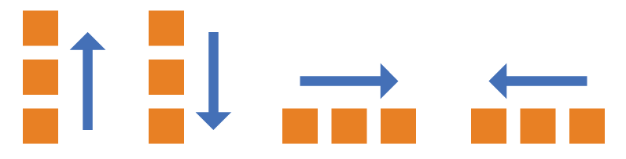
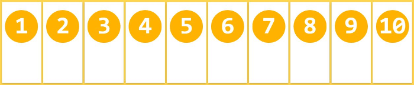
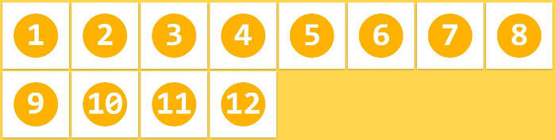
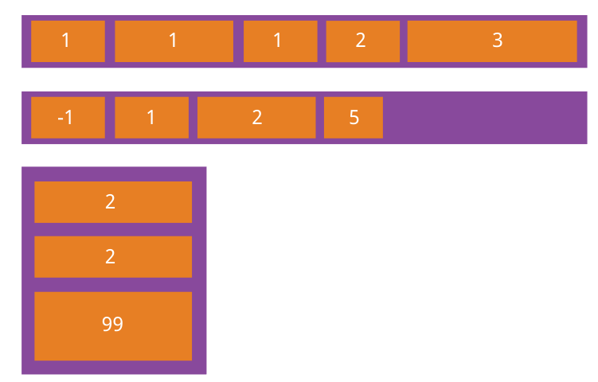
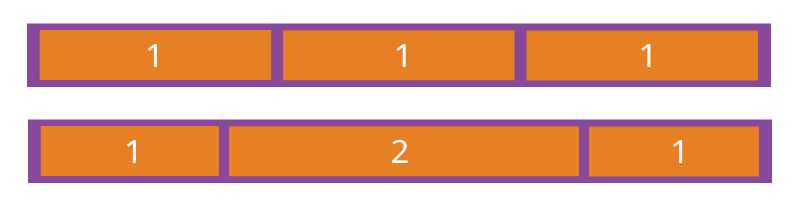
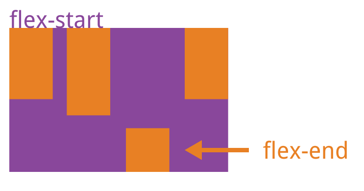

常见的 CSS 布局主要有 Box Model 和 Flex 布局两种。

<!-- more -->

## Box Model(盒模型)

所有 HTML 元素可以看作盒子，在 CSS 中，"**box model**" 这一术语是用来设计和布局时使用。

CSS 盒模型本质上是一个盒子，封装周围的 HTML 元素，它包括: 边距，边框，填充，和实际内容。

盒模型允许我们在其它元素和周围元素边框之间的空间放置元素。

下面的图片说明了盒子模型 (Box Model):


不同部分的说明:

- Margin (外边距) - 清除边框外的区域，外边距是透明的。
- Border (边框) - 围绕在内边距和内容外的边框。
- Padding (内边距) - 清除内容周围的区域，内边距是透明的。
- Content (内容) - 盒子的内容，显示文本和图像。

```css
div {
  width: 300px;
  border: 25px solid green;
  padding: 25px;
  margin: 25px;
}
```

为了正确设置元素在所有浏览器中的宽度和高度，您需要知道的盒模型是如何工作的。

::: tip 元素的宽度和高度
当您指定一个 CSS 元素的宽度和高度属性时，您只是设置内容区域的宽度和高度。要知道，完全大小的元素，您还必须添加填充，边框和边距。
:::

下面的例子中的元素的总宽度为 300px:

```css
div {
  width: 300px;
  border: 25px solid green;
  padding: 25px;
  margin: 25px;
}
```

300px (宽) + 50px (左 + 右填充) + 50px (左 + 右边框) + 50px (左 + 右边距) = 450px

试想一下，您只有 250 像素的空间。让我们设置总宽度为 250 像素的元素:

```css
div {
  width: 220px;
  padding: 10px;
  border: 5px solid gray;
  margin: 0;
}
```

最终元素的总宽度计算公式是这样的:

总元素的宽度=宽度+左填充+右填充+左边框+右边框+左边距+右边距

元素的总高度最终计算公式是这样的:

总元素的高度 = 高度 + 顶部填充 + 底部填充 + 上边框 + 下边框 + 上边距 + 下边距

::: tip
更多相关可见[MDN](https://developer.mozilla.org/en-US/docs/Web/CSS/box_model)
:::

## Flex (弹性模型) <MyBadge text="来源: 阮一峰的博客" />

### Flex 布局简介

Flex 是 Flexible Box 的缩写，意为"弹性布局"，用来为盒状模型提供最大的灵活性。

任何一个容器都可以指定为 Flex 布局。

```css
.box {
  display: flex;
}
```

行内元素也可以使用 Flex 布局。

```css
.box {
  display: inline-flex;
}
```

Webkit 内核的浏览器，必须加上`-webkit`前缀。

```css
.box {
  display: -webkit-flex; /* Safari */
  display: flex;
}
```

::: warning
注意，设为 Flex 布局以后，子元素的`float`、`clear`和`vertical-align`属性将失效。
:::

### 基本概念

采用 Flex 布局的元素，称为 Flex 容器(flex container)，简称"容器"。它的所有子元素自动成为容器成员，称为 Flex 项目(flex item)，简称"项目"。


::: tip
这张图很有用，可以多看看。

在默认情况下，主轴水平，方向是从左到右；交叉轴垂直，方向是从上到下。
:::

容器默认存在两根轴: 水平的主轴 (main axis) 和垂直的交叉轴 (cross axis)。主轴的开始位置(与边框的交叉点)叫做 main start，结束位置叫做 main end；交叉轴的开始位置叫做 cross start，结束位置叫做 cross end。

项目默认沿主轴排列。单个项目占据的主轴空间叫做 main size，占据的交叉轴空间叫做 cross size。

### 容器的属性

以下 6 个属性设置在容器上。

- flex-direction
- flex-wrap
- flex-flow
- justify-content
- align-items
- align-content

1. flex-direction 属性

   `flex-direction` 属性决定主轴的方向(即项目的排列方向)。

   ```css
   .box {
     flex-direction: row | row-reverse | column | column-reverse;
   }
   ```

   

   它可能有 4 个值。

   - `row`(默认值): 主轴为水平方向，起点在左端。
   - `row-reverse`: 主轴为水平方向，起点在右端。
   - `column`: 主轴为垂直方向，起点在上沿。
   - `column-reverse`: 主轴为垂直方向，起点在下沿。

   ::: warning
   请注意，在任何情况下，交叉轴的均为主轴顺时针旋转 90°
   :::

1. flex-wrap 属性

   默认情况下，项目都排在一条线(又称"轴线")上。`flex-wrap` 属性定义，如果一条轴线排不下，如何换行。

   

   ```css
   .box {
     flex-wrap: nowrap | wrap | wrap-reverse;
   }
   ```

   它可能取三个值。

   1. `nowrap`(默认): 不换行。

      

   1. `wrap`: 换行，第一行在上方。

      

   1. `wrap-reverse`: 换行，第一行在下方。

      

1. flex-flow

   `flex-flow` 属性是 `flex-direction` 属性和 `flex-wrap` 属性的简写形式，默认值为 `row nowrap`。

   ```css
   .box {
     flex-flow: <flex-direction> || <flex-wrap>;
   }
   ```

1. justify-content 属性

   `justify-content` 属性定义了项目在主轴上的对齐方式。

   ```css
   .box {
     justify-content: flex-start | flex-end | center | space-between |
       space-around;
   }
   ```

   

   它可能取 5 个值，具体对齐方式与轴的方向有关。下面假设主轴为从左到右。

   - `flex-start`(默认值): 左对齐
   - `flex-end`: 右对齐
   - `center`: 居中
   - `space-between`: 两端对齐，项目之间的间隔都相等。
   - `space-around`: 每个项目两侧的间隔相等。所以，项目之间的间隔比项目与边框的间隔大一倍。
   - `space-evenly`: 均匀排列每个元素，每个元素之间的间隔相等。

1. align-items 属性

   `align-items` 属性定义项目在交叉轴上如何对齐。

   ```css
   .box {
     align-items: flex-start | flex-end | center | baseline | stretch;
   }
   ```

   

   它可能取 5 个值。具体的对齐方式与交叉轴的方向有关，下面假设交叉轴从上到下。

   - `flex-start`: 交叉轴的起点对齐。
   - `flex-end`: 交叉轴的终点对齐。
   - `center`: 交叉轴的中点对齐。
   - `baseline`: 项目的第一行文字的基线对齐。
   - `stretch`(默认值): 如果项目未设置高度或设为 auto，将占满整个容器的高度。

1. align-content 属性

   `align-content`属性定义了多根轴线的对齐方式。如果项目只有一根轴线，该属性不起作用。

   ```css
   .box {
     align-content: flex-start | flex-end | center | space-between |
       space-around | stretch;
   }
   ```

   

   该属性可能取 6 个值。

   - `flex-start`: 与交叉轴的起点对齐。
   - `flex-end`: 与交叉轴的终点对齐。
   - `center`: 与交叉轴的中点对齐。
   - `space-between`: 与交叉轴两端对齐，轴线之间的间隔平均分布。
   - `space-around`: 每根轴线两侧的间隔都相等。所以，轴线之间的间隔比轴- 线与边框的间隔大一倍。
   - `stretch`(默认值): 轴线占满整个交叉轴。

### 项目的属性

以下 6 个属性设置在项目上。

- order
- flex-grow
- flex-shrink
- flex-basis
- flex
- align-self

1. order 属性

   `order`属性定义项目的排列顺序。数值越小，排列越靠前，默认为 `0`。

   

   ```css
   .item {
     order: <integer>;
   }
   ```

2. flex-grow 属性

   `flex-grow`属性定义项目的放大比例，默认为 `0`，即如果存在剩余空间，也不放大。

   ```css
   .item {
     flex-grow: <number>; /* default 0 */
   }
   ```

   

   如果所有项目的 `flex-grow` 属性都为 `1`，则它们将等分剩余空间(如果有的话)。如果一个项目的 `flex-grow` 属性为 `2`，其他项目都为 `1`，则前者占据的剩余空间将比其他项多一倍。

3. flex-shrink 属性

`flex-shrink`属性定义了项目的缩小比例，默认为 `1`，即如果空间不足，该项目将缩小。

```css
.item {
  flex-shrink: <number>; /* default 1 */
}
```


如果所有项目的 `flex-shrink` 属性都为 `1`，当空间不足时，都将等比例缩小。如果一个项目的 `flex-shrink` 属性为 `0`，其他项目都为 `1`，则空间不足时，前者不缩小。

::: tip
负值对该属性无效。
:::

1. flex-basis 属性

`flex-basis`属性定义了在分配多余空间之前，项目占据的主轴空间 (main size)。浏览器根据这个属性，计算主轴是否有多余空间。它的默认值为 `auto`，即项目的本来大小。

```css
.item {
  flex-basis: <length> | auto; /* default auto */
}
```

它可以设为跟 `width` 或 `height` 属性一样的值(比如 350px)，则项目将占据固定空间。

1. flex 属性

   flex 属性是 `flex-grow`, `flex-shrink` 和 `flex-basis` 的简写，默认值为 `0 1 auto`。后两个属性可选。

   ```css
   .item {
     flex: none | [ < "flex-grow" > < "flex-shrink" >? || < "flex-basis" > ];
   }
   ```

   该属性有两个快捷值: `auto` (`1 1 auto`) 和 `non`e (`0 0 auto`)。

   建议优先使用这个属性，而不是单独写三个分离的属性，因为浏览器会推算相关值。

1. align-self 属性

`align-self` 属性允许单个项目有与其他项目不一样的对齐方式，可覆盖 `align-items` 属性。默认值为 `auto`，表示继承父元素的 `align-items` 属性，如果没有父元素，则等同于 `stretch`。

```css
.item {
  align-self: auto | flex-start | flex-end | center | baseline | stretch;
}
```



该属性可能取 6 个值，除了 `auto`，其他都与 `align-items` 属性完全一
致。
