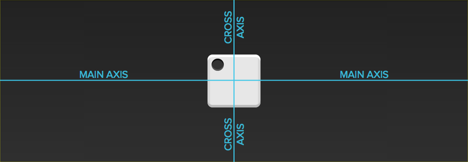
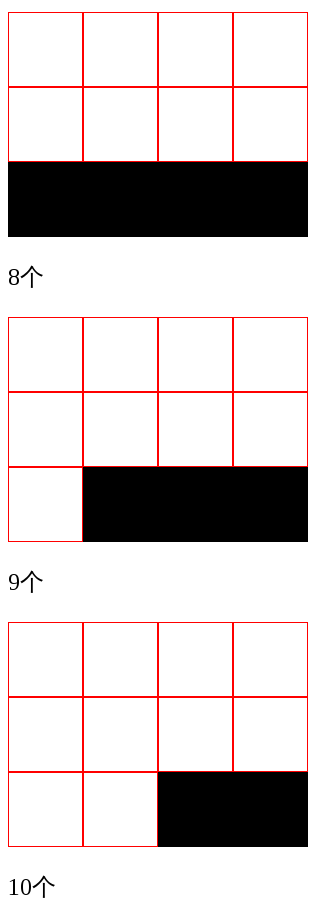

本章包括了一些经典的布局实战案例。

<!-- more -->

## Flex 布局实战

下面我们将通过骰子，来很好的在实战中展示 Flex 布局的功能与美丽。

骰子的一面，最多可以放置 9 个点。



下面，就来看看 Flex 如何实现，从 1 个点到 9 个点的布局。`div` 元素 (代表骰子的一个面) 是 Flex 容器，`span` 元素 (代表一个点) 是 Flex 项目。如果有多个项目，就要添加多个 `span` 元素，以此类推。

### 单项目

首先，只有左上角 1 个点的情况。Flex 布局默认就是首行左对齐，所以一行代码就够了。

::: normal-demo 点位 1

```html
<div class="dice-container">
  <div class="box">
    <span class="item" />
  </div>
</div>
```

```css
.box {
  display: flex;
}

/* Common styles */
.dice-container {
  display: flex;
  justify-content: center;
  align-items: center;
  height: 150px;
  background-color: #000;
}

.dice-container .box {
  width: 90px;
  height: 90px;
  padding: 8px;
  border-radius: 8px;
  background-color: #f8f8f8;
}

.dice-container .item {
  width: 24px;
  height: 24px;
  margin: 3px;
  border-radius: 50%;
  background-color: #000;
}
```

:::

设置项目的对齐方式，就能实现居中对齐和右对齐。

::: normal-demo 点位 2

```html
<div class="dice-container">
  <div class="box">
    <span class="item" />
  </div>
</div>
```

```css
.box {
  display: flex;
  justify-content: center;
}

/* Common styles */
.dice-container {
  display: flex;
  justify-content: center;
  align-items: center;
  height: 150px;
  background-color: #000;
}

.dice-container .box {
  width: 90px;
  height: 90px;
  padding: 8px;
  border-radius: 8px;
  background-color: #f8f8f8;
}

.dice-container .item {
  width: 24px;
  height: 24px;
  margin: 3px;
  border-radius: 50%;
  background-color: #000;
}
```

:::

::: normal-demo 点位 3

```html
<div class="dice-container">
  <div class="box">
    <span class="item" />
  </div>
</div>
```

```css
.box {
  display: flex;
  justify-content: flex-end;
}

/* Common styles */
.dice-container {
  display: flex;
  justify-content: center;
  align-items: center;
  height: 150px;
  background-color: #000;
}

.dice-container .box {
  width: 90px;
  height: 90px;
  padding: 8px;
  border-radius: 8px;
  background-color: #f8f8f8;
}

.dice-container .item {
  width: 24px;
  height: 24px;
  margin: 3px;
  border-radius: 50%;
  background-color: #000;
}
```

:::

设置交叉轴对齐方式，可以垂直移动主轴。

::: normal-demo 点位 4

```html
<div class="dice-container">
  <div class="box">
    <span class="item" />
  </div>
</div>
```

```css
.box {
  display: flex;
  align-items: center;
}

/* Common styles */
.dice-container {
  display: flex;
  justify-content: center;
  align-items: center;
  height: 150px;
  background-color: #000;
}

.dice-container .box {
  width: 90px;
  height: 90px;
  padding: 8px;
  border-radius: 8px;
  background-color: #f8f8f8;
}

.dice-container .item {
  width: 24px;
  height: 24px;
  margin: 3px;
  border-radius: 50%;
  background-color: #000;
}
```

:::

::: normal-demo 点位 5

```html
<div class="dice-container">
  <div class="box">
    <span class="item" />
  </div>
</div>
```

```css
.box {
  display: flex;
  justify-content: center;
  align-items: center;
}

/* Common styles */
.dice-container {
  display: flex;
  justify-content: center;
  align-items: center;
  height: 150px;
  background-color: #000;
}

.dice-container .box {
  width: 90px;
  height: 90px;
  padding: 8px;
  border-radius: 8px;
  background-color: #f8f8f8;
}

.dice-container .item {
  width: 24px;
  height: 24px;
  margin: 3px;
  border-radius: 50%;
  background-color: #000;
}
```

:::

::: normal-demo 点位 8

```html
<div class="dice-container">
  <div class="box">
    <span class="item" />
  </div>
</div>
```

```css
.box {
  display: flex;
  justify-content: center;
  align-items: flex-end;
}

/* Common styles */
.dice-container {
  display: flex;
  justify-content: center;
  align-items: center;
  height: 150px;
  background-color: #000;
}

.dice-container .box {
  width: 90px;
  height: 90px;
  padding: 8px;
  border-radius: 8px;
  background-color: #f8f8f8;
}

.dice-container .item {
  width: 24px;
  height: 24px;
  margin: 3px;
  border-radius: 50%;
  background-color: #000;
}
```

:::

::: normal-demo 点位 9

```html
<div class="dice-container">
  <div class="box">
    <span class="item" />
  </div>
</div>
```

```css
.box {
  display: flex;
  justify-content: flex-end;
  align-items: flex-end;
}

/* Common styles */
.dice-container {
  display: flex;
  justify-content: center;
  align-items: center;
  height: 150px;
  background-color: #000;
}

.dice-container .box {
  width: 90px;
  height: 90px;
  padding: 8px;
  border-radius: 8px;
  background-color: #f8f8f8;
}

.dice-container .item {
  width: 24px;
  height: 24px;
  margin: 3px;
  border-radius: 50%;
  background-color: #000;
}
```

:::

### 双项目

::: normal-demo 双点位 13

```html
<div class="dice-container">
  <div class="box">
    <span class="item" />
    <span class="item" />
  </div>
</div>
```

```css
.box {
  display: flex;
  justify-content: space-between;
}

/* Common styles */
.dice-container {
  display: flex;
  justify-content: center;
  align-items: center;
  height: 150px;
  background-color: #000;
}

.dice-container .box {
  width: 90px;
  height: 90px;
  padding: 8px;
  border-radius: 8px;
  background-color: #f8f8f8;
}

.dice-container .item {
  width: 24px;
  height: 24px;
  margin: 3px;
  border-radius: 50%;
  background-color: #000;
}
```

:::

::: normal-demo 双点位 17

```html
<div class="dice-container">
  <div class="box">
    <span class="item" />
    <span class="item" />
  </div>
</div>
```

```css
.box {
  display: flex;
  flex-direction: column;
  justify-content: space-between;
}

/* Common styles */
.dice-container {
  display: flex;
  justify-content: center;
  align-items: center;
  height: 150px;
  background-color: #000;
}

.dice-container .box {
  width: 90px;
  height: 90px;
  padding: 8px;
  border-radius: 8px;
  background-color: #f8f8f8;
}

.dice-container .item {
  width: 24px;
  height: 24px;
  margin: 3px;
  border-radius: 50%;
  background-color: #000;
}
```

:::

::: normal-demo 双点位 28

```html
<div class="dice-container">
  <div class="box">
    <span class="item" />
    <span class="item" />
  </div>
</div>
```

```css
.box {
  display: flex;
  flex-direction: column;
  justify-content: space-between;
  align-items: center;
}

/* Common styles */
.dice-container {
  display: flex;
  justify-content: center;
  align-items: center;
  height: 150px;
  background-color: #000;
}

.dice-container .box {
  width: 90px;
  height: 90px;
  padding: 8px;
  border-radius: 8px;
  background-color: #f8f8f8;
}

.dice-container .item {
  width: 24px;
  height: 24px;
  margin: 3px;
  border-radius: 50%;
  background-color: #000;
}
```

:::

::: normal-demo 双点位 39

```html
<div class="dice-container">
  <div class="box">
    <span class="item" />
    <span class="item" />
  </div>
</div>
```

```css
.box {
  display: flex;
  flex-direction: column;
  justify-content: space-between;
  align-items: flex-end;
}

/* Common styles */
.dice-container {
  display: flex;
  justify-content: center;
  align-items: center;
  height: 150px;
  background-color: #000;
}

.dice-container .box {
  width: 90px;
  height: 90px;
  padding: 8px;
  border-radius: 8px;
  background-color: #f8f8f8;
}

.dice-container .item {
  width: 24px;
  height: 24px;
  margin: 3px;
  border-radius: 50%;
  background-color: #000;
}
```

:::

::: normal-demo 双点位 15

```html
<div class="dice-container">
  <div class="box">
    <span class="item" />
    <span class="item" />
  </div>
</div>
```

```css
.box {
  display: flex;
}

.item:nth-child(2) {
  align-self: center;
}

/* Common styles */
.dice-container {
  display: flex;
  justify-content: center;
  align-items: center;
  height: 150px;
  background-color: #000;
}

.dice-container .box {
  width: 90px;
  height: 90px;
  padding: 8px;
  border-radius: 8px;
  background-color: #f8f8f8;
}

.dice-container .item {
  width: 24px;
  height: 24px;
  margin: 3px;
  border-radius: 50%;
  background-color: #000;
}
```

:::

::: normal-demo 双点位 19

```html
<div class="dice-container">
  <div class="box">
    <span class="item" />
    <span class="item" />
  </div>
</div>
```

```css
.box {
  display: flex;
  justify-content: space-between;
}

.item:nth-child(2) {
  align-self: flex-end;
}

/* Common styles */
.dice-container {
  display: flex;
  justify-content: center;
  align-items: center;
  height: 150px;
  background-color: #000;
}

.dice-container .box {
  width: 90px;
  height: 90px;
  padding: 8px;
  border-radius: 8px;
  background-color: #f8f8f8;
}

.dice-container .item {
  width: 24px;
  height: 24px;
  margin: 3px;
  border-radius: 50%;
  background-color: #000;
}
```

:::

### 三项目

::: normal-demo 三点

```html
<div class="dice-container">
  <div class="box">
    <span class="item" />
    <span class="item" />
    <span class="item" />
  </div>
</div>
```

```css
.box {
  display: flex;
}

.item:nth-child(2) {
  align-self: center;
}

.item:nth-child(3) {
  align-self: flex-end;
}

/* Common styles */
.dice-container {
  display: flex;
  justify-content: center;
  align-items: center;
  height: 150px;
  background-color: #000;
}

.dice-container .box {
  width: 90px;
  height: 90px;
  padding: 8px;
  border-radius: 8px;
  background-color: #f8f8f8;
}

.dice-container .item {
  width: 24px;
  height: 24px;
  margin: 3px;
  border-radius: 50%;
  background-color: #000;
}
```

:::

### 四项目

::: normal-demo 四点

```html
<div class="dice-container">
  <div class="box">
    <div class="column">
      <span class="item" />
      <span class="item" />
    </div>
    <div class="column">
      <span class="item" />
      <span class="item" />
    </div>
  </div>
</div>
```

```css
.box {
  display: flex;
  flex-wrap: wrap;
  align-content: space-between;
}

.column {
  flex-basis: 100%;
  display: flex;
  justify-content: space-between;
}

/* Common styles */
.dice-container {
  display: flex;
  justify-content: center;
  align-items: center;
  height: 150px;
  background-color: #000;
}

.dice-container .box {
  width: 90px;
  height: 90px;
  padding: 8px;
  border-radius: 8px;
  background-color: #f8f8f8;
}

.dice-container .item {
  width: 24px;
  height: 24px;
  margin: 3px;
  border-radius: 50%;
  background-color: #000;
}
```

:::

### 六项目

::: normal-demo 六点

```html
<div class="dice-container">
  <div class="box">
    <span class="item" />
    <span class="item" />
    <span class="item" />
    <span class="item" />
    <span class="item" />
    <span class="item" />
  </div>
</div>
```

```css
.box {
  display: flex;
  flex-wrap: wrap;
  justify-content: space-between;
  align-content: space-between;
}

/* Common styles */
.dice-container {
  display: flex;
  justify-content: center;
  align-items: center;
  height: 150px;
  background-color: #000;
}

.dice-container .box {
  width: 90px;
  height: 90px;
  padding: 8px;
  border-radius: 8px;
  background-color: #f8f8f8;
}

.dice-container .item {
  width: 24px;
  height: 24px;
  margin: 3px;
  border-radius: 50%;
  background-color: #000;
}
```

:::

::: normal-demo 六点 2

```html
<div class="dice-container">
  <div class="box">
    <span class="item" />
    <span class="item" />
    <span class="item" />
    <span class="item" />
    <span class="item" />
    <span class="item" />
  </div>
</div>
```

```css
.box {
  display: flex;
  flex-direction: column;
  flex-wrap: wrap;
  justify-content: space-between;
  align-content: space-between;
}

/* Common styles */
.dice-container {
  display: flex;
  justify-content: center;
  align-items: center;
  height: 150px;
  background-color: #000;
}

.dice-container .box {
  width: 90px;
  height: 90px;
  padding: 8px;
  border-radius: 8px;
  background-color: #f8f8f8;
}

.dice-container .item {
  width: 24px;
  height: 24px;
  margin: 3px;
  border-radius: 50%;
  background-color: #000;
}
```

:::

您还可以使用高级选择器:

::: normal-demo 一个图案

```html
<div class="dice-container">
  <div class="box">
    <div class="row">
      <span class="item" />
      <span class="item" />
      <span class="item" />
    </div>
    <div class="row">
      <span class="item" />
    </div>
    <div class="row">
      <span class="item" />
      <span class="item" />
    </div>
  </div>
</div>
```

```css
.box {
  display: flex;
  flex-wrap: wrap;
}

.row {
  flex-basis: 100%;
  display: flex;
}

.row:nth-child(2) {
  justify-content: center;
}

.row:nth-child(3) {
  justify-content: space-between;
}

/* Common styles */
.dice-container {
  display: flex;
  justify-content: center;
  align-items: center;
  height: 150px;
  background-color: #000;
}

.dice-container .box {
  width: 90px;
  height: 90px;
  padding: 8px;
  border-radius: 8px;
  background-color: #f8f8f8;
}

.dice-container .item {
  width: 24px;
  height: 24px;
  margin: 3px;
  border-radius: 50%;
  background-color: #000;
}
```

:::

## 网格布局

### 基本网格布局

最简单的网格布局，就是平均分布。在容器里面平均分配空间，跟上面的骰子布局很像，但是需要设置项目的自动缩放。

::: normal-demo 网格布局

```html
<div class="grid-wrapper">
  <div class="grid-cell">1</div>
</div>
<div class="grid-wrapper">
  <div class="grid-cell">1/2</div>
  <div class="grid-cell">1/2</div>
</div>
<div class="grid-wrapper">
  <div class="grid-cell">1/3</div>
  <div class="grid-cell">1/3</div>
  <div class="grid-cell">1/3</div>
</div>
<div class="grid-wrapper">
  <div class="grid-cell">Mr.Hope 很帅!</div>
  <div class="grid-cell">
    Mr.Hope 很帅! Mr.Hope 很帅! Mr.Hope 很帅! Mr.Hope 很帅! Mr.Hope 很帅!
    Mr.Hope 很帅! Mr.Hope 很帅! Mr.Hope 很帅! Mr.Hope 很帅! Mr.Hope 很帅!
    Mr.Hope 很帅! Mr.Hope 很帅! Mr.Hope 很帅! Mr.Hope 很帅! Mr.Hope 很帅!
  </div>
</div>
```

CSS 代码如下。

```css
.grid-wrapper {
  display: flex;
}

.grid-cell {
  flex: 1;
}

/* Common styles */
.grid-cell {
  margin: 4px;
  padding: 12px;
  border-radius: 4px;
  background-color: rgb(207, 232, 220);
  color: #666;
  font-size: 14px;
}
```

:::

### 百分比布局

某个网格的宽度为固定的百分比，其余网格平均分配剩余的空间。

::: normal-demo 百分比布局

```html
<div class="grid-wrapper">
  <div class="grid-cell grid-cell-2">1/2</div>
  <div class="grid-cell grid-cell-auto">auto</div>
  <div class="grid-cell grid-cell-auto">auto</div>
</div>
<div class="grid-wrapper">
  <div class="grid-cell grid-cell-auto">auto</div>
  <div class="grid-cell grid-cell-auto">auto</div>
  <div class="grid-cell grid-cell-3">1/3</div>
</div>
<div class="grid-wrapper">
  <div class="grid-cell grid-cell-4">1/4</div>
  <div class="grid-cell grid-cell-auto">auto</div>
  <div class="grid-cell grid-cell-3">1/3</div>
</div>
```

```css
.grid-wrapper {
  display: flex;
}

.grid-cell-auto {
  flex: 1;
}

.grid-cell-2 {
  width: 50%;
}
.grid-cell-3 {
  width: calc(100% / 3);
}

.grid-cell-4 {
  width: 25%;
}

/* Common styles */
.grid-cell {
  margin: 4px;
  padding: 12px;
  border-radius: 4px;
  background-color: rgb(207, 232, 220);
  color: #666;
  font-size: 14px;
}
```

:::

## 圣杯布局

圣杯布局 (Holy Grail Layout) 指的是一种最常见的网站布局。

页面从上到下，分成三个部分: 头部 (header) ，躯干 (body) ，尾部 (footer) 。其中躯干又水平分成三栏，从左到右为: 导航、主栏、副栏。


HTML 代码如下。

```html
<body class="holy-grail">
  <header>...</header>
  <div class="holy-grail-body">
    <main class="holy-grail-content">...</main>
    <nav class="holy-grail-nav">...</nav>
    <aside class="holy-grail-ads">...</aside>
  </div>
  <footer>...</footer>
</body>
```

CSS 代码如下。

```css
.holy-grail {
  display: flex;
  min-height: 100vh;
  flex-direction: column;
}

header,
footer {
  flex: 1;
}

.holy-grail-body {
  display: flex;
  flex: 1;
}

.holy-grail-content {
  flex: 1;
}

.holy-grail-nav,
.holy-grail-ads {
  /* 两个边栏的宽度设为 12em */
  flex: 0 0 12em;
}

.holy-grail-nav {
  /* 导航放到最左边 */
  order: -1;
}
```

如果是小屏幕，躯干的三栏自动变为垂直叠加。

```css
@media (max-width: 768px) {
  .holy-grail-body {
    flex-direction: column;
    flex: 1;
  }
  .holy-grail-nav,
  .holy-grail-ads,
  .holy-grail-content {
    flex: auto;
  }
}
```

## 输入框的布局

我们常常需要在输入框的前方添加提示，后方添加按钮。


HTML 代码如下。

```html
<div class="input-add-on">
  <span class="input-add-on-item">...</span>
  <input class="input-add-on-field" />
  <button class="input-add-on-item">...</button>
</div>
```

CSS 代码如下。

```css
.input-add-on {
  display: flex;
}

.input-add-on-field {
  flex: 1;
}
```

## 悬挂式布局

有时，主栏的左侧或右侧，需要添加一个图片栏。


HTML 代码如下。

```html
<div class="media">
  
  <p class="media-body">...</p>
</div>
```

CSS 代码如下。

```css
.media {
  display: flex;
  align-items: flex-start;
}

.media-figure {
  margin-right: 1em;
}

.media-body {
  flex: 1;
}
```

## 固定的底栏

有时，页面内容太少，无法占满一屏的高度，底栏就会抬高到页面的中间。这时可以采用 Flex 布局，让底栏总是出现在页面的底部。


HTML 代码如下。

```html
<body class="site">
  <header>...</header>
  <main class="site-content">...</main>
  <footer>...</footer>
</body>
```

CSS 代码如下。

```css
.site {
  display: flex;
  min-height: 100vh;
  flex-direction: column;
}

.site-content {
  flex: 1;
}
```

## 流式布局



每行的项目数固定，会自动分行。

CSS 的写法。

```css
.parent {
  width: 200px;
  height: 150px;
  background-color: black;
  display: flex;
  flex-flow: row wrap;
  align-content: flex-start;
}

.child {
  box-sizing: border-box;
  background-color: white;
  flex: 0 0 25%;
  height: 50px;
  border: 1px solid red;
}
```
