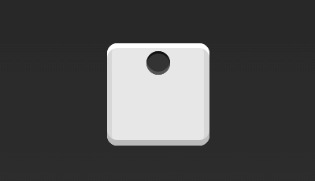

本章包括了一些经典的布局实战案例。

<!-- more -->

## Flex 布局实战

下面我们将通过骰子，来很好的在实战中展示 Flex 布局的功能与美丽。


骰子的一面，最多可以放置 9 个点。


下面，就来看看 Flex 如何实现，从 1 个点到 9 个点的布局。您可以到 [CodePen](http://codepen.io/LandonSchropp/pen/KpzzGo) 查看本部分的 Demo。

::: info

如果不加说明，本节的 HTML 模板一律如下。

```html
<div class="box">
  <span class="item" />
</div>
```

:::

上面代码中，`div` 元素 (代表骰子的一个面) 是 Flex 容器，`span` 元素 (代表一个点) 是 Flex 项目。如果有多个项目，就要添加多个 `span` 元素，以此类推。

### 单项目

首先，只有左上角 1 个点的情况。Flex 布局默认就是首行左对齐，所以一行代码就够了。


```css
.box {
  display: flex;
}
```

设置项目的对齐方式，就能实现居中对齐和右对齐。



```css
.box {
  display: flex;
  justify-content: center;
}
```


```css
.box {
  display: flex;
  justify-content: flex-end;
}
```

设置交叉轴对齐方式，可以垂直移动主轴。


```css
.box {
  display: flex;
  align-items: center;
}
```


```css
.box {
  display: flex;
  justify-content: center;
  align-items: center;
}
```


```css
.box {
  display: flex;
  justify-content: center;
  align-items: flex-end;
}
```


```css
.box {
  display: flex;
  justify-content: flex-end;
  align-items: flex-end;
}
```

### 双项目


```css
.box {
  display: flex;
  justify-content: space-between;
}
```


```css
.box {
  display: flex;
  flex-direction: column;
  justify-content: space-between;
}
```


```css
.box {
  display: flex;
  flex-direction: column;
  justify-content: space-between;
  align-items: center;
}
```


```css
.box {
  display: flex;
  flex-direction: column;
  justify-content: space-between;
  align-items: flex-end;
}
```


```css
.box {
  display: flex;
}

.item:nth-child(2) {
  align-self: center;
}
```


```css
.box {
  display: flex;
  justify-content: space-between;
}

.item:nth-child(2) {
  align-self: flex-end;
}
```

### 三项目


```css
.box {
  display: flex;
}

.item:nth-child(2) {
  align-self: center;
}

.item:nth-child(3) {
  align-self: flex-end;
}
```

### 四项目


```css
.box {
  display: flex;
  flex-wrap: wrap;
  justify-content: flex-end;
  align-content: space-between;
}
```


HTML 代码如下。

```html
<div class="box">
  <div class="column">
    <span class="item" />
    <span class="item" />
  </div>
  <div class="column">
    <span class="item" />
    <span class="item" />
  </div>
</div>
```

CSS 代码如下。

```css
.box {
  display: flex;
  flex-wrap: wrap;
  align-content: space-between;
}

.column {
  flex-basis: 100%;
  display: flex;
  justify-content: space-between;
}
```

### 六项目


```css
.box {
  display: flex;
  flex-wrap: wrap;
  align-content: space-between;
}
```


```css
.box {
  display: flex;
  flex-direction: column;
  flex-wrap: wrap;
  align-content: space-between;
}
```


HTML 代码如下。

```html
<div class="box">
  <div class="row">
    <span class="item" />
    <span class="item" />
    <span class="item" />
  </div>
  <div class="row">
    <span class="item" />
  </div>
  <div class="row">
    <span class="item" />
    <span class="item" />
  </div>
</div>
```

CSS 代码如下。

```css
.box {
  display: flex;
  flex-wrap: wrap;
}

.row {
  flex-basis: 100%;
  display: flex;
}

.row:nth-child(2) {
  justify-content: center;
}

.row:nth-child(3) {
  justify-content: space-between;
}
```

### 九项目


```css
.box {
  display: flex;
  flex-wrap: wrap;
}
```

## 网格布局

### 基本网格布局

最简单的网格布局，就是平均分布。在容器里面平均分配空间，跟上面的骰子布局很像，但是需要设置项目的自动缩放。


HTML 代码如下。

```html
<div class="Grid">
  <div class="Grid-cell">...</div>
  <div class="Grid-cell">...</div>
  <div class="Grid-cell">...</div>
</div>
```

CSS 代码如下。

```css
.Grid {
  display: flex;
}

.Grid-cell {
  flex: 1;
}
```

### 百分比布局

某个网格的宽度为固定的百分比，其余网格平均分配剩余的空间。


HTML 代码如下。

```html
<div class="Grid">
  <div class="Grid-cell u-1of4">...</div>
  <div class="Grid-cell">...</div>
  <div class="Grid-cell u-1of3">...</div>
</div>
```

```css
.Grid {
  display: flex;
}

.Grid-cell {
  flex: 1;
}

.Grid-cell.u-full {
  flex: 0 0 100%;
}

.Grid-cell.u-1of2 {
  flex: 0 0 50%;
}

.Grid-cell.u-1of3 {
  flex: 0 0 33.3333%;
}

.Grid-cell.u-1of4 {
  flex: 0 0 25%;
}
```

## 圣杯布局

圣杯布局 (Holy Grail Layout) 指的是一种最常见的网站布局。页面从上到下，分成三个部分: 头部 (header) ，躯干 (body) ，尾部 (footer) 。其中躯干又水平分成三栏，从左到右为: 导航、主栏、副栏。


HTML 代码如下。

```html
<body class="HolyGrail">
  <header>...</header>
  <div class="HolyGrail-body">
    <main class="HolyGrail-content">...</main>
    <nav class="HolyGrail-nav">...</nav>
    <aside class="HolyGrail-ads">...</aside>
  </div>
  <footer>...</footer>
</body>
```

CSS 代码如下。

```css
.HolyGrail {
  display: flex;
  min-height: 100vh;
  flex-direction: column;
}

header,
footer {
  flex: 1;
}

.HolyGrail-body {
  display: flex;
  flex: 1;
}

.HolyGrail-content {
  flex: 1;
}

.HolyGrail-nav,
.HolyGrail-ads {
  /* 两个边栏的宽度设为 12em */
  flex: 0 0 12em;
}

.HolyGrail-nav {
  /* 导航放到最左边 */
  order: -1;
}
```

如果是小屏幕，躯干的三栏自动变为垂直叠加。

```css
@media (max-width: 768px) {
  .HolyGrail-body {
    flex-direction: column;
    flex: 1;
  }
  .HolyGrail-nav,
  .HolyGrail-ads,
  .HolyGrail-content {
    flex: auto;
  }
}
```

## 输入框的布局

我们常常需要在输入框的前方添加提示，后方添加按钮。


HTML 代码如下。

```html
<div class="InputAddOn">
  <span class="InputAddOn-item">...</span>
  <input class="InputAddOn-field" />
  <button class="InputAddOn-item">...</button>
</div>
```

CSS 代码如下。

```css
.InputAddOn {
  display: flex;
}

.InputAddOn-field {
  flex: 1;
}
```

## 悬挂式布局

有时，主栏的左侧或右侧，需要添加一个图片栏。


HTML 代码如下。

```html
<div class="Media">
  
  <p class="Media-body">...</p>
</div>
```

CSS 代码如下。

```css
.Media {
  display: flex;
  align-items: flex-start;
}

.Media-figure {
  margin-right: 1em;
}

.Media-body {
  flex: 1;
}
```

## 固定的底栏

有时，页面内容太少，无法占满一屏的高度，底栏就会抬高到页面的中间。这时可以采用 Flex 布局，让底栏总是出现在页面的底部。


HTML 代码如下。

```html
<body class="Site">
  <header>...</header>
  <main class="Site-content">...</main>
  <footer>...</footer>
</body>
```

CSS 代码如下。

```css
.Site {
  display: flex;
  min-height: 100vh;
  flex-direction: column;
}

.Site-content {
  flex: 1;
}
```

## 流式布局


每行的项目数固定，会自动分行。

CSS 的写法。

```css
.parent {
  width: 200px;
  height: 150px;
  background-color: black;
  display: flex;
  flex-flow: row wrap;
  align-content: flex-start;
}

.child {
  box-sizing: border-box;
  background-color: white;
  flex: 0 0 25%;
  height: 50px;
  border: 1px solid red;
}
```
