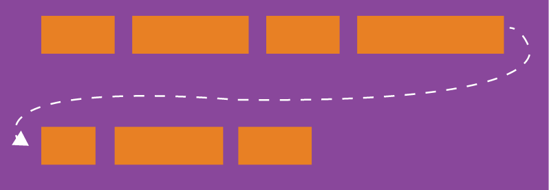
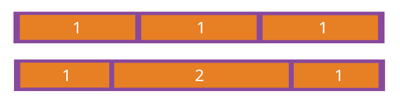

Flex 是 Flexible Box 的缩写，意为"弹性布局"，用来为盒状模型提供最大的灵活性。

<!-- more -->

## 简介

Flex 是 Flexible Box 的缩写，意为"弹性布局"，用来为盒状模型提供最大的灵活性。

任何一个容器都可以指定为 Flex 布局。

```css
.box {
  display: flex;
}
```

行内元素也可以使用 Flex 布局。

```css
.box {
  display: inline-flex;
}
```

::: warning

设为 Flex 布局以后，子元素的 `float`、`clear` 和 `vertical-align` 属性将失效。

:::

## 基本概念

采用 Flex 布局的元素，称为 Flex 容器(flex container)，简称"容器"。它的所有子元素自动成为容器成员，称为 Flex 项目(flex item)，简称"项目"。


- 主轴 (main axis) 是沿着 flex 元素放置的方向延伸的轴(比如页面上的横向的行、纵向的列)。该轴的开始和结束被称为 main start 和 main end。
- 交叉轴 (cross axis) 是垂直于 flex 元素放置方向的轴。该轴的开始和结束被称为 cross start 和 cross end。
- 设置了 `display: flex` 的父元素被称之为 flex 容器(flex container)。
- 在 flex 容器中表现为柔性的盒子的元素被称之为 flex 项(flex item)
- 单个项目占据的主轴空间叫做 main size，占据的交叉轴空间叫做 cross size。

::: tip

这张图很有用，可以多看看。

在默认情况下，主轴水平，方向是从左到右；交叉轴垂直，方向是从上到下。

:::

## 容器的属性

以下 6 个属性设置在容器上。

- flex-direction
- flex-wrap
- flex-flow
- justify-content
- align-items
- align-content

### flex-direction

`flex-direction` 属性决定主轴的方向(即项目的排列方向)。

```css
.box {
  flex-direction: row | row-reverse | column | column-reverse;
}
```


它可能有 4 个值。

- `row`(默认值): 主轴为水平方向，起点在左端。
- `row-reverse`: 主轴为水平方向，起点在右端。
- `column`: 主轴为垂直方向，起点在上沿。
- `column-reverse`: 主轴为垂直方向，起点在下沿。

::: warning

请注意，在任何情况下，交叉轴的均为主轴顺时针旋转 90°

:::

### flex-wrap

默认情况下，项目都排在一条线(又称"轴线")上。`flex-wrap` 属性定义，如果一条轴线排不下，如何换行。



```css
.box {
  flex-wrap: nowrap | wrap | wrap-reverse;
}
```

它可能取三个值。

1. `nowrap`(默认): 不换行。

   ::: normal-demo nowrap

   ```html
   <div class="wrapper">
     <div class="item1">1</div>
     <div class="item2">2</div>
     <div class="item3">3</div>
     <div class="item4">4</div>
     <div class="item5">5</div>
     <div class="item6">6</div>
     <div class="item7">7</div>
     <div class="item8">8</div>
     <div class="item9">9</div>
     <div class="item10">10</div>
     <div class="item11">11</div>
     <div class="item12">12</div>
   </div>
   ```

   ```css
   .wrapper {
     display: flex;
     flex-wrap: no-wrap;
   }

   .wrapper > div {
     width: 80px;
     height: 80px;
     background-color: rgb(207, 232, 220);
     border: 2px solid rgb(79, 185, 227);
   }
   ```

   :::

1. `wrap`: 换行，第一行在上方。

   ::: normal-demo wrap

   ```html
   <div class="wrapper">
     <div class="item1">1</div>
     <div class="item2">2</div>
     <div class="item3">3</div>
     <div class="item4">4</div>
     <div class="item5">5</div>
     <div class="item6">6</div>
     <div class="item7">7</div>
     <div class="item8">8</div>
     <div class="item9">9</div>
     <div class="item10">10</div>
     <div class="item11">11</div>
     <div class="item12">12</div>
   </div>
   ```

   ```css
   .wrapper {
     display: flex;
     flex-wrap: wrap;
   }

   .wrapper > div {
     width: 80px;
     height: 80px;
     background-color: rgb(207, 232, 220);
     border: 2px solid rgb(79, 185, 227);
   }
   ```

   :::

1. `wrap-reverse`: 换行，第一行在下方。

   ::: normal-demo wrap-reverse

   ```html
   <div class="wrapper">
     <div class="item1">1</div>
     <div class="item2">2</div>
     <div class="item3">3</div>
     <div class="item4">4</div>
     <div class="item5">5</div>
     <div class="item6">6</div>
     <div class="item7">7</div>
     <div class="item8">8</div>
     <div class="item9">9</div>
     <div class="item10">10</div>
     <div class="item11">11</div>
     <div class="item12">12</div>
   </div>
   ```

   ```css
   .wrapper {
     display: flex;
     flex-wrap: wrap-reverse;
   }

   .wrapper > div {
     width: 80px;
     height: 80px;
     background-color: rgb(207, 232, 220);
     border: 2px solid rgb(79, 185, 227);
   }
   ```

   :::

### flex-flow

`flex-flow` 属性是 `flex-direction` 属性和 `flex-wrap` 属性的简写形式，默认值为 `row nowrap`。

```css
.box {
  flex-flow: <flex-direction> || <flex-wrap>;
}
```

### justify-content

`justify-content` 属性定义了项目在主轴上的对齐方式。

```css
.box {
  justify-content: flex-start | flex-end | center | space-between | space-around;
}
```

::: normal-demo flex-start

```html
<div class="wrapper">
  <div class="item1" />
  <div class="item2" />
  <div class="item3" />
</div>
```

```css
.wrapper {
  display: flex;
  justify-content: flex-start;
}

.wrapper > div {
  height: 60px;
  background-color: rgb(207, 232, 220);
  border: 2px solid rgb(79, 185, 227);
}

.item1 {
  width: 60px;
}

.item2 {
  width: 120px;
}

.item3 {
  width: 80px;
}
```

:::

::: normal-demo flex-end

```html
<div class="wrapper">
  <div class="item1" />
  <div class="item2" />
  <div class="item3" />
</div>
```

```css
.wrapper {
  display: flex;
  justify-content: flex-end;
}

.wrapper > div {
  height: 60px;
  background-color: rgb(207, 232, 220);
  border: 2px solid rgb(79, 185, 227);
}

.item1 {
  width: 60px;
}

.item2 {
  width: 120px;
}

.item3 {
  width: 80px;
}
```

:::

::: normal-demo center

```html
<div class="wrapper">
  <div class="item1" />
  <div class="item2" />
  <div class="item3" />
</div>
```

```css
.wrapper {
  display: flex;
  justify-content: center;
}

.wrapper > div {
  height: 60px;
  background-color: rgb(207, 232, 220);
  border: 2px solid rgb(79, 185, 227);
}

.item1 {
  width: 60px;
}

.item2 {
  width: 120px;
}

.item3 {
  width: 80px;
}
```

:::

::: normal-demo space-between

```html
<div class="wrapper">
  <div class="item1" />
  <div class="item2" />
  <div class="item3" />
</div>
```

```css
.wrapper {
  display: flex;
  justify-content: space-between;
}

.wrapper > div {
  height: 60px;
  background-color: rgb(207, 232, 220);
  border: 2px solid rgb(79, 185, 227);
}

.item1 {
  width: 60px;
}

.item2 {
  width: 120px;
}

.item3 {
  width: 80px;
}
```

:::

::: normal-demo space-around

```html
<div class="wrapper">
  <div class="item1" />
  <div class="item2" />
  <div class="item3" />
</div>
```

```css
.wrapper {
  display: flex;
  justify-content: space-around;
}

.wrapper > div {
  height: 60px;
  background-color: rgb(207, 232, 220);
  border: 2px solid rgb(79, 185, 227);
}

.item1 {
  width: 60px;
}

.item2 {
  width: 120px;
}

.item3 {
  width: 80px;
}
```

:::

::: normal-demo space-evenly

```html
<div class="wrapper">
  <div class="item1" />
  <div class="item2" />
  <div class="item3" />
</div>
```

```css
.wrapper {
  display: flex;
  justify-content: space-evenly;
}

.wrapper > div {
  height: 60px;
  background-color: rgb(207, 232, 220);
  border: 2px solid rgb(79, 185, 227);
}

.item1 {
  width: 60px;
}

.item2 {
  width: 120px;
}

.item3 {
  width: 80px;
}
```

:::

它可能取 5 个值，具体对齐方式与轴的方向有关。下面假设主轴为从左到右。

- `flex-start`(默认值): 左对齐
- `flex-end`: 右对齐
- `center`: 居中
- `space-between`: 两端对齐，项目之间的间隔都相等。
- `space-around`: 每个项目两侧的间隔相等。所以，项目之间的间隔比项目与边框的间隔大一倍。
- `space-evenly`: 均匀排列每个元素，每个元素之间的间隔相等。

### align-items

`align-items` 属性定义项目在交叉轴上如何对齐。

```css
.box {
  align-items: flex-start | flex-end | center | baseline | stretch;
}
```

::: normal-demo flex-start

```html
<div class="wrapper">
  <div class="item1" />
  <div class="item2" />
  <div class="item3" />
  <div class="item4" />
</div>
```

```css
.wrapper {
  display: flex;
  justify-content: space-between;
  align-items: flex-start;
  height: 160px;
}

.wrapper > div {
  width: 60px;
  background-color: rgb(207, 232, 220);
  border: 2px solid rgb(79, 185, 227);
}

.item1 {
  height: 60px;
}

.item2 {
  height: 120px;
}

.item3 {
  height: 80px;
}

.item4 {
  height: 40px;
}
```

:::

::: normal-demo flex-end

```html
<div class="wrapper">
  <div class="item1" />
  <div class="item2" />
  <div class="item3" />
  <div class="item4" />
</div>
```

```css
.wrapper {
  display: flex;
  justify-content: space-between;
  align-items: flex-end;
  height: 160px;
}

.wrapper > div {
  width: 60px;
  background-color: rgb(207, 232, 220);
  border: 2px solid rgb(79, 185, 227);
}

.item1 {
  height: 60px;
}

.item2 {
  height: 120px;
}

.item3 {
  height: 80px;
}

.item4 {
  height: 40px;
}
```

:::

::: normal-demo center

```html
<div class="wrapper">
  <div class="item1" />
  <div class="item2" />
  <div class="item3" />
  <div class="item4" />
</div>
```

```css
.wrapper {
  display: flex;
  justify-content: space-between;
  align-items: center;
  height: 160px;
}

.wrapper > div {
  width: 60px;
  background-color: rgb(207, 232, 220);
  border: 2px solid rgb(79, 185, 227);
}

.item1 {
  height: 60px;
}

.item2 {
  height: 120px;
}

.item3 {
  height: 80px;
}

.item4 {
  height: 40px;
}
```

:::

::: normal-demo baseline

```html
<div class="wrapper">
  <div class="item1">text</div>
  <div class="item2">text</div>
  <div class="item3">text</div>
  <div class="item4">text</div>
</div>
```

```css
.wrapper {
  display: flex;
  justify-content: space-between;
  align-items: baseline;
  height: 160px;
}

.wrapper > div {
  width: 60px;
  background-color: rgb(207, 232, 220);
  border: 2px solid rgb(79, 185, 227);
}

.item1 {
  height: 60px;
}

.item2 {
  padding-top: 20px;
  height: 100px;
}

.item3 {
  padding-top: 40px;
  height: 40px;
}

.item4 {
  height: 40px;
}
```

:::

::: normal-demo stretch

```html
<div class="wrapper">
  <div class="item1" />
  <div class="item2" />
  <div class="item3" />
  <div class="item4" />
</div>
```

```css
.wrapper {
  display: flex;
  justify-content: space-between;
  align-items: stretch;
  height: 160px;
}

.wrapper > div {
  width: 60px;
  background-color: rgb(207, 232, 220);
  border: 2px solid rgb(79, 185, 227);
}
```

:::

它可能取 5 个值。具体的对齐方式与交叉轴的方向有关，下面假设交叉轴从上到下。

- `flex-start`: 交叉轴的起点对齐。
- `flex-end`: 交叉轴的终点对齐。
- `center`: 交叉轴的中点对齐。
- `baseline`: 项目的第一行文字的基线对齐。
- `stretch`(默认值): 如果项目未设置高度或设为 auto，将占满整个容器的高度。

### align-content

`align-content` 属性定义了多根轴线的对齐方式。如果项目只有一根轴线，该属性不起作用。

```css
.box {
  align-content: flex-start | flex-end | center | space-between | space-around |
    stretch;
}
```


该属性可能取 6 个值。

- `flex-start`: 与交叉轴的起点对齐。
- `flex-end`: 与交叉轴的终点对齐。
- `center`: 与交叉轴的中点对齐。
- `space-between`: 与交叉轴两端对齐，轴线之间的间隔平均分布。
- `space-around`: 每根轴线两侧的间隔都相等。所以，轴线之间的间隔比轴- 线与边框的间隔大一倍。
- `stretch`(默认值): 轴线占满整个交叉轴。

## 项目的属性

以下 6 个属性设置在项目上。

- order
- flex-grow
- flex-shrink
- flex-basis
- flex
- align-self

### order

`order` 属性定义项目的排列顺序。数值越小，排列越靠前，默认为 `0`。


```css
.item {
  order: <integer>;
}
```

### flex-grow

`flex-grow` 属性定义项目的放大比例，默认为 `0`，即如果存在剩余空间，也不放大。

```css
.item {
  flex-grow: <number>; /* default 0 */
}
```



如果所有项目的 `flex-grow` 属性都为 `1`，则它们将等分剩余空间(如果有的话)。如果一个项目的 `flex-grow` 属性为 `2`，其他项目都为 `1`，则前者占据的剩余空间将比其他项多一倍。

### flex-shrink

`flex-shrink` 属性定义了项目的缩小比例，默认为 `1`，即如果空间不足，该项目将缩小。

```css
.item {
  flex-shrink: <number>; /* default 1 */
}
```


如果所有项目的 `flex-shrink` 属性都为 `1`，当空间不足时，都将等比例缩小。如果一个项目的 `flex-shrink` 属性为 `0`，其他项目都为 `1`，则空间不足时，前者不缩小。

::: tip

负值对该属性无效。

:::

### flex-basis

`flex-basis` 属性定义了在分配多余空间之前，项目占据的主轴空间 (main size)。浏览器根据这个属性，计算主轴是否有多余空间。它的默认值为 `auto`，即项目的本来大小。

```css
.item {
  flex-basis: <length> | auto; /* default auto */
}
```

它可以设为跟 `width` 或 `height` 属性一样的值(比如 350px)，则项目将占据固定空间。

### flex

`flex` 属性是 `flex-grow`, `flex-shrink` 和 `flex-basis` 的简写，默认值为 `0 1 auto`。后两个属性可选。

```css
.item {
  flex: none | [ < "flex-grow" > < "flex-shrink" >? || < "flex-basis" >];
}
```

该属性有两个快捷值: `auto` (`1 1 auto`) 和 `non`e (`0 0 auto`)。

建议优先使用这个属性，而不是单独写三个分离的属性，因为浏览器会推算相关值。

### align-self

`align-self` 属性允许单个项目有与其他项目不一样的对齐方式，可覆盖 `align-items` 属性。默认值为 `auto`，表示继承父元素的 `align-items` 属性，如果没有父元素，则等同于 `stretch`。

```css
.item {
  align-self: auto | flex-start | flex-end | center | baseline | stretch;
}
```


该属性可能取 6 个值，除了 `auto`，其他都与 `align-items` 属性完全一
致。
