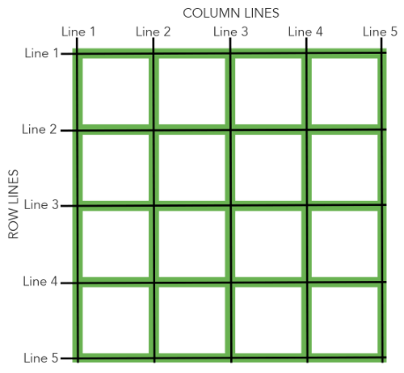
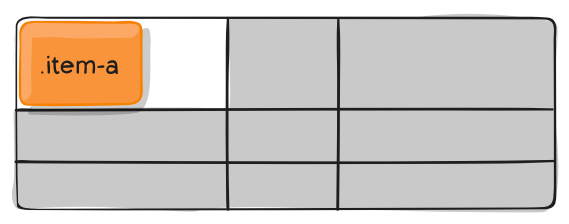

## 概述

网格布局 (Grid) 是最强大的 CSS 布局方案。它将网页划分成一个个网格，可以任意组合不同的网格，做出各种各样的布局。

::: normal-demo 网格布局案例

```html
<div class="grid-demo">
  <div class="item1">1</div>
  <div class="item2">2</div>
  <div class="item3">3</div>
  <div class="item4">4</div>
  <div class="item5">5</div>
  <div class="item6">6</div>
</div>
```

```css
.grid-demo {
  display: grid;
  grid-template-columns: repeat(3, 1fr);
  grid-gap: 10px;
  grid-auto-rows: minmax(100px, auto);
}

/* Common styles */
.grid-demo > div {
  padding: 1em;
  border: 2px solid rgb(233, 171, 88);
  border-radius: 5px;
  background-color: rgba(233, 171, 88, 0.5);
  color: #d9480f;
  font-size: 2rem;
}

.grid-demo > .item1 {
  grid-column: 1 / 3;
  grid-row: 1;
}

.grid-demo > .item2 {
  grid-column: 2 / 4;
  grid-row: 1 / 3;
}

.grid-demo > .item3 {
  grid-row: 2 / 5;
  grid-column: 1;
}

.grid-demo > .item4 {
  grid-column: 3;
  grid-row: 3;
}

.grid-demo > .item5 {
  grid-column: 2;
  grid-row: 4;
}

.grid-demo > .item6 {
  grid-column: 3;
  grid-row: 4;
}
```

:::

上图这样的布局，就是 Grid 布局的拿手好戏。

::: tip 与 flex 的区别

Grid 布局与 Flex 布局有一定的相似性，都可以指定容器内部多个项目的位置。但是，它们也存在重大区别。

Flex 布局是轴线布局，只能指定"项目"针对轴线的位置，可以看作是一维布局。Grid 布局则是将容器划分成"行"和"列"，产生单元格，然后指定"项目所在"的单元格，可以看作是二维布局。Grid 布局远比 Flex 布局强大。

:::

## 基本概念

### 容器和项目

采用网格布局的区域，称为"容器" (container) 。容器内部采用网格定位的子元素，称为"项目" (item) 。

```html
<div>
  <div><p>1</p></div>
  <div><p>2</p></div>
  <div><p>3</p></div>
</div>
```

上面代码中，最外层的 `<div>` 元素就是容器，内层的三个 `<div>` 元素就是项目。

::: warning

项目只能是容器的顶层子元素，不包含项目的子元素，比如上面代码的 `<p>` 元素就不是项目。Grid 布局只对项目生效。

:::

### 行和列


容器里面的水平区域称为"行" (row) ，垂直区域称为"列" (column) 。

上图中，水平的深色区域就是"行"，垂直的深色区域就是"列"。

### 单元格

行和列的交叉区域，称为"单元格" (cell) 。

正常情况下，n 行和 m 列会产生 $n \times m$ 个单元格。比如，3 行 3 列会产生 9 个单元格。

### 网格线

划分网格的线，称为"网格线" (grid line) 。水平网格线划分出行，垂直网格线划分出列。



正常情况下，$n$ 行有 $n + 1$ 根水平网格线，$m$ 列有 $m + 1$ 根垂直网格线，比如三行就有四根水平网格线。

上图是一个 $4 \times 4$ 的网格，共有 5 根水平网格线和 5 根垂直网格线。

### 沟槽

行与行、列与列之间的间隙，这个间隙一般被称为沟槽(gutter)。

## 容器属性

Grid 布局的属性分成两类。一类定义在容器上面，称为容器属性；另一类定义在项目上面，称为项目属性。这部分先介绍容器属性。

### display 属性

`display: grid` 指定一个容器采用网格布局。

::: normal-demo 网格布局

```html
<span style="font-size: 22px">Mr.Hope</span>
<div class="grid-demo">
  <div class="item1">1</div>
  <div class="item2">2</div>
  <div class="item3">3</div>
  <div class="item4">4</div>
  <div class="item5">5</div>
  <div class="item6">6</div>
  <div class="item7">7</div>
  <div class="item8">8</div>
  <div class="item9">9</div>
</div>
<span style="font-size: 22px">is handsome</span>
```

```css
.grid-demo {
  display: grid;
  grid-template-columns: 100px 100px 100px;
  grid-template-rows: 100px 100px 100px;
}

/* Common styles */
.grid-demo > div {
  color: black;
  font-size: 32px;
}

.grid-demo > .item1 {
  background-color: #ff69b4;
}

.grid-demo > .item2 {
  background-color: #ffa500;
}

.grid-demo > .item3 {
  background-color: #3cb371;
}

.grid-demo > .item4 {
  background-color: #87cefa;
}

.grid-demo > .item5 {
  background-color: #9370db;
}

.grid-demo > .item6 {
  background-color: #f0e68c;
}

.grid-demo > .item7 {
  background-color: #fa8072;
}

.grid-demo > .item8 {
  background-color: #ffd700;
}

.grid-demo > .item9 {
  background-color: #008b8b;
}
```

:::

默认情况下，容器元素都是块级元素，但也可以设成行内元素。

::: normal-demo 行内网格布局

```html
<span style="font-size: 22px">Mr.Hope</span>
<div class="grid-demo">
  <div class="item1">1</div>
  <div class="item2">2</div>
  <div class="item3">3</div>
  <div class="item4">4</div>
  <div class="item5">5</div>
  <div class="item6">6</div>
  <div class="item7">7</div>
  <div class="item8">8</div>
  <div class="item9">9</div>
</div>
<span style="font-size: 22px">is handsome</span>
```

```css
.grid-demo {
  display: inline-grid;
  grid-template-columns: 100px 100px 100px;
  grid-template-rows: 100px 100px 100px;
}

/* Common styles */
.grid-demo > div {
  color: black;
  font-size: 32px;
}

.grid-demo > .item1 {
  background-color: #ff69b4;
}

.grid-demo > .item2 {
  background-color: #ffa500;
}

.grid-demo > .item3 {
  background-color: #3cb371;
}

.grid-demo > .item4 {
  background-color: #87cefa;
}

.grid-demo > .item5 {
  background-color: #9370db;
}

.grid-demo > .item6 {
  background-color: #f0e68c;
}

.grid-demo > .item7 {
  background-color: #fa8072;
}

.grid-demo > .item8 {
  background-color: #ffd700;
}

.grid-demo > .item9 {
  background-color: #008b8b;
}
```

:::

::: tip

设为网格布局以后，容器子元素 (项目) 的 `float`、`display: inline-block`、`display: table-cell`、`vertical-align` 和 `column-*` 等设置都将失效。

:::

### grid-template-columns 和 grid-template-rows 属性

容器指定了网格布局以后，接着就要划分行和列。`grid-template-columns` 属性定义每一列的列宽，`grid-template-rows` 属性定义每一行的行高。

::: normal-demo 划分行和列

```html
<div class="grid-demo">
  <div class="item1">1</div>
  <div class="item2">2</div>
  <div class="item3">3</div>
  <div class="item4">4</div>
  <div class="item5">5</div>
  <div class="item6">6</div>
  <div class="item7">7</div>
  <div class="item8">8</div>
  <div class="item9">9</div>
</div>
```

```css
.grid-demo {
  display: grid;
  grid-template-columns: 100px 100px 100px;
  grid-template-rows: 100px 100px 100px;
}

/* Common styles */
.grid-demo > div {
  color: black;
  font-size: 32px;
}

.grid-demo > .item1 {
  background-color: #ff69b4;
}

.grid-demo > .item2 {
  background-color: #ffa500;
}

.grid-demo > .item3 {
  background-color: #3cb371;
}

.grid-demo > .item4 {
  background-color: #87cefa;
}

.grid-demo > .item5 {
  background-color: #9370db;
}

.grid-demo > .item6 {
  background-color: #f0e68c;
}

.grid-demo > .item7 {
  background-color: #fa8072;
}

.grid-demo > .item8 {
  background-color: #ffd700;
}

.grid-demo > .item9 {
  background-color: #008b8b;
}
```

:::

上面代码指定了一个三行三列的网格，列宽和行高都是 100px。

除了使用绝对单位，也可以使用百分比。

::: normal-demo 百分比

```html
<div class="grid-demo">
  <div class="item1">1</div>
  <div class="item2">2</div>
  <div class="item3">3</div>
  <div class="item4">4</div>
  <div class="item5">5</div>
  <div class="item6">6</div>
  <div class="item7">7</div>
  <div class="item8">8</div>
  <div class="item9">9</div>
</div>
```

```css
.grid-demo {
  display: grid;
  grid-template-columns: 33.33% 33.33% 33.33%;
  grid-template-rows: 33.33% 33.33% 33.33%;
}

/* Common styles */
.grid-demo > div {
  color: black;
  font-size: 32px;
}

.grid-demo > .item1 {
  background-color: #ff69b4;
}

.grid-demo > .item2 {
  background-color: #ffa500;
}

.grid-demo > .item3 {
  background-color: #3cb371;
}

.grid-demo > .item4 {
  background-color: #87cefa;
}

.grid-demo > .item5 {
  background-color: #9370db;
}

.grid-demo > .item6 {
  background-color: #f0e68c;
}

.grid-demo > .item7 {
  background-color: #fa8072;
}

.grid-demo > .item8 {
  background-color: #ffd700;
}

.grid-demo > .item9 {
  background-color: #008b8b;
}
```

:::

#### repeat()

有时候，重复写同样的值非常麻烦，尤其网格很多时。这时，可以使用 `repeat()` 函数，简化重复的值。

::: normal-demo repeat()

上面的代码用 `repeat()` 改写如下。

```html
<div class="grid-demo">
  <div class="item1">1</div>
  <div class="item2">2</div>
  <div class="item3">3</div>
  <div class="item4">4</div>
  <div class="item5">5</div>
  <div class="item6">6</div>
  <div class="item7">7</div>
  <div class="item8">8</div>
  <div class="item9">9</div>
</div>
```

```css
.grid-demo {
  display: grid;
  grid-template-columns: repeat(3, 33.33%);
  grid-template-rows: repeat(3, 33.33%);
}

/* Common styles */
.grid-demo > div {
  color: black;
  font-size: 32px;
}

.grid-demo > .item1 {
  background-color: #ff69b4;
}

.grid-demo > .item2 {
  background-color: #ffa500;
}

.grid-demo > .item3 {
  background-color: #3cb371;
}

.grid-demo > .item4 {
  background-color: #87cefa;
}

.grid-demo > .item5 {
  background-color: #9370db;
}

.grid-demo > .item6 {
  background-color: #f0e68c;
}

.grid-demo > .item7 {
  background-color: #fa8072;
}

.grid-demo > .item8 {
  background-color: #ffd700;
}

.grid-demo > .item9 {
  background-color: #008b8b;
}
```

:::

`repeat()` 接受两个参数，第一个参数是重复的次数 (上例是 `3`) ，第二个参数是所要重复的值。

`repeat()` 重复某种模式也是可以的。

::: normal-demo 重复模式

```html
<div class="grid-demo">
  <div class="item1">1</div>
  <div class="item2">2</div>
  <div class="item3">3</div>
  <div class="item4">4</div>
  <div class="item5">5</div>
  <div class="item6">6</div>
  <div class="item7">7</div>
  <div class="item8">8</div>
  <div class="item9">9</div>
</div>
```

```css
.grid-demo {
  width: 300px;
  height: 300px;
  display: grid;
  grid-template-columns: repeat(2, 100px 20px 80px);
}

/* Common styles */
.grid-demo > div {
  color: black;
  font-size: 32px;
}

.grid-demo > .item1 {
  background-color: #ff69b4;
}

.grid-demo > .item2 {
  background-color: #ffa500;
}

.grid-demo > .item3 {
  background-color: #3cb371;
}

.grid-demo > .item4 {
  background-color: #87cefa;
}

.grid-demo > .item5 {
  background-color: #9370db;
}

.grid-demo > .item6 {
  background-color: #f0e68c;
}

.grid-demo > .item7 {
  background-color: #fa8072;
}

.grid-demo > .item8 {
  background-color: #ffd700;
}

.grid-demo > .item9 {
  background-color: #008b8b;
}
```

:::

上面代码定义了 6 列，第一列和第四列的宽度为 `100px`，第二列和第五列为 `20px`，第三列和第六列为 `80px`。

#### auto-fill 关键字

有时，单元格的大小是固定的，但是容器的大小不确定。如果希望每一行 (或每一列) 容纳尽可能多的单元格，这时可以使用 `auto-fill` 关键字表示自动填充。

::: normal-demo 自动填充

```html
<div class="grid-demo">
  <div class="item1">1</div>
  <div class="item2">2</div>
  <div class="item3">3</div>
  <div class="item4">4</div>
  <div class="item5">5</div>
  <div class="item6">6</div>
  <div class="item7">7</div>
  <div class="item8">8</div>
  <div class="item9">9</div>
</div>
```

```css
.grid-demo {
  display: grid;
  grid-template-columns: repeat(auto-fill, 100px);
}

.grid-demo > div {
  height: 100px;
}

/* Common styles */
.grid-demo > div {
  color: black;
  font-size: 32px;
}

.grid-demo > .item1 {
  background-color: #ff69b4;
}

.grid-demo > .item2 {
  background-color: #ffa500;
}

.grid-demo > .item3 {
  background-color: #3cb371;
}

.grid-demo > .item4 {
  background-color: #87cefa;
}

.grid-demo > .item5 {
  background-color: #9370db;
}

.grid-demo > .item6 {
  background-color: #f0e68c;
}

.grid-demo > .item7 {
  background-color: #fa8072;
}

.grid-demo > .item8 {
  background-color: #ffd700;
}

.grid-demo > .item9 {
  background-color: #008b8b;
}
```

:::

上面代码表示每列宽度 `100px`，然后自动填充，直到容器不能放置更多的列。

#### fr 关键字

为了方便表示比例关系，网格布局提供了 `fr` 关键字 (fraction 的缩写，意为"片段") 。如果两列的宽度分别为 `1fr` 和 `2fr`，就表示后者是前者的两倍。

::: normal-demo fr

下面代码表示两个相同宽度的列。

```html
<div class="grid-demo">
  <div class="item1">1</div>
  <div class="item2">2</div>
  <div class="item3">3</div>
  <div class="item4">4</div>
  <div class="item5">5</div>
  <div class="item6">6</div>
  <div class="item7">7</div>
  <div class="item8">8</div>
  <div class="item9">9</div>
</div>
```

```css
.grid-demo {
  display: grid;
  grid-template-columns: 1fr 1fr;
}

.grid-demo > div {
  height: 100px;
}

/* Common styles */
.grid-demo > div {
  color: black;
  font-size: 32px;
}

.grid-demo > .item1 {
  background-color: #ff69b4;
}

.grid-demo > .item2 {
  background-color: #ffa500;
}

.grid-demo > .item3 {
  background-color: #3cb371;
}

.grid-demo > .item4 {
  background-color: #87cefa;
}

.grid-demo > .item5 {
  background-color: #9370db;
}

.grid-demo > .item6 {
  background-color: #f0e68c;
}

.grid-demo > .item7 {
  background-color: #fa8072;
}

.grid-demo > .item8 {
  background-color: #ffd700;
}

.grid-demo > .item9 {
  background-color: #008b8b;
}
```

:::

`fr` 可以与绝对长度的单位结合使用，这时会非常方便。

::: normal-demo fr 的混用

下面代码表示，第一列的宽度为 150 像素，第二列的宽度是第三列的一半。

```html
<div class="grid-demo">
  <div class="item1">1</div>
  <div class="item2">2</div>
  <div class="item3">3</div>
  <div class="item4">4</div>
  <div class="item5">5</div>
  <div class="item6">6</div>
  <div class="item7">7</div>
  <div class="item8">8</div>
  <div class="item9">9</div>
</div>
```

```css
.grid-demo {
  display: grid;
  grid-template-columns: 150px 1fr 2fr;
}

.grid-demo > div {
  height: 100px;
}

/* Common styles */
.grid-demo > div {
  color: black;
  font-size: 32px;
}

.grid-demo > .item1 {
  background-color: #ff69b4;
}

.grid-demo > .item2 {
  background-color: #ffa500;
}

.grid-demo > .item3 {
  background-color: #3cb371;
}

.grid-demo > .item4 {
  background-color: #87cefa;
}

.grid-demo > .item5 {
  background-color: #9370db;
}

.grid-demo > .item6 {
  background-color: #f0e68c;
}

.grid-demo > .item7 {
  background-color: #fa8072;
}

.grid-demo > .item8 {
  background-color: #ffd700;
}

.grid-demo > .item9 {
  background-color: #008b8b;
}
```

:::

#### minmax()

`minmax()` 函数产生一个长度范围，表示长度就在这个范围之中。它接受两个参数，分别为最小值和最大值。

::: normal-demo minmax()

下面代码中，`minmax(100px, 1fr)` 表示列宽不小于 `100px`，不大于 `1fr`。

```html
<div class="grid-demo">
  <div class="item1">1</div>
  <div class="item2">2</div>
  <div class="item3">3</div>
  <div class="item4">4</div>
  <div class="item5">5</div>
  <div class="item6">6</div>
  <div class="item7">7</div>
  <div class="item8">8</div>
  <div class="item9">9</div>
</div>
```

```css
.grid-demo {
  display: grid;
  grid-template-columns: 1fr 1fr minmax(100px, 1fr);
}

.grid-demo > div {
  height: 100px;
}

/* Common styles */
.grid-demo > div {
  color: black;
  font-size: 32px;
}

.grid-demo > .item1 {
  background-color: #ff69b4;
}

.grid-demo > .item2 {
  background-color: #ffa500;
}

.grid-demo > .item3 {
  background-color: #3cb371;
}

.grid-demo > .item4 {
  background-color: #87cefa;
}

.grid-demo > .item5 {
  background-color: #9370db;
}

.grid-demo > .item6 {
  background-color: #f0e68c;
}

.grid-demo > .item7 {
  background-color: #fa8072;
}

.grid-demo > .item8 {
  background-color: #ffd700;
}

.grid-demo > .item9 {
  background-color: #008b8b;
}
```

:::

#### auto 关键字

`auto` 关键字表示由浏览器自己决定长度。

::: normal-demo auto

下面代码中，第二列的宽度，基本上等于该列单元格的最大宽度，除非单元格内容设置了 `min-width`，且这个值大于最大宽度。

```html
<div class="grid-demo">
  <div class="item1">1</div>
  <div class="item2">2</div>
  <div class="item3">3</div>
  <div class="item4">4</div>
  <div class="item5">5</div>
  <div class="item6">6</div>
  <div class="item7">7</div>
  <div class="item8">8</div>
  <div class="item9">9</div>
</div>
```

```css
.grid-demo {
  display: grid;
  grid-template-columns: 100px auto 100px;
}

.grid-demo > div {
  height: 100px;
}

/* Common styles */
.grid-demo > div {
  color: black;
  font-size: 32px;
}

.grid-demo > .item1 {
  background-color: #ff69b4;
}

.grid-demo > .item2 {
  background-color: #ffa500;
}

.grid-demo > .item3 {
  background-color: #3cb371;
}

.grid-demo > .item4 {
  background-color: #87cefa;
}

.grid-demo > .item5 {
  background-color: #9370db;
}

.grid-demo > .item6 {
  background-color: #f0e68c;
}

.grid-demo > .item7 {
  background-color: #fa8072;
}

.grid-demo > .item8 {
  background-color: #ffd700;
}

.grid-demo > .item9 {
  background-color: #008b8b;
}
```

:::

#### 网格线的名称

`grid-template-columns` 属性和 `grid-template-rows` 属性里面，还可以使用方括号，指定每一根网格线的名字，方便以后的引用。

::: normal-demo 网格线的名称

下面代码指定网格布局为 3 行 x 3 列，因此有 4 根垂直网格线和 4 根水平网格线。方括号里面依次是这八根线的名字。

```html
<div class="grid-demo">
  <div class="item1">1</div>
  <div class="item2">2</div>
  <div class="item3">3</div>
  <div class="item4">4</div>
  <div class="item5">5</div>
  <div class="item6">6</div>
  <div class="item7">7</div>
  <div class="item8">8</div>
  <div class="item9">9</div>
</div>
```

```css
.grid-demo {
  display: grid;
  grid-template-columns: [c1] 100px [c2] 100px [c3] auto [c4];
  grid-template-rows: [r1] 100px [r2] 100px [r3] auto [r4];
}

/* Common styles */
.grid-demo > div {
  color: black;
  font-size: 32px;
}

.grid-demo > .item1 {
  background-color: #ff69b4;
}

.grid-demo > .item2 {
  background-color: #ffa500;
}

.grid-demo > .item3 {
  background-color: #3cb371;
}

.grid-demo > .item4 {
  background-color: #87cefa;
}

.grid-demo > .item5 {
  background-color: #9370db;
}

.grid-demo > .item6 {
  background-color: #f0e68c;
}

.grid-demo > .item7 {
  background-color: #fa8072;
}

.grid-demo > .item8 {
  background-color: #ffd700;
}

.grid-demo > .item9 {
  background-color: #008b8b;
}
```

:::

网格布局允许同一根线有多个名字，比如 `[fifth-line row-5]`。

#### 布局实例

`grid-template-columns` 属性对于网页布局非常有用。两栏式布局只需要一行代码。

```css
.wrapper {
  display: grid;
  grid-template-columns: 70% 30%;
}
```

上面代码将左边栏设为 `70%`，右边栏设为 `30%`。

传统的十二网格布局，写起来也很容易。

```css
.container {
  grid-template-columns: repeat(12, 1fr);
}
```

### row-gap 属性、column-gap 属性 和 gap 属性

`row-gap` 属性设置行与行的间隔 (行间距) ，`column-gap` 属性设置列与列的间隔 (列间距) 。

```css
.container {
  row-gap: 20px;
  column-gap: 20px;
}
```

::: normal-demo 间距设置

```html
<div class="grid-demo">
  <div class="item1">1</div>
  <div class="item2">2</div>
  <div class="item3">3</div>
  <div class="item4">4</div>
  <div class="item5">5</div>
  <div class="item6">6</div>
  <div class="item7">7</div>
  <div class="item8">8</div>
  <div class="item9">9</div>
</div>
```

```css
.grid-demo {
  display: grid;
  grid-template-columns: 100px 100px 100px;
  grid-template-rows: 100px 100px 100px;
  row-gap: 20px;
  column-gap: 20px;
}

/* Common styles */
.grid-demo > div {
  color: black;
  font-size: 32px;
}

.grid-demo > .item1 {
  background-color: #ff69b4;
}

.grid-demo > .item2 {
  background-color: #ffa500;
}

.grid-demo > .item3 {
  background-color: #3cb371;
}

.grid-demo > .item4 {
  background-color: #87cefa;
}

.grid-demo > .item5 {
  background-color: #9370db;
}

.grid-demo > .item6 {
  background-color: #f0e68c;
}

.grid-demo > .item7 {
  background-color: #fa8072;
}

.grid-demo > .item8 {
  background-color: #ffd700;
}

.grid-demo > .item9 {
  background-color: #008b8b;
}
```

:::

上面代码中，`row-gap` 用于设置行间距，`column-gap` 用于设置列间距。

`gap` 属性是 `column-gap` 和 `row-gap` 的合并简写形式，语法如下。

```css
.container {
  gap: <row-gap> <column-gap>;
}
```

因此，上面一段 CSS 代码等同于下面的代码。

```css
.container {
  gap: 20px 20px;
}
```

如果 `gap` 省略了第二个值，浏览器认为第二个值等于第一个值。

### grid-template-areas 属性

网格布局允许指定"区域" (area) ，一个区域由单个或多个单元格组成。`grid-template-areas` 属性用于定义区域。

```css
.container {
  display: grid;
  grid-template-columns: 100px 100px 100px;
  grid-template-rows: 100px 100px 100px;
  grid-template-areas:
    "a b c"
    "d e f"
    "g h i";
}
```

上面代码先划分出 9 个单元格，然后将其定名为 `a` 到 `i` 的九个区域，分别对应这九个单元格。

多个单元格合并成一个区域的写法如下。

```css
.container {
  grid-template-areas:
    "a a a"
    "b b b"
    "c c c";
}
```

上面代码将 9 个单元格分成 `a`、`b`、`c` 三个区域。

下面是一个布局实例。

```css
.container {
  grid-template-areas:
    "header header header"
    "main main sidebar"
    "footer footer footer";
}
```

上面代码中，顶部是页眉区域 `header`，底部是页脚区域 `footer`，中间部分则为 `main` 和 `sidebar`。

如果某些区域不需要利用，则使用"点" (`.`) 表示。

```css
.container {
  grid-template-areas:
    "a . c"
    "d . f"
    "g . i";
}
```

上面代码中，中间一列为点，表示没有用到该单元格，或者该单元格不属于任何区域。

::: tip

区域的命名会影响到网格线。每个区域的起始网格线，会自动命名为 `区域名-start`，终止网格线自动命名为 `区域名-end`。

比如，区域名为 `header`，则起始位置的水平网格线和垂直网格线叫做 `header-start`，终止位置的水平网格线和垂直网格线叫做 `header-end`。

:::

### grid-auto-flow 属性

划分网格以后，容器的子元素会按照顺序，自动放置在每一个网格。默认的放置顺序是"先行后列"，即先填满第一行，再开始放入第二行，即下方数字的顺序。

::: normal-demo 默认顺序“先行后列”

```html
<div class="grid-demo">
  <div class="item1">1</div>
  <div class="item2">2</div>
  <div class="item3">3</div>
  <div class="item4">4</div>
  <div class="item5">5</div>
  <div class="item6">6</div>
  <div class="item7">7</div>
  <div class="item8">8</div>
  <div class="item9">9</div>
</div>
```

```css
.grid-demo {
  display: grid;
  grid-template-columns: 100px 100px 100px;
  grid-template-rows: 100px 100px 100px;
}

/* Common styles */
.grid-demo > div {
  color: black;
  font-size: 32px;
}

.grid-demo > .item1 {
  background-color: #ff69b4;
}

.grid-demo > .item2 {
  background-color: #ffa500;
}

.grid-demo > .item3 {
  background-color: #3cb371;
}

.grid-demo > .item4 {
  background-color: #87cefa;
}

.grid-demo > .item5 {
  background-color: #9370db;
}

.grid-demo > .item6 {
  background-color: #f0e68c;
}

.grid-demo > .item7 {
  background-color: #fa8072;
}

.grid-demo > .item8 {
  background-color: #ffd700;
}

.grid-demo > .item9 {
  background-color: #008b8b;
}
```

:::

这个顺序由 `grid-auto-flow` 属性决定，默认值是 `row`，即"先行后列"。也可以将它设成 `column`，变成"先列后行"。

设置了 `column` 以后，放置顺序就变成了下图。

::: normal-demo grid-auto-flow: column

```html
<div class="grid-demo">
  <div class="item1">1</div>
  <div class="item2">2</div>
  <div class="item3">3</div>
  <div class="item4">4</div>
  <div class="item5">5</div>
  <div class="item6">6</div>
  <div class="item7">7</div>
  <div class="item8">8</div>
  <div class="item9">9</div>
</div>
```

```css
.grid-demo {
  display: grid;
  grid-template-columns: 100px 100px 100px;
  grid-template-rows: 100px 100px 100px;
  grid-auto-flow: column;
}

/* Common styles */
.grid-demo > div {
  color: black;
  font-size: 32px;
}

.grid-demo > .item1 {
  background-color: #ff69b4;
}

.grid-demo > .item2 {
  background-color: #ffa500;
}

.grid-demo > .item3 {
  background-color: #3cb371;
}

.grid-demo > .item4 {
  background-color: #87cefa;
}

.grid-demo > .item5 {
  background-color: #9370db;
}

.grid-demo > .item6 {
  background-color: #f0e68c;
}

.grid-demo > .item7 {
  background-color: #fa8072;
}

.grid-demo > .item8 {
  background-color: #ffd700;
}

.grid-demo > .item9 {
  background-color: #008b8b;
}
```

:::

`grid-auto-flow` 属性除了设置成 `row` 和 `column`，还可以设成 `row dense` 和 `column dense`。这两个值主要用于，某些项目指定位置以后，剩下的项目怎么自动放置。

下面的例子让 1 号项目和 2 号项目各占据两个单元格，然后在默认的 `grid-auto-flow: row` 情况下，会产生下面这样的布局。

::: normal-demo 项目占据多个单元格下的 grid-auto-flow: row

```html
<div class="grid-demo">
  <div class="item1">1</div>
  <div class="item2">2</div>
  <div class="item3">3</div>
  <div class="item4">4</div>
  <div class="item5">5</div>
  <div class="item6">6</div>
  <div class="item7">7</div>
  <div class="item8">8</div>
  <div class="item9">9</div>
</div>
```

```css
.grid-demo {
  width: 300px;
  display: grid;
  grid-template-columns: 100px 100px 100px;
  grid-template-rows: 100px 100px 100px;
  grid-auto-rows: 100px;
  grid-auto-flow: row;
}

/* Common styles */
.grid-demo > div {
  color: black;
  font-size: 32px;
}

.grid-demo > .item1 {
  /* 这个属性后面会提到 */
  grid-column-start: span 2;
  background-color: #ff69b4;
}

.grid-demo > .item2 {
  /* 这个属性后面会提到 */
  grid-column-start: span 2;
  background-color: #ffa500;
}

.grid-demo > .item3 {
  background-color: #3cb371;
}

.grid-demo > .item4 {
  background-color: #87cefa;
}

.grid-demo > .item5 {
  background-color: #9370db;
}

.grid-demo > .item6 {
  background-color: #f0e68c;
}

.grid-demo > .item7 {
  background-color: #fa8072;
}

.grid-demo > .item8 {
  background-color: #ffd700;
}

.grid-demo > .item9 {
  background-color: #008b8b;
}
```

:::

上图中，1 号项目后面的位置是空的，这是因为 3 号项目默认跟着 2 号项目，所以会排在 2 号项目后面。

现在修改设置，设为 `row dense`，表示"先行后列"，并且尽可能紧密填满，尽量不出现空格。

上面代码的效果如下。

::: normal-demo grid-auto-flow: row dense

```html
<div class="grid-demo">
  <div class="item1">1</div>
  <div class="item2">2</div>
  <div class="item3">3</div>
  <div class="item4">4</div>
  <div class="item5">5</div>
  <div class="item6">6</div>
  <div class="item7">7</div>
  <div class="item8">8</div>
  <div class="item9">9</div>
</div>
```

```css
.grid-demo {
  width: 300px;
  display: grid;
  grid-template-columns: 100px 100px 100px;
  grid-template-rows: 100px 100px 100px;
  grid-auto-rows: 100px;
  grid-auto-flow: row dense;
}

/* Common styles */
.grid-demo > div {
  color: black;
  font-size: 32px;
}

.grid-demo > .item1 {
  /* 这个属性后面会提到 */
  grid-column-start: span 2;
  background-color: #ff69b4;
}

.grid-demo > .item2 {
  /* 这个属性后面会提到 */
  grid-column-start: span 2;
  background-color: #ffa500;
}

.grid-demo > .item3 {
  background-color: #3cb371;
}

.grid-demo > .item4 {
  background-color: #87cefa;
}

.grid-demo > .item5 {
  background-color: #9370db;
}

.grid-demo > .item6 {
  background-color: #f0e68c;
}

.grid-demo > .item7 {
  background-color: #fa8072;
}

.grid-demo > .item8 {
  background-color: #ffd700;
}

.grid-demo > .item9 {
  background-color: #008b8b;
}
```

:::

上图会先填满第一行，再填满第二行，所以 3 号项目就会紧跟在 1 号项目的后面。8 号项目和 9 号项目就会排到第四行。

如果将设置改为 `column dense`，表示"先列后行"，并且尽量填满空格。

上面代码的效果如下。

::: normal-demo grid-auto-flow: column dense

```html
<div class="grid-demo">
  <div class="item1">1</div>
  <div class="item2">2</div>
  <div class="item3">3</div>
  <div class="item4">4</div>
  <div class="item5">5</div>
  <div class="item6">6</div>
  <div class="item7">7</div>
  <div class="item8">8</div>
  <div class="item9">9</div>
</div>
```

```css
.grid-demo {
  width: 300px;
  display: grid;
  grid-template-columns: 100px 100px 100px;
  grid-template-rows: 100px 100px 100px;
  grid-auto-columns: 100px;
  grid-auto-flow: column dense;
}

/* Common styles */
.grid-demo > div {
  color: black;
  font-size: 32px;
}

.grid-demo > .item1 {
  /* 这个属性后面会提到 */
  grid-column-start: span 2;
  background-color: #ff69b4;
}

.grid-demo > .item2 {
  /* 这个属性后面会提到 */
  grid-column-start: span 2;
  background-color: #ffa500;
}

.grid-demo > .item3 {
  background-color: #3cb371;
}

.grid-demo > .item4 {
  background-color: #87cefa;
}

.grid-demo > .item5 {
  background-color: #9370db;
}

.grid-demo > .item6 {
  background-color: #f0e68c;
}

.grid-demo > .item7 {
  background-color: #fa8072;
}

.grid-demo > .item8 {
  background-color: #ffd700;
}

.grid-demo > .item9 {
  background-color: #008b8b;
}
```

:::

上图会先填满第一列，再填满第 2 列，所以 3 号项目在第一列，4 号项目在第二列。8 号项目和 9 号项目被挤到了第四列。

### justify-items 属性，align-items 属性 和 place-items 属性

`justify-items` 属性设置单元格内容的水平位置 (左中右) ，`align-items` 属性设置单元格内容的垂直位置 (上中下) 。

```css
.container {
  justify-items: start | end | center | stretch;
  align-items: start | end | center | stretch;
}
```

这两个属性的写法完全相同，都可以取下面这些值。

- start: 对齐单元格的起始边缘。
- end: 对齐单元格的结束边缘。
- center: 单元格内部居中。
- stretch: 拉伸，占满单元格的整个宽度 (默认值) 。

```css
.container {
  justify-items: start;
}
```

上面代码表示，单元格的内容左对齐，效果如下图。

::: normal-demo justify-items: start

```html
<div class="grid-demo">
  <div class="item1">1</div>
  <div class="item2">2</div>
  <div class="item3">3</div>
  <div class="item4">4</div>
  <div class="item5">5</div>
  <div class="item6">6</div>
  <div class="item7">7</div>
  <div class="item8">8</div>
  <div class="item9">9</div>
</div>
```

```css
.grid-demo {
  display: grid;
  grid-template-columns: 100px 100px 100px;
  grid-template-rows: 100px 100px 100px;
  justify-items: start;
}

/* Common styles */
.grid-demo > div {
  width: 50px;
  color: black;
  font-size: 32px;
}

.grid-demo > .item1 {
  background-color: #ff69b4;
}

.grid-demo > .item2 {
  background-color: #ffa500;
}

.grid-demo > .item3 {
  background-color: #3cb371;
}

.grid-demo > .item4 {
  background-color: #87cefa;
}

.grid-demo > .item5 {
  background-color: #9370db;
}

.grid-demo > .item6 {
  background-color: #f0e68c;
}

.grid-demo > .item7 {
  background-color: #fa8072;
}

.grid-demo > .item8 {
  background-color: #ffd700;
}

.grid-demo > .item9 {
  background-color: #008b8b;
}
```

:::

```css
.container {
  align-items: start;
}
```

上面代码表示，单元格的内容头部对齐，效果如下图。

::: normal-demo align-items: start

```html
<div class="grid-demo">
  <div class="item1">1</div>
  <div class="item2">2</div>
  <div class="item3">3</div>
  <div class="item4">4</div>
  <div class="item5">5</div>
  <div class="item6">6</div>
  <div class="item7">7</div>
  <div class="item8">8</div>
  <div class="item9">9</div>
</div>
```

```css
.grid-demo {
  display: grid;
  grid-template-columns: 100px 100px 100px;
  grid-template-rows: 100px 100px 100px;
  align-items: start;
}

/* Common styles */
.grid-demo > div {
  height: 50px;
  color: black;
  font-size: 32px;
}

.grid-demo > .item1 {
  background-color: #ff69b4;
}

.grid-demo > .item2 {
  background-color: #ffa500;
}

.grid-demo > .item3 {
  background-color: #3cb371;
}

.grid-demo > .item4 {
  background-color: #87cefa;
}

.grid-demo > .item5 {
  background-color: #9370db;
}

.grid-demo > .item6 {
  background-color: #f0e68c;
}

.grid-demo > .item7 {
  background-color: #fa8072;
}

.grid-demo > .item8 {
  background-color: #ffd700;
}

.grid-demo > .item9 {
  background-color: #008b8b;
}
```

:::

`place-items` 属性是 `align-items` 属性和 `justify-items` 属性的合并简写形式。

```css
.container {
  place-items: <align-items> <justify-items>;
}
```

下面是一个例子。

::: normal-demo place-items: start end

```html
<div class="grid-demo">
  <div class="item1">1</div>
  <div class="item2">2</div>
  <div class="item3">3</div>
  <div class="item4">4</div>
  <div class="item5">5</div>
  <div class="item6">6</div>
  <div class="item7">7</div>
  <div class="item8">8</div>
  <div class="item9">9</div>
</div>
```

```css
.grid-demo {
  display: grid;
  grid-template-columns: 100px 100px 100px;
  grid-template-rows: 100px 100px 100px;
  place-items: start end;
}

/* Common styles */
.grid-demo > div {
  width: 50px;
  height: 50px;
  color: black;
  font-size: 32px;
}

.grid-demo > .item1 {
  background-color: #ff69b4;
}

.grid-demo > .item2 {
  background-color: #ffa500;
}

.grid-demo > .item3 {
  background-color: #3cb371;
}

.grid-demo > .item4 {
  background-color: #87cefa;
}

.grid-demo > .item5 {
  background-color: #9370db;
}

.grid-demo > .item6 {
  background-color: #f0e68c;
}

.grid-demo > .item7 {
  background-color: #fa8072;
}

.grid-demo > .item8 {
  background-color: #ffd700;
}

.grid-demo > .item9 {
  background-color: #008b8b;
}
```

:::

如果省略第二个值，则浏览器认为与第一个值相等。

### justify-content 属性，align-content 属性 和 place-content 属性

`justify-content` 属性是整个内容区域在容器里面的水平位置 (左中右) ，`align-content` 属性是整个内容区域的垂直位置 (上中下) 。

```css
.container {
  justify-content: start | end | center | stretch | space-around | space-between
    | space-evenly;
  align-content: start | end | center | stretch | space-around | space-between |
    space-evenly;
}
```

这两个属性的写法完全相同，都可以取下面这些值。(下面的图都以 `justify-content` 属性为例，`align-content` 属性的图完全一样，只是将水平方向改成垂直方向。)

::: normal-demo start - 对齐容器的起始边框。

```html
<div class="grid-demo">
  <div class="item1">1</div>
  <div class="item2">2</div>
  <div class="item3">3</div>
  <div class="item4">4</div>
  <div class="item5">5</div>
  <div class="item6">6</div>
  <div class="item7">7</div>
  <div class="item8">8</div>
  <div class="item9">9</div>
</div>
```

```css
.grid-demo {
  margin: 8px;
  padding: 8px;
  border: 1px solid grey;
  display: grid;
  grid-template-columns: 100px 100px 100px;
  grid-template-rows: 100px 100px 100px;
  justify-content: start;
}

/* Common styles */
.grid-demo > div {
  color: black;
  font-size: 32px;
}

.grid-demo > .item1 {
  background-color: #ff69b4;
}

.grid-demo > .item2 {
  background-color: #ffa500;
}

.grid-demo > .item3 {
  background-color: #3cb371;
}

.grid-demo > .item4 {
  background-color: #87cefa;
}

.grid-demo > .item5 {
  background-color: #9370db;
}

.grid-demo > .item6 {
  background-color: #f0e68c;
}

.grid-demo > .item7 {
  background-color: #fa8072;
}

.grid-demo > .item8 {
  background-color: #ffd700;
}

.grid-demo > .item9 {
  background-color: #008b8b;
}
```

:::

::: normal-demo end - 对齐容器的结束边框

```html
<div class="grid-demo">
  <div class="item1">1</div>
  <div class="item2">2</div>
  <div class="item3">3</div>
  <div class="item4">4</div>
  <div class="item5">5</div>
  <div class="item6">6</div>
  <div class="item7">7</div>
  <div class="item8">8</div>
  <div class="item9">9</div>
</div>
```

```css
.grid-demo {
  margin: 8px;
  padding: 8px;
  border: 1px solid grey;
  display: grid;
  grid-template-columns: 100px 100px 100px;
  grid-template-rows: 100px 100px 100px;
  justify-content: end;
}

/* Common styles */
.grid-demo > div {
  color: black;
  font-size: 32px;
}

.grid-demo > .item1 {
  background-color: #ff69b4;
}

.grid-demo > .item2 {
  background-color: #ffa500;
}

.grid-demo > .item3 {
  background-color: #3cb371;
}

.grid-demo > .item4 {
  background-color: #87cefa;
}

.grid-demo > .item5 {
  background-color: #9370db;
}

.grid-demo > .item6 {
  background-color: #f0e68c;
}

.grid-demo > .item7 {
  background-color: #fa8072;
}

.grid-demo > .item8 {
  background-color: #ffd700;
}

.grid-demo > .item9 {
  background-color: #008b8b;
}
```

:::

::: normal-demo center - 容器内部居中

```html
<div class="grid-demo">
  <div class="item1">1</div>
  <div class="item2">2</div>
  <div class="item3">3</div>
  <div class="item4">4</div>
  <div class="item5">5</div>
  <div class="item6">6</div>
  <div class="item7">7</div>
  <div class="item8">8</div>
  <div class="item9">9</div>
</div>
```

```css
.grid-demo {
  margin: 8px;
  padding: 8px;
  border: 1px solid grey;
  display: grid;
  grid-template-columns: 100px 100px 100px;
  grid-template-rows: 100px 100px 100px;
  justify-content: center;
}

/* Common styles */
.grid-demo > div {
  color: black;
  font-size: 32px;
}

.grid-demo > .item1 {
  background-color: #ff69b4;
}

.grid-demo > .item2 {
  background-color: #ffa500;
}

.grid-demo > .item3 {
  background-color: #3cb371;
}

.grid-demo > .item4 {
  background-color: #87cefa;
}

.grid-demo > .item5 {
  background-color: #9370db;
}

.grid-demo > .item6 {
  background-color: #f0e68c;
}

.grid-demo > .item7 {
  background-color: #fa8072;
}

.grid-demo > .item8 {
  background-color: #ffd700;
}

.grid-demo > .item9 {
  background-color: #008b8b;
}
```

:::

::: normal-demo stretch - 项目大小没有指定时，拉伸占据整个网格容器

```html
<div class="grid-demo">
  <div class="item1">1</div>
  <div class="item2">2</div>
  <div class="item3">3</div>
  <div class="item4">4</div>
  <div class="item5">5</div>
  <div class="item6">6</div>
  <div class="item7">7</div>
  <div class="item8">8</div>
  <div class="item9">9</div>
</div>
```

```css
.grid-demo {
  margin: 8px;
  padding: 8px;
  border: 1px solid grey;
  display: grid;
  grid-template-columns: 1fr 1fr 1fr;
  grid-template-rows: 100px 100px 100px;
  justify-content: stretch;
}

/* Common styles */
.grid-demo > div {
  color: black;
  font-size: 32px;
}

.grid-demo > .item1 {
  background-color: #ff69b4;
}

.grid-demo > .item2 {
  background-color: #ffa500;
}

.grid-demo > .item3 {
  background-color: #3cb371;
}

.grid-demo > .item4 {
  background-color: #87cefa;
}

.grid-demo > .item5 {
  background-color: #9370db;
}

.grid-demo > .item6 {
  background-color: #f0e68c;
}

.grid-demo > .item7 {
  background-color: #fa8072;
}

.grid-demo > .item8 {
  background-color: #ffd700;
}

.grid-demo > .item9 {
  background-color: #008b8b;
}
```

:::

::: normal-demo space-around - 每个项目两侧的间隔相等

这意味着项目之间的间隔比项目与容器边框的间隔大一倍。

```html
<div class="grid-demo">
  <div class="item1">1</div>
  <div class="item2">2</div>
  <div class="item3">3</div>
  <div class="item4">4</div>
  <div class="item5">5</div>
  <div class="item6">6</div>
  <div class="item7">7</div>
  <div class="item8">8</div>
  <div class="item9">9</div>
</div>
```

```css
.grid-demo {
  margin: 8px;
  padding: 8px;
  border: 1px solid grey;
  display: grid;
  grid-template-columns: 100px 100px 100px;
  grid-template-rows: 100px 100px 100px;
  justify-content: space-around;
}

/* Common styles */
.grid-demo > div {
  color: black;
  font-size: 32px;
}

.grid-demo > .item1 {
  background-color: #ff69b4;
}

.grid-demo > .item2 {
  background-color: #ffa500;
}

.grid-demo > .item3 {
  background-color: #3cb371;
}

.grid-demo > .item4 {
  background-color: #87cefa;
}

.grid-demo > .item5 {
  background-color: #9370db;
}

.grid-demo > .item6 {
  background-color: #f0e68c;
}

.grid-demo > .item7 {
  background-color: #fa8072;
}

.grid-demo > .item8 {
  background-color: #ffd700;
}

.grid-demo > .item9 {
  background-color: #008b8b;
}
```

:::

::: normal-demo space-between - 项目与项目的间隔相等

这意味着项目与容器边框之间没有间隔。

```html
<div class="grid-demo">
  <div class="item1">1</div>
  <div class="item2">2</div>
  <div class="item3">3</div>
  <div class="item4">4</div>
  <div class="item5">5</div>
  <div class="item6">6</div>
  <div class="item7">7</div>
  <div class="item8">8</div>
  <div class="item9">9</div>
</div>
```

```css
.grid-demo {
  margin: 8px;
  padding: 8px;
  border: 1px solid grey;
  display: grid;
  grid-template-columns: 100px 100px 100px;
  grid-template-rows: 100px 100px 100px;
  justify-content: space-between;
}

/* Common styles */
.grid-demo > div {
  color: black;
  font-size: 32px;
}

.grid-demo > .item1 {
  background-color: #ff69b4;
}

.grid-demo > .item2 {
  background-color: #ffa500;
}

.grid-demo > .item3 {
  background-color: #3cb371;
}

.grid-demo > .item4 {
  background-color: #87cefa;
}

.grid-demo > .item5 {
  background-color: #9370db;
}

.grid-demo > .item6 {
  background-color: #f0e68c;
}

.grid-demo > .item7 {
  background-color: #fa8072;
}

.grid-demo > .item8 {
  background-color: #ffd700;
}

.grid-demo > .item9 {
  background-color: #008b8b;
}
```

:::

::: normal-demo space-evenly - 项目与项目的间隔相等

这意味着项目与容器边框之间也是同样长度的间隔。

```html
<div class="grid-demo">
  <div class="item1">1</div>
  <div class="item2">2</div>
  <div class="item3">3</div>
  <div class="item4">4</div>
  <div class="item5">5</div>
  <div class="item6">6</div>
  <div class="item7">7</div>
  <div class="item8">8</div>
  <div class="item9">9</div>
</div>
```

```css
.grid-demo {
  margin: 8px;
  padding: 8px;
  border: 1px solid grey;
  display: grid;
  grid-template-columns: 100px 100px 100px;
  grid-template-rows: 100px 100px 100px;
  justify-content: space-evenly;
}

/* Common styles */
.grid-demo > div {
  color: black;
  font-size: 32px;
}

.grid-demo > .item1 {
  background-color: #ff69b4;
}

.grid-demo > .item2 {
  background-color: #ffa500;
}

.grid-demo > .item3 {
  background-color: #3cb371;
}

.grid-demo > .item4 {
  background-color: #87cefa;
}

.grid-demo > .item5 {
  background-color: #9370db;
}

.grid-demo > .item6 {
  background-color: #f0e68c;
}

.grid-demo > .item7 {
  background-color: #fa8072;
}

.grid-demo > .item8 {
  background-color: #ffd700;
}

.grid-demo > .item9 {
  background-color: #008b8b;
}
```

:::

`place-content` 属性是 `align-content` 属性和 `justify-content` 属性的合并简写形式。

```css
.container {
  place-content: <align-content> <justify-content>;
}
```

下面是一个例子。

::: normal-demo place-content: space-around space-evenly

```html
<div class="grid-demo">
  <div class="item1">1</div>
  <div class="item2">2</div>
  <div class="item3">3</div>
  <div class="item4">4</div>
  <div class="item5">5</div>
  <div class="item6">6</div>
  <div class="item7">7</div>
  <div class="item8">8</div>
  <div class="item9">9</div>
</div>
```

```css
.grid-demo {
  height: 450px;
  margin: 8px;
  padding: 8px;
  border: 1px solid grey;
  display: grid;
  grid-template-columns: 100px 100px 100px;
  grid-template-rows: 100px 100px 100px;
  place-content: space-around space-evenly;
}

/* Common styles */
.grid-demo > div {
  color: black;
  font-size: 32px;
}

.grid-demo > .item1 {
  background-color: #ff69b4;
}

.grid-demo > .item2 {
  background-color: #ffa500;
}

.grid-demo > .item3 {
  background-color: #3cb371;
}

.grid-demo > .item4 {
  background-color: #87cefa;
}

.grid-demo > .item5 {
  background-color: #9370db;
}

.grid-demo > .item6 {
  background-color: #f0e68c;
}

.grid-demo > .item7 {
  background-color: #fa8072;
}

.grid-demo > .item8 {
  background-color: #ffd700;
}

.grid-demo > .item9 {
  background-color: #008b8b;
}
```

:::

如果省略第二个值，浏览器就会假定第二个值等于第一个值。

### grid-auto-columns 属性 和 grid-auto-rows 属性

有时候，一些项目的指定位置，在现有网格的外部。比如网格只有 3 列，但是某一个项目指定在第 5 行。这时，浏览器会自动生成多余的网格，以便放置项目。

`grid-auto-columns` 属性和 `grid-auto-rows` 属性用来设置，浏览器自动创建的多余网格的列宽和行高。它们的写法与 `grid-template-columns` 和 `grid-template-rows` 完全相同。如果不指定这两个属性，浏览器完全根据单元格内容的大小，决定新增网格的列宽和行高。

下面的例子里面，划分好的网格是 3 行 x 3 列，但是，8 号项目指定在第 4 行，9 号项目指定在第 5 行。

```css
.container {
  display: grid;
  grid-template-columns: 100px 100px 100px;
  grid-template-rows: 100px 100px 100px;
  grid-auto-rows: 50px;
}
```

上面代码指定新增的行高统一为 50px (原始的行高为 100px) 。


### grid-template 属性 和 grid 属性

`grid-template` 属性是 `grid-template-columns`、`grid-template-rows` 和 `grid-template-areas` 这三个属性的合并简写形式。

`grid` 属性是 `grid-template-rows`、`grid-template-columns`、`grid-template-areas`、`grid-auto-rows`、`grid-auto-columns`、`grid-auto-flow` 这六个属性的合并简写形式。

::: tip

从易读易写的角度考虑，还是建议不要合并属性，所以这里就不详细介绍这两个属性了。

:::

## 项目属性

下面这些属性定义在项目上面。

### 位置指定

项目的位置是可以指定的，具体方法就是指定项目的四个边框，分别定位在哪根网格线。

- `grid-column-start` 属性: 左边框所在的垂直网格线
- `grid-column-end` 属性: 右边框所在的垂直网格线
- `grid-row-start` 属性: 上边框所在的水平网格线
- `grid-row-end` 属性: 下边框所在的水平网格线

```css
.item1 {
  grid-column-start: 2;
  grid-column-end: 4;
}
```

上面代码指定，1 号项目的左边框是第二根垂直网格线，右边框是第四根垂直网格线。

::: normal-demo 案例渲染结果

```html
<div class="grid-demo">
  <div class="item1">1</div>
  <div class="item2">2</div>
  <div class="item3">3</div>
  <div class="item4">4</div>
  <div class="item5">5</div>
  <div class="item6">6</div>
  <div class="item7">7</div>
  <div class="item8">8</div>
  <div class="item9">9</div>
</div>
```

```css
.grid-demo {
  display: grid;
  grid-template-columns: 100px 100px 100px;
  grid-template-rows: 100px 100px 100px;
  grid-auto-rows: 100px;
}

/* Common styles */
.grid-demo > div {
  color: black;
  font-size: 32px;
}

.grid-demo > .item1 {
  background-color: #ff69b4;
  grid-column-start: 2;
  grid-column-end: 4;
}

.grid-demo > .item2 {
  background-color: #ffa500;
}

.grid-demo > .item3 {
  background-color: #3cb371;
}

.grid-demo > .item4 {
  background-color: #87cefa;
}

.grid-demo > .item5 {
  background-color: #9370db;
}

.grid-demo > .item6 {
  background-color: #f0e68c;
}

.grid-demo > .item7 {
  background-color: #fa8072;
}

.grid-demo > .item8 {
  background-color: #ffd700;
}

.grid-demo > .item9 {
  background-color: #008b8b;
}
```

:::

上述案例中，只指定了 1 号项目的左右边框，没有指定上下边框，所以会采用默认位置，即上边框是第一根水平网格线，下边框是第二根水平网格线。

除了 1 号项目以外，其他项目都没有指定位置，由浏览器自动布局，这时它们的位置由容器的 `grid-auto-flow` 属性决定，这个属性的默认值是 `row`，因此会"先行后列"进行排列。您可以把这个属性的值分别改成 `column`、`row dense` 和 `column dense`，看看其他项目的位置发生了怎样的变化。

下面我们给出一个指定四个边框位置的案例。

```css
.item1 {
  grid-column-start: 1;
  grid-column-end: 3;
  grid-row-start: 2;
  grid-row-end: 4;
}
```

::: normal-demo 案例渲染结果

```html
<div class="grid-demo">
  <div class="item1">1</div>
  <div class="item2">2</div>
  <div class="item3">3</div>
  <div class="item4">4</div>
  <div class="item5">5</div>
  <div class="item6">6</div>
  <div class="item7">7</div>
  <div class="item8">8</div>
  <div class="item9">9</div>
</div>
```

```css
.grid-demo {
  display: grid;
  grid-template-columns: 100px 100px 100px;
  grid-template-rows: 100px 100px 100px;
  grid-auto-rows: 100px;
}

/* Common styles */
.grid-demo > div {
  color: black;
  font-size: 32px;
}

.grid-demo > .item1 {
  background-color: #ff69b4;
  grid-column-start: 1;
  grid-column-end: 3;
  grid-row-start: 2;
  grid-row-end: 4;
}

.grid-demo > .item2 {
  background-color: #ffa500;
}

.grid-demo > .item3 {
  background-color: #3cb371;
}

.grid-demo > .item4 {
  background-color: #87cefa;
}

.grid-demo > .item5 {
  background-color: #9370db;
}

.grid-demo > .item6 {
  background-color: #f0e68c;
}

.grid-demo > .item7 {
  background-color: #fa8072;
}

.grid-demo > .item8 {
  background-color: #ffd700;
}

.grid-demo > .item9 {
  background-color: #008b8b;
}
```

:::

这四个属性的值，除了指定为第几个网格线，还可以指定为网格线的名字。

```css
.item1 {
  grid-column-start: header-start;
  grid-column-end: header-end;
}
```

上面代码中，左边框和右边框的位置，都指定为网格线的名字。

这四个属性的值还可以使用 `span` 关键字，表示"跨越"，即左右边框 (上下边框) 之间跨越多少个网格。

```css
.item1 {
  grid-column-start: span 2;
}
```

上面代码表示，1 号项目的左边框距离右边框跨越 2 个网格。

::: normal-demo grid-column-start: span 2

```html
<div class="grid-demo">
  <div class="item1">1</div>
  <div class="item2">2</div>
  <div class="item3">3</div>
  <div class="item4">4</div>
  <div class="item5">5</div>
  <div class="item6">6</div>
  <div class="item7">7</div>
  <div class="item8">8</div>
  <div class="item9">9</div>
</div>
```

```css
.grid-demo {
  display: grid;
  grid-template-columns: 100px 100px 100px;
  grid-template-rows: 100px 100px 100px;
  grid-auto-rows: 100px;
}

/* Common styles */
.grid-demo > div {
  color: black;
  font-size: 32px;
}

.grid-demo > .item1 {
  background-color: #ff69b4;
  grid-column-start: span 2;
}

.grid-demo > .item2 {
  background-color: #ffa500;
}

.grid-demo > .item3 {
  background-color: #3cb371;
}

.grid-demo > .item4 {
  background-color: #87cefa;
}

.grid-demo > .item5 {
  background-color: #9370db;
}

.grid-demo > .item6 {
  background-color: #f0e68c;
}

.grid-demo > .item7 {
  background-color: #fa8072;
}

.grid-demo > .item8 {
  background-color: #ffd700;
}

.grid-demo > .item9 {
  background-color: #008b8b;
}
```

:::

这与下面的代码效果完全一样。

```css
.item-1 {
  grid-column-end: span 2;
}
```

::: info

使用这四个属性，如果产生了项目的重叠，则使用 `z-index` 属性指定项目的重叠顺序。

:::

### grid-column 属性 和 grid-row 属性

- `grid-column` 属性是 `grid-column-start` 和 `grid-column-end` 的合并简写形式
- `grid-row` 属性是 `grid-row-start` 属性和 `grid-row-end` 的合并简写形式。

```css
.item {
  grid-column: <start-line> / <end-line>;
  grid-row: <start-line> / <end-line>;
}
```

下面是一个例子。

```css
.item-1 {
  grid-column: 1 / 3;
  grid-row: 1 / 2;
}
/* 等同于 */
.item-1 {
  grid-column-start: 1;
  grid-column-end: 3;
  grid-row-start: 1;
  grid-row-end: 2;
}
```

上面代码中，项目 `item-1` 占据第一行，从第一根列线到第三根列线。

这两个属性之中，也可以使用 `span` 关键字，表示跨越多少个网格。

```css
.item-1 {
  background: #b03532;
  grid-column: 1 / 3;
  grid-row: 1 / 3;
}
/* 等同于 */
.item-1 {
  background: #b03532;
  grid-column: 1 / span 2;
  grid-row: 1 / span 2;
}
```

上面代码中，项目 `item-1` 占据的区域，包括第一行 + 第二行、第一列 + 第二列。


斜杠以及后面的部分可以省略，默认跨越一个网格。

```css
.item-1 {
  grid-column: 1;
  grid-row: 1;
}
```

上面代码中，项目 `item-1` 占据左上角第一个网格。

### grid-area 属性

`grid-area` 属性指定项目放在哪一个区域。

```css
.item-1 {
  grid-area: e;
}
```

上面代码中，1 号项目位于 `e` 区域，效果如下图。


`grid-area` 属性还可用作 `grid-row-start`、`grid-column-start`、`grid-row-end`、`grid-column-end` 的合并简写形式，直接指定项目的位置。

```css
.item {
  grid-area: <row-start> / <column-start> / <row-end> / <column-end>;
}
```

下面是一个例子。

```css
.item-1 {
  grid-area: 1 / 1 / 3 / 3;
}
```

### justify-self 属性，align-self 属性 和 place-self 属性

`justify-self` 属性设置单元格内容的水平位置 (左中右) ，跟 `justify-items` 属性的用法完全一致，但只作用于单个项目。

`align-self` 属性设置单元格内容的垂直位置 (上中下) ，跟 `align-items` 属性的用法完全一致，也是只作用于单个项目。

```css
.item {
  justify-self: start | end | center | stretch;
  align-self: start | end | center | stretch;
}
```

这两个属性都可以取下面四个值。

- start: 对齐单元格的起始边缘。
- end: 对齐单元格的结束边缘。
- center: 单元格内部居中。
- stretch: 拉伸，占满单元格的整个宽度 (默认值) 。

下面是 `justify-self: start` 的例子。

```css
.item-1 {
  justify-self: start;
}
```



`place-self` 属性是 `align-self` 属性和 `justify-self` 属性的合并简写形式。

```css
.item-1 {
  place-self: <align-self> <justify-self>;
}
```

下面是一个例子。

```css
.item-1 {
  place-self: center center;
}
```

如果省略第二个值，`place-self` 属性会认为这两个值相等。
