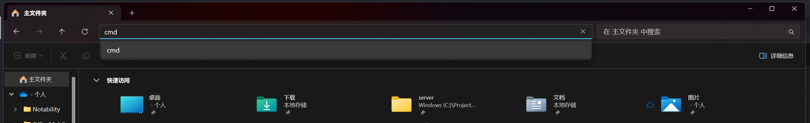

打开命令行 (命令提示符) 有多种方式。

1. 运行 - cmd: `Win + R` 打开运行，然后敲入 `cmd` 后回车。
1. 搜索 - cmd: 点击左下角搜索，输入 cmd，然后单击命令提示符。
1. 开始菜单 - Windows 系统 - 命令提示符。

如果想要快速打开特定路径的 cmd，请打开对应的文件夹，在地址栏直接输入 `cmd` 并回车。

<!-- more -->

这样就会快速打开一个路径为当前文件夹的命令提示符窗口。
