本文对应用程序设计中常见的组件及其作用进行了介绍。

<!-- more -->

## 页面总体布局

- ### navigationbar

  简称 Navbar 也就是导航栏。

  主要负责承接页面的导航操作。

  在内部界面上，一般左侧展示返回操作，居中显示页面标题，右侧展示更多操作。

  在主页上，主要承载 tabpage 对应的功能展示与触发。

  在 navbar 上，设计要突出质感，应该以简约为主。

  使用不鲜明的颜色，可以使用 APP 或网页对的主体色。

  可附以纯色 icon。

  不能太吸睛导致用户对页面内容注意的分散。

  有条件的情况下应该设计其切换动效。

  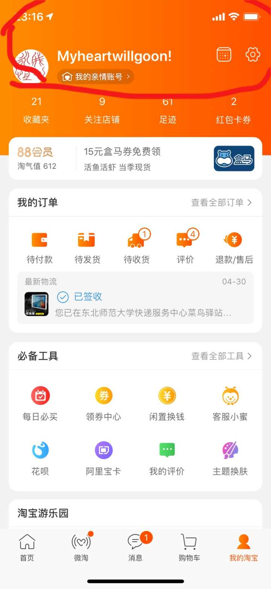
  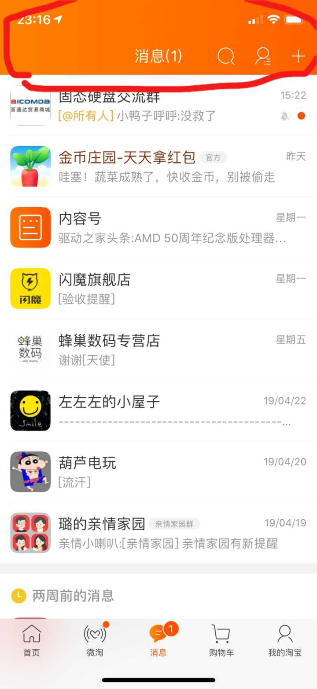
  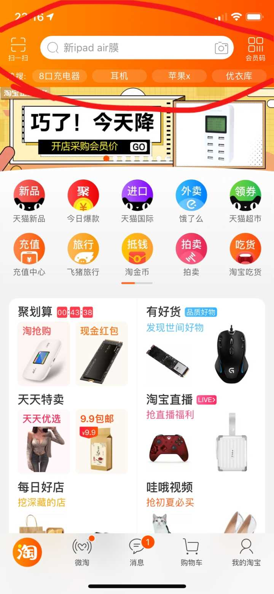

好文推荐: [iOS 导航栏动效设计思路](https://www.jianshu.com/p/6037e4f79f4d)

- ### Tabbar

  APP 打开后底部的操作栏叫 tabbar，一般设置 2-5 个模块，每个模块应该设计 logo 与文字，对应的界面叫 tabpage。

  在 logo 上应以简约为主，应当设计设置点击与激活效果。

  tabpage 的设置要慎重，分类展示 APP 最关键的几个分项设置，并在每个界面内展示具体内容。

  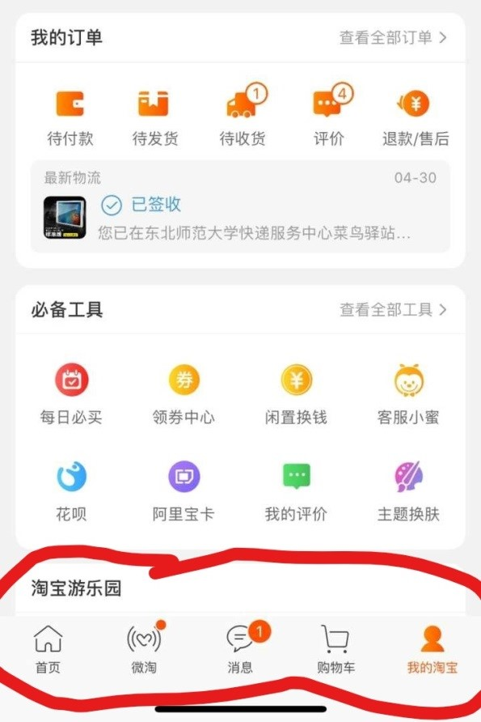
  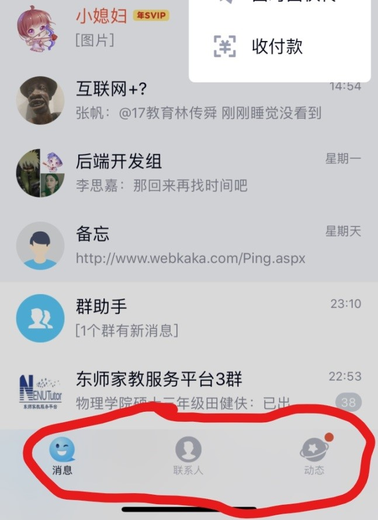

### Page

App 每个页面的背景色，除了纯文章之外不应采用纯白色，设计可以向 APP 主题色靠拢。

应当针对不同设备造成的不同长宽比、分辨率设置不同的页面排版样式，并制作不同的 UI 布局。

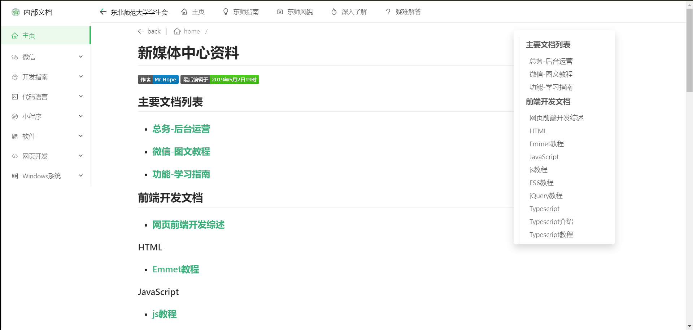
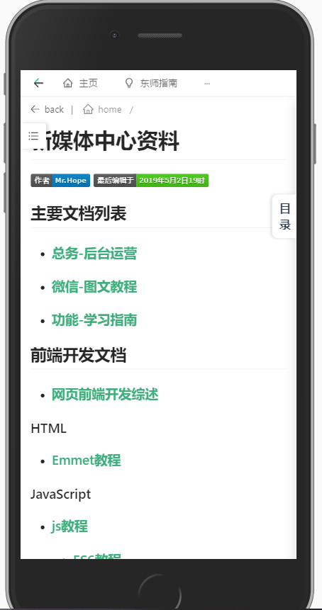
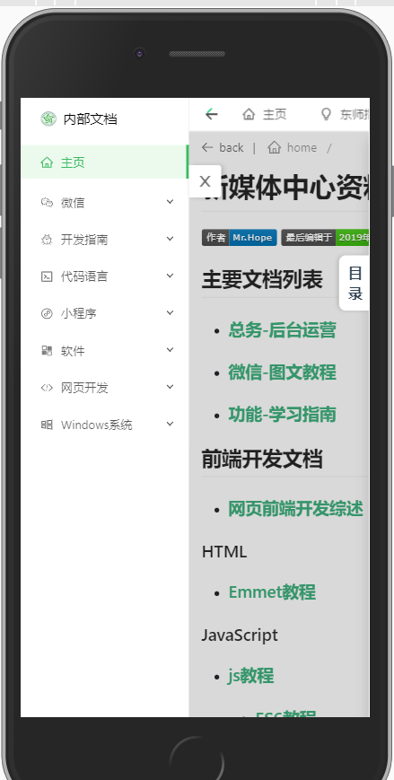
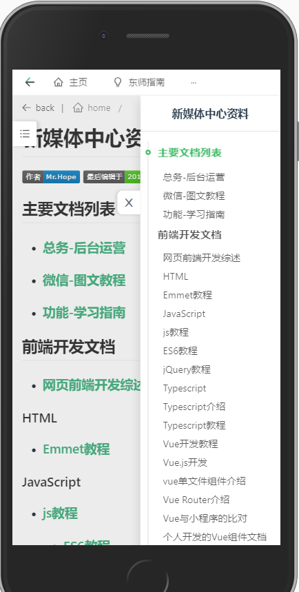

- ### Sider

  侧边栏，可以设置侧边固定按钮点击弹出或者从左向右滑动弹出式。

  一般用于承载不需要展示的一些设置项、介绍项、个人信息项。

  
  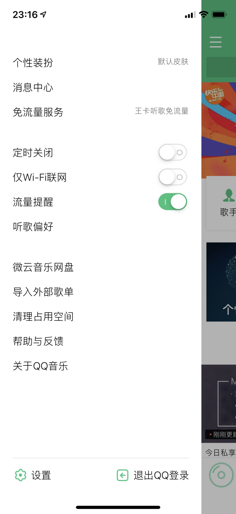

## UI 元素

- ### Grid

  九宫格结构，实际使用的时候 3×3、4×2 都有广泛使用。

  Gird 结构主要用于罗列展示各项功能，或者是各项板块。

  各元素应该以上部的圆形或异形图标于下部的说明文字为主。

  在移动设备上一般不显示边框、不设计点击动效，而在 PC 与 HD 恰好相反。

  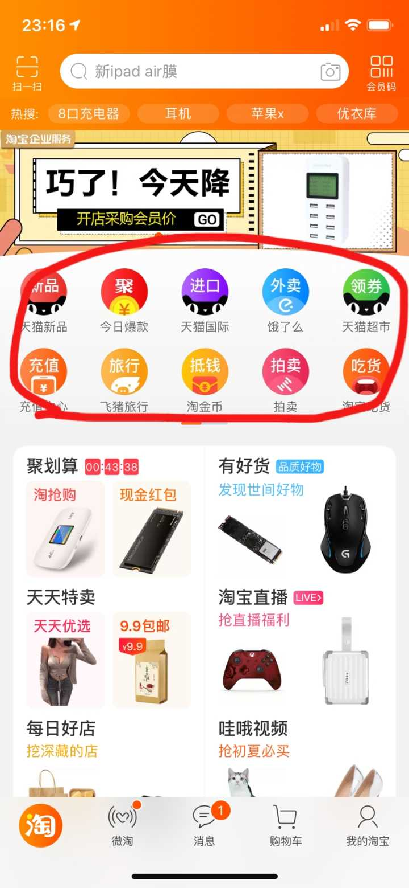
  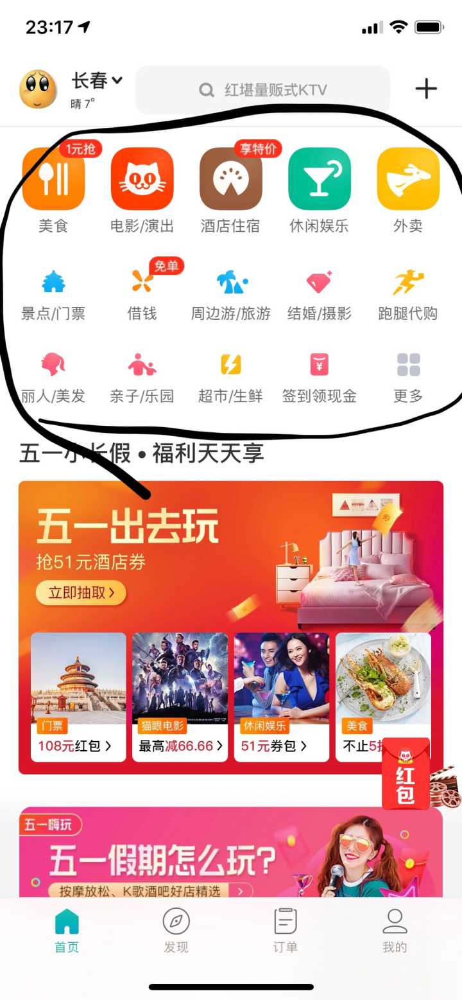

- ### Menu

  菜单有多种表现方式，比如 float menu、pop-up menu、modal menu、dropdown 等。

- ### 其他元素可以参考[Ant-design](https://vue.ant.design/docs/vue/introduce-cn/)

## 杂项

### Mask 设计

灰色的半透明遮罩叫 mask

当透明度很高，感受很小的时候一般设计成可穿透，也就是说点击相当于直接点击蒙层下部区域。

透明度中等的一般式可触摸做取消热区的，也就是点击会取消。

不可穿透的 mask，也就是说点击没有反应，一般要给非常高的不透明度，用户只能点叉号取消。(一般用于弹出推广)

### 设计趋势

目前以 iOS 特有的苹果风，Windows 上的 Aero 效果(毛玻璃效果)与安卓的 Material Design 设计为主。

#### 图标

常用实心矢量图标

#### 移动端

分割线和边框目前采用已经比较少。

#### PC

增强鼠标移动与网页的交互带来沉浸式的体验。

#### 突出质感

因为不同机型现实效果不一样，普遍采用圆角、阴影、以及毛玻璃效果，还有避免用纯色背景转而用略蓝略灰的色调突出质感。

#### 增强反馈感

每次点击时和点击之后出发的效果都能在屏幕上让用户感知自己的操作(即我刚刚点了按钮，按钮生效产生了某种操作)
