好的设计师理解心理学在视觉感知中的强大作用。当别人的目光与您的设计创作相遇时，会发生什么? 他们对您分享的信息有什么反应?

## 格式塔原理概述

### 前言

举一个场景化的栗子，大家平时逛街的时候能记住哪些广告呢? 我们虽然每天看到那么多的信息，但是真正记住的却不多。还有当我们看到复杂的事物的时候，心里会涌现不舒服的奇怪感受，有时候这种感受没有办法用语言来描述。那么为什么会有这些感受呢?

其实道理很简单，我们做的东西是给人用的。人是动物不是一台机器，人的认知和记忆能力是有限的。视觉设计和心理是相互联系的，并且可以相互影响。格式塔原则可以帮助我们理解和控制这些联系。

今天就给大家科普下格式塔原则到底是什么? 在设计中如何运用? 是如何影响到我们的生活学习的? 本文会结合大量案例分析讲解，无论您是平面设计师，UI 设计师，插画师，设计小白还是路人，一篇文章让格式塔帮您做出更好的设计!

### 什么是格式塔原理

格式塔学习理论可谓是现代认知主义学习理论的先驱，自 1912 年由韦特海墨(Ｍ，Wetheimer)提出后，在德国得到迅速发展。

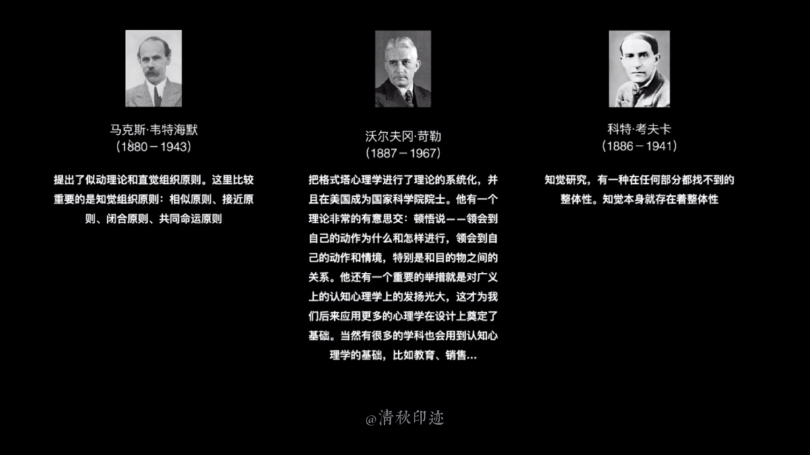

1910，这位心理学家乘坐火车度假旅行。当火车经过一个铁路道口的时候，他发现道口闪烁的灯竟然像马戏团表演时剧院帐篷上环绕的灯光，令他产生了光在运动的错觉。(而我们坐火车永远就只会遇到熊孩子和熊孩子)然后他赶紧下火车买了一个西洋镜，来测试自己的想法。

他将一张图片放在西洋镜内部并通过狭缝观看时，一系列静止图像看起来像是动图。接着他用简单的抽象线条制作不同的画条，通过改变这些元素来研究导致错觉的原因。似动(Apparent Movement)实验成为格式塔心理学的起点。

### 解决什么问题

他们认为思维是整体的、有意义的知觉，而不是联结起来的表象的简单集合；主张学习是在于构成一种完形，是改变一个完形为另一完形。我们的视觉系统自动对视觉输入构建结构，并在神经系统层面上感知形状、图形和物体，而不是只看到互不相连的边、线和区域。所谓格式塔，是德语 Gestalt 的译音，意即「完形」或「形状」；他们认为学习的过程不是试尝错误的过程，而是顿悟的过程，即结合当前整个情境对问题的突然解决。再通俗一点就是人是怎样认知和记忆所看到的事物。

## 格式塔实验研究

主要包括以下三方面的实验研究:

### 1. 似动现象

似动现象是形成格式塔心理学的基础。是指两个相距不远、相继出现的视觉刺激物，呈现的时间间隔如果在 1/10 秒到 1/30 秒之间，那么我们看到的不是两个物体，而是一个物体在移动。

例如，我们看到灯光从一处向另一处移动，事实上是这只灯熄了，那只灯同时亮了。这种现象正是不能把整体分解成部分的证据。这种现象的组成部分是一些独立的灯在一开一关，但组成一个整体后，给人造成这些灯在动的假象。

后来，格式塔心理学把重点放在整体系统上，在这个系统中，各个部分是以一种能动的方式相互联系在一起的，也就是说，仅根据各分离的部分，无法推断出这个整体。所以人们把它称为「格式塔或完形心理学」。

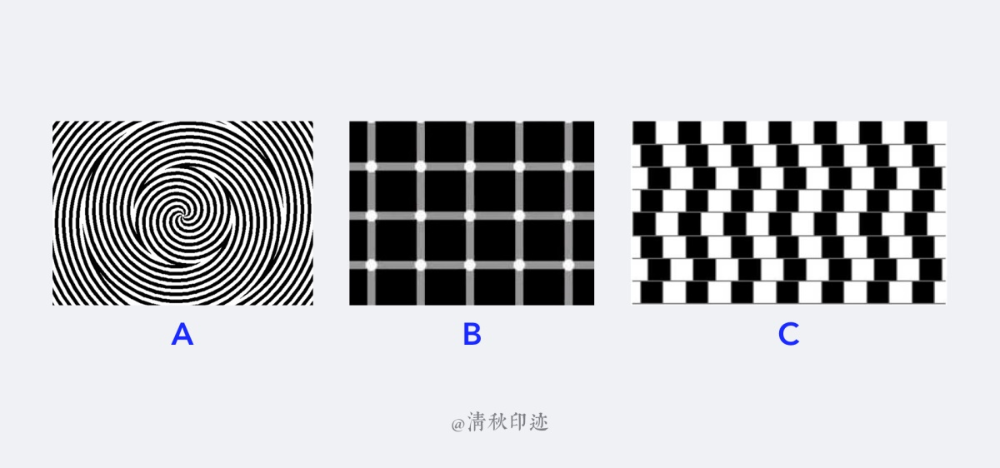

- A: 这张螺旋图是静态还是动态的? 盯着漩涡看一会，您就会感觉到它在转动。

- B: 您数数看有几个黑点? 当您的眼睛离开那个白点时，就出现白的负象，即黑。当您重新把视点 集中在原来的白点上时，它又变成白色的了。因此，当您的眼睛不断地 在移动的时候，那些黑白点 (正负像) 也就在不断地变化。

- C: 您看是水平线还是不规则的斜线? 事实上所有的横线都是水平的，不信您拿尺子比一下。

### 2. 整体与部分

看起来格式塔心理学是把重点放在整体上，但这并不意味着他们不承认分离性。事实上，格式塔也可以是指一个分离的整体。

研究认为，一个人的知觉场始终被分成图形与背景两部分。「图形」是一个格式塔，是突出的实体，是我们知觉到的事物；「背景」则是尚未分化的、衬托图形的东西。知觉帮助我们把图形从背景中分离出来。图形与背景的对比越大，图形的轮廓越明显，则图形越容易被发觉。

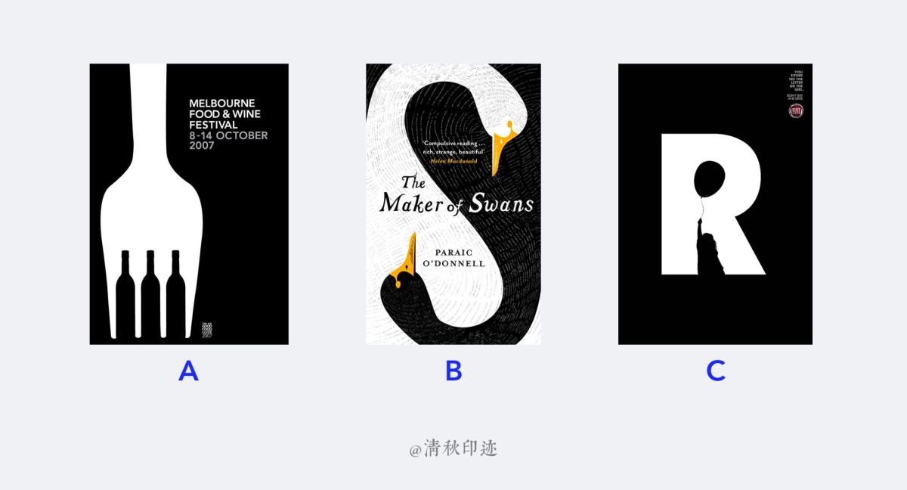

- A: 这幅美食节广告中，酒瓶是被战略性地放置，以创造一个叉子的错觉。黑色酒瓶是图形，白色叉子是背景；在另一种情况下，黑色酒瓶是背景，白色叉子是图形。

- B: 一黑一白两只天鹅，白天鹅和黑天鹅可以互充图形与背景的关系。

- C: 这幅海报中，小女孩和气球是被战略性的放置，以创造一个字母「R」的错觉。这两个角色同样可以在图形和背景中互换。

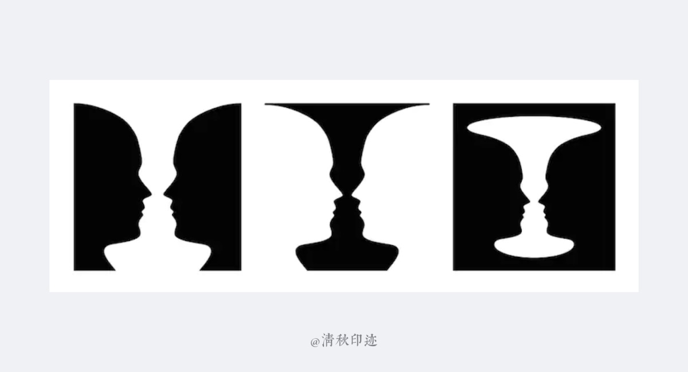

### 3. 顿悟实验

W·科勒在一次实验中用绳子把一只香蕉悬挂在笼子的顶棚上。笼子里只有惟一的一只木箱可以使用。6 只黑猩猩看到香蕉时跳跃起来竭力想抓住香蕉，但是徒劳。有一只名叫苏尔坦的黑猩猩马上停止了这些白费力气的努力，开始从各个方向打量箱子。忽然它停在箱子前面，抓起它并径直朝目标走去。它把木箱迅速放到地上，爬上箱子，从木箱上面使劲跳起，终于抓住了香蕉。

W·科勒还对这组黑猩猩使用其他工具进行了观察，如利用木棍去获取放在笼子外面的水果。这些黑猩猩甚至能够将两根短棍连接起来做成一根长棍。同样，它们还能把两三个箱子叠放在一起，再爬到放在最上面的箱子顶上，借助一根木棍去获取香蕉。

苛勒通过对黑猩猩进行的许多实验，提出了顿悟理论。他认为问题的解决不是由于尝试错误，而是由于顿悟。所谓顿悟，就是内在地把握情境的关系性，并依此改变整个情境。

或许正如一些批评家所指出的那样，顿悟不是一种独立的学习过程或学习形式，而是学习达到一定程度的表现或者结果。一定的经验积累，是产生顿悟的前提。

## 影响记忆的三个因素

沃尔夫实验时要求实验体观看样本图形并记住它们，然后在不同的时间里根据记忆把它们画出来。结果发现实验体在不同的间隔时间画出来的图像都有不同。有时再现的图画比原来的图画更简单更有规则，有时原来图画中显著的细节在再现时被更加突出了。还有的比原来的图像更像某些别的我们都很熟悉的图案了。沃尔夫把这三种记忆规律称之为格式塔三大记忆律: 「水平化」、「尖锐化」、「常态化」。

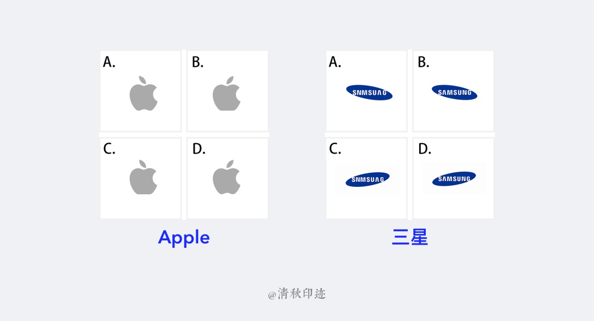

### 水平化 leveling

水平化是指在记忆中我们趋向于减少知觉图形小的不规则部分使其对称；或趋向于减少知觉图形中的具体细节。

### 尖锐化 sharpening

尖锐化是在记忆中与水平化过程伴随而行的。尖锐化是指在记忆中，人们往往强调知觉图形的某些特征而忽视其它具体细节的过程。在有些心理学家看来，人类记忆的特征之一，就是客体中最明显的特征在再现过程中往往被夸大了。

### 常态化 normalizing

常态化是指人们在记忆中，往往根据自己已有的记忆痕迹对知觉图形加以修改，即一般会趋向于按照自己认为它似乎应该是什么样子来加以修改的。

## 格式塔原理在设计中的应用

格式塔的七个基本原则:

- 接近性原则
- 相似性原则
- 连续性原则
- 闭合性原则
- 主体/背景原则
- 简单对称性原则
- 共同命运原则

::: info 格式塔原理的核心

整体决定部分的性质并且部分依从与整体。

:::

### 接近性原则 law of proximity

人们对知觉场中客体的知觉，是根据它们各部分彼此接近或邻近的程度而组合在一起的。两个元素越是接近，组合在一起的可能性就越大。说明它们之间关系更强。但是接近也是有对比的，在复杂的设计中，我们要一边考虑它们之间内部的逻辑关系一边来排版。

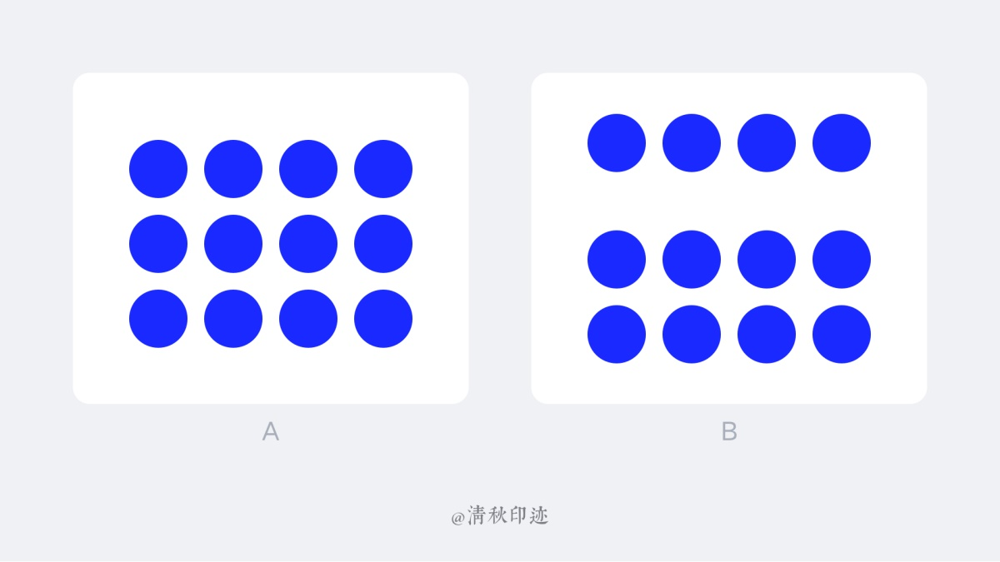

> 同样都是 12 个圆形，您会把左图的 12 个圆形当成一个整体；右边那幅图，上面 4 个圆和下面 8 个圆距离较远，所以您会把上面 4 个圆当成一个整体，下面 8 个圆当成另外一个整体。

需要注意的是，接近性比重较大，把上图的圆形改变形状，甚至添加颜色，人们也会把相近的一组当成一个整体:

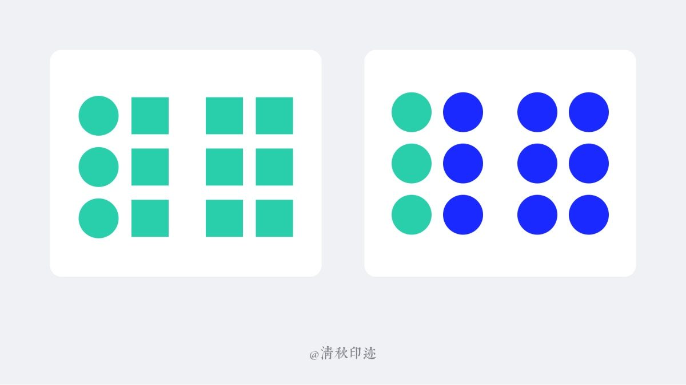

::: tip 案例

板块之间的大间距把页面信息分割成各种不同栏目，距离更近的信息暗示了他们有内在的逻辑关系

设计师模块，每个设计师信息组之间有足够大的留白，即使去掉分割线，用户也会清晰分清每一组的边界

:::

::: tip

在界面设计中常用的设计方法就是划分固定的位置区域，比如导航栏，内容区，操作栏。还有就是通过距离远近来进行信息归类，同类信息接近，不同信息远离。

:::

::: info

属性相同、场景相似的信息应该放到一起，降低阅读成本，提高用户感知效率;不相关的信息尽量区分开，不要放到一起模糊不清引起不必要的误解。

:::

### 相似性原则 law of similarity

人们在感知时，会对那些相似的项目，只要不被接近因素干扰，会倾向于把它们联合在一起。换言之，相似的部分在知觉中会形成若干组。

例如，我们在小组辩论中，往往几个人争着发言，但我们仍然能从嘈杂的声音中听出某个人的讲话，这是因为这个人讲话的音质始终有相似性的缘故。如果他讲话的音质经常在变化，那就很难从噪音声中分辨出他的话来。

人们会把那些明显具有共同特性(如形状、大小、共同运动、方向、颜色等)的事物当成一个整体。与不具有相似视觉特征的元素相比，具有相似视觉特征的元素被认为更加相关。

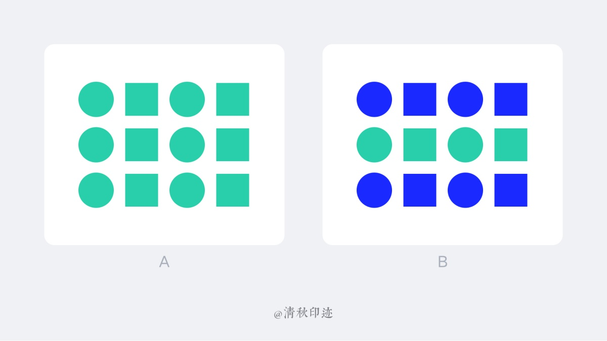

举个例子相似性原则在实际产品中的应用:

> 上图全部频道页面，我们在浏览时，会从心理上默认，把频道头像、介绍和订阅按钮自动归为一类。类似外形的单元会被我们人脑默认为同一属类

::: info

看起来跟亲密性非常类似，但是他们确实不同的两个概念。亲密性强调位置，相似性则强调内容。通常把有明显特征的事物(形状、颜色、大小)组合在一起。多用于表单和导航。

:::

### 连续性原则 law of continuity

在知觉过程中人们往往倾向于使知觉对象的直线继续成为直线，使曲线继续成为曲线，也就是视觉的惯性。利用连续律我们可以让用户操作界面时不经过思考就点击一个固定的位置。

我们倾向于完整地连接一个图形，而不是观察残缺的线条或形状。这种知觉上的结束，称之为闭合。如果局部形象过于陌生或者简略，则不会产生整体闭合联想。

人的视觉有追随一个方向的延续，以便把元素联接在一起，使它们看来是连续向着特定的方向。

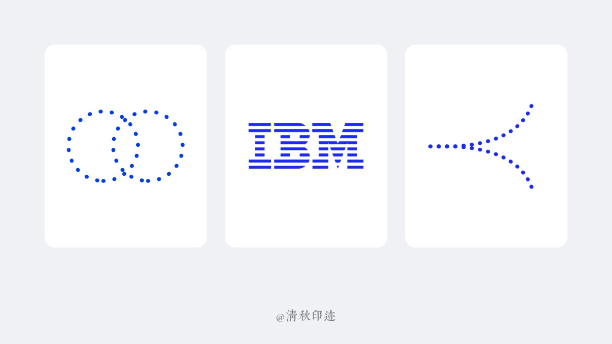

△ 左图我们不会认为是两个残缺的圆，而是两个相交的圆；中间的 IBM 商标我们之所以能看出来是 IBM，就是因为我们在视觉上看到的不是离散的线条，而是连续的图形；右图我们会看到是向两个方向连续的曲线。

::: tip 案例

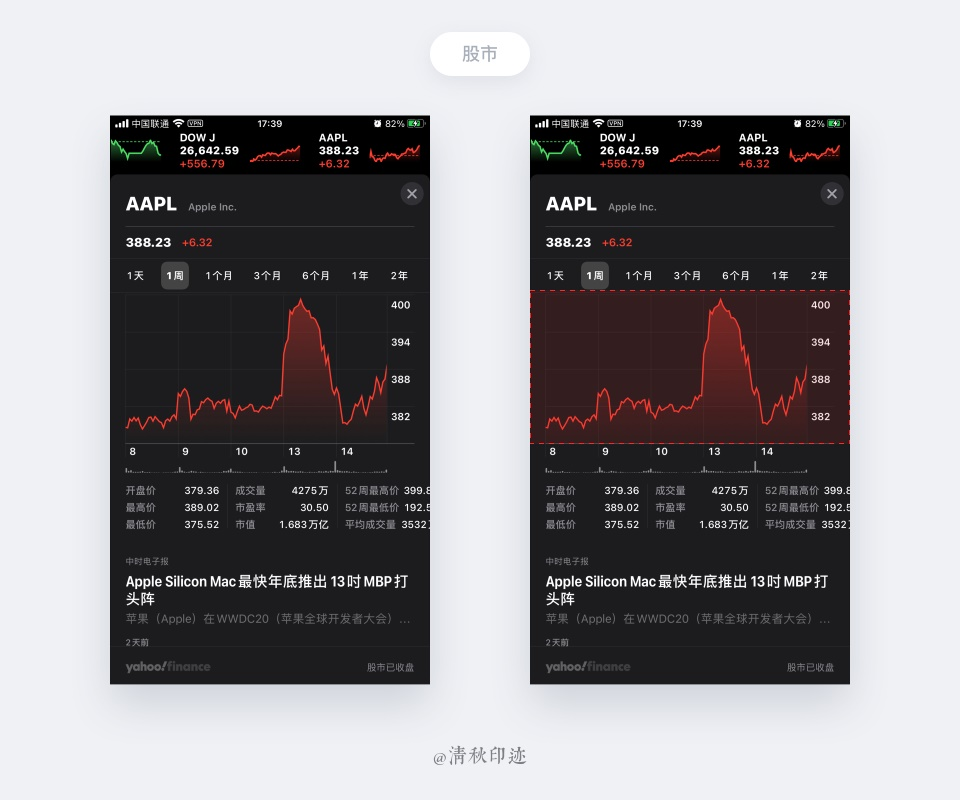

每天的股市数据构成走势图，视觉上会跟随曲线方向知道由左向右去看走势

:::

::: info

视觉倾向于感知连续的形式而不是分散的碎片通过找到非常微小的共性，将多个不同的信息结成一个整体，是界面设计和 logo 设计常用的原则之一

:::

### 闭合性原则 law of closure

人们在观察熟悉的视觉形象时，会把不完整的局部形象当作一个整体的形象来感知，这种知觉上的结束，称之为闭合。如果局部形象过于陌生或者简略，则不会产生整体闭合联想。

闭合是一种完成某种图形(完形)的行动。就算没有外形的约束，我们也会自动把图形脑补完全。比如半个形状或者有缺口的形状我们不会认为是一条线或各种零碎的图形，而是一个完整的形状。闭合是指一种完形的认知规律。

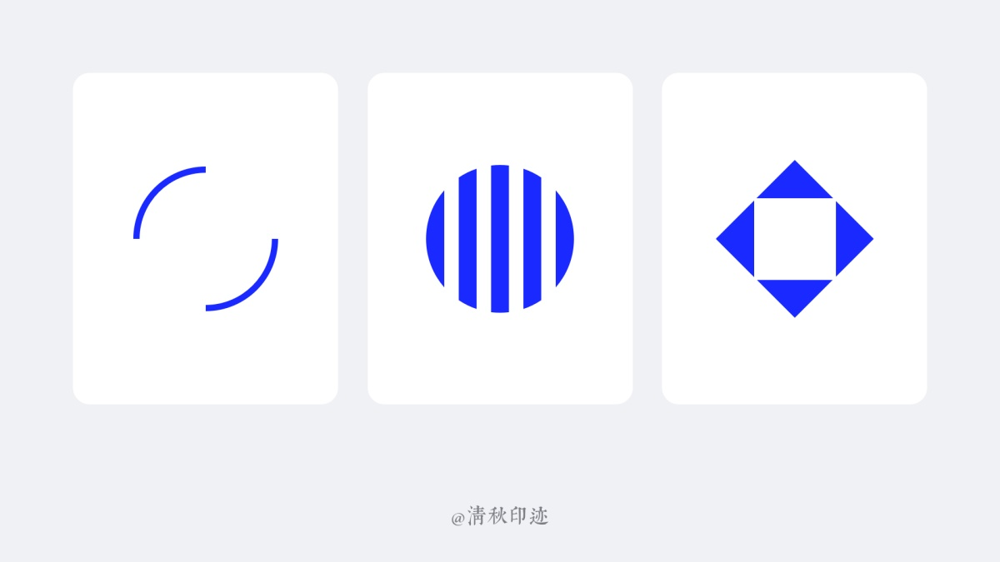

::: tip 案例

我们常见的页面横滑组件就运用了闭合律原则，通常在界面右侧露出一半(或少部分)内容，来提示用户右边还隐藏着更多内容

:::

::: info

人们的视觉系统会自动将不相干的图形元素封闭起来感知为完整的个体为不实单独的碎片

表现手法有:正负形、封闭边界、不完全闭合

:::

### 主体/背景原则

主体指的是在界面当中占据我们主要注意力的所有元素，其余的元素在此时均成为背景。当主体与背景重叠时，人的视觉更加倾向于将小的物体视为主体，大的物体视为背景，所以我们可以通过大小与图的关系，将我们希望传递的不同层次的内容进行展示。

当小图形重叠大图形之上，我们的视觉会倾向于将小图形归为主体，大色块为背景，这就是格式塔中的主体与背景原则。

::: tip 案例

在白色背景上有非常突出的主体: 歌曲封面、歌名、进度条、播放/暂停、收藏等，歌曲播放时，进度条有非常明显的进度变化，切换歌曲时，封面的前后错层，这些都与背景有非常鲜明的对比

:::

::: info

在界面设计中，主体背景是弹窗常常运用到的表现手法利用空间感给用户带来视觉引导，让用户快速感知重要的信息内容，和可忽略的信息内容

:::

### 简单对称性原则 Simple principle

在观察事物过程中，我们第一印象更倾向于简单而且对称的图形，这就是格式塔的简化对称性原则。

具有对称、规则、平滑的简单图形特征的各部分趋于组成整体。对称的元素往往被认为是归属在一起的，而不管它们之间的距离，都给我们一种牢固和有序的感觉。

人的眼睛喜欢在复杂的形状中找到简单而有序的对象，当我们在一个设计中看到复杂的物体时，眼睛更愿意将它们转换为单一统一形状，并尝试从这些形状中移除无关的细节来简化这些物体。

对称的构图是令人满意的，但它们也会变得有点沉闷。在对称的设计中加入不对称的元素可以在给人留下印象的同时吸引注意力。

::: tip 案例

左右布局的瀑布流就是格式塔的简化对称性的体现，用户在浏览的的过程中有效减轻了阅读压力。特别适合这种以图片流为主的产品，能大大提高浏览效率。

:::

::: info

对称元素简单、和谐，但往往容易单调，一般来说加入不对称的样式会更容易让人印象深刻，在平面设计中对称的使用趣味性更加广泛

:::

### 共同命运原则 Common destiny

无论元素之间的距离有多远，或者它们看起来有多不同，如果它们一起运动或变化，它们都被认为是相关的。这里的共同命运针对的是运动的物体。与接近性原理和相似性原理相像，都与我们的视觉系统会有着给对象进行分组来感知事物的倾向相关，但是一起运动的物体会被感知为属于同一组或是彼此相关这样的一种视觉现象，这就是格式塔中的共同命运原则。

向同一方向移动的元素，我们在处理的过程当中，会默认把它们归为一类。

::: tip 案例

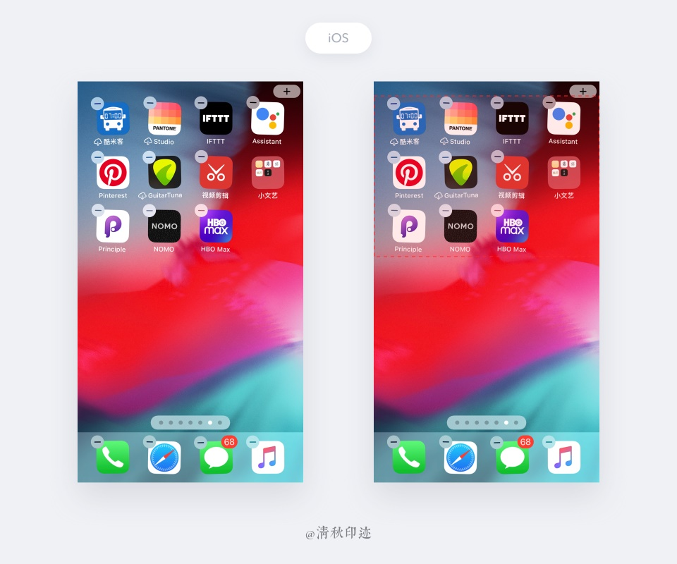

iPhone 删除应用时候，所有图标都一起晃动起来(意思瑟瑟发抖，不要删我不要删我! )，左上角都有一个删除的按钮，要么删除，要么保留，这就是共同命运原则。

:::

::: info

共同命运强调的是方向，当元素的运动、方向具有共同运动形式或者某种规律使，我们会将其视为为彼此相关的一个群组或整体

:::

### 更多

事实上，以上 7 条原则只是格式塔心理学中的一小部分而已，比如还有:

#### 成员特性律

一个整体中的个别部分并不具有固定的特性，个别部分的特性是从它与其他部分的关系中显现出来的。

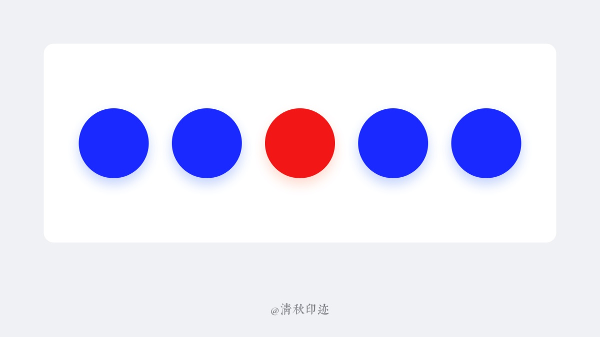

如果我们有很多同样的按钮，如何让某个更重要的按钮突出但是仍然让用户感知还是按钮呢? 那就要用到成员特性律了。成员特性律赋予了集体中某一个元素特殊的一些刺激元素从而突出它。

独特的外形暗示了它与别的元素有不同的功能

::: tip 案例

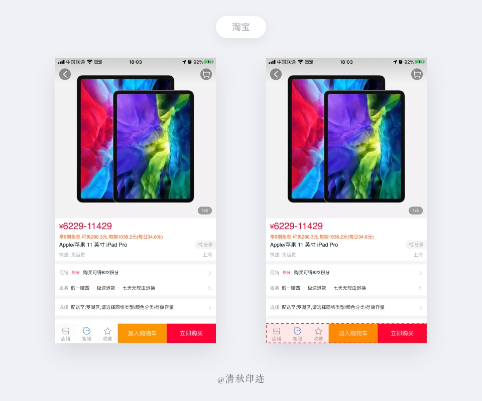

商品详情页有两个重要的操作按钮: 加入购物车、立即购买。为了促使用户尽快购买，给「立即购买」更重的红色以突出它的独特性

:::

## 格式塔学习理论的基本观点

### 认知重组

格式塔心理学认为，通过学习，会在头脑中留下记忆痕迹，这些痕迹不是孤立的要素，而是一个有组织的整体，即完形。因此，学习主要不是加进新痕迹或减去旧痕迹的问题，而是要使一种完形改变成另一种完形。一个人学习的过程，通常是从一种混沌的模糊状态，转变成一种有意义的、有结构的状态，这就是知觉重组的过程。

### 顿悟学习

顿悟学习可以避免多余的试误，同时又有助于迁移。格式塔心理学家认为，通过对问题情境的内在性质有所顿悟的方式来解决问题，就可以避免与这一问题情境不相干的大量随机的、盲目的行动，而且有利于把学习所得迁移到新的问题情境中去。顿悟学习的核心是要把握事物的本质，而不是无关紧要的细节。

### 遗忘曲线

真正的学习是不会遗忘的。通过顿悟习得的内容，一旦掌握后，永远也不会遗忘。顿悟将成为我们知识技能中永久的部分。用现代认知信息加工心理学的术语来说，顿悟的内容是进入了长时记忆将永远保留在学习者的头脑中。

::: tip

有人在一项实验中，把 149162536496481 写在一张卡片上，要一组被试看 15 秒钟，然后试图回忆它。这是一项相当困难的任务。在一般情况下，除了记住其中少数几个数字外，没有人能全部记住。但在给另一组被试看这张卡片之前，告诉他们在试图记住它以前，先想一下这些数字为什么这样排列，是否有规律可循。结果不少被试都觉察到，这些数原是用 1 到 9 的平方排列起来的。这样一来，回忆这些数字就毫无困难，哪怕是在几周或几个月之后也能轻易做到。

:::

### 学习奖励

格式塔心理学家认为，真正的学习常常会伴随着一种兴奋感。例如，一些人对智力拼图、字迷填空玩得津津有味。也因此有人抨击滥用各种外部奖励，诸如使用糖果、好分数、五角星或金钱之类的东西来驱动学习。对于教育工作者来说，不加区分地使用奖励物，可能会使学生分心，不把心思用在学习上，而只关心能得到什么奖励上，从而不可能达到对问题情境有顿悟的理解。

### 顿悟说对错误说的批判

还记得第二部分对猩猩的实验吗，实验表明猩猩在行动之前，已经领会到了自己的动作为什么进行，怎样去进行以及最终的结果为何，在苛勒看来，猩猩对问题的解决并非是一种盲目尝试错误的过程，而是处于对问题产生了顿悟。

在格式塔心理学家看来，学习是一种智慧行为，是一种顿悟过程，需要有理解、领会与思维等认识活动的参与，并且它是一种突现、速变、飞跃的过程。顿悟学习特点可归纳如下: 问题解决前尚有一个困惑或沉静的时期，表现得迟疑不决，有长时间停顿；从问题解决前到问题解决之间的过渡不是一种渐变的过程，而是一种突发性的质变过程；在问题解决阶段，行为操作是一个顺利的不间断的过程，形成一个连续的完整体，很少有错误的行为；由顿悟获得的问题解决方法能在记忆中保持较长的时间；由顿悟而掌握的学习原则有利于适应新的情境，解决新的问题。

### 创造性思维

韦特默认为要想创造性地解决问题必须让整体支配部分。即使在必要的关注问题的细节时，也决不能忽视问题的整体。必须把细节放在问题的整体中，把它们与整体结构联系起来加以考虑。这是一种自上而下、由整体到部分的思维。他认为要使人们顺利地解决问题，必须把问题的整个情境呈现出来，使之能对问题有个完全概观，决不能像桑代克那样，有意地把解决问题的方法和途径藏起来，迫使被试不得不去盲目试误。学习贵在打破旧有知识和模式的束缚，争取在对问题领域的基础上产生顿悟，掌据解决问题的原则，做到触类旁通、举一反三，促进智力水平的提高。

## 格式塔学习理论的分支

### 勒温的基本观点

传统的格式塔心理学在探讨学习的问题时，认为学习者「渴望达到某些目的」是理所当然的，因而他们关注的是通过知觉重组达到目的的途径；而勒温则把注意力集中在「渴望」和「目的」本身上，并把它们与个性联系起来研究。勒温由此而形成的理论体系，主要不是一种学习理论，而是一种描述系统。

### 勒温论学习

勒温的基本观点是社会心理学方面的，尤其是关于个体的动机。从某种角度来看，这弥补了格式塔学习理论的不足。勒温认为，用场论来研究学习的问题，需要注意以下几个方面:

要使用构成法(Constructive method)，而不是用分类法或分析法。这就是说，要用心理学中最基本的几个构成来探讨学习的问题。这些基本构成就是生活空间，心理环境、诱发力和约束力等。

要对行为作动态分析，要了解作为行为之基础的各种力(forces)。他把行为变化看作是各种心理力量的结果。

要从心理的角度来分析学习者当时的生活空间和心理世界，而不能像行为主义者那样用客观的物理主义者的术语来界定刺激。

要从整体情境分析入手，而不能只是从刺激情境中抽取一两个孤立的要素。因为不从整体上考虑问题，是不可能作出正确判断的。

行为是行为发生时场的函数。勒温认为行为取决于有机体以往的经验和强化史，这是形而上学的。因为过去的事情现在并不存在，所以不可能直接影响现在的行为。虽说过去的心理场是现在的心理场的来源，但影响现在行为的，毕竟是现在的心理场。

在研究学习时，至少必须区别这样四种变化: 第一，作为认知结构(即知识)变化的学习；第二，作为动机变化的学习；第三，作为群体属性和意识形态变化的学习；第四，作为身体肌肉随意控制发生变化的学习。在勒温看来，学习理论要探讨的，主要是学习者认知结构和动机的变化。

### 评论

勒温在格式塔心理学的框架结构内引进「场」、「生活空间」、「拓扑学」和「向量」等概念，另辟蹊径，从而丰富和发展了传统的格塔理论。尽管他研究的重心放在社会心理学方面，但他对行为、问题和动机等方面探讨，在当时是很有新意的。

## 格式塔原理的贡献与局限性

### 1. 贡献

#### 对元素主义的反击具有进步意义

格式塔学派用大量的事实证明了冯特元素主义理论的漏洞百出，并大胆地冲破了元素主义的束缚，积极而有成效地进行了大量的探索，并取得了一系列引人注目的成果，这对促进心理学事业的繁荣和发展是大有脾益的。

#### 格式塔学派引发了知觉心理学的革新

由于格式塔学派在知觉领域做了大量有目共睹的研究，使得经验论、联想论、官能主义的传统方法逐渐让位于先验论、整体论和突创论。知觉心理学也由感觉心理学的附庸变成一个独立的分支，并在短时期内就取得了一系列突破。

#### 格式塔学派的学习理论独具特色

格式塔学派的顿悟说及对迁移、创造性思维的研究，冲击了联结主义和行为主义的框框，不论在理论创建还是在教育实践中都具有独到的价值和意义。顿悟说也成为西方学习理论中最重要的理论之一。

#### 对人本主义心理学影响较大

人本主义心理学的创建人马斯洛(就是提出人生 7 个层次的需求理论的那位)曾在他老师的惠特海默指导下，研究整体论，从而积累下了研究人的经验；同时期的对人的心理事件或整体研究。主张存在分析的心理学，这些都表明了格式塔学派的潜在影响。

#### 对现代认知心理学的产生起了推动作用

格式塔学派研究的那些认知过程及心理过程成了现代认知心理学的基本观点，正如罗伯特逊指出，认知心理学实际上是一种新格式塔现象。

### 2. 局限性

过分强调顿悟，而全面否定尝试错误，犯了以偏概全的偏激性错误。

顿悟似乎是一个神秘的概念，它的心理活动机制没有揭示清楚。还不能说是一个完善的理论解释。

顿悟说还缺乏对其他与学习有关问题的研究。而且研究的主要是动物的经验学习，还不能很好地解释人类的所有直接经验学习，如技能的习得等。

其理论观点和术语含糊不清。格式塔学派不加分析地采用了一些物理学的概念和数理术语，观点模棱两可，概念不确切，给人的感觉是理论主张过于晦涩深奥，神秘莫测。

对其他学派的批评过于苛刻，他们只批评其他学派的缺陷，却没有提出更好的改进措施，且自身的理论建设和主张又并不明确和高明多少。原来每个行业都有一条鄙视链的存在啊。

格式塔学派的实验不够严谨，过分依赖现象学的方法，缺乏信度和效度，就水平而言，并不比他们所批评的其他学派好多少。

## 总结

我们把原理归类、总结的目的有两个: 一个是自我检查，我们在构思设计的过程中往往会多于专注视觉效果的创作而忽略最基本的原理，比如在设计之前进行完整的设计构思；设计过程中检查自己的设计作品，避免低级错误导致反复改稿，比如信息不对齐，布局杂乱等；再就是设计完成之后对需求方有理有据的陈述。第二个是在深入理解的前提下做设计时能够举一反三。

用户界面设计并不全是关于漂亮的像素和完美的图形。它主要是关于沟通、性能和便利性。格式塔原则总是帮助我们实现这些目标，为用户创造愉快的体验，为企业创造巨大的成功。

通过例子可以发现，这 7 项法则并不是独立存在的，它们之间具有高度的关联性，是相辅相成的关系，我们需要跟进不同的需求类型和用户场景，运用这些基本法则打出组合拳，使您的设计方案更有依据。在做产品或者设计的时候一定要考虑人的认知与记忆的因素，这是与生俱来的天性，人们的审美对简单与和谐具有基本的要求。我们只有更好的利用视觉空间设计作品，减少设计的复杂性，尽量保持格式塔原则的完整，用户才能更好更容易地理解使用我们的产品。

> 参考文献:
>
> - 《格式塔心理学理论》MBA 智库
> - 《格式塔心理学原理》库尔特.考夫卡
> - 《视觉设计中的格式塔艺术心理学》
> - 《格式塔心理学 5 项法则的学习与思考》Tencent CDC
> - 《设计中的格式塔原则》Souche Blog
> - 维基百科及其他
