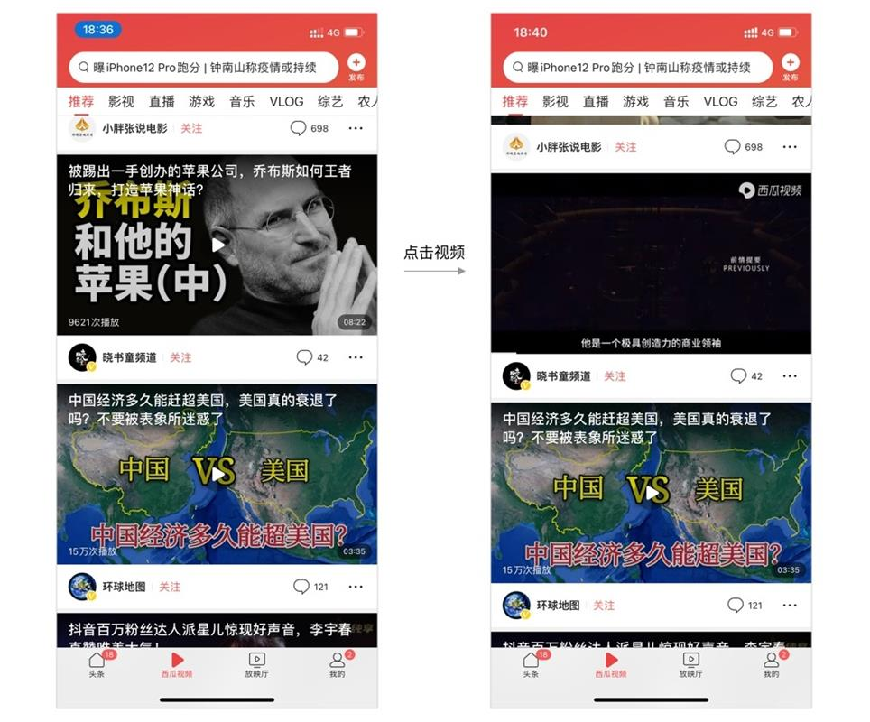
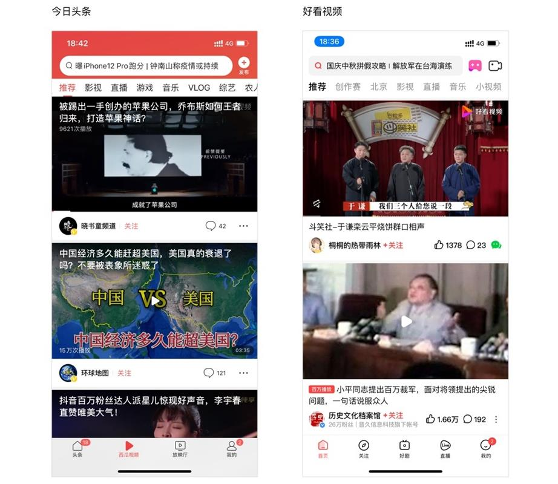

今日头条的出现颠覆了传统新闻产品(如网易、新浪和搜狐新闻)。

传统新闻依靠着编辑人员的推荐，将新闻触达给用户，而今日头条则依靠着新闻算法，抛弃传统人工分发的思路，使分发效率数以万计的提升，其迅速崛起，成为头部新闻资讯产品。

今日头条作为新闻信息流的头部产品，里面的设计细节和设计逻辑值得我们思考和分析。

## 信息流样式

什么是信息流? 信息流由两部分组成，信息流=信息+流。

信息指的是内容，这些内容可以是新闻、视频、图片等，所呈现的样式多为列表或卡片。

流指的是瀑布流，可以无限滑动浏览。

所以信息流就是可以无限滑动浏览内容信息。

信息流的样式的好坏，会直接影响到信息的展现效率和点击率，从而影响到用户获取信息的效率和整体阅读时长。

下图为今日头条首页推荐频道的信息流:

将信息流样式进行简单分类，使用最多的四种样式为纯文、左文右图、短内容、大图视频。如下图所示:

纯文样式用于新闻中没有图片的情况，当文章中没有图片时，这时候采用改样式。列表含有: 标题、来源、评论数、发布时间。

对于含有图片时候，采用左文右图样式。目前新闻对于含有图片的列表样式，一般有 3 种分别为: 左文右图、左图右文和三图。

左图右文的样式，强化图片，弱化标题。对于新闻资讯来说，图片无法准确的表达其新闻资讯的内容，所以这种样式目前没什么产品使用。

目前市面上绝大部分产品都采用左文右图，例如今日头条、网易新闻、腾讯新闻、新浪新闻等。只有是搜狐新闻采用左图右文。

三图则通过图片吸引用户点击查看，更加通过图片引导用户点击，好处是可以提升点击率，但是整个信息流显得乱，影响用户阅读。

和网易相比，头条信息流阅读起来更加舒服，视觉压力减少，这是基于今日头条三图样式占比很少，如下图所示，网易新闻信息流插入三图样式导致整个信息流杂乱。

对比下网易新闻和今日头条信息流样式，如下图所示:

纯文，今日头条的标题颜色更深，网易的相对而言淡一些。头条的列表高度比网易的高，这意味着，头条的屏幕展示条数比网易新闻的少，但是整体的空间感和留白呼吸感更舒服。同时今日头条含有发布时间，使得用户观看新闻资讯时，能够感知新闻的实时性。

左文右图，头条的列表比网易的要高一些，对比来看，头条的标题更加明显，图片含有圆角半径，使得头条整体看上去更舒服。

大图视频，两者的区别不大，依然是标题文字颜色、封面圆角和发布时间的差异性。

### 小结

头条流整体的空间感、留白，标题颜色对比做的比较好。

留白相对于网易更多一些，相同的屏幕空间，展示的内容信息会少一点，屏幕展示效率会低一些。但用户在阅读过程中舒适度更强，同样的情况下用户的阅读时长会变长。

## 信息流分发

什么是信息流分发? 通过一定的设计策略，将用户的流量合理的分配到其他各个地方，从而达到产品的设计目标，促进流量利用最大化。提升流量最大限度的转化，获得更大的商业化价值。

今日头条的信息流主要包含 5 个模块: 置顶模块、资讯列表、广告模块、短内容、其他功能模块的卡片入口。如下图所示:

推荐流顶部的置顶内容，最多置顶两条，这里是因为相关政策原因。

在正常信息流第一条之后，插入广告，为平台做商业化营收。之后就会根据用户的阅读习惯，给用户推荐信息内容，并时不时的插入广告等。

今日头条没有编辑运营，所以几乎所有的新闻都来自于机器算法。少了编辑人员的人工运营，使得今日头条有巨量的内容按照不同用户的阅读习惯推荐用户不同的内容。

## 搜索栏

在新闻信息流产品里，搜索栏所承接的使用场景主要有两个。一个是提供搜索新闻功能，通过关键词对当前或过去的新闻进行搜索。

另一个是在搜索模块提供热搜新闻，提供用户阅读。

那么如何提升搜索栏的点击次数。今日头条将热搜新闻以提示语的形式展示在搜索栏滚动，吸引用户。同时为了更大限度的展示新闻条数，采用一排两个的设计，保证最大程度的提升点击率。

用户点击搜索框之后，搜索框里面内置第一条热搜关键词。用户可通过键盘上的搜索，进行搜索。也可以点击搜索栏下方的两个热搜新闻进行搜索查看。

## 短视频

视频标题内置于播放器中，这样的好处可以减少卡片高度，让视频曝光量提升，缺点是用户如果想看视频标题介绍时，则需要点击下播放器，标题才能再次出现。

标题置于播放器里面，头条可以展示 2.5 条，而好看视频将标题置于外面只能展示 2 条，如下图所示:

对于广告业务来说，收入的一个重要指标则是广告曝光量，为了提升广告的收入，则必须降低视频高度，使得广告曝光效率得到提升，以此提升收入，所以头条将标题放置于播放器里面符合商业目标，但是不符合用户目标。

## 小视频

小视频的布局设计大致有两种，一种是抖音式布局，采用头像和操作项位于右侧。这样的好处是，视频的互动量很明显的展示出来，可引导用户互动。但对视频的内容有一定遮挡影响。

另一种是好看视频式布局，将头像昵称、操作项放在底部，弱化视频的互动数据。让用户专注于视频内容。

今日头条的小视频采用和抖音一样的布局。头像和操作项放于右侧。但是为了引导用户评论，在界面底部加入了输入框，引导用户评论，为了让用户更加方便的看评论。上滑手势变成了调起起评论。

## 短内容流

推荐流里面的短内容(微头条)，点击进入短内容 feed 流。而非短内容详情页。用户如果想看详情，那么需要用户再次点击。

这种设计明显体验不好，估计产品为其他短内容导流。这样的交互设计，可以使得整体的短内容流的曝光量提升好几倍。

这种做法牺牲了体验，用户如果需要看详情，则需要连续点击两次。这是为了业务指标作出牺牲的设计。
