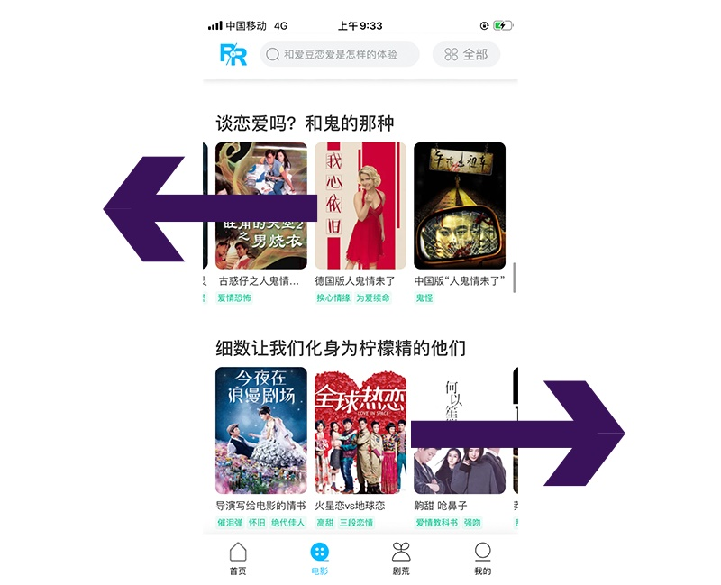

## 左右横跳的泳道

最近经常在人人视频上看电视剧，发现人人视频在设计上有个很有意思的点。

它的电影页中有很多推荐电影片单，每个片单里有 5-12 部电影；碍于手机尺寸，用户只能看到 3 部电影；如果您对这个片单里的电影比较感兴趣，可以滑动查看更多的电影——这种横向滑动的设计又被称之为“泳道”。

那么问题来了，究竟向哪个方向滑动呢?

或许您会觉得这是一个送分题，肯定是左滑啊；没错，您去查看 100 个 APP，这种水平横滑的泳道，99 个都是左滑的；但是人人视频就是那唯一的特例，它是左滑和右滑相互组合的。

前一个片单是左滑，后一个就是右滑；反之，前一个片单是右滑，后一个就是左滑。

第一次碰到这种设计，我很奇怪: 为什么要做出这种挑战用户固有认知的调整? 后来思考了一下，开始理解他们的做法。

当用户左滑查看电影时，浏览完最后一部电影，用户的视线是停留在在屏幕右侧；如果下一个片单依然采用左滑，那么用户的视线需要先移动到屏幕左侧，再移动到右侧——这个路线就是 Z 型浏览模式；而人人视频紧接着的是右滑，第一个视频直接从右侧开始，避免了用户视线的转移。

人人视频的这种方案，让我想起夸克浏览器——用户在夸克浏览器里观看视频，如果点击屏幕的位置靠左，那么菜单就会出现在左边；如果点击的位置靠右，菜单就会出现在右边；这样的处理方式，可以缩短用户手指的移动距离。

一个是缩短视线移动距离，一个是缩短手指移动距离。

## 左还是右

设计中有很多这样“左、右”的争论。最经典的就是: 对话框的确定按钮到底是在左边还是右边? 这个话题被讨论了无数次。

那么不管是左还是右，我们到底在争论什么? 左和右代表了什么?

我们习惯的浏览方向是由左至右，那么左代表了用户视线的起点。

我们经常说用户的浏览模式是 Z 型的，但是在移动端界面中，左边为信息区，右边为操作区。

用户在快速浏览页面的模式下，根据左边的信息区判断自己是否对这条内容感兴趣，如果感兴趣才进行操作；所以更多的情况下，用户的浏览模式不是 Z 型，而是 L 型的。

iOS 11 与 iOS 10 相比，我们可以发现页面标题、搜索框文案和内容都是改成放在左边。

整体的视觉动线由中间改成了左边，用户在快速浏览过程中视线不需要发生偏移。

右代表着更好的易用性。因为在移动端，用户更习惯单手握持手机进行操作；而我们大部分人都是右撇子。

谷歌的 MD 设计中的浮动按钮，是位于界面右侧；微信的浮窗也是位于界面右侧，就是为了方便用户操作。

看到这里或许您会理解为什么“对话框的确定按钮在左边还是右边? ”这个话题经久不衰了吧。

因为左边和右边背后都有理论支撑——左代表着离您的眼睛更近，右代表着离您的手更近。

我们再来设想一个场景，针对左撇子用户，界面设计应该怎么调整；用户的惯用手是左手，那是不是要做镜面反转，把操作区移动到左边呢? 读者中肯定有左撇子用户，您们会喜欢这种布局吗?

## 流量分发

当然也会有一些设计方案在“左/右”的选择上没这么纠结，例如在微博、抖音这类社交产品中，其主页的“推荐”栏目永远在“关注”栏目的左边。

以微博为例，“关注”和“推荐”在信息架构上是类似的，下面都有一些细分类目: “关注”里有不同的分组，“推荐”里也有不同内容类别，例如热门、同城、榜单等。

但是“关注”用户需要点击下拉框才能筛选，而“推荐”里用户直接右滑就可以切换不同的内容类别；如果把“关注”里的分组也改成滑动切换的样式，那么必然会降低“推荐”栏目的流量。

抖音也是类似的道理，因为用户左滑可以查看作者的主页，如果把推荐栏目放在左边，那么用户左滑就会进入关注栏目。

引导用户进入已经关注的作者主页，相对来说意义不是很大；抖音的想法是——用户在刷推荐视频的时候，觉得这个视频很好玩，对这个视频的作者产生兴趣；用户可以直接滑动进入作者的主页，而不是需要点击头像才能进入主页。

微博和抖音的“左关注，右推荐”的模式都是为了往推荐栏目引流。

社交产品追求的是用户可以在这个产品里建立更多关系链，关系链是社交产品的护城河；既然这个人您已经关注了，说明关系链已经形成，那就没有必要引流了。

从这里我们也能看出，在考虑方案的时候，不仅仅要考虑交互易用性，更要着眼于流量分配——哪个方案的流量分配更符合您的诉求，哪个就是好的方案。

甚至在很多时候，当交互易用性跟流量分配相冲突时，交互易用性是被牺牲的一方，因为流量代表了产品经理的 KPI。

最典型的例子就是知乎为了给答案底部的广告引流把左右滑动切换答案改成了上下滑动；当然，我们也不能批判知乎的这种行为。

还是回到对话框的话题，“确定按钮到底在左边还是右边? ”，最好的办法就是 A/B 测试；如果是一个引导用户安装 APP 的对话框，您就看“确定”按钮放在哪边可以带来更多的转化率。

这个 A/B 测试，搜狗输入法曾经做过，结果显示: 确定按钮放在左边转化率更高，误操作率更低，操作平均时长也更短；那么我们是否可以说，以后“确定”按钮就放在左边了?

当然不可以，因为这个测试是在安卓 4.0 时期进行的；安卓 4.0 之前的系统对话框的确定按钮是在左边的，4.0 才改成右边——用户之前的操作习惯会影响测试结果。

还有一个因素就是设备尺寸，手机尺寸现在越来越大，用户需要双手握持手机；那么在双手操作的模式下，手指可以全覆盖屏幕，那么右边的易用性就没那么高了。

总之，同一个交互问题，在不同的设备，系统，时间和场景下，会有不同的答案。
