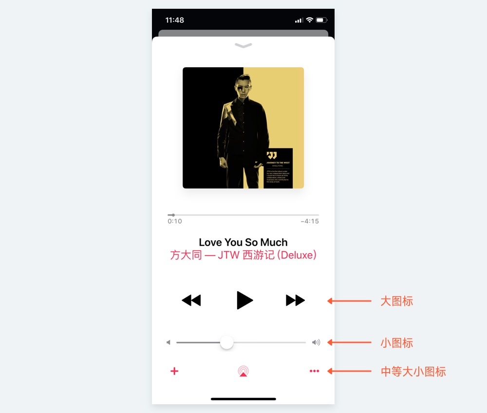
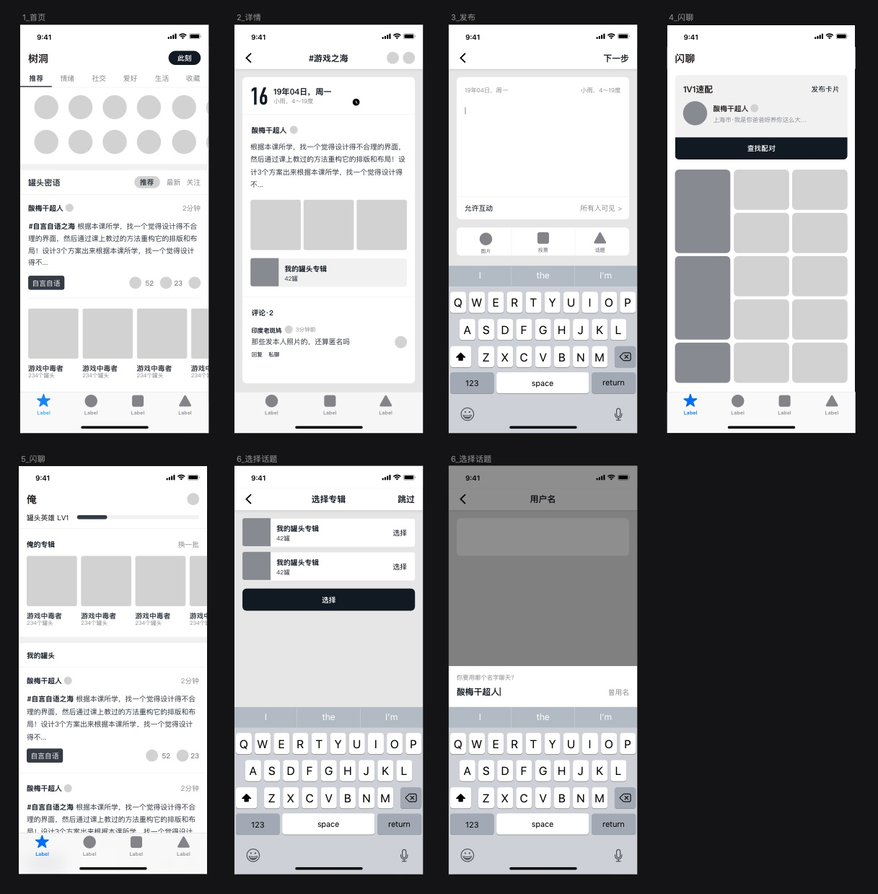
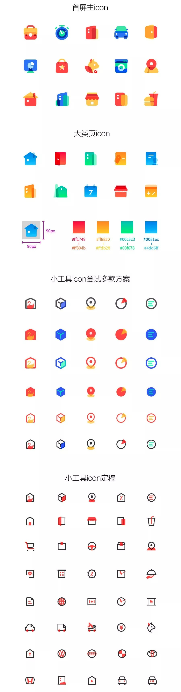
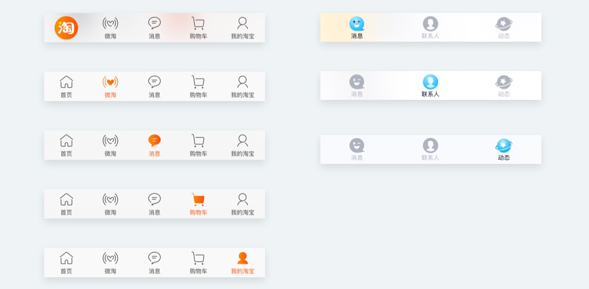
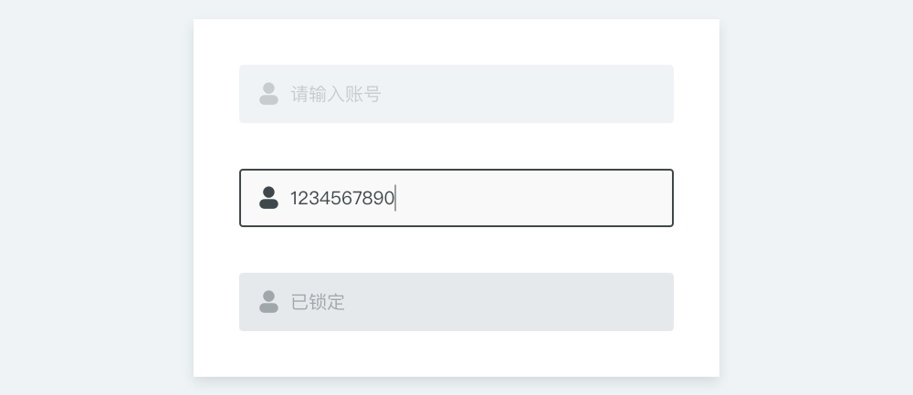
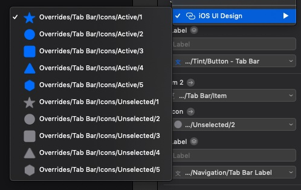
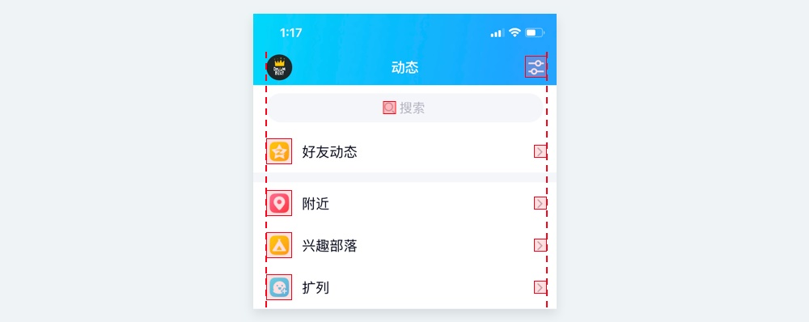
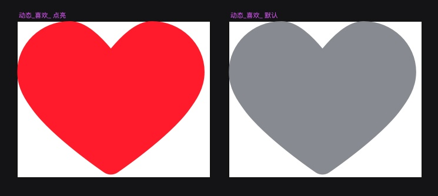
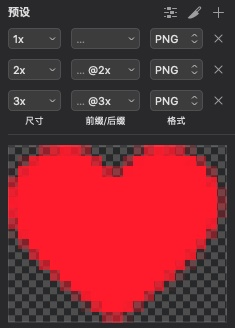

在 UI 设计中，图标不是孤立存在的。我们学习图标的设计，不是为了画一组套图，然后上传到设计平台中分享或求赞，而是要在真实的项目中发挥作用。如果不了解图标应用到项目中的知识点，那么真实的图标设计水平就会在项目设计过程中被损耗。

所以，本章讲述工具图标在项目中应用的方法。

<!-- more -->

## 一套应用中的图标规格

图标是一个应用不可或缺的组成元素，在应用的界面中随处可见。也因为图标的常见性，我们往往需要在一个应用中应用多套图标，这和崇尚简约的第一印象是有背离的。

很多新手，都以为我们只要设计一套大而全的图标，在项目中对应提取即可。但有很多场景，如果只使用一种图标类型，那么效果会非常差劲。比如，我们看看下面的淘宝设置页，前后包含了 6 种以上的图标。是太复杂了没错，但如果我们把图标都替换成同一套呢?

可以看见，右侧替换后的案例，效果非常的不理想，缺乏对比和趣味性。交互规则中说: 如无必要，勿增实体，但对于图标的使用来说，这就是必要。

---

应用内的图标规格不同，可以用两个属性来划分，大小和风格。

### 图标的尺寸

大小就是图标的尺寸规格，有些界面的元素权重低，图标的尺寸就小，有些权重高的则反之。比如在 Apple Music 的播放界面，播放快进等按钮，作为页面最重要的按钮，尺寸非常大，其它可以点击的图标次之，而表示音量的两个按钮则最小。

确定图标尺寸，是我们在项目中进行图标设计的第一件事。但尺寸的确定，不是我们凭空制定出来的，我们要先构建出实际的「场景」进行分析，即先完成了界面的高保真原型或交互原型。

下方是一个原型演示，在构建了这样的页面以后可以在原型中检查，总共用了多少种图标的尺寸，它们分别会应用在哪些场景中，然后整理出来。如果出现了一些觉得没有必要的，可以将它们进行调整合并成一种尺寸。

所以，在这个案例中，我整理出了 4 种图标的尺寸:

- 48pt: 分类、快速入口大图标
- 32pt: 底部 TabBar 图标
- 24pt: 常规工具图标
- 16pt: 小型提示图标

定好了这 4 种规格，我们在后续的设计上才有明确的设计方向。再复习一遍，为什么我们需要先定尺寸再设计，而不是统一设计一套很大的图标进行缩小。

因为图标要尽可能满足像素对齐的要求，通过缩小的图标往往在细节上会发生错位、模糊、丢失等问题。且在大画布上设计图标和一开始就在小画布中设计，两者在过程中得到的视觉反馈是完全不一样的，先在大画布画完，再缩小到 16pt、12pt 的规格时往往会显得太复杂，或描边太粗。

### 图标的风格

图标尺寸确认完以后，下面就是确认图标的风格了，和尺寸一样，我们要应用什么风格的图标，是需要在已经具备视觉雏形的页面中对比确定的，而不能提前开始设计。

在正常的设计流程中，通常会将图标放在项目的最后再开始设计，原因就是图标的视觉样式风格是取决于所处位置和环境的，是「先有界面样式，再有图标风格」的。

在常规情况下，如果一个应用中有多套图标，那么普通的中小尺寸图标使用一般的线性或面性风格即可。而在分类、快速入口这些具备装饰性、大尺寸的类型中，就应该使用一些更激进的设计风格。比如下图是 58 同城客户端应用图标案例:

通常，一种风格会应用在一种「类别」的图标中。上方案例属于比较理想的状态，一种类别的图标对应一种尺寸，但是在一些更复杂的环境中，往往同一种尺寸下还会包括不同类别的图标。

## 图标的不同状态

图标在一个产品中，除了充当装饰以外，往往也可以作为按钮来使用。每个应用中都有大量的图标可以进行点击和交互，比如底部导航栏，头部的消息图标、发布图标等等。

当一个图标能被操作后，那么我们就要注意到它的状态变化。从导航栏图标举例，常规的选中状态是更换色彩，但也有越来越多的应用会在选中状态采取不同的设计风格，通过更丰富的样式表现来提升可看性。比如淘宝、QQ 的底部导航栏。

还有，一些包含在控件内的图标，也会跟随控件状态的变更发生变更。例如在账号输入框中，如果选中了输入框，那么图标的色彩也得到改变。如果输入框目前处于不可输入状态，那么图标也会对应置灰。

合格的 UI 设计师会充分考虑到图标所变换的各种状态，并在提交给开发的过程中会进行详细的说明、归类。以及，充分运用 Sketch 等软件中的组件功能，提升项目的效率和最后的产出成果。

## 图标的标注和切图

在我们完成了界面和图标的设计以后，要提交我们的设计给开发人员。其中，包含我们的标注和切图。抛开其它设计元素不谈，我们就讲讲图标的切图需要遵循哪些规范，它和字体都是在这个过程中最容易出错的地方。

应用图标的导出我们已经在上一章提到过，所以下面还是以工具图标的说明为主。

### 图标的边界

我们要回到第二章工具图标的规范中，当我们确定出图标的尺寸时，不是要把图形设计得正好撑满这个尺寸，而是利用格线系统来定义它们的大小。

很多新人会在这个过程中产生疑惑，那么在标注的过程中，我们标注的到底是图形到其它元素的距离，还是图标外轮廓到别的图形的距离。

其实，图标的距离是根据外部轮廓进行计算的。虽然这个轮廓我们肉眼不可见，但它包含的内在规律可以帮助我们忽略一些不必要的小问题。

所以，要让标注有效，就一定不要偷懒只把图标置入画布中，而没有透明矩形背景。

### 图标的画布

现在有很多帮助我们进行标注和切图的协作工具，比如蓝湖、Zeplin 等。我们只要将设计稿上传，程序员可以自行获取图标对应的切图。

在裁切一些特定元素时很好用，但通过线上页面导出图标的方法，是非常不牢靠的。我们说过，一个应用中可能出现多种规格的图标，所以合理的图标切图，要根据不同的规格进行导出和整理，而不是让程序员自己在线上工具中下载，这样不仅操作起来困难，而且图标间不同的状态难以被轻易获取。

所以，要在项目设计过程中，创建不同规格的画布(Symbol)并将它们分类排列，不仅利于我们对以后图标的调用，也方便在最后批量导出切图到对应文件夹中。

### 图标的命名

下面我们简单讲讲图标的命名规则。有很多新手和刚入职场的 UI 设计师会不明就里的强调图标一定要用英文命名，并且各种收集常见的英文命名词汇，我首先要指出这种做法是错误的。

因为涉及到整个应用的图标系统时，会出现大量寓意「抽象」的图标。比如在我上方案例中，有一个启动图标的中文名是「中二」，那么这个词应该如何翻译? 即使不受制于英文水平的发挥，但是您写的英文不代表开发人员能看得懂，而大量抽象词汇的堆积最后导致命名无法成为有效的索引条件，因为没人看得懂，开发需要查找一个图标的时候依旧是通过缩略图而不是命名。

所以，在内部没有具体的命名规范，亦或是程序员没有特殊要求的情况下，更建议使用中文命名系统，因为国内多数程序员的习惯会将获取的图标进行二次命名。

命名的格式可以分成 3 级，格式大致为: 「模块\_名称\_状态@1x」，比如下面的案例:

- 设置\_钱包\_高亮@1x.png
- 动态\_评论\_默认@1x.png
- 登录\_按钮\_点击@2x.png

当然，这不是唯一准确的命名方式，可以根据实际场景自由调整，但大家要牢记，图标的命名是为了方便查找、检索。

最后，图标 Symbol 的命名，要和图标的命名保持一致，这样才能起到事半功倍的效果。

### 图标的格式

上一章启动图标的导出格式，会根据不同设备、场景导出不同的尺寸，并且使用 PNG 的格式。不要担心，工具图标虽然也面临设备不同的问题，但不需要导出这么多的规格。下面讲讲两种图标的导出类型。

#### 位图格式

最常用的导出格式就是位图 PNG 格式，因为显示器显示倍率的不同，所以我们要导出 1x、2x、3x 三种倍率规格的图片，即设计了 16pt 的图标的话，我们需要导出 16pt、32pt、48pt 三种尺寸。并在导出的文件名后缀上标有 @1x、@2x、@3x 的标注。

这个规格对于 iOS 还是 Android 都是通用的，虽然还有 3x 以上的设备，但是那些设备只要调用 3x 的规格即可。

虽然后面会提图标可以使用矢量格式导出，但对于使用了渐变、投影或者拟物风格的图标，必须使用位图的格式，否则无法完整记录图形的细节元素。

#### 矢量格式

导出 3 种规格的图标很麻烦，而且位图占用的空间往往较大。所以，iOS 和 Android 为了优化这个问题，在之前的系统更新中都默认支持了矢量格式的切图文件:

- iOS 使用 PDF 的 1x 切图
- Android 使用 SVG 的 1x 切图

当然，如果使用矢量格式导出，那么切记在分类文件夹的时候，要将 iOS 和 Android 分开保存，而不是混合在一起。
