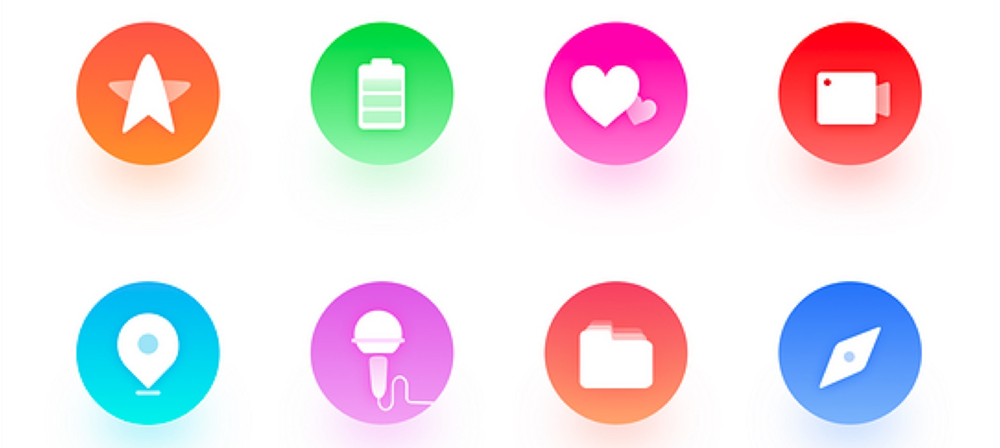

装饰图标最主要的应用区域，集中在首页的快速入口上，也是今天多数应用中会使用的组件。下面，我们会讲解国内主流应用中的几种装饰图标的设计。

<!-- more -->

## 扁平插画风格

装饰图标的主要作用是丰富视觉体验，对于识别性的要求较低，所以我们可以在这里应用更复杂的图形和添加更多的细节。在这里的扁平插画风格设计更具象，而不是像工具图标一样的抽象化，所以完整的采用扁平插画的设计是没问题的。

例如在肯德基客户端首页的服务分类中，使用的图标就是依据扁平插画的形式设计的，有较多的色彩和完整的细节。

这类图标的设计并不困难，只要具备了工具图标的设计基础，就可以很快学会并运用。它的设计特征是这样的，先通过绘制具体的图形轮廓，然后为这个轮廓内添加细节，并对不同的面填充不同的色彩进行区分。

下面，我们通过讲解几个图标的设计过程，帮助大家学习这种设计风格。

1. 优惠券图标

   先通过模拟现实世界的优惠券样式，确定出基本的线性轮廓。

   

   但作为装饰图标来说，这样的设计目前有些简陋，左侧空出了大量的留白，所以我们要考虑如何增加细节来丰富这个区域。于是，使用 % 号就可以比较好的标示折扣。

   

   最后，开始为图标填色。因为在这套图标中，红色是主要基调，所以我们不能大面积的使用其它颜色，于是就将其中一侧进行留白处理，只修改了它描边的色彩。并且还在票据两侧的连接处添加了一个用来标示阴影的竖线。

   

1. 店铺图标

   

1. 我的卡包图标

   

## 渐变几何背景

和其它风格比较，在快速入口中，线上案例应用得最多的风格其实是渐变几何背景的设计方案，即在一个应用渐变色的背景上贴了一个线性或面性的图标。

这种风格的设计，主要在于背景渐变色的应用，通常，在一组彩色快速入口的图标中，要让它们的渐变色看起来自然和谐，是需要技巧的。

例如有四个图标，首先要定义出不同的色相，然后再对它们应用相同的渐变模式。例如，使用相同的渐变角度，然后在渐变的起始色使用该色相，在结尾使用不同明度、饱和度的色彩。

之后，再在上方置入图标的图形，并为它们添加适当的阴影即可。

如果在这个基础上，还想再添加细节，那么就可以在上方的图形中添加一些折叠的阴影效果，强化立体感。

## 炫彩渐变风格

这是一个比较奇特的设计风格，在过去只存在于飞机稿中，是一种单纯为了追求视觉表现力的设计形式，通过高饱和的渐变、撞色，抓取浏览者的眼球。

这类风格的设计，在确定了图形以后，就是为它们填充高饱和度的渐变色。和扁平插画比较不同的是，色彩的填充不是用来描绘物体的颜色，而仅仅是视觉表现的一种方法，所以颜色的添加追求的不是「合理」，而是纯粹的「好看」。

并且，通常这类图标还会使用前两年开始流行的彩色投影，增加界面本身的层次感。下面，我们也通过 3 个案例，为大家演示一下这类图标设计的过程。

案例 1:

案例 2:

案例 3:

## 实物贴图风格

最后，讲讲实物贴图的图标风格。这种图标出现在涉及到实物产品的应用中，例如电商应用，智能硬件控制应用等等。

这类设计看起来很简单，只要画出一个几何的背景，并建立蒙版将实物图置入进去即可，但还是有不少新手会犯错误，下面我们主要说说常见的问题有哪些。

1. 物体的透视

   和工具图标一样，我们要尽可能的保证整组图标中图形的形状和透视可以统一，如果实物图采用的透视不一致，那么空间的对立感就更强，也容易被用户觉察到违和感。

   

1. 形体和比例

   当我们采用实物照片时，我们往往不能控制该物体完整的形状，但需要切记的是，不是物体本身是什么形状我们都要完整的置入进去。

   比如入口中有口红和香水两种，口红是细长的而香水是圆形，那么我们可以做的就是放大口红，最终只展示它的局部，否则它们的对比会完全失衡。

   

1. 图形的质感

   实物的图形，还有一个非常重要的细节，就是它们的质感。这种质感指的不是物体本身的材质，而是摄影、后期产生的质感。如下图的对比，同一件商品，手机直出的图，和经过商品精修的图，展现出来的质感是完全不一样的。

   

   如果强行将有精修痕迹和普通照片抠出来的商品放到一起，也只能给用户产生巨大的违和感。所以，如果提供给我们的素材本身质感不同，那么我们就要在 PS 中对它们进行调试，尽可能保证它们的一致。

1. 前后对比

   因为是摄影图，所以图形本身包含的细节会非常丰富，而且色彩也可能比较多。在采用了几何背景时，就要保证它能更好地衬托主体物。如果使用较强的颜色，或是太多细节，就会导致前后元素的分离度不足，无法凸显物体本身。所以，多数采用这种风格的设计案例中，背景用色都使用饱和度偏低的配色。

   

只要不犯上面 4 种错误，那么设计这类图标时，就能保证最终的效果不会太差。

## 小结

掌握以上这种风格的画法，已经可以应对绝大多数的需求和场景了。但这并不是终点，应用对于视觉风格的追求愈发的重要，想要尝试更多的设计风格，那么就需要掌握更多种装饰类图标的设计方法。需要大家在之后的时间里努力积累相关的技巧和思路。
