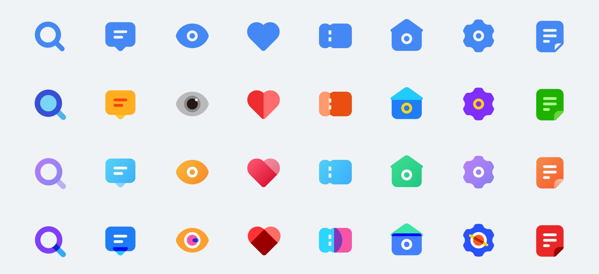
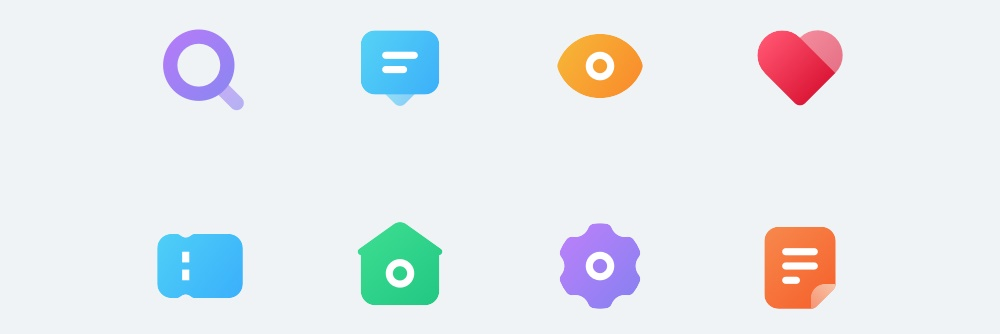
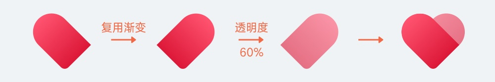
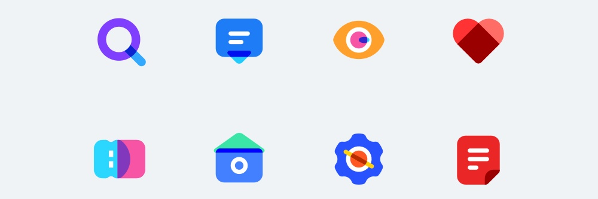

面性图标在操作中和线性图标的最大差别就在于描边和填充模式，我们知道为了满足像素对齐的要求，线性描边会在操作中产生很多不可控的因素，要用很多额外的操作步骤去弥补。在面性图标中，就不需要使用描边，并且使用相同的图标模板即可。

下面就进入本篇的具体案例演示。

## 基本面性风格

如图所示，我们使用线性图标中的样式，设计成面性效果。具体的操作步骤就不需要再完整演示了，只需要将所有线性风格演示中的描边替换成填充，再使用对应的路径查找器功能即可。

需要注意的是，可能我们会习惯于使用线条工具绘制很多 1pt 宽的直线，这是错误的做法。我们需要使用矩形工具画出一个完整的闭合图形，再使用路径查找器工具或者对图形进行批量操作，这样才能保证统一。

还有，面性图标不代表完全不能出现「线性」元素，在一些特定的情况下，我们依旧要通过线条的形式展现图形轮廓，比如搜索图标的镜片，使用全填充的样式显然效果不理想，所以镂空镜片区域是不可避免的。

虽然我们不可避免要使用「线性」的元素，但在面性风格中，这些图形的描边元素不能太细，应该使用不小于 2pt 的宽度。并且，为了保证图标的一致性，整套图标的线条都要尽可能使用相同的粗细，而不是这里使用了 2pt，在别的图标中就是 4pt。

## 扁平插画风格

扁平插画风格实际上是一个自由度非常高的图标风格，可以设计出很多有趣又极具创意的插画式图标。在本案例中，我们只讲解其中一种最基础的设计方式，便于新人入门。

最基础的扁平插画，就是在面性图标的基础上，将图形拆分成不同面的组合，然后分别为这些面填充纯色即可。比如心型图标，看起来像是只有一个面的图形，但我们可以人为居中将它分割成两个面，然后填充同色系的不同明度，就可以得到一个扁平插画风格的图标。

类似搜索或消息图标这样有镂空区域的图标，我们就可以为镂空区域填充不同的色彩，使其作为独立的面呈现，也能达到相同的风格。

最后一种，就是将图标「拟真」化。比如眼睛图标，我们可以用接近真实眼睛的样式来创作，为它增加瞳孔、高光等细节，只要依旧使用纯色填充，且将细节数量保持在合理的范围内，就不会与其它图标产生冲突。

## 彩色渐变风格

在面性图标的彩色渐变中，有多种更细致的设计类型，比如整个图标采用同一渐变，或者图标中不同的面采取不同的渐变方式。

整个图标使用同一渐变色的做法，和线性图标的渐变方法几乎一样，只要在开始填充渐变前将所有图层进行合并即可。我们来讲解一个比较特殊的基础渐变风格——不同透明度渐变。

比如心形图标，我们把它划分成了两个不同的面的组合，然后都使用了红色的渐变色，一强一弱。通常，我们只要先设定出较强的渐变，然后再复制这个渐变色到另一个面中，降低它的透明度即可。

在使用了透明度的图形中，要注意的是为了保证在实际使用中不让图形背面的元素影响到图标色彩本身，我们要将这些图形复制一层填充成白色并置于底部。

## 透明叠加风格

最后，就是这类透明叠加的设计风格了。和线性图标中的叠加设计方式一样，我们需要将图形拆分成若干面，才能创造出重叠的区域。

在这个方案中，图标尽可能使用纯色，会比使用渐变的效果更好，原因在于我们对重叠区域色彩的控制上。可能很多同学看到这个风格，会以为叠加的区域只要控制透明度就可以了，但这种效果通常很不理想，尤其在配色为撞色上，相交部分的色彩就会有「朦胧」感，缺少通透的舒适性，并且图形本身的饱和度也会受到影响，比如下面的演示:

通常，相交区域的色彩要另外配置。也就是在绘制好图形的所有轮廓以后，将它们一起选中，然后使用「图像生成工具」，再为相交的区域单独选择配色。下图就是单独挑选的两个配色和透明度的方式对比。

## 总结

相对于线性图标的设计而言，面性工具图标的设计就简单很多，虽然设计风格有非常多的延展性和可能性，但大家始终要记得它们依旧是「工具图标」，识别性是优先于视觉风格的，所以切勿过度强调视觉性而将它们做成了装饰性图标。
