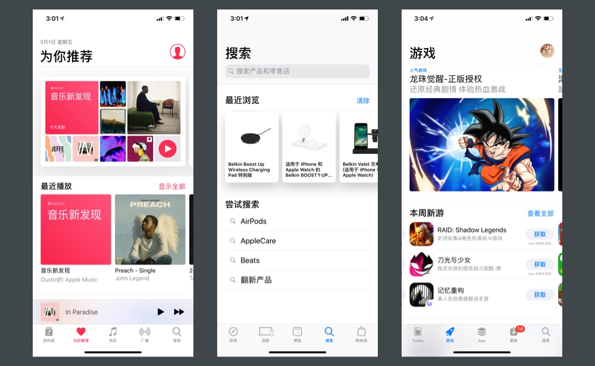
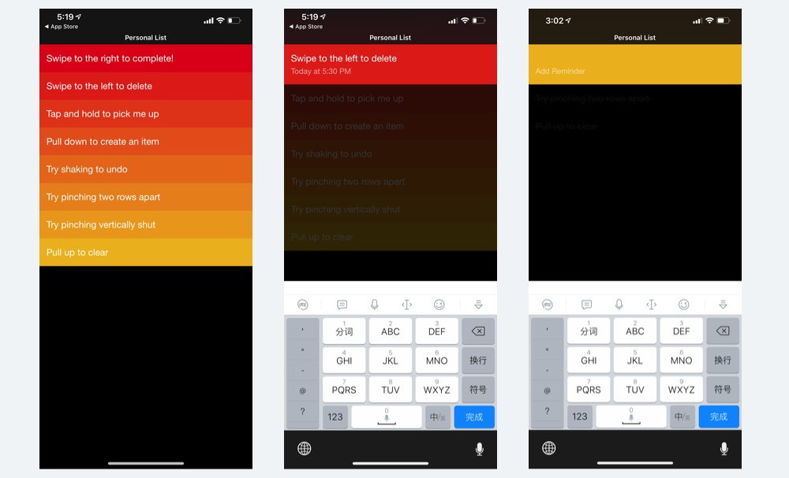
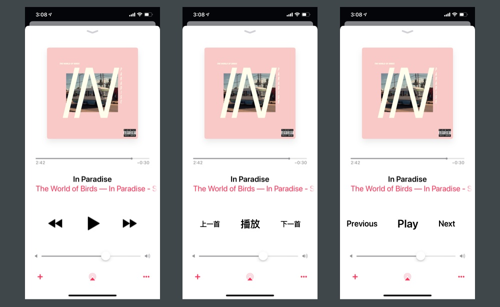
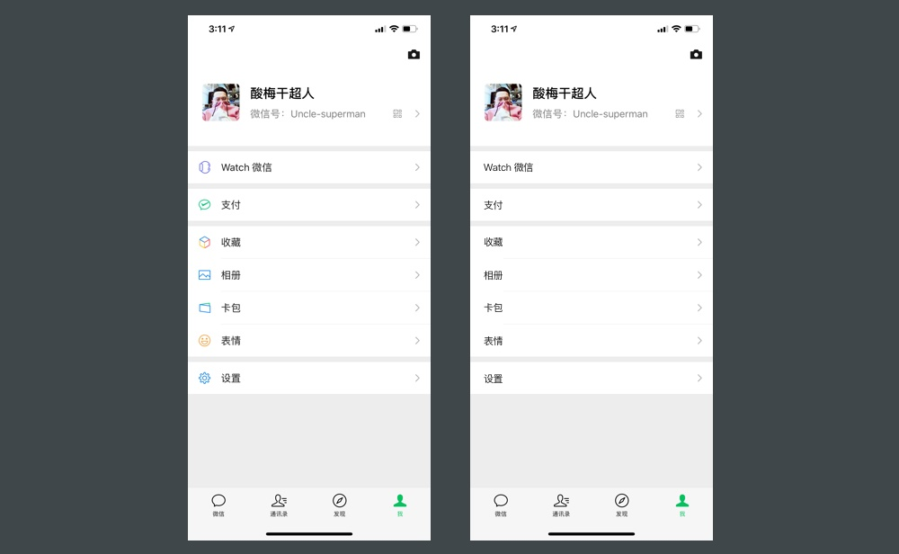

## 图标的基本认识

图标，是一种图形化的标识，它有广义和狭义两种概念，广义指的是所有现实中有明确指向含义的图形符号，狭义主要指在计算机设备界面中的图形符号，有非常大的覆盖范围。

对于 UI 设计师而言，主要针对的就是狭义的概念，它是 UI 界面视觉组成的关键元素之一。

在当下最常见的扁平化设计风格中，界面的实际视觉组成只有 4 种元素，图片、文字、几何图形、图标。

可以说，图片、文字、几何图形的运用，都只用到排版的技巧，而图标，是 UI 设计中除了插画元素以外唯一需要「绘制」、「创作」的元素，一涉及到这两件事，难度就直线上升了。

本来往界面里丢一些方方圆圆、贴几张图、填一些字，就可以把界面做出来了，比如 Clear APP，不仅工作量少，而且还符合极简原则，为什么还要吃力不讨好的设计图标?

这就涉及图标作用的探讨了，本文就不长篇大论从上古时期人类与图形符号的纠葛开始写了，就谈对于图形界面本身，为什么图标有这么重要的地位，没它不行?

有两个原因，第一文字虽然也是一种图形符号，但相对于图标而言，文字实在太复杂了，在识别效率上有先天的劣势。再者，不同的语言，文字的长度也不同，如果换成阿拉伯语或者俄罗斯语，或许一行还装不下所有文字。图标可以以一种更高效的方式，将想要传递的信息进行浓缩，不仅易于识别，也能让界面更简洁，利于排版，比如下方案例。

第二点，就是关于视觉的观赏性。有些页面中，如果把图标去掉了，也丝毫不会影响操作效率，以及对内容的理解。但没有图标，缺少这些点缀，这个页面看起来就会太枯燥，最好的例子就是应用的设置页了，见下方案例。

## 总结

在 UI 的界面中，图标的主要作用是用来高效地传递信息，以及起到美化界面的作用。
