在 UI 的设计体系中，图标是最重要的组成部分之一，是任何 UI 界面中都不可或缺的视觉元素。了解图标相关的概念，以及正确绘制的方法，是入门 UI 设计的必备条件。本文会详细讲明图标设计的所有要点和具体的设计方法。

本文共分为 5 个部分:

- 图标简介: 先对图标有个整体的认识，了解图标总共有哪些类型和应用场景。
- 工具图标: 最常见的工具型图标的相关规范，以及对应的设计案例演示。
- 装饰图标: 近年来使用越来越广泛的视觉型图标设计认识，以及对应的讲解。
- 主体图标: 讲解主体图标的相关规范，如何高效的进行设计。
- 应用案例: 介绍在一个 UI 项目中，要应用多少种图标规格，如何设计出正确的图标。

## 图标的基本认识

图标，是一种图形化的标识，它有广义和狭义两种概念，广义指的是所有现实中有明确指向含义的图形符号，狭义主要指在计算机设备界面中的图形符号，有非常大的覆盖范围。

对于 UI 设计师而言，我们主要针对的就是狭义的概念，它是 UI 界面视觉组成的关键元素之一。

在当下最常见的扁平化设计风格中，界面的实际视觉组成只有 4 种元素，图片、文字、几何图形、图标。

可以说，图片、文字、几何图形的运用，都只用到排版的技巧，而图标，是 UI 设计中除了插画元素以外唯一需要我们「绘制」、「创作」的元素，一涉及到这两件事，难度就直线上升了。

本来往界面里丢一些方方圆圆、贴几张图、填一些字，就可以把界面做出来了，比如 Clear APP，不仅工作量少，而且还符合极简原则，为什么还要吃力不讨好的设计图标？

这就涉及图标作用的探讨了，本文就不长篇大论从上古时期人类与图形符号的纠葛开始写了，就谈对于图形界面本身，为什么图标有这么重要的地位，没它不行？

有两个原因，第一文字虽然也是一种图形符号，但相对于图标而言，文字实在太复杂了，在识别效率上有先天的劣势。再者，不同的语言，文字的长度也不同，如果换成阿拉伯语或者俄罗斯语，或许一行还装不下所有文字。图标可以以一种更高效的方式，将我们想要传递的信息进行浓缩，不仅易于识别，也能让界面更简洁，利于排版，比如下方案例。

第二点，就是关于视觉的观赏性。有些页面中，如果把图标去掉了，也丝毫不会影响我们的操作效率，以及对内容的理解。但没有图标，缺少这些点缀，我们就会觉得这个页面看起来太枯燥了，不得劲，最好的例子就是应用的设置页了，见下方案例。

既然知道了图标的作用和重要性，那么接下来，就要进一步了解在工作中我们要设计哪些图标。

可以先划分成三种大类:

- 工具图标
- 装饰图标
- 主体图标

下面，我们将对它们分别进行介绍，以及展示相关的设计类型，方便读者在开始学习具体设计前，对 UI 设计会创作的图标有更全面的认识。

## 工具图标

首先，我们要说的是工具图标。这是我们在日常讨论中提及最频繁的图标类型，即应用内有明确功能、提示含义的标识。作为最常见的图标类型，我们就不需要做太多的说明了。

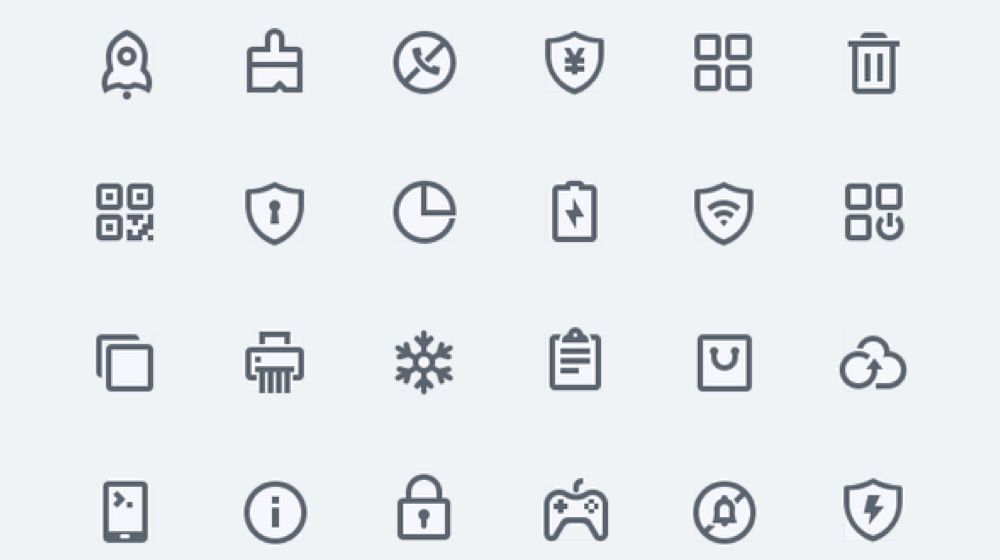

虽然理解起来容易，但是它所包含的设计样式却并不少，可以把它们归纳成线性、面性两个大类，再分别进行细分。

### 线性风格

线性图标，即图形是通过线条的描边轮廓勾勒出来的。多数人对它样式认识的第一反应应该是使用纯色的闭合轮廓，比如上图案例，线性图标的创作空间看似不多，但实际上有非常多的调整空间。

下面我们把它们罗列出来。

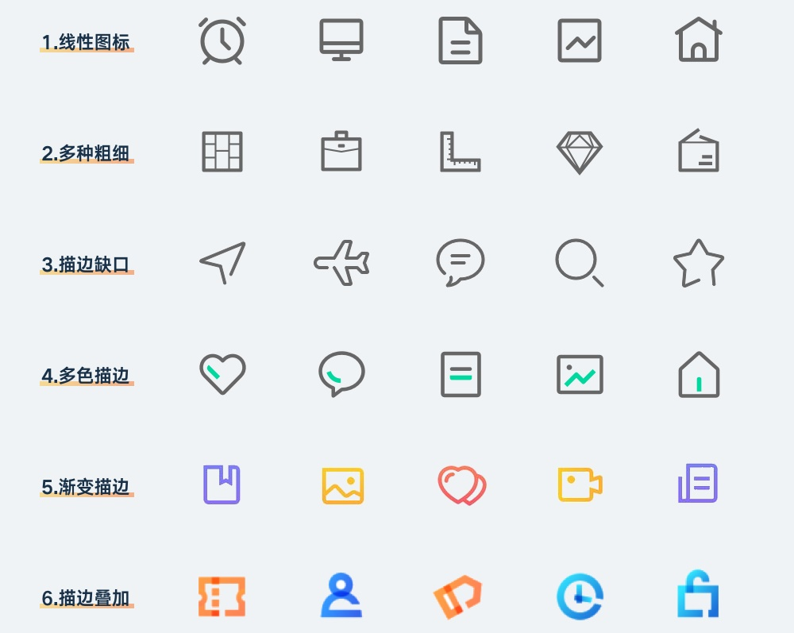

### 面性风格

面性图标，即使用对内容区域进行色彩填充的图标样式。同样，在这类图标中，也不是只能应用纯色的方式进行填充，还有非常多的视觉表现类型。

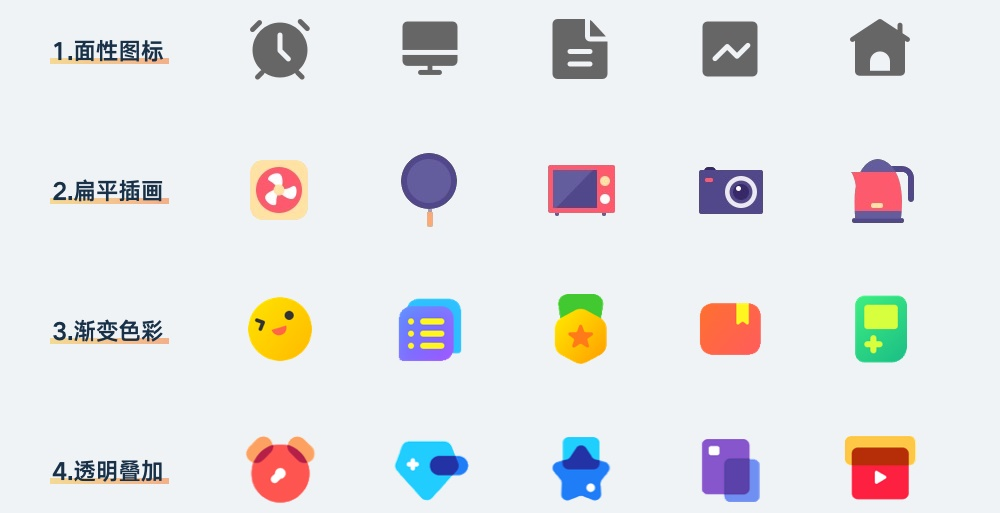

### 混合风格

当然，在设计图标类型的时候，也不一定非线性和面性不可，有一些热衷创造和尝试的设计师，还创作出了混合型的图标，既有线性描边的轮廓，又有色彩填充的区域。常见的样式类型如下:

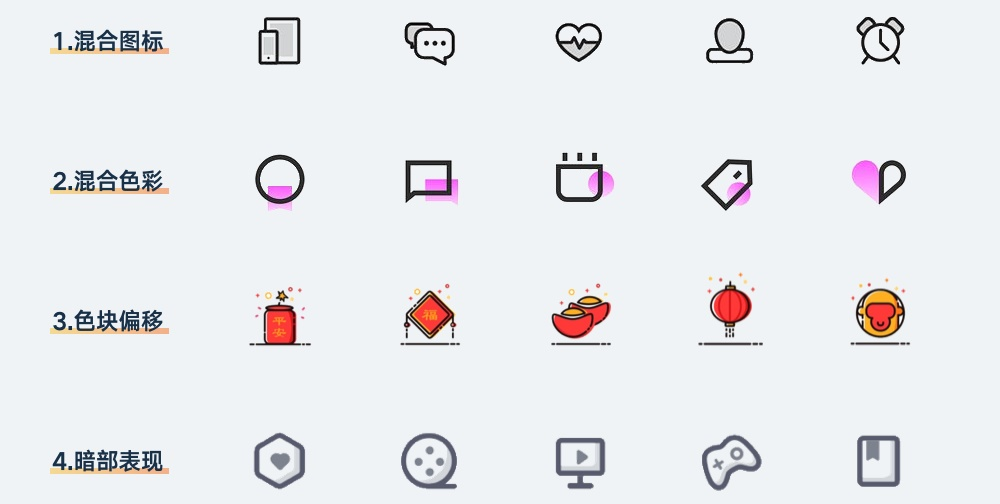

## 装饰图标

和工具图标比起来，装饰图标的视觉性作用更多。对于一些比较复杂的应用来说，过分的简约并不能弥补信息过多的信噪问题，我们要通过丰富视觉体验的方法来增加内容的观赏性，减少一屏内显示内容的数量。

比如在分类列表里，是可以只使用线框和文字把大量内容浓缩到一屏以内，但实际浏览效率并不会增加，而且并不美观。

还有就是国内的界面设计环境，会根据运营需求设计进行特殊化处理，尤其在电商领域，首屏的图标都会改成首页风格的样式，增加活动氛围。

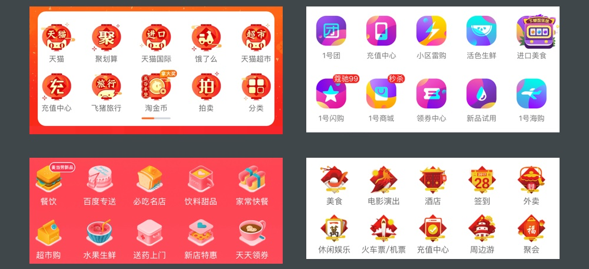

装饰性的图标设计，虽然没有明确的规范该怎么做，效果怎么好怎么来，但最常见的类型有四种，下面分别进行介绍。

### 扁平风格

扁平风格的装饰图标，通常可以理解成是用扁平插画的方式画出来的图标，除了继承扁平的纯色填充特性以外，也比普通图标有更丰富的细节与趣味性。

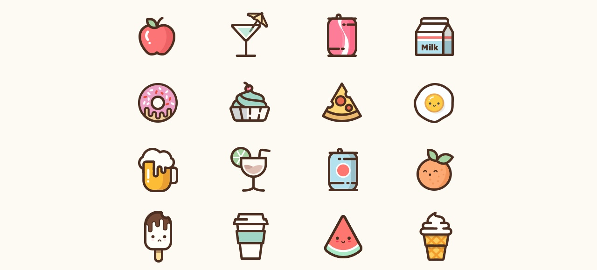

### 拟物风格

拟物风格的图标现在出现的频率越来越高，集中在大型的运营活动中，通常这些活动会通过拟物的方式将头部设计成有故事性的场景，所以自然顶部的相关图标使用拟物的设计形式会更贴合。

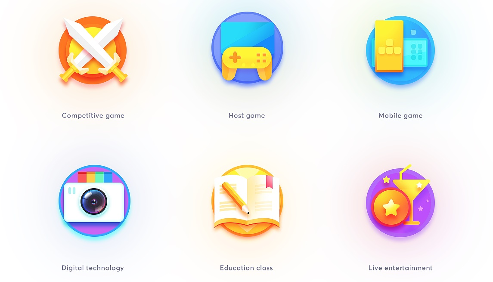

### 2.5D 风格

2.5D 是一种偏卡通、像素画风格的扁平设计类型，在一些非必要的设计环境中，使用 2.5D 会比较容易搭配主流的界面设计风格，有更强的趣味性和层次感。

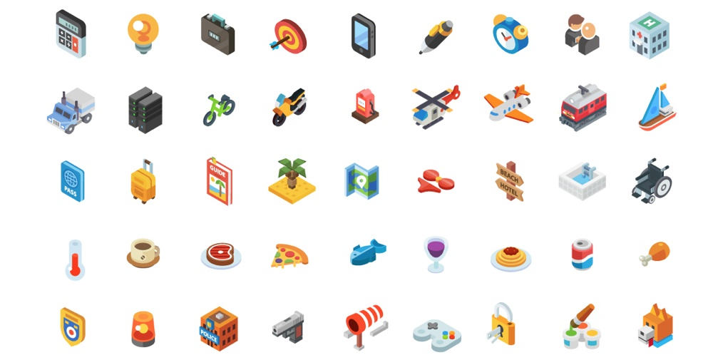

### 炫彩渐变

这是一个拗口的原创名词，找不到更合适的形容，还是觉得浮夸点符合它的气质。这种图标，就是通过一系列非常激进的渐变和撞色实现，通常还会使用彩色的阴影。

使用这样图标的区域，通常都会呈现出一副五彩斑斓的景象，只有在内容非常丰富且用户偏向年轻化的产品中可以使用，是一种非常难驾驭的设计风格。

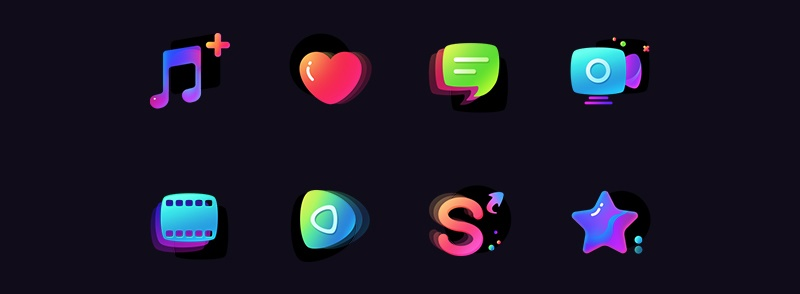

### 实物贴图

最后一种，就是采用了真实摄影物体的设计风格。虽然它不属于完全依靠我们创作和绘制出来的，但想想还是放进来合适。因为这种图标的出现频率非常高，有必要在后面掌握它的做法。

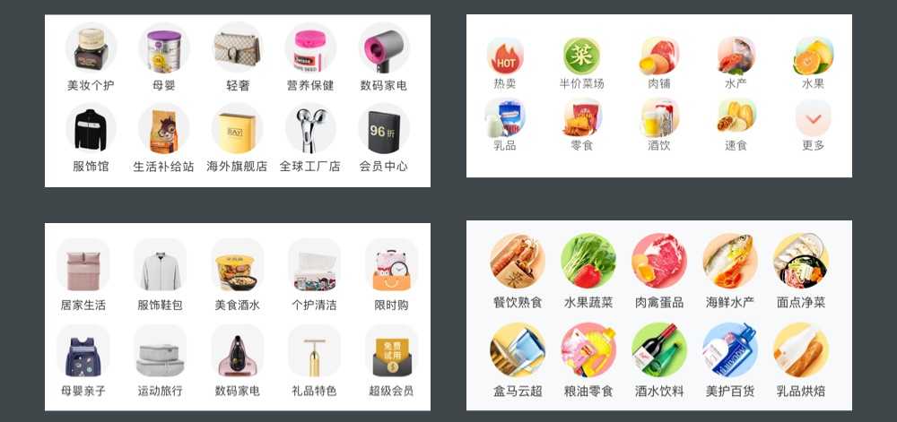

## 主体图标

最后，就要说说主体图标了。主体图标的设计比前面两种类型的图标说起来更难，因为它实际上就是把「LOGO 嵌套进系统图标模版」的图标。

除了掌握必要的规范以外，主体图标的主体物设计就是 LOGO 的设计，已经超出了图标绘制本身的知识点。所以，在后面我会针对这个问题讲解一些比较套路易懂的设计方案供新手学习，这里我们先来了解一下它有哪几种设计形式。

### 文字形式

使用了文字作为图标主体物的类型，通常是这类应用本身的品牌 LOGO 就使用了文字，所以这里就把字体照搬过来。

### 图标形式

对于一些偏工具，适合用简单图形传达应用功能的主体图标，就会采取使用工具图标的方式设计。

### 图形图标

图形形式看起来和图标形式很接近，但实际上完全不属于同一类型，之所以它不是图标，是因为这类图标的主体图形是一种经过高度抽象化的标识，传达的是品牌性，而不是图形的含义。

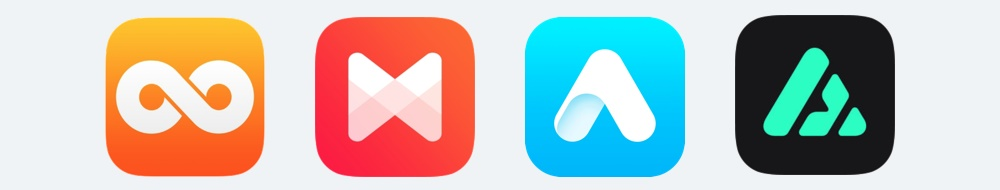

### 插画形式

对于一些比较纯粹的应用，如读本、漫画、幼儿类应用，就热衷于采用卡通形象作为图标的主体进行设计。

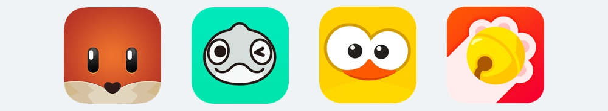

### 拟物形式

虽然现在扁平化的设计占据主导地位，但依旧有很多应用的主体图标是通过拟物的方式设计的。因为对于这些应用来说，拟物设计所传递的信息往往更直观和准确。

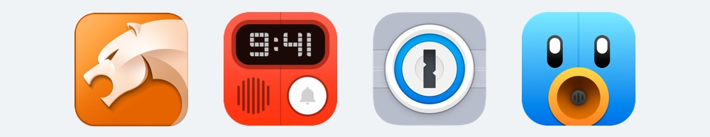

当然，还有其它的数之不尽的主体图标设计方式，比如明星大头照、摄影图、游戏原画等，但理解上面这些类型就够了。

前面介绍的三种图标，就是今后在进入 UI 行业设计的内容。虽然图标看起来简单，但可以玩出的花样不少。除了正确设计出图标以外，高低阶的 UI 设计师之间的区别也包含图标设计类型掌握的多寡。

所以，在开始学习前，不要将设计图标的目标局限在最简单的图形绘制上，还有很多有趣的设计形式等待你们去尝试。

## 总结

1. 在 UI 的界面中，图标的主要作用是用来高效地传递信息，以及起到美化界面的作用。
1. UI 会涉及的图标类型主要有三种，工具图标、装饰图标、应用图标。
1. 工具图标，是界面中用来传递信息的图形符号，主要包含线性、面性、混合三种设计风格。
1. 装饰图标，是界面中用来提升视觉体验的图形，主要包含扁平、拟物、2.5D、渐变炫彩等设计风格。
1. 应用图标，是用来启动应用的图标，主要包含文字、图标、图形、插画、拟物等设计形式。
