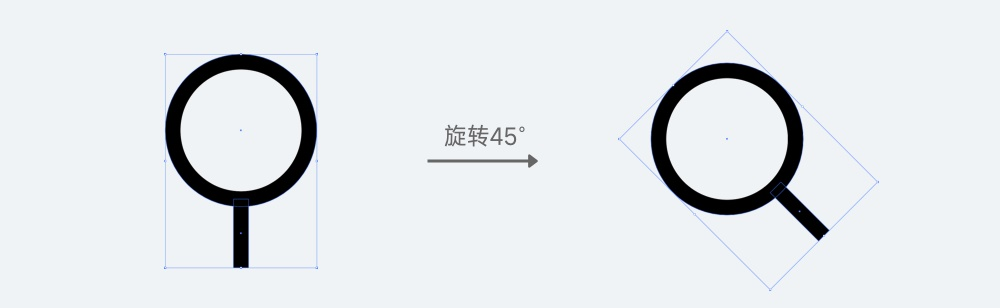

线性图标是所有图标中最基础的设计形式，也是最简单的入门。在我们后续设计其它的风格图标前，首先要通过练习线性图标来打下坚实的基础。

<!-- more -->

## 设计注意事项

设计线性图标需要注意:

- 制图的规范性
- 图形的合理应用

只要图形的设计能达到这两个要求，才能在进一步的创作中施展拳脚。

线性图标的设计首先要确定图标的尺寸、描边的粗细和绘制图标的栅格系统，所以先确定图标的规格为 28pt \* 28pt，使用 2pt 的内描边(设计中 PT 可以等同 PX )，然后再画出栅格，并进行编组。

## 设计演示

### 搜索图标

搜索图标是 APP 中最常见的图标，绘制原理也很简单，就是一个圆和圆角矩形的结合。

1. 在案例中，设计的风格主要是偏圆润一点的，那么镜片的比例就要偏大。在这里使用了尺寸为 20pt 的圆，和一个宽 2pt 高 9pt 的圆角矩形。

   

1. 将矩形和圆形进行连接并且垂直方向居中、编组，然后旋转 45 度。之所以要先垂直再旋转，是因为如果直接画出一条倾斜的矩形再去连接镜片，那么矩形的中轴将很难移动到和圆心相交的位置。

   

1. 调整搜索图标在模版中的位置，因为几何视觉差的关系，要让图标重心平稳，那么就要向右下角偏移，最终效果见下图。

   

### 聊天图标

聊天图标的设计和搜索图标一样，需要通过几何图形的组合完成，但不同于搜索图标的是，该图标需要应用到路径查找器面板的相关功能。

1. 首先要画出聊天气泡的外轮廓，可以看出它是由一个圆角矩形和三角形组成，所以第一步要做的就是画出这两个元素。

   

1. 将它们连接并垂直方向居中，然后使用路径查找器面板的「联集」选项，将它们合并成一个图形。

   

1. 在轮廓内部画一长一短两条 2pt 宽的矩形。

   

1. 调整图标在模版中的位置，根据视觉差要将图标向下偏移，最终效果见下图。

   

### 查看图标

查看图标的设计也需要应用路径查找器的功能，实现过程也非常简单。

1. 画两个 2pt 描边，垂直方向对齐且相交的圆，并使用路径查找器中的「交集」功能获取它们相交的部分。

   

1. 将这个图形置入到模版中，然后可以通过拖动图形大小的方式，更改它的左右两边到像素对齐的位置(这个形状的比例发生变化是没问题的)。

   

1. 在中央位置添加一个 8pt 大小的圆，就完成了最终的效果。

   

### 心形图标

心形图标如何绘制，对于新人来说是一个非常常见的问题。很多人都不知道具体该怎么画出这个图形，而心形图标又几乎被运用在所有应用中，所以就要巧妙运用几何图形的组合。

1. 画两个矩形，一个竖直一个水平放置，并将上方和右侧的两个边缘进行圆角处理。

   

1. 将两个图形进行移动相交，并保证上方和右侧的两个半圆正好紧贴在另一个矩形的边缘，然后使用路径查找器中的 「联集」功能，就可以得到一个躺着的心形。

   

1. 将心形进行旋转，并置入到模版中，添加圆角细节，略微向下偏移，就可以得到下图的最终效果。

   

### 卡券图标

卡券图标有一个外轮廓和内部的虚线部分，外轮廓在上下有两个半圆的凹槽，要通过两个圆进行裁切。

1. 画一个 28pt \* 24pt 的圆角矩形，并在上下方各画一个 4pt 大小的圆，与矩形的边缘相交。

   

1. 确认两个小圆图层顺序在矩形的上方，然后选中三个图层，使用路径查找器中的「减去顶层」即可得到外轮廓。

   

1. 最后，就是画出卡片中的两条「虚线」，再置入到模版中，就可以得到下图的最终效果。

   

### 房屋图标

从房屋图标的形状中，我们可以看出它包含了三角、圆和矩形这三个形状，主要的难点是如何通过三角形和矩形画出外部的轮廓。

1. 首先画出一个 28pt × 10pt 的等腰三角形，再画一个 22pt × 16pt 的矩形，将它们边缘进行重叠。

   

1. 三角形三个尖角的圆角依次设置为 3pt、1pt、1pt(上、左、右)，再将矩形下半部分的两个直角添加 4pt 圆角。

   

1. 执行「联集」操作，生成完整的外轮廓。之所以先做圆角再执行联集，是因为提前合并两个形状，会导致一些尖角无法使用圆角工具。

   

1. 画出房屋中间的圆形，然后将图形置入模版中，就可以得到下图的最终效果。

   

### 齿轮图标

齿轮在 UI 中一般作为设置的图标使用，也是常用图标中最难画的图标之一。

1. 画一个 28pt 的大圆，然后再画一个 8pt 的小圆，置于圆的左侧。然后使用「旋转工具」，将小圆旋转中心固定到大圆的圆心中，按回车键，在弹出的对话框中选择 60° 然后点击复制按钮，生成第二个圆。之后再按 Ctrl / Command +D 重复操作 4 次，就可以得到完整的圆环。

   

1. 保证周围的 6 个圆在大圆的上层(一般来说，新画的六个小圆必然在大圆上层)，并将 7 个圆全部选中，执行「减去顶层」操作。

   

1. 最后，将所有内圆角改为 2pt，再画一个直径 8pt 的内圆，然后在模版中调整到正确的位置即可，就可以得到下图的最终效果。

   

### 文件图标

文件图标也是一个很简单，但是大多数人就是做不好的图标，右下角的折角难倒了很多新手，在这里我们用一个简单的方法进行实现。

1. 先画一个 20pt \* 23pt 的圆角矩形(高不是偶数，后面会解释)，然后要先把右下角的缺口做出来。这里如果要使用减去顶层的方法做也可以，但我们要用一个更简单的操作，在右下角顶点上方和左侧 6pt 的位置各添加一个锚点，然后使用「删除锚点工具」删除右下角顶点的锚点，就可以得到一个倾斜的切口。

   

1. 在右下角画一个圆角为 4pt 的矩形，然后将其中一个边与上个步骤的缺口相交，相交的部分即为折角的部分。这时候选中两个矩形，使用「形状生成器工具」(快捷键 Shift + M)，点击一下图示的部分，就会生成一个新的形状组，接着取消它们的编组，再选中多余的图形进行删除，就可以得到一个完整的折角效果。

   

1. 最后，设置大圆角(4pt)和小圆角(2pt)，并在内部添加 3 个圆角矩形，再根据几何的视觉差将图标置入模版中，向下移动一个像素，就可以得到下图的最终效果。

   

## 总结

### 栅格的使用

针对栅格的使用，为了便于演示都给出了具体的数值，在最后一步才置入到模版中。实际上，我们应该在一开始的绘制中就在模版中进行，而往往刚开始画的图形尺寸是不能代表最终效果的。

比如最后一个文件图标中，为什么是 23pt，并且偏下 1pt。是因为一开始创建 24pt 高的矩形，在完成最终效果以后会发现重心上移，而且整体偏大了(下图第一行)，这时候缩减高度才能保证视觉的稳定性(下图第二行)。而房屋屋顶的三角形，我们使用的是 28pt 撑满画布，这也是经过了不断地尝试，测试了多种宽度和圆角效果后才确定出来的，并不是一蹴而就的。

### 图形的调整

图形的不同角度、尺寸和比例，都会影响图标最后呈现的效果，需要我们在制作过程中保持对图形优化的态度，通过持续调整和对比找到最合适的结果。

比如搜索图标，重点在于圆和矩形的比例，不同比例会带给我们截然不同的感受。

以及在查看图标中，圆形相切的比例不同，也决定了最终呈现的效果差异，相交越少感觉越尖锐，相交越多则感觉越圆润。

### 多种操作方式

实现同一种效果，可以有非常多的操作方法，殊途同归。虽然软件只是实现设计的工具，但对工具的理解越全面越好，很多时候我们都可以尝试使用不同的方法来实现相同的效果，而不用太拘泥于一种固定的形式。

比如在房子图标的绘制中，我们用的是三角形和矩形合并的形式制作的外轮廓。因为网格的存在，还可以直接通过钢笔工具绘制，自由度更高，但对我们图形把控能力的要求也更高。

再比如文件图标的步骤 2 中，用的是「形状生成器工具」。如果将两个图形轮廓化，再使用路径查找器中的「分割」，也能够达到相同的效果。

---

如果想要开启图标的练习，就要从这些最基础的线性图标入手，不断练习和思考如何通过正确、规范的操作制作图标。如果实在不知道要画什么，可以临摹微信、QQ 等成熟的应用工具图标。
