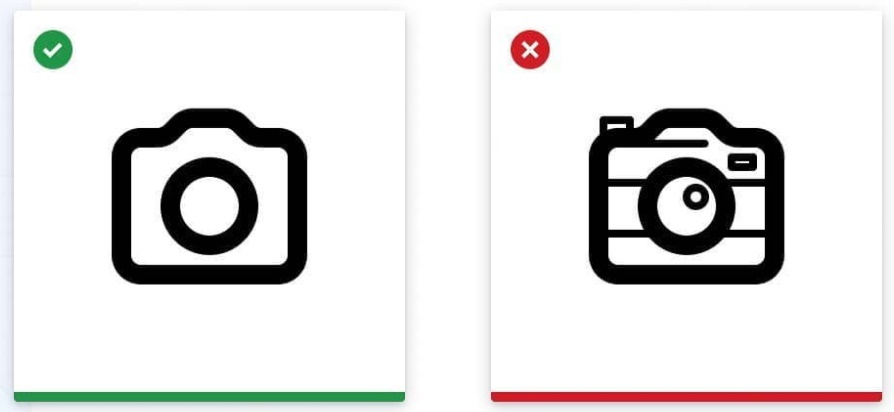
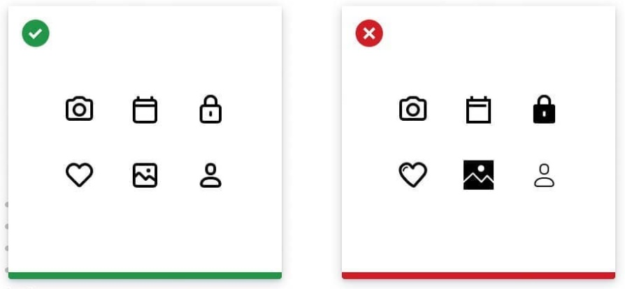
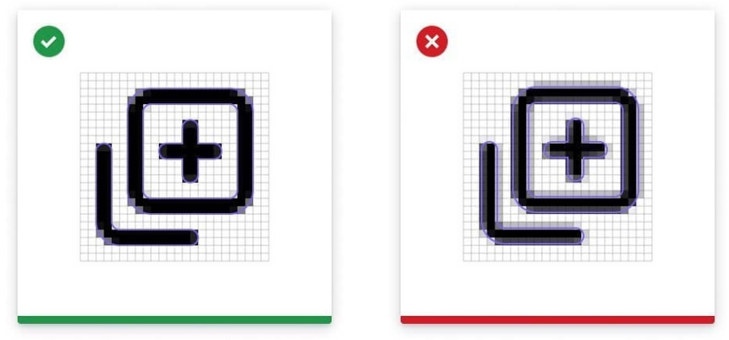
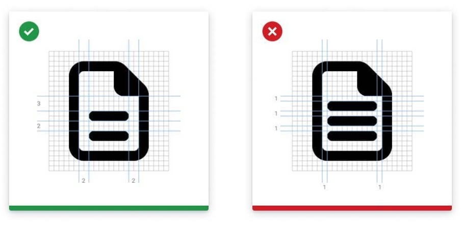
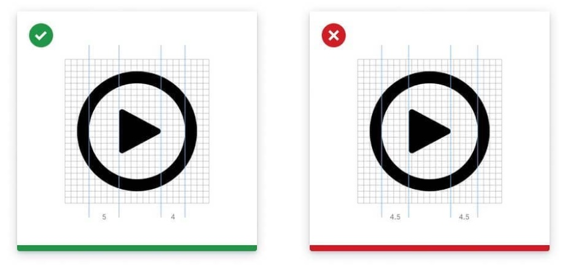

图标是 UI 设计中最基础也是很重要的部分，辅助人们更好的理解功能内容。随着扁平化设计风格的普及，图标的风格越来越简约，看似简单的图形，实际要准确的表达含义，也是需要注意一些方法的。下面是是图标设计的实用技巧。

## 简单

一个图标一个非写实的表现。不需要担心图标不够真实，消除不必要的细节，用基本的形状只保留最基础的部分，让这个图标更容易被理解。

有时候图标会因为有更多细节而传达了更复杂的意思，这反而是样式问题!

## 一致性

在整个图标系统中，您的图标要保持同一种样式来确保图标完美协调。比如同样的形状，填充，描边粗细，尺寸等。要制定好可以被复用的栅格，规范和样式。

如果可以的话，尽可能重新设计这些图标，而不要混入其他不同风格的图标来使用。

## 清晰

设计「完美像素」的图标，特别是在图标非常小的时候。这样图标的描边就可以保持锐利，不会有模糊。注意半像素的情况出现，尽量避免小数点参数。

这也可以帮您保持图标的辨识度，在您等比缩放他们的时候保持清晰。

## 空间

确保您的图标的所有形状有足够的空间。笔画和空间过于狭小会使图标更难被理解。

最少给 2px 的负空间

## 视觉调整

确保您的图标看起来是正确的，适当的调整元素的对齐来达到视觉上的平衡。

不要只关注参数，如果有需要就用上您的眼睛来衡量，轻微移动这些元素。

## 布局规格

所有图标保持同样的尺寸，在图标周围定义一个可调整的内边距范围，尽量让元素设计在这个范围内。不要挤满所有元素。

当图标需要额外控件时可以超出这个内边距范围。
