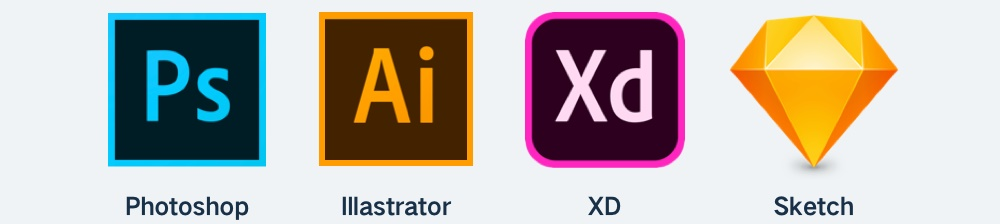

了解了图标的类型，就要开始了解做出这些图标应该使用哪些软件了。通常，UI 主要使用的设计软件包含 PS、AI、Sketch、XD 四款，理论上，它们都包含了图标绘制的功能，下面介绍这四款软件对于图标设计的优劣，以及需要掌握的部分。

<!-- more -->

## Sketch / XD

这两款软件是设计 UI 界面的主力。但大家一定要记得，它们主要的功能是用来完成 UI 界面元素的排版，而不是创作和绘图。

虽然它们都包含路径、钢笔、布尔运算等功能(Sketch 相对 XD 更完善一点)，想要绘制一些非常基础的线性或面性图标时没有问题，但只要涉及到比较复杂的图形，往往就束手无策。

所以，建议新手都不要从这两个软件中入手，而是先掌握 PS 和 AI，后面想要快速实现一些简单的图标时，自然懂得如何使用 Sketch 和 XD。

可以说，PS 和 AI 的应用决定了我们图标设计的上限，而 Sketch 和 XD 是下限，所以，把上限拓展得越高越好。

## Photoshop

PS 是一款无论什么东西都设计得出来的设计软件，但是，它本质上是一款「位图软件」。后续的文章中会提及，在界面中采用矢量格式的图标是最理想的，而 PS 针对矢量的操作并不便捷，比如将矢量图层复制到其它软件中。

实际项目中，会用 PS 设计一些视觉表现相对复杂的图标，例如主体图标、拟物图标、实物图标等等。

绘制图标需要用到的 PS 功能并不太多，需要在前期学习这个软件的过程中加以筛选，重点是以下知识点:

- 路径创建和调整
- 钢笔工具和锚点
- 路径图层
- 布尔运算
- 图层属性

虽然 PS 在实际项目中是用来画复杂的图标，但并不妨碍使用 PS 从最基础的图标开始画起，因为想要熟练掌握上方的知识点，简易的工具图标是最好的磨刀石，之后再学习 AI 的操作，就可以更快的上手。

## Illastrator

AI 也是 UI 设计必学的一款软件，它的功能异常丰富，主要用来设计矢量图形。对比 PS，它有更好的矢量操作支持，对于路径细节的调整上，是最全面最细腻的软件，并且 AI 中的图形还可以直接复制粘贴到其它应用的画布中。

如果掌握了上方提及的 PS 基础，那么学习 AI 也就轻松了不少，其中，AI 设计图标中有三个特殊的功能是需要重点掌握和学习的:

- 形状生成器
- 轮廓化描边
- 路径查找器

## 总结

优先学习 PS、AI 的路径相关功能，而不是 Sketch 和 XD。
