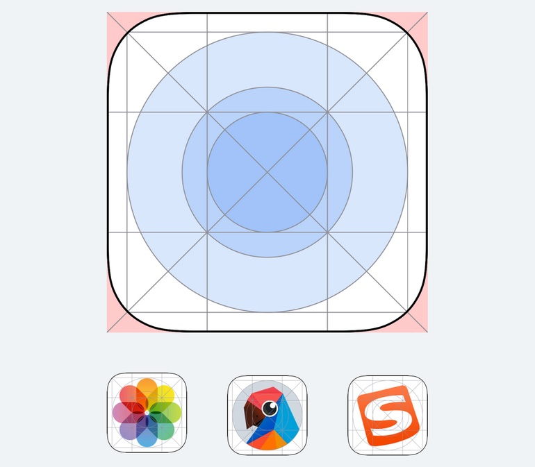

想要在启动图标设计上入门，就要先从规范开始学习，然后了解不同的风格以及对应风格的设计过程。

## 启动图标的设计规范

说到启动图标的规范，首先会想到的，就是 iOS 提供的图标栅格。通过这个栅格，会规范图形的尺寸，以及所处的位置。

这个模板和工具图标的使用方法类似，我们在后面的案例进一步讲解。接着，来说明一个更重要的问题，就是启动图标画布的尺寸。

默认的情况下，我们使用 1024×1024 尺寸来设计启动图标，这个参数在 iOS 和 Android 中都适用。

之所以使用这么大的尺寸，是由屏幕分辨率的差异和使用场景导致的。

第一，在手机硬件中，根据屏幕规格的不同，展示图标的实际像素量也不同，即图标的尺寸会发生改变。

例如在 1x 的屏幕中，图标使用 60x60px；在 2x 的屏幕中，就使用 120x120pt；3x 则是 180×180。

第二，不同设备和显示场景里，应用的图标尺寸也不一样。对于一个真实的项目来说，图标不是只放在手机上运行，无论是 iOS 还是 Android 的 APP 都可以在 PAD 上安装，图标尺寸规格就不同。并且，在网页或者手机应用商店里，也需要展示启动图标，显示的规格和真实应用列表中又不同。

所以，在 iOS 官方的图标模板中，我们会看见里面罗列了非常多的图标尺寸，我们只需要设计第一个 1024 规格的，将这个图标置入到 PS 的智能对象，或者 Sketch 的 Symbol 中，就可以一次性生成所有尺寸，不需要我们自己手动调整各种规格的图标输出。

应该有同学这时候还会产生疑问，模板里的画布就是一个正方形，但是大多数手机的 启动图标使用的是圆角，所以，应该如何制作这个圆角，以及它的相关参数呢?

真实项目中，除非项目的特定要求，只需要提交正方形的图形即可，之后无论是 APP Store，还是多数安卓应用商店，都会「自动」对该图形进行裁切，生成符合自己系统的圆角图标。

如果我们想要设计出正方形图形后预览真实的效果，就可以用我们准备的 PSD 模板，将正方形置入到模板中即可。

在设计已经确认以后，我们就要导出这些图标。因为启动图标有很多拟物的设计或会使用真实的摄影素材，所以应用商店提交的格式会选用位图格式而不是矢量格式，所以导出启动图标，只需要导出对应尺寸的 PNG 即可。

## 启动图标的设计演示

### 图标形式

在一些比较基础的应用类型中，通常会直接使用工具图标的图形设计启动图标。因为基础的 APP 服务大多有表意极其清晰的工具图标与之对应，例如邮箱、计算器、音乐、地图等类型应用，企业往往在使用一些抽象的品牌化图形与表意更清晰的工具图标中选择后者。

工具图标的设计其实很简单，就是在画板中完成两种元素的设计，一个是背景，一个是上方图标。

背景的设计，比较常见的有两种类型，纯色、渐变。而上方图标的设计里，包含的类型就是我们前面讲过的几种常见的工具图标。所以您看，只要将它们组合，就可以很轻松地设计出符合主流特征的启动图标。

所以，如果我们要设计一款笔记应用，那么就可以先画一个线性的笔记图标，然后再将它置入格线模板中确认大小，再分别为它们上色，就可以完成设计了。

### 文字形式

文字形式的设计，背景和上方一样，也只使用纯色和渐变，但这种设计的主要难点在于字体的设计上。

想要放文字，大家首先想到的肯定是直接用字体打进去，但是切记，字体的商业版权问题是不能视而不见的。选择字体前，一定要关注该字体是否是免费的，百度或者官网都可以查询。或者一开始就在免费字库中挑选，如思源黑、思源宋、王汉宗系列等等。

如果觉得直接使用字库文字太没有设计感，那可以选择做一次字体的二次创作，对于新手来说简单一点。即一开始挑选一个合适的字体，然后在 AI 中对该字体进行临摹，再对细节进行重新加工，比如衬线的调整，笔画粗细的调整等等。

比如要设计一个我的应用，那么我可以取「超级帅的 Mr.Hope」的第一个字 ── 超，作为图标上方的文字。然后我选用「方正兰亭大黑」作为基础字形，对它进行重构即可。

最后建议，如果不是一些比较严肃或是传统的题材，尽量不要选用宋体或是楷体进行设计。

### 拟物形式

虽然现在整体设计环境中，拟物已经被扁平取代，但不代表它已经消失，或是在形式上不合理。适当的拟物设计会让我们对应用功能的认识更清晰，且更有趣味性。

还是老惯例，我们从简单的拟物设计入手。目前拟物的领域中，使用最普遍的风格也是新手最容易学习的风格，即「轻拟物」的设计。这种风格需要刻画的细节相对较少，更易于我们掌握，只要能用好渐变即可。

比如，iOS 的官方应用 ── 文件，图标的形式就符合轻拟物的特征。简单分析一遍，即在确定完轮廓后，通过渐变填充来表示物体本身的高光和阴影，并添加投影来制造立体感。

如果要设计一些更复杂的拟物图形，可以通过多做拟物图标的练习会更有帮助。在今天扁平化图形当道的环境中，设计得精良的拟物图标往往可以在满屏的扁平图标中脱颖而出，助于吸引用户启动应用。

## 小结

启动图标的介绍到这里就结束了，新手该掌握的知识点并不多。无论是更好的字体、图案、插画，都已经进入 LOGO 设计的范畴。如果要在这个领域进一步提升，那么针对性训练的效果反而不理想，需要长期积累视觉、图形的整体设计能力。
