设计图标可以划分成三种大类:

- 工具图标
- 装饰图标
- 主体图标

下面将对它们分别进行介绍，以及展示相关的设计类型。

<!-- more -->

## 工具图标

工具图标是在日常讨论中提及最频繁的图标类型，即应用内有明确功能、提示含义的标识。

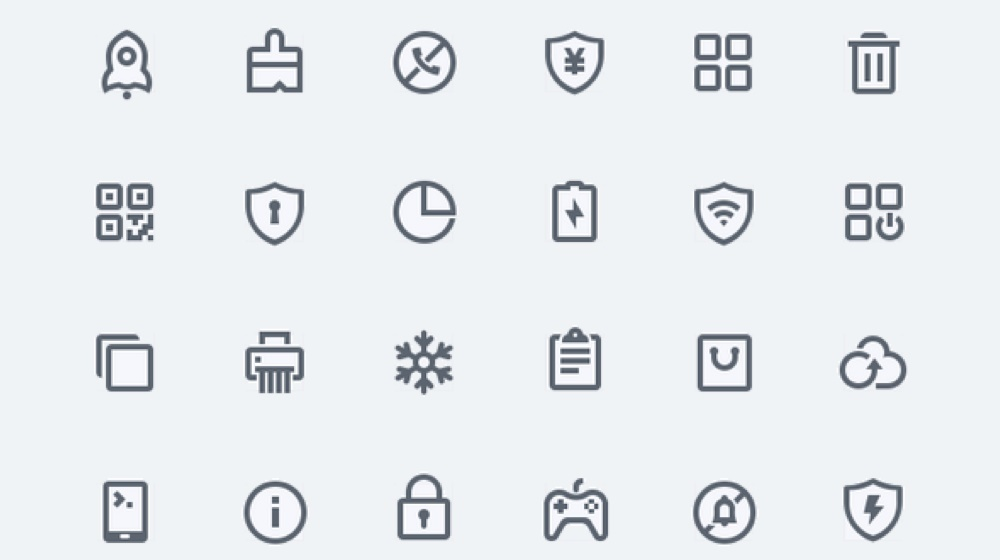

虽然理解起来容易，但是它所包含的设计样式却并不少，可以把它们归纳成线性、面性两个大类，再分别进行细分。

### 线性风格

线性图标，即图形是通过线条的描边轮廓勾勒出来的。多数人对它样式认识的第一反应应该是使用纯色的闭合轮廓，比如上图案例，线性图标的创作空间看似不多，但实际上有非常多的调整空间。

下面我们把它们罗列出来。

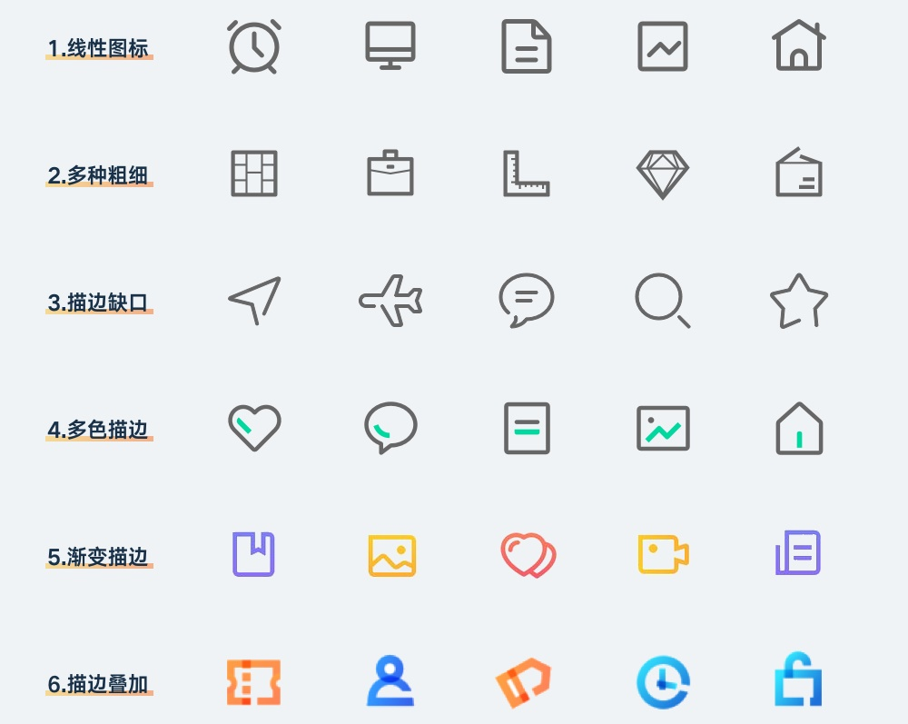

### 面性风格

面性图标，即使用对内容区域进行色彩填充的图标样式。同样，在这类图标中，也不是只能应用纯色的方式进行填充，还有非常多的视觉表现类型。

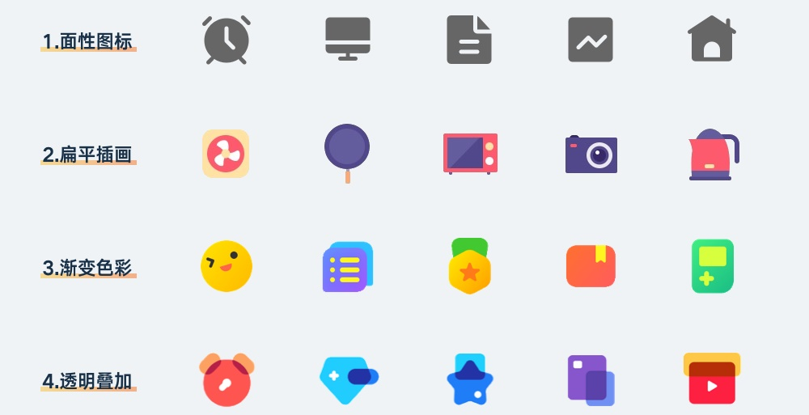

### 混合风格

当然，在设计图标类型的时候，也不一定非线性和面性不可，有一些热衷创造和尝试的设计师，还创作出了混合型的图标，既有线性描边的轮廓，又有色彩填充的区域。常见的样式类型如下:

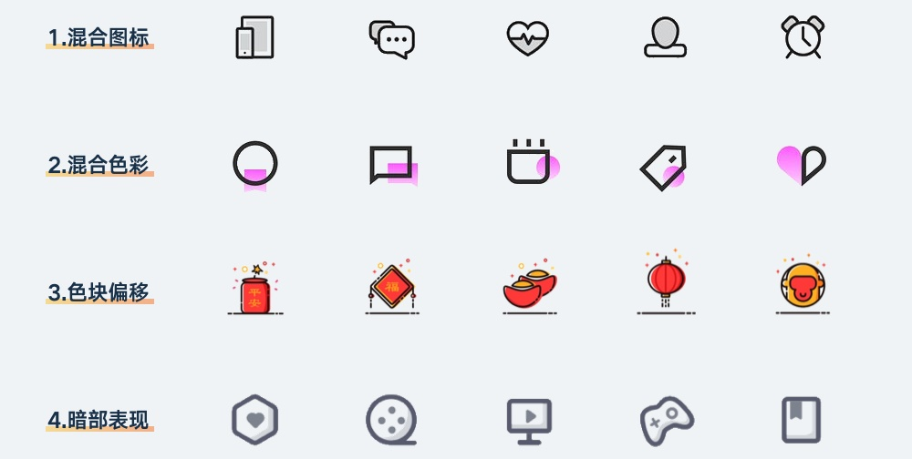

## 装饰图标

和工具图标比起来，装饰图标的视觉性作用更多。对于一些比较复杂的应用来说，过分的简约并不能弥补信息过多的信噪问题，那么要通过丰富视觉体验的方法来增加内容的观赏性，减少一屏内显示内容的数量。

比如在分类列表里，是可以只使用线框和文字把大量内容浓缩到一屏以内，但实际浏览效率并不会增加，而且并不美观。

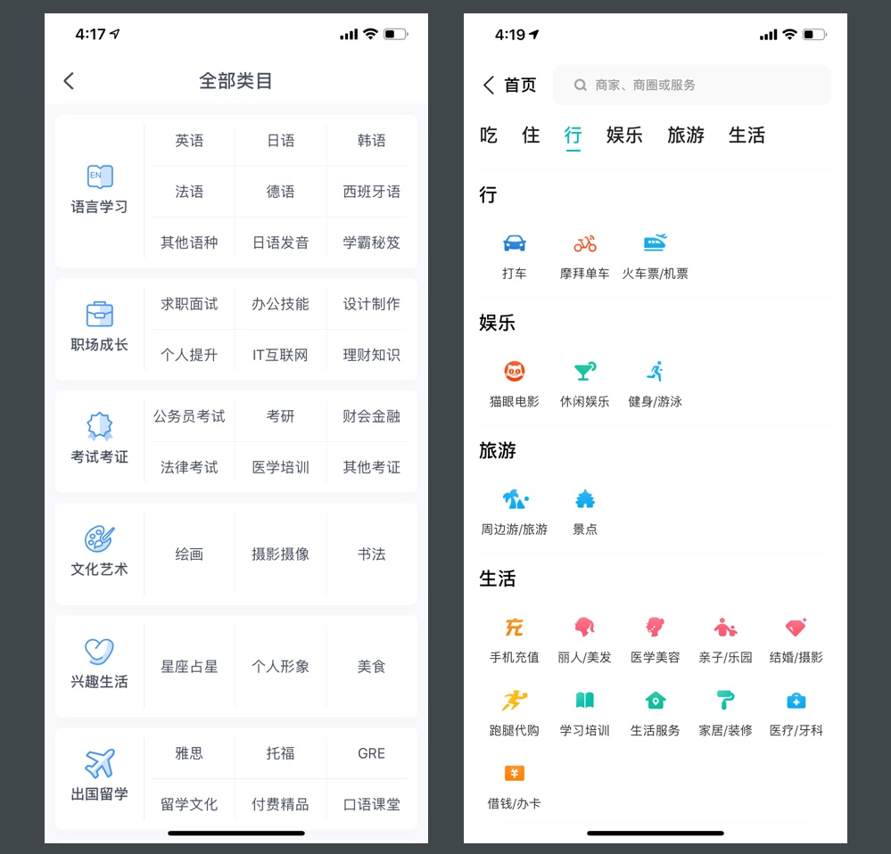

还有就是国内的界面设计环境，会根据运营需求设计进行特殊化处理，尤其在电商领域，首屏的图标都会改成首页风格的样式，增加活动氛围。

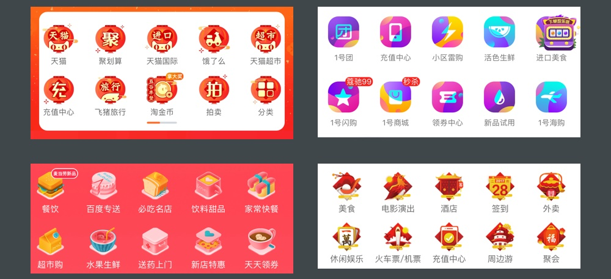

装饰性的图标设计，虽然没有明确的规范该怎么做，效果怎么好怎么来，但最常见的类型有四种，下面分别进行介绍。

### 扁平风格

扁平风格的装饰图标，通常可以理解成是用扁平插画的方式画出来的图标，除了继承扁平的纯色填充特性以外，也比普通图标有更丰富的细节与趣味性。

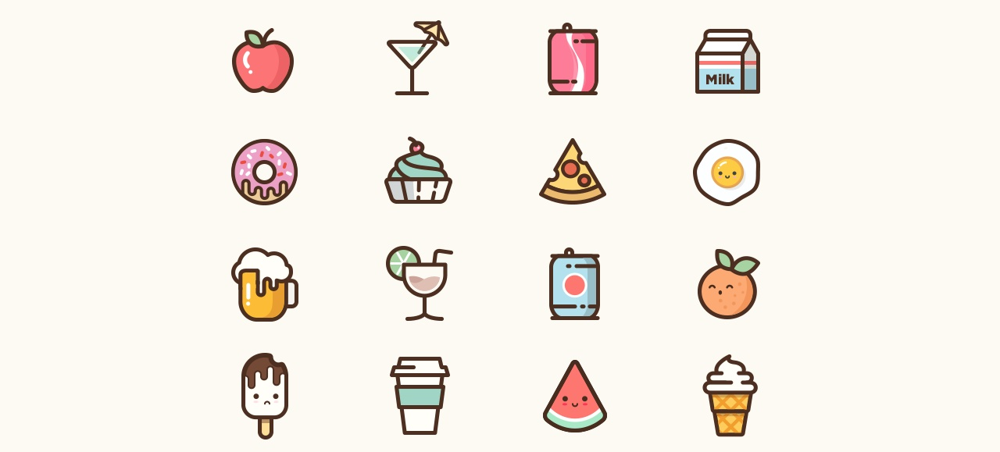

### 拟物风格

拟物风格的图标现在出现的频率越来越高，集中在大型的运营活动中，通常这些活动会通过拟物的方式将头部设计成有故事性的场景，所以自然顶部的相关图标使用拟物的设计形式会更贴合。

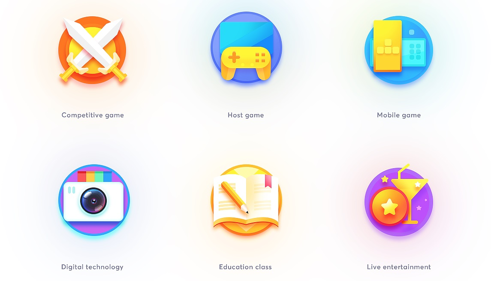

### 2.5D 风格

2.5D 是一种偏卡通、像素画风格的扁平设计类型，在一些非必要的设计环境中，使用 2.5D 会比较容易搭配主流的界面设计风格，有更强的趣味性和层次感。

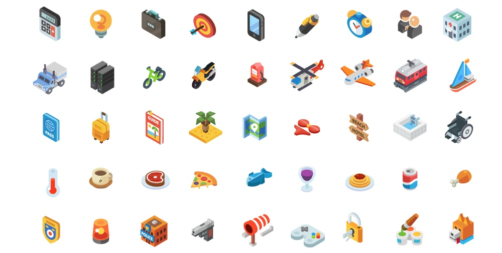

### 炫彩渐变

这是一个拗口的原创名词，找不到更合适的形容，还是觉得浮夸点符合它的气质。这种图标，就是通过一系列非常激进的渐变和撞色实现，通常还会使用彩色的阴影。

使用这样图标的区域，通常都会呈现出一副五彩斑斓的景象，只有在内容非常丰富且用户偏向年轻化的产品中可以使用，是一种非常难驾驭的设计风格。

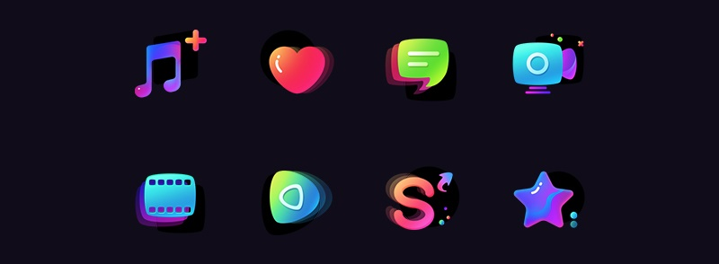

### 实物贴图

采用真实摄影物体的设计风格。它不完全依靠创作和绘制。

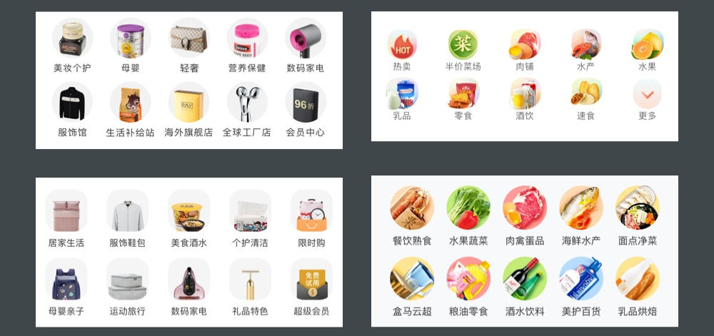

## 主体图标

主体图标的设计比前面两种类型的图标说起来更难，因为它实际上就是把「LOGO 嵌套进系统图标模版」的图标。

除了掌握必要的规范以外，主体图标的主体物设计就是 LOGO 的设计。

### 文字形式

使用了文字作为图标主体物的类型，通常是这类应用本身的品牌 LOGO 就使用了文字，所以这里就把字体照搬过来。

### 图标形式

对于一些偏工具，适合用简单图形传达应用功能的主体图标，就会采取使用工具图标的方式设计。

### 图形图标

图形形式看起来和图标形式很接近，但实际上完全不属于同一类型，之所以它不是图标，是因为这类图标的主体图形是一种经过高度抽象化的标识，传达的是品牌性，而不是图形的含义。

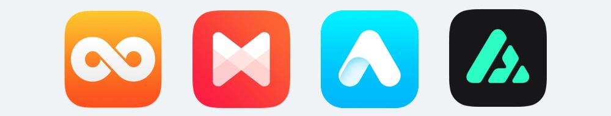

### 插画形式

对于一些比较纯粹的应用，如读本、漫画、幼儿类应用，就热衷于采用卡通形象作为图标的主体进行设计。

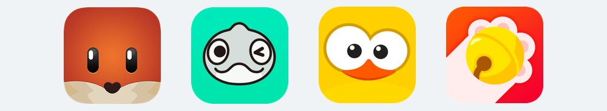

### 拟物形式

虽然现在扁平化的设计占据主导地位，但依旧有很多应用的主体图标是通过拟物的方式设计的。因为对于这些应用来说，拟物设计所传递的信息往往更直观和准确。

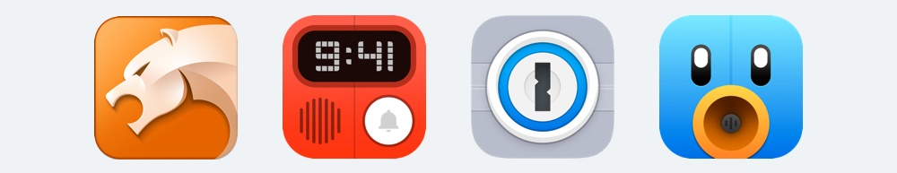

---

当然，还有其它的数之不尽的主体图标设计方式，比如明星大头照、摄影图、游戏原画等，但理解上面这些类型就够了。

前面介绍的三种图标，就是今后在进入 UI 行业设计的内容。虽然图标看起来简单，但可以玩出的花样不少。除了正确设计出图标以外，高低阶的 UI 设计师之间的区别也包含图标设计类型掌握的多寡。

所以，在开始学习前，不要将设计图标的目标局限在最简单的图形绘制上，还有很多有趣的设计形式等待尝试。

## 总结

UI 会涉及的图标类型主要有三种，工具图标、装饰图标、启动图标。

1. 工具图标，是界面中用来传递信息的图形符号，主要包含线性、面性、混合三种设计风格。
1. 装饰图标，是界面中用来提升视觉体验的图形，主要包含扁平、拟物、2.5D、渐变炫彩等设计风格。
1. 启动图标，是用来启动应用的图标，主要包含文字、图标、图形、插画、拟物等设计形式。
