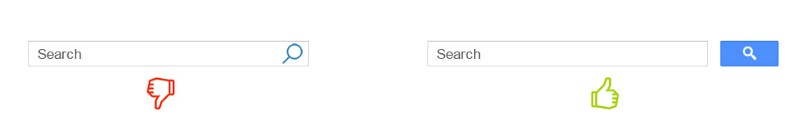

搜索框是我们最常用到的 UI 控件之一，它几乎存在于所有的网站和 APP 当中。许多人认为搜索框不需要设计，因为它似乎就是由两个最简单的元素构成的。在以内容为导向的网站中，搜索框的重要性会相对更明显，用户需要快速又无痛地找到他们想要的内容。而对于设计相对负责的网站而言，这个需求尤其明显。搜索框的可用性设计，是整个设计的关键，也就是如何让用户尽量节省时间，搜到他们想要的内容。

## 使用放大镜图标

时至今日，搜索的概念和放大镜图标之间的关系已经深入人心，根深蒂固了。在日常最常用、最易于识别的几个图标当中，放大镜所带代表的搜索图标就是其中之一。

即使在没有文本标签标识的情况下，用户也能轻松地识别图标的含义。

::: tip

使用最简略直观的放大镜图标，细节越少，越容易识别。

:::

## 显眼的搜索输入框

如果搜索是您的网站或者 APP 的重要功能的话，您应当让搜索框足够显眼，这样的能设计让用户最快发现它的存在。

左边: 搜索功能隐藏在图标之后

显示完整的文本输入框是很重要的，隐藏在按钮背后的输入框会让用户觉得不是那么明显，不容易被快速发现。需要点击之后用户才能看到。

::: tip

由于博客新用户通常会浏览博客的大致内容，而不会有目的性的搜索，所以移动视图下，博客的搜索也采用了这种设计

:::

## 提供搜索按钮

按钮的存在让用户能够明白搜索的触发方式——也就是说通过触发按钮来完成这一操作。

::: tip 有效的建议

本博客由于采用了即时搜索，也就是会实时显示输入的搜索结果，所以并没有设置这个按钮

- 控制搜索按钮的尺寸大小，让用户使用光标可以轻松找到并点击，让触发区域大小合适。
- 让用户可以通过回车键提交搜索，许多用户仍然有通过点击键盘按键来触发搜索的习惯。

:::

## 每页都保留搜索输入框

您应该为用户拥有在每个页面都能立刻进行搜索的权限，如果您的用户在特定的页面找不到他们想要的内容，可以立刻通过搜索获取内容，无论他在网站的哪个地方。

## 让搜索框尽量简单

在您设计搜索框的时候，请尽量让它看起来就是一个搜索框，并且简单易用。可用性研究表明，默认没有显示高级选项的搜索框看起来更加友好，所以，通常情况下给用户提供的搜索框最好不要提供进阶的搜索选项。

## 让搜索框处于用户预期的位置

当用户想要搜索内容的时候还需要花费精力来寻找搜索框，这就非常尴尬了。这意味着搜索框本身就不容易被察觉。

下面这个图表来自 A. Dawn Shaikh 和 Keisi Lenz 的一项研究，它展示出了 142 名被调查者对于网站的搜索框的预期的位置。这项研究表明，网站的左上角和右上角是用户所期待的搜索框的位置，用户在使用 F 型扫视法查看内容的时候，可以轻松找到搜索框。

这份研究还表明，右上角的区域是用户搜寻输入框的首选区域。

因此，将输入框置于顶部靠右或者顶部居中的位置，用户会主动在这个地方寻找搜索框。

::: tip

本博客主题在 Desktop 模式下搜索栏即为居中设计，移动视图下置于右上角

- 在理想情况下，搜索框的设计应当和整个网站的设计风格保持一致，同时在视觉上要略显突出，便于用户发觉它的存在。
- 如果网站的内容足够多，搜索框在设计上显著程度应该越高，如果搜索功能对于您的网站至关重要，那么您应该采用较大的对比度，确保输入框和按钮从背景中脱颖而出。

:::

## 合理的输入框尺寸

输入框太小是最常见的搜索框设计错素，虽然用户可以输入比输入框更长的内容，但是可见的部分往往无法完全可见，这种设计的可用性并不强。这样的输入框可能因为可视范围的限制，促使用户使用短的、不精确的查询方式，因为更长的内容并不适合阅读。如果输入框能够符合用户的常见输入内容的尺寸来进行匹配，那么它的可用性会更强。

根据经验，输入框能够承载的最佳字符数量为 27 个，百分之 90 的搜索内容都在这个长度以内。

小贴士: 建议考虑使用能根据输入长度增长而能变长的输入框，这不仅节省了屏幕空间，而且能够给予用户足够的视觉提示，并快速进入搜索环节。

## 使用自动搜索建议机制

自动建议机制能够帮助用户在输入的过程中，动态地预测正确的查询方向。自动建议并不会加快搜索的过程，但是能够帮助用户构建正确的搜索关键词/内容。普通用户在第一次搜索结果不理想的情况下，很少会继续进行尝试，而自动建议运作顺利的情况下，将会帮助用户更好的搜索。

谷歌搜索在这方面有着丰富的经验，自 2008 年开始，谷歌开始记录用户的搜索记录，并且通过这种方式节省时间，优化结果，创造更为优秀的体验。

::: tip

- 确保您的自动搜索建议是有用的。不当的搜索建议内容可能会混淆和分散用户的注意力。尽量帮助用户更正拼写，识别词根，预测文本，并改进您的工具。
- 当用户开始输入之后，尽快开始给予用户建议，例如在第三个字符之后，为用户开始提供即时的、有价值的建议，降低用户的输入难度和工作量。
- 尽量为用户提供少于 10 个搜索结果，避免信息过载。
- 允许使用键盘进行交互，当用户使用方向键向下滚动到最后的条目之后，继续滚动会跳转到顶部的项目。允许用户使用 Esc 按键推出列表。
- 突出显示输入的信息和建议的信息之间的差异。

:::

## 让用户明白哪些可以搜索到

最好是在输入框中包含示例，这样可以向用户给予建议。如果用户可以输入多个关键词搜索，那么可以像下面的 IMDB 的网站一样给予建议。HTML5 可以轻松的实现在输入框内加入文本占位符。

::: tip

建议的内容不宜过多，否则施加太多认知负荷给用户。

:::
