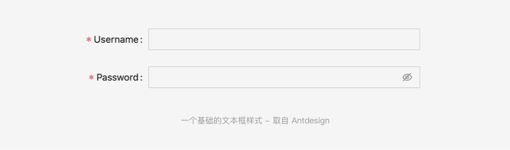
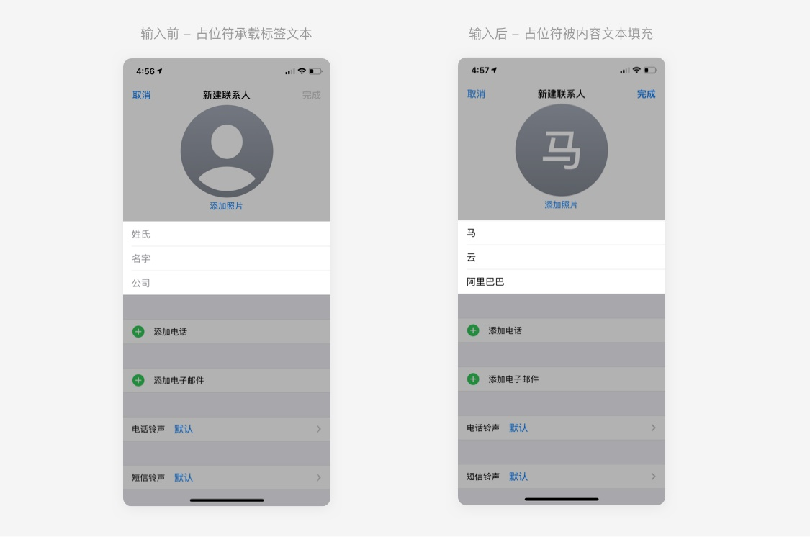
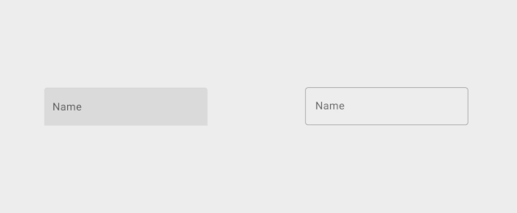

文本框的出现几乎可以追溯到可视化交互诞生的源头，是一个再经典不过的「鼻祖」控件了。我们每天都在和文本框打交道，不论您是产品设计者还是用户。

## 文本框的拆解

文本框(Text Fields)根据 Material Design 指导规范，被拆解为七个部分。分别是:

- 容器(Container)
- 前导图标(Leading icon)
- 标签文本(Label text)
- 输入文本(Input text)
- 尾随图标(Trailing icon)
- 激活指示器(Activation indicator)
- 帮助文本(Helper text)

当然，MD 为我们展示的是已经经过其团队长期摸索之后，基于其平台规范下的标准样式。想要探索文本框的交互演变，我们还是要回溯到文本框最初的模样。

这就是一个文本框最基础的样式了， 一个标签文本+容器，已经基本可以确保向用户传递文本框最直观的信息。

但如今的文本框已经演变出了形形色色的样式和交互形式，究竟 MD 的文本框是如何演变到今天这番样子?

## 基础的文本框布局方式

激励设计师不停探索文本框新的交互形式的根本原因之一，一定包含总让人头疼的排版问题。在解决了基本视觉问题之后，才是思考如何设计文本框来 提升用户的填写和使用效率。

例如前面我们所看到的最基础的文本框样式，如果简单地进行单列布局，自然而然会出现让众多设计师纠结的一个问题: 标签文本究竟应该如何对齐?

如果标签文本采用右对齐，标签文本的长短问题容易导致左侧的视觉隐形边界错乱，用户的规律眼动容易被打乱；

如果标签文本采用左对齐，文本的长短问题又会导致部分较短标签文本与容器间距增大，让用户从左至右浏览的效率降低，并且看起来不够协调。

于是乎文本框的布局方式有了进一步的演变: 标签文本与容器顶端对齐。

顶端对齐的方式使得用户眼动变得十分规律，竖直向下浏览可以便捷地理解标签文本并进行填写，文本的长短问题不再成为干扰设计师进行排版的一个纠结点。

但纵向布局的的方式只是把问题迁移到了另一个维度，那就是在表单数据量过多时，纵向布局会使得纵向空间耗损增加，用户需要不停地滑动页面才能实现表单的完整填写。

所以，文本框的布局需要多方位评估标签文本长度、表单数据量等问题，才能对具体场景进行有效设计。

## 文本框的改良

当文本框横向布局或是纵向布局都很难解决具体场景问题的时候，更新颖的文本框交互形式就出现了。

最初的演变形式是众多的应用开始采用前导图标来替代标签文本，使用图标可以有效地解决标签文本导致的排版错落问题。

这种方案在轻量表单中较为常见，一般都是在表单内容少、用户对于场景的熟悉度较高的情景当中(例如登录场景)。

因为每个用户对于图标的认知性存在差异，在生疏场景或表单内容过多的情况下，图标容易导致用户对文本框信息产生更多的认知成本。所以用图标来代替标签文本的普适性其实并不高。

于是后来 iOS 人机交互规范 和 MD 规范 都给设计师提出了一条指导建议: 当占位符字段中不包含必要内容时，可以合理地使用占位符来承载标签文本。

例如 iOS 通讯录新增联系人，就采用了占位符承载标签文本的方式。

但这种形式同样也存在一个弊端: 用户一旦输入内容之后，占位符就被内容文本填充覆盖了，有时用户会忘记所填写的信息是关于什么内容，必须要清空文本进行重新确认。对于表单内容繁多或重要内容需要谨慎填写的场景，这样的交互其实还是有一些不妥。

于是乎，类似 MD 的指导规范下这样普适性较高的文本框形式就诞生了。采用占位符承载标签文本，并且在用户填写信息时，标签文本始终可见，由占位符转移到文本框顶部。

这一文本框交互形式的诞生，不论是对于排版空间的节省、遵循用户眼动习惯、微动效提升文本框趣味性等方面，都得到了一定提升。并且许多应用开始进行借鉴效仿。

其实像以上这种巧用占位符的场景已经越来越常见了，占位符已经不再仅仅用来承载无用信息或提示性信息，也可以用于承载 默认值，帮助用户自动填充， 提高用户填写信息的效率(例如手游当中，创建账号时系统帮玩家默认填充一个可用昵称)。

但填充默认值的手法也不仅仅局限于提升用户体验和填写效率，甚至也被运用到了一些商业场景中。

例如淘宝、京东等电商平台，将商品名称作为占位符填充在搜索栏中，一方面给所推荐商品增加了曝光；另一方面，在用户直接点击搜索时，将会以当前占位符内容进行搜索，达到为所推荐商品引流的效果。

## 合理的反馈

合理的反馈机制对于提升用户填写文本框效率也起着重要的作用，MD 规范中的帮助文本不仅仅是告诉设计者可以用于指导用户该如何正确填写文本框信息，也为反馈提示提供了展示空间。

MD 的反馈状态可以归纳为以下几种:

在这里我大概总结了一下文本框的负反馈提示信息，希望在您设计表单的时候，能够帮助到您对负反馈提示状态进行走查(可能不全，欢迎补充):

- 内容是否为空(例: 必填项不能为空)
- 二次确认内容是否一致(例: 确认密码与首次输入不一致)
- 内容是否合规 (例: 昵称中包含不文明词语)
- 内容格式是否合规(例: 昵称中不能包含特殊字符)
- 内容长度是否合规(例: 手机号输入不足 11 位)
- 内容的是否符合唯一性(例: 验证码输入错误)

及时给予用户负反馈，可以让用户清晰地排查所发生的错误。但交互设计讲究「以人为本」，在某些场景中，当用户所填写的信息是合理的，及时地展示 正向反馈也是有必要的。

例如，部分应用在用户创建账号的场景中，当用户输入账号信息后，系统将立刻检索用户的账号是否已存在在当前数据库中，避免用户忘记已创建过该账号而进行重复创建的徒劳步骤。

所以不要狭隘地认为 MD 所给到的帮助文本只能用于「批评」用户(负反馈)， 当用户做了正确的事时，也应该适当地激励用户，这也正符合了尼尔森可见性原则。
