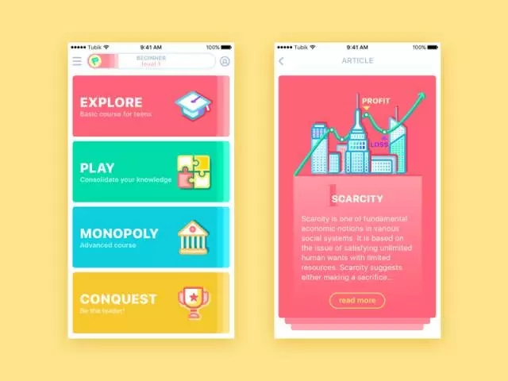
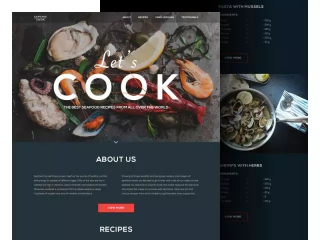
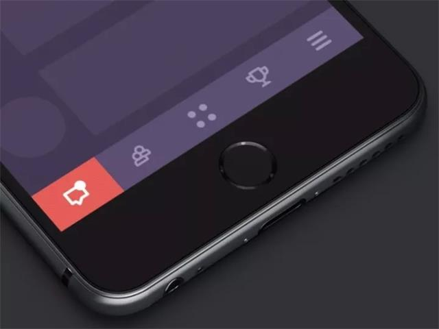
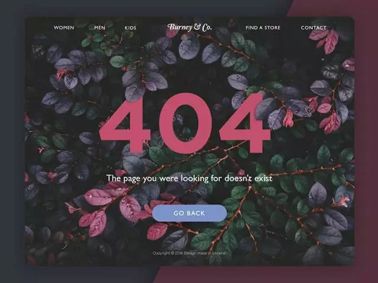
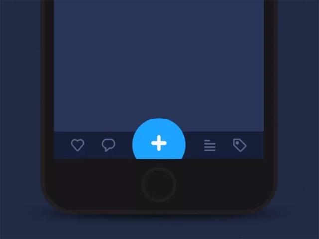
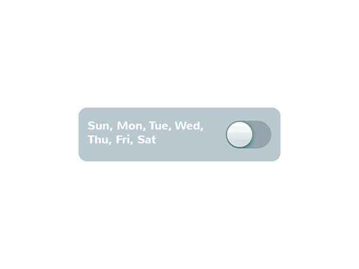
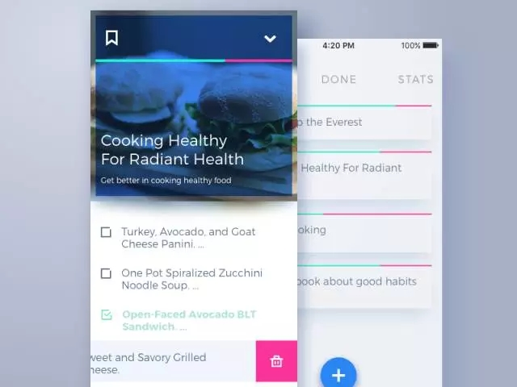

其实网页或者 App 中的导航(Navigation)这个概念远不止我们熟悉的导航栏，而是一个更加广的交互概念: 引导用户和产品进行有效的交互，实现用户的目标。本文将详细地介绍界面的导航设计。

一个网页或 App 产品要想有很好的可用性(usability)，需要做好的最基本的一点是导航的设计或者说引导用户的设计。如果用户在使用一个网站或者 App 的时候找不到自己的处在什么位置或者该怎么去到想要的页面，那么视觉效果再怎么有创意或者抓人眼球都无法弥补产品的缺陷。无论您的产品想满足用户什么需求，让用户知道产品当下的状态和每一步操作之后的结果是对用户最基本的尊重。

## 导航

首先，让我们弄清楚导航这个概念。最基本的含义就是在我们的现实世界中，当我们从一个地方到另一个地方，需要一些引导和指示。英文中 Navigation 这个词来源于拉丁文，原意就是: 操纵船只在海上航行。所以导航就是能够帮助我们到达目的地的行为。导航的其他意思都是建立在这个原意的基础上。

所以回到 UX／UI 设计上，导航毫无疑问是可用性的一个要点。它可以定义为一系列引导用户成功地与产品互动并且实现他们目标的动作组合或者技巧组合。用户带着他们的期望和目标来使用您的网站或者产品，作为设计师的您需要给他们提供实现他们目标的最好操作流程。因此当您的导航设计得非常高效，用户体验能得到极大的提升。

界面的导航(Navigation)是用户体验设计的核心之一。毫无疑问，如果您看不到路, 您就去不了您的目的地。用户现在正面对着越来越多的网站和 APP 产品。越来越多的选择会让用户期望这些产品具备符合他们使用习惯的导航设计。

在您刚开始设计您的界面时，就要思考怎么设计一个有效的无缝衔接的导航。通过一些可交互的元素，比如按钮(buttons)，开关(switches)，链接(links)，标签(tabs)，条(bas)，菜单(menus)，区域(fields)，让用户在不同的界面之间进行切换。

工作室的设计思路是，在界面设计的早期就全面地思考导航的设计，包括界面的布局，页面间如何切换，导航元素的放置和具体功能。并且通过低保真原型来进行验证，保证用户能清楚地理解所有重要的操作。如果跳过这一步，设计将有巨大的风险，其他事情有可能到头来都白干了。所以无论，对用户还是客户还是设计团队来讲，做好这最基础的部分是非常有好处的。

## 菜单(Menu)

菜单是我们最熟悉的具备导航功能的元素，它向用户展示了界面的所有重要选项。基本上，它可以是用动词命名的一系列指令，用户可以用它来指示系统做出动作，像保存，删除等；它也可以是一个用名词命名的目录，用来代表不同内容的集合。

在界面设计中菜单可以放在不同的位置(侧边菜单，顶部菜单，底部菜单等)，拥有不同的交互和视觉形式(下拉菜单，上拉菜单，滑动菜单等)。要想设计好菜单的位置、交互和视觉形式，设计师需要经过全面的用户调查，包括目标用户的预期和要求、接受能力和使用情境。好的菜单设计能让用户更快地实现他们的目标，为用户体验打下坚实的基础。

博客的界面设计，采用了侧边菜单以及目录的形式，文字直接说明内容，再加上图标来做为辅助的视觉说明。

这个 UI 概念设计的例子很好的运用了颜色作为标记，这是一种很有效的导航技巧: 每个分类的背景色使用了和目录相同的的颜色，这样目录和内容有着非常强的相关性，用户能自然地将他们联系起来。

## 行为召唤(CTA)

CTA 是用户行为召唤的简称(call to action)。CTA 简单来说就是指设计师通过设计，刺激用户去做出一些行动。相应的，CTA 元素就是指那些能刺激用户做出行动的交互元素。典型的 CTA 元素是按钮，标签或者链接。

不管在什么界面，CTA 元素都是高效的交互行为的核心，极大的关系到产品的可用性和导航有效性。如果 CTA 元素的设计不到位的话，用户会产生困惑并且得费劲地去尝试。产品的转化率和用户体验都会大打折扣。这就是为什么 CTA 元素特别值得注意。无论什么样的界面，它都必须是最瞩目的元素之一，用来直接地告诉用户怎么用这个产品。

一些 CTA 元素直接用图标形式而没有任何文字说明，但只适用于大家都熟知其含义的图标，比如听筒图标和信封图标。上图这个例子中，这个听筒图标就是这个界面中一个焦点，是一个典型的 CTA 元素，引导用户快速地实现他们的目标。不需要任何文字说明，用户也能懂点击这个图标的结果。

但是，如果一个图标的含义不是那么明显或者可能造成误解，最好还是加上文字说明。

上面这个例子是一个关于制作海鲜的网站的着陆页(Landing page)。页面的标题 let’s cook 还有食材照片是一个 CTA，但不是一个可交互的 CTA。可交互的 CTA 是下面这个红色按钮，用户点击这个按钮能看到更多关于不同主题和菜谱的信息。抓人眼球的颜色强调了页面的视觉层级关系，把用户的注意力拉到关键的交互区域中。

## 条(Bar)

条(Bar)指的是界面中一组用户可以点击的元素，用来快速与产品进行互动，或者还能让用户知道事件的进程。

### 标签条(Bar)

最基本的条是标签条(Tab bars)，常出现在 APP 界面的底部，让用户能在 APP 的不同模块间快速切换。

### 载入条(Loading bar)

载入条是用来告知某个动作的进展，用户可以通过时间、百分比或者其他信息了解整个过程。

::: tip

比如本博客在跳转新页面的时候导航栏下方就会出现载入条

:::

### 进度条(Progress bar)

给用户提供反馈，让他们了解事件的进度，比如说计划的事情完成了多少。

::: tip

最常见的就是音乐和视频 APP

:::

## 按钮(Button)

按钮应该是用得最多的元素了。按钮能让用户在对系统发出指令后得到恰当的反馈。用户通过按钮对系统下命令，跟系统进行交互从而实现他们某个目标，比如发送邮件，买一个东西，下载文件，播放音乐等等这样的指令。按钮之所以那么的常用和对用户那么友好，是因为按钮很好地模仿了人和真实世界里跟物品的交互。

现如今的 UI 按钮有不计其数的设计样式，能满足很多的设计需求。按钮典型的用途是表明这个地方是可点击，因此需要具有非常高的视觉识别，有着特定的形状还有文字说明它能实现什么动作。设计师通常需要花不少时间好好考虑怎么让按钮很好地融合界面的风格，同时又能在视觉上跳脱出来。

---

以下是在 APP 和网页设计中常用的几种具备附加功能的按钮。

### 汉堡按钮

汉堡按钮隐藏着一个菜单。当用户点击他们的时候，能把菜单调出来。有这个名字是因为它是由三条水平线组成的，看起来就像是汉堡的形式。它是一个典型的交互元素，也是颇具争议的元素。

大多数用户知道点击这个按钮能展开一个菜单，所以不需要额外的说明。汉堡菜单极大地节省了界面的空间，能让界面看起来更简洁，也为其他重要的界面元素腾出了必要的空间。它同时非常适合响应式设计，通过隐藏菜单让整个设计更统一，界面能在不同设备间保持一致。尽管它因为一些缺点而饱受争议，但因为这极大的好处，它目前仍然被广泛的使用。关于这个元素的主要诟病是，对于一些对界面不太熟悉的用户来说，这个比较抽象的设计元素可能会让他们产生困惑。所以，在决定使用汉堡菜单前，应该调查一下目标用户的接受程度和他们的需求。

::: tip

我的博客在移动视图下左上角就应用了汉堡按钮

:::

### 加号按钮(Plus button)

一般通过这个按钮，用户可以实现添加某个内容的动作，比如添加新的联系人，状态，笔记，位置等所有用户在产品里能做的基本动作。有时候，点击这个按钮会出现新的窗口。有时候还会出现一些选项供用户进行选择添加什么内容，这取决于是什么产品。

上面这个例子就是用户在点击加号按钮后出现了可以选择添加的内容(图片，视频，文字)，在选择了之后才会弹出添加内容的窗口。尽管这个操作可能增加一些额外的交互动作，但因为给予了用户选择空间，所以还是对用户很友好的一种设计。

### 分享按钮(Share Button)

分享按钮顾名思义就是能让用户把内容分享到他们的社交平台账号上。大多数情况下，这个按钮都是用社交平台的 Logo 作为视觉形象，这样非常易于识别和认知。

::: tip

比如 inNENU 小程序大部分页面都会在右下角展示分享浮窗

:::

## 开关(Switch)

同样，这也是一个用户非常好理解的元素，在界面中用得也非常多。因为它很好地模仿了现实世界里人们熟悉的开关概念。关于这个元素的设计，特别要注意的是开和关的状态在视觉上要差别非常明显。这样能避免用户花时间去研究怎样是开怎样是关。很多种的形式对比或者切换动画都可以解决这个问题，从而设计出很好的用户体验。

这个案例是来自一款闹钟应用 Toonie。动画效果让交互变得更流畅和自然，同时整个控件颜色的改变和滑动元素形态的变化让用户能够轻易地识别出开关的状态。如果您想了解整个 App 的案例研究，可以到来源查看。

::: tip

我的主题 vuepress-theme-hope 也有一款很棒的主题模式切换开关，需将 `darkmode` 设置为 `'switch'` 即可查看

:::

## 选择器(Picker)

也很好理解，就是让用户在一些选项里选出目标选项。通常包含一个可滑动的列表，上面是一列数值，比如小时，分钟，日期，度量，币种等等。通过滑动列表，用户可以选定想要的数值。这个元素广泛地应用在有时间设定这个功能的界面设计上。

## 复选框(Checkbox)

复选框是可以用来同时标记多个特定的内容。同样的，也是借用了我们在现实世界里熟悉的概念。我们在考试的时候，或者填调查问卷的时候会在选项前的小方框里涂上颜色作为选中的标记。和开关一样，复选框同样用得很多，主要在设置页面设计里。不过，复选框还有另外一个用得比较多的地方，那就是含有任务管理，待办事项，时间记录等类似功能的 App 或者网页。

上面这个是一个待办事项 App 的概念设计。用户点击复选框后，表示这个内容已经完成。字体变粗的同时颜色发生了改变，这样就非常明显地把这个已完成的任务和其他未完成的任务区分开来。

## 图标(Icons)

图标可以定义为一个象征着某个概念或物体的视觉形象，有着加强与受众沟通的目的。会和文字结合一起使用，将想要传达给受众的信息表现出来。在界面设计中，图标通常是象形符号或表意文字，对可用性和成功的人机交互有重要意义 。

毫无疑问，图标的其中一个重要作用是可以有效地替代文字描述。因为比起文字，用户对图片的理解速度更快，所以这个特点能极大提升用户体验，增强产品的导航和对用户的引导。但是，需要注意，即使是轻微的歧义或者误解都会导致糟糕的用户体验。所以在设计图标的时候要做必要的测试，根据目标用户平衡好文字和图标的使用。最有效的方式是同时使用图标和文字，这样大部分用户都不会有问题。电商 APP 或者网站最常使用这样的形式来给用户足够的信息，让他们能轻松快速地浏览。

---

根据图标的功能，我们可以将它们分为一下几类:

### 交互式图标(interactive icons)

这类图标具备交互功能。他们是可点击的，能回应用户的要求，触发图标代表的动作。这种图标告知用户按钮、控件或者其他界面交互元素的功能或者特点。在大多数情况下，这类图标的意义明确，不需要文字辅助说明。

### 说明性图标(clarifying icons)

起到说明作用的图标，设计师用它来表示某一个特点或者内容的种类。它有时候不属于界面布局的元素或者并不具备直接的交互功能。经常和文字结合使用。

### 娱乐性和装饰性图标(entertaining and decorative icons)

这类图标注重抓人眼球的视觉效果并非功能，通常用在节日或者特别款的场景。他们能有效地吸引用户的注意力，增强视觉冲击力。

复活节和春天主题的图标:

### APP 图标(app icons)

在各个平台上可交互的品牌标志，展示品牌和产品的形象。最常见的就是我们手机界面上每一个 App 的图标，上面通常是品牌和产品的 Logo。

### 网页图标(favicons)

就是我们经常在网址栏或者书签里看到的 URL 前面的那个小图标，也是代表着产品或者品牌的形象。能让用户在浏览网页时给他们快速的视觉提示。

## 搜索区域(Search Field)

搜索区域又常常被称作搜索框(search box)或者搜索条(search bar)，代表着用户可以在这个区域内输入想要搜索的内容。它是那些有着很多内容的网站或 APP 的核心导航元素，像博客，电商，新闻等产品。设计得好的搜索框能让用户轻松地找到想要的信息。因为它能帮助用户省去很多时间和精力，所以它是一个对用户特别友好的界面元素。

它的设计形式有很多种，可以是标签的形态，也可以是引导输入的一条线或者简单的一个搜索图标。大多数情况下搜索框的图标是一个放大镜的样式。基本上所有的用户都懂得这个图标的含义，所以能实现非常直观的导航设计。想要在这个图标上做文章的话，要好好测试一下，因为改得不好的话会严重影响交互和界面的可用性。搜索框还可以加入提供候选项的下拉菜单或者自动填补内容的功能。

另外需要注意的一点是搜索框控件在界面中的位置。在网页设计中，搜索框经常出现在网页的顶部。这是一个很恰当的设计，因为通常网页的顶部区域具有很高的可见性，用户打开网页就看到了，不需要再花时间去找到这个控件。举个反面例子，如果一个电商网站因为搜索框的设计有问题，导致用户没办法快速方便地找到想买的东西，网站销售表现会受到极大的影响。因为现在很多网站都将搜索框放在网页的顶部，所以用户也养成了在那里找到搜索框的习惯。

至于 App 界面的话，要视具体情况而定，设计师可能面临更多的限制。如果是一个有着大量内容的 APP，而且搜索是核心功能之一的话，那么一般放在一个显眼的标签条(tab bar)上。如果搜索并不是核心功能，那么可以把它藏到菜单里或者只在需要的用到的地方显示或者时刻显示出来。

## 标签(Tag)

标签是一个标有关键词的可交互元素。标签其实是给用户提供快速通道的元数据，用户可以通过它快速导航到与关键词相关的所有内容。除了网页或者 App 本身带有的标签，在很多情况下用户也可以自己创建标签。

标签这个界面元素被广泛地应用在用户原创内容平台(UGC)的界面设计里。当用户上传图片、状态到社交网络的时候，可以加上关键词作为标签。通过点击某个标签，能切换到带着这个标签的所有内容的页面。标签是友好的搜索引擎优化(SEO-friendly)技巧，能提高用户搜索内容的成功率。

对于一些内容站点来说，当用户想要下载图片时，可以输入描述图片的关键词作为标签。通过这样的形式帮助用户有效地找到想要的图片。我们还可以注意到，输入框内加入了引导用户进行操作的说明，这样更进一步地提高了产品的可用性。设计的细节真的很重要。总而言之，标签是一种用户可以自行创造的导航元素，拉近了界面和目标用户之间的距离。

## 总结

全面地设计好整个界面的导航不是一件容易的事，需要一些心理学、交互模式、用户测试的基础知识，还需要在项目的早期思考清楚网站或者 App 的信息架构。但是做好这一点的话，能够让您的产品很好地帮助用户解决他们的问题，给优秀的用户体验打下坚实的基础，让他们对您的产品产生越来越大的粘性。
