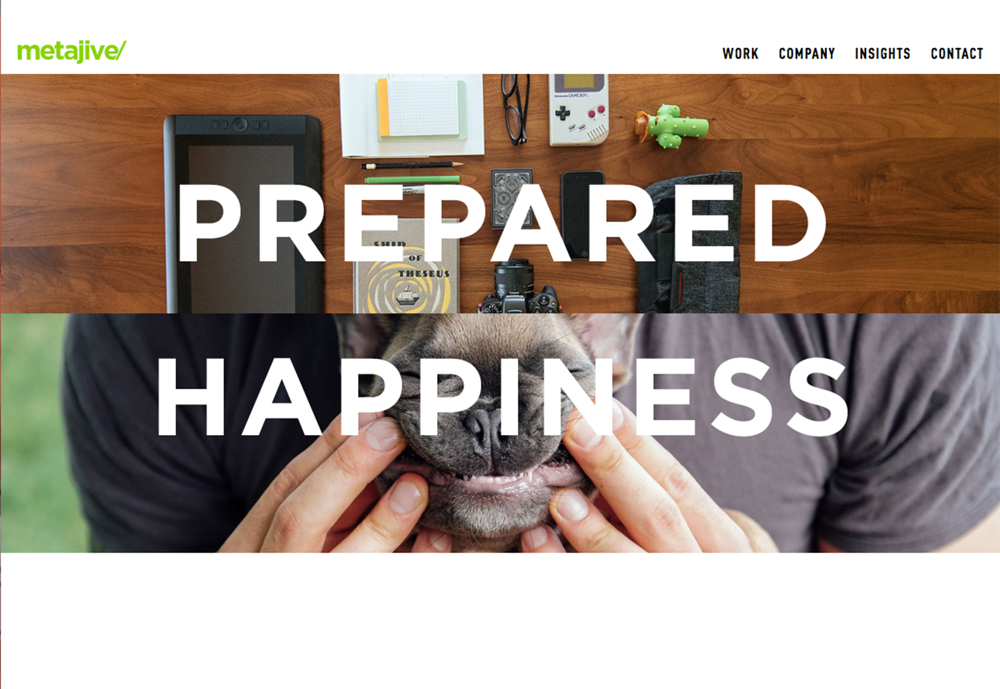
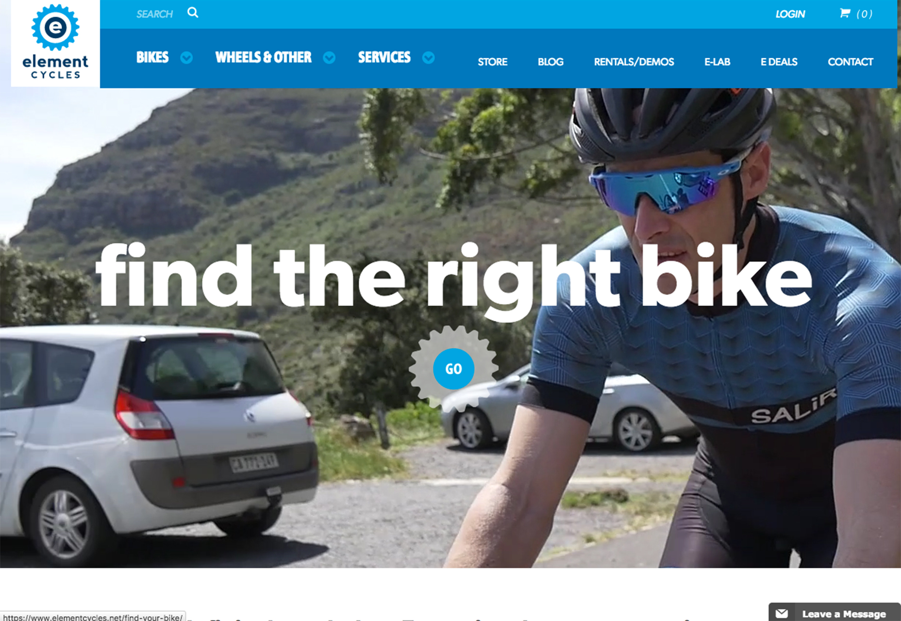

评判导航菜单的设计好坏有多种不同的维度，由于它太过常用，它的好坏并没有得到更多重视。实际上，导航作为网站设计的一个基础组成部分，对于可用性的要求并不低。以下是一些常见的设计技巧。

## 超大菜单栏

即使许多设计师不喜欢这样的设计，而且从美学的角度上它也是反智的，但是对于许多客户而言，它依然是一个客户反响很好的设计方案。但是这样的设计对于用户可能还是有一些困扰，并且没有提供真正有用的功能。

只有极少数的电商类网站能够真正适合使用超大导航栏的，因为他们确实需要足够的空间来承载大量的导航栏目。不过过大的导航栏可能还是存在一些可用性问题的。

通常，超大的导航栏存在的主要原因在于，导航栏项目很多难以缩减。这真是一个艰难的决定。对于网站的运营者而言需要仔细考量这件事情，或者通过搜集来的数据来做设计决策的论据。对于特定的内容，许多用户还是倾向于使用搜索来获取，这是毋庸置疑的。

## 加入显眼的搜索框

用户常常使用搜索来筛选信息，更快更直接地获取重要的信息，所以，搜索框应该突出展示。它应该出现在每个页面上，应该和主导航栏一起存在，应该够大也易于访问。

强大的搜索引擎是让用户留存的重要影响因素，当搜索引擎的可用性较差的时候，网站的可访问性会受到影响。网站的页面一次展示的内容是相当有限的，一旦用户在页面中无法直接获取想要的内容，下一步就是考虑借助搜索引擎来达成目标了。

用户对于搜索的需求是刚性的，不要试图打破这种客观存在的规律，尽量让搜索融入到主导航当中来吧。(确保输入框足够大，可以输入，并且足以一次显示常见的搜索内容)

## 限制导航内条目数量

作为设计师，您需要预测用户经常访问的内容，将最重要、最常用到的条目置于导航栏当中。值得一提的是，几乎每个网站的导航中都会包含搜索、关于我们、首页，而电商类网站则通常会包含购物车、购买的按钮。

但是无论如何，永远将最关键、最重要的导航类目让用户看到，才是导航所应该做到的事情，换句话来说，就是关键内容驱动导航分类。

## 更聪明的导航机制

好的导航设计，能让用户能在页面和页面之间合理快速切换，网站不同的内容和功能之间是有一定的自然逻辑的，这个自然逻辑可以作为导航设计的一个重要参考。

在这个用户体验高度个性化的时代，网页导航的玩法可以更加多样。以 Amazon 为例，当您登录了之后，会发现导航开始围绕着您的信息进行了调整，导航栏从通用的条目变为更贴近您的个人情况的样式，其中包括最近的购买记录，信用额度和 Amazon 的服务信息等。

## 正确地排布导航内的条目

导航内的元素的排布顺序和条目内容同样重要。导航栏两头的条目是最引人注意的，并且也通常是用户点击最多的，所以作为设计者，您需要特别注意这些条目的设计。

对于这一点，还有不少科学研究和理论支持。比如，序列位置效应指的就是人会更容易记住列表的开头和结尾的条目。新近效应说的是用户更容易记住最新看到的条目，而首位效应说的是，相比于列表中间的内容，用户更容易记住列表开头的几个条目。

## 长滚动页面上使用悬浮导航

对于长滚动页面而言，导航设计是否可靠是一件颇为重要的事情，无论导航是在顶部、侧边栏还是在底部，它最好能够悬浮置顶，不论用户滚动到哪个地方都时刻存在于界面上。让用户尽量轻松自然地同您的网站进行交互，而不需要费力。交互越是方便，用户便越是会在您的网站中四处探索，自然而然的，用户在网站中停留的时间就越长。

::: tip

比如我博客的导航栏就是一个悬浮导航，确保用户可以随时接触到菜单(移动端)和导航栏与搜索框(PC 端)。

:::

## 不要隐藏导航

超小的汉堡图标，隐藏在页脚、不显眼的链接，或者在长滚动页面中时隐时现的悬浮菜单，都会让用户觉得难以掌控。这些“躲闪”的导航元素让用户难以与之进行交互。相反，时刻存在的导航让用户会更加安心，让用户时刻都拥有离开、跳转的安全通道。

## 使用描述性的标签文本

从导航标签到图标，UI 界面中每个交互元素都应该明确的指引用户，告诉他们点击之后会发生什么。像放大镜、购物车这样的拥有普遍认知的图标，应该尽量多用。

导航栏中每个条目都会有个文本标签，它们会告诉用户这个链接中所包含的内容。这个时候要尽量注意不要使用太过宽泛的描述，比如“服务”或者“产品”，尽量用更精准的描述。

## 尝试全页面导航

导航这件事玩法有很多，如果您真的想做的更醒目一些，不妨采用全页面式的导航，绝对不会让用户错过。

对于作品集和相对较小的实验性网站，这种非常规的设计有时候能出奇效。

## 垂直导航

垂直导航设计也是目前越来越流行的设计之一。最常见的是垂直导航，是侧边栏导航，它和许多软件的 UI 设计不谋而合。

侧边栏导航对于如今的许多网站是个合理的选择，尤其是诸如长滚动式的页面。侧边栏导航通常为常驻式的，让用户可以随时定位，快速跳转，并且其中所能承载的元素相对比顶部导航更多。垂直导航尤其要注意条目之间的空间间隔。
