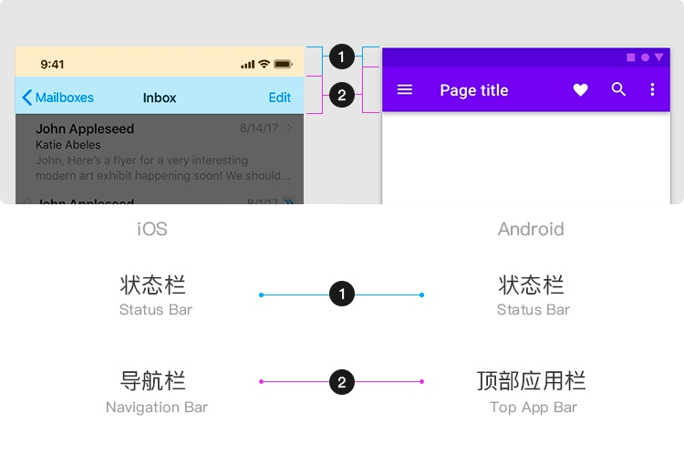
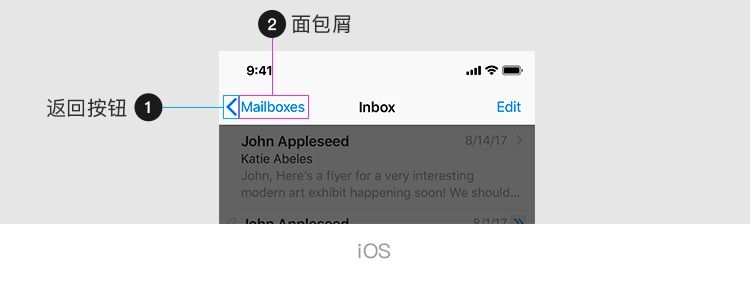
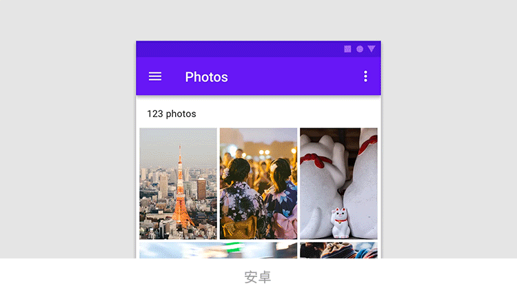
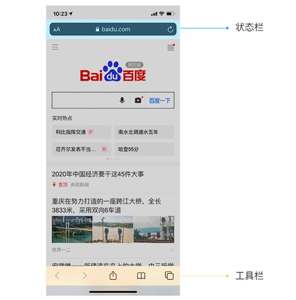
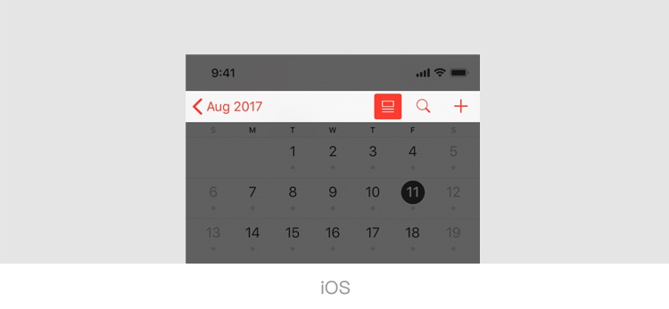
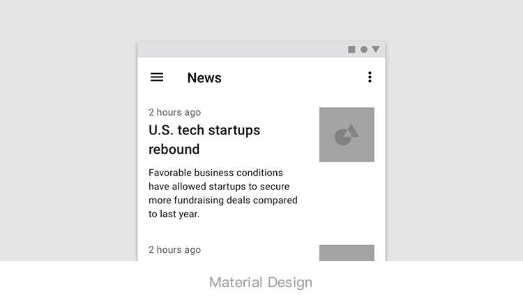
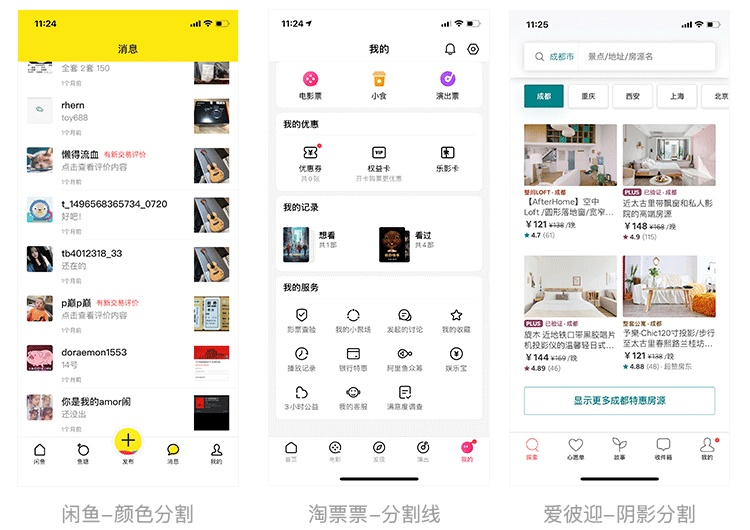

其实网页或者 App 中的导航(Navigation)这个概念远不止我们熟悉的导航栏，而是一个更加广的交互概念: 引导用户和产品进行有效的交互，实现用户的目标。

## 导航栏究竟在哪里

导航栏 Navigation Bar，也简称为 Navbar。一定会有不少刚入门的 UI 新人，在诸多的 Bar 控件中，难以区分它所指代的区域。

在 iOS 上，导航栏是指显示在应用程序顶部，位于状态栏下方的容器区域，层级应高于当前页面内容。

在安卓上，Google 公司在 Material Design 中也赋予了它同样的定义，但是却给了它另一个名称，顶部应用栏(Top App Bar)。

请务必要记住: 导航栏是用于构架当前屏幕的内容，阐述当前屏幕的状态，并且起到连接父子级页面层次结构的作用。所以回到开头的小故事，为什么标签栏不能叫做底部导航，因为标签栏是构架了多个屏幕之间平级页面的内容切换，和「导航」的定义没有关系。

## 规范里告诉我们该怎么做 vs 实际项目我们该怎么做

一个基本的导航栏容器一般承载的信息可能会有: 标题、导航按钮、内容控件按钮、其他控件(比如搜索栏、分页标签或分页控件等)，千万别忘了还有分割线。(比如微信的导航栏)

### 导航栏标题

时间倒退回 2017 年以前，这时候的移动端规范下的导航栏还是循规蹈矩的，样式单一。但随着 iPhone X 等一系列全面屏手机相继问世后，移动设备在屏幕高度上有了进一步的扩展，界面设计在一屏内的发挥空间也随之增加。iOS11 发布后，大标题导航栏设计风格兴起，随后被引入平台规范。

于是现在 iOS 与 Material Design 在导航栏上也都定义了两种导航栏标题规范，常规标题与大标题。

常规标题是指在高度为 88px(iOS@2x 下)的导航容器中，居中放置一个当前页面的标题。标题字号一般为 34px-38px(34px 为 iOS 标准规范，但实际项目中可以尽量在不小于 34px 标准的情况下根据设计需求确定)。

大标题是将导航栏高增加到 192px(iOS@2x)，保留高度为 88px 的导航容器来承载内容控件按钮，将标题下坠居左。iOS 的标准规范定义大标题的字号为 68px。但由于英文有大小写区分，在视觉上有一定的层次表现，而中文因为缺少一定的层次结构，并且相同字号的中文视觉大小大于英文，所以大多数时候我们在进行大标题设计时，会适当缩小，一般为 56px-64px 居多。

大标题导航栏的优点毋庸置疑，页面留白更多，呼吸感更强，大气现代、格调更高，因为页面标题巨大，能够帮助用户快速确认当前所处位置。采用统一的大标题，让页面布局风格快速统一。但缺点也显而易见，因为增加了导航栏的高度，导致屏幕利用率降低，一些通过广告变现或更加注重一屏内内容呈现的应用便中和了常规导航与大标题导航的优缺点，进行了风格改进。

那我们如何在常规标题和大标题之间抉择呢? 这可不单单是设计风格的问题，还受产品定位与功能的影响。苹果的设计师在 Apple Music 中实验并验证了一条结论——在内容非常丰富、层级结构较深的产品当中，大标题能够帮用户快速确认自己的位置。

所以我理解的适合使用大标题风格的产品一定是: 突出内容呈现而不是功能繁琐的；产品定位更偏向于现代或文艺艺术的；需要快速统一界面风格的。而层级结构需不需要很深，这并不一定，我反而觉得功能越单一、产品体量级越轻的应用，越适合大标题。

所以如此看来，国内使用大标题成功的案例就为数不多了，这可能与中文字体还有国内 app 产品功能都比较繁琐的原因有关，真正做到了使用大标题快速帮助用户确认自己位置，并且结合了产品特性与风格的，我认为人人都是产品经理的移动端在这方面做得非常棒。

### 导航按钮及内容控件按钮

iOS 规定导航按钮位置仅能用于放置返回按钮，可以添加一个层级的面包屑，帮助用户有效地明确当前页面层级；Material Design 中，不仅可以放置返回按钮，还另有作用，菜单图标-用于打开导航抽屉或者关闭图标-关闭工具栏。

这一点与 iOS 的定义有着天壤之别，iOS 非常明确地赋予了工具栏的定义，并且将导航栏和工具栏(Toolbars)彻底地分离开，典型案例就是 Safari。

在内容控件上 iOS 与 Material Design 也大相径庭，Material Design 不去限制您的内容控件多少，因为它提供了溢出菜单，并可以根据屏宽的变化，自适应释出和收纳溢出菜单中的控件。

而 iOS 则规定我们，要给内容控件按钮足够多的空间，必要的时候，隐藏导航栏标题也未尝不可。

那么真实的项目中，我们往往为了快速落地，会存在一稿适配双平台的情况。这时候我们应该遵从哪一个平台的规范呢? 答案是: 许多大厂的做法已经向我们验证，规范不分家。

在 iOS 诸多的应用中溢出菜单早已普及，尽管这是 Material Design 提出的设计理念。

虽然国内遵从 Material Design 进行 Android 应用设计的情况相对较少，但它提供的设计理念与方案却并不局限在安卓平台。

### 分割线

分割线只是一种体现形式，我想要表达的是，别忘记区分导航栏与内容界面的视觉层级关系。Matetial Design 提醒我们，顶部应用栏可以与内容位于同一高度，但滚动时，请增加导航栏的视觉高度，让内容在其后方滚动。而 iOS 则默认采用了背景模糊的方式区分了导航栏与内容区域的层级关系。

缺少视觉分割会让用户分不清导航栏与内容界面，它们看起来会更像一个平级。对用户视觉区分内容主次其实是极不友好的。

### 其他控件

关于其他控件，iOS 只在规范中提及到了分页控件。苹果设计师考虑到部分场景在当前页面中还存在信息层级结构划分，此时建议可以在导航栏中使用分段控件。

但国内的应用程序早已将导航栏容器的作用发挥到极致，基于导航栏层级始终高于内容区域的特性，我们通常可以将分段控件、分页标签、搜索栏等等用户可能随时使用的工具放在导航栏中。

## 总结

导航栏是几乎每一个界面都必定存在的控件，正因为无法轻易删减，逃不掉就必须用好它，不然很容易沦为页面的减分项。

设计好导航栏不仅仅是视觉上的工作，表现的方式、承载的按钮与组件、滚屏时的组合操作还能给用户带来极大的体验增益。
