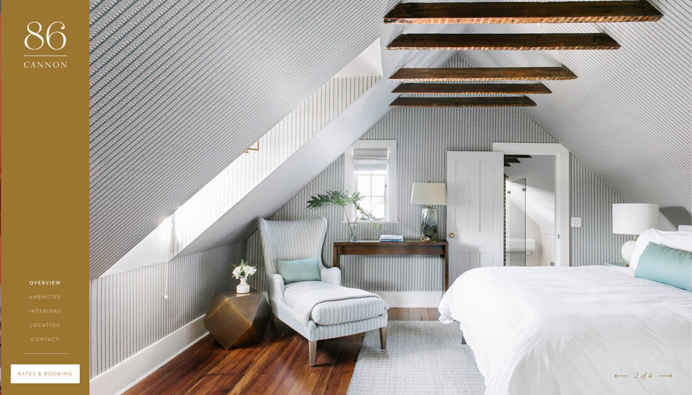

厌倦了传统顶部导航的设计师，越来越偏爱侧边栏导航了。这种常见于页面左侧的侧边栏设计，已经成了许多独树一帜的设计师的选择了。

## 无处不在的侧边栏导航

侧边栏导航和菜单设计的演变有着密不可分的关系。响应式设计的流行使得向移动端偏移的网页设计，不得不采用菜单栏来替代传统的导航模式，其直接的影响就是催生了汉堡图标。

随着汉堡图标的流行，弹出式的菜单也越发的常见。其中有些菜单是完全开放式的，而有的菜单则带着下拉框，还有一部分直接是弹出的菜单界面。而为了兼容大量的移动端界面，下拉和弹出式的菜单大多采用的是纵向布局——而这和侧边栏的设计，是如此的相似。换句话来说，这种垂直的导航就是一种弹出式的侧边栏导航。

目前，这种左侧侧边栏导航的设计已经成为一种持续迭代中的设计趋势了。现在我们看到的侧边栏设计，常常使用单一的纯色打底，包含较少(但是重要或常用的)选项，导航栏顶端通常会包含有品牌或者网站 LOGO，文字链接，以及带有小图标的社交媒体帐号的链接。

想要这种侧边栏设计能够最大化的发挥作用，诀窍在于控制好侧边栏本身和右侧网站内容的对比度，它要包含足够清晰可见的导航条目，还要能在移动端上良好地运作。

还有一点值得一提: 不要因为屏幕侧边够长，就试图用链接和内容将侧边栏填满。留白是完全可以接受的，在简约之风大行其道的今天，尽量只保留必须的内容，让留白来凸显它们，才是合乎道理又符合趋势的设计。今天的文章中的许多优质案例，都遵循着这样的设计逻辑。

## 侧边栏导航的优点

侧边栏导航的美学特征是毋庸置疑的。它在互联网存在的早期就已经存在，在软件的 GUI 设计中常常可以看到，但是在今天它仍然以一种时尚而前卫的姿态出现。

::: tip 侧边栏导航的优点

- 侧边栏导航通常位于左侧，它位于 F 式布局的最左侧，作为信息主干，也符合用户的浏览习惯
- 侧边栏导航不会像汉堡菜单一样一开始就隐藏其中的条目
- 侧边栏中的条目优先级基本一致
- 当间距足够的时候，侧边栏中的条目会非常的一目了然
- 今天的侧边栏通常会留有足够的空间，让后续的条目能够加入进去
- 侧边栏让右侧的画板形状尺寸不尽相同，设计师可以以非常规的方式来展现视频和图片，创造更独特的视觉体验
- 侧边栏导航以更加干净优雅的方式呈现更多的链接

:::

## 侧边栏导航的缺点

不喜欢侧边栏导航的人也很多，有些争论是关于导航栏放在右侧会不会更好，还有人则觉得侧边栏导航本身就是个麻烦，一方面让用户面对更复杂的布局，另一方面还增加了开发的难度。

::: warning 使用垂直导航存在的问题

- 垂直式的导航在响应式布局当中很难正常工作
- 导航中的词汇必须足够简短，否则导航栏会设计的很宽，或者部分内容无法显示
- 垂直导航所占据的空间，可能会挤压其他更有价值的内容
- 在同等内容量之下，侧边栏导航会让用户滚动页面的时间更长
- 顶部导航通常只能放四五个链接，而侧边栏导航无疑能放更多，这可能会促使部分设计师，在导航栏中塞入过多导航条目
- 绝大多数用户是右撇子，这些用户需要横快整个屏幕去点击导航
- 垂直导航通常在单页式页面上非常好用，但是其他类型的网页上则没有想象中那么好使

:::

## 侧边栏导航是否好用

说真的，讨论很多，结论并不那么明朗。

作为一种设计趋势，侧边栏导航是引人注意的，作为导航栏，它常驻式的设计，让它的功能性更强。如果您的导航是用户流程中非常重要的存在，那么侧边栏导航是个不错的选择。

总而言之，这种导航设计对于较少的导航内容的小型网站而言，颇为有用，尤其是对于产品展示型的网站而言。

## 其他的导航模式

非常规的导航模式是打破了旧有的常规导航模式的有趣尝试，除了侧边栏导航之外，还有一些其他的有趣的导航设计。

当然，非常规的导航设计最主要的问题在于，用户不熟悉，容易混淆，迷惑。对于小型站点，适当的尝试还好，对于复杂的大型网站，这样的尝试就有点得不偿失了。

在这里另外介绍两种有趣的导航设计。Aurora 所采用的是隐藏式的导航，点击 LOGO 旁边的菜单按钮能够显示，而 AndCulture 则直接将顶部导航旋转了 90 度直接放到侧面。

两种设计虽然都有人让人意想不到，但是都在各自的网站中良好的运行。当然，不管您要做多么奇怪的尝试，在真正决定投入使用之前，尽量多做用户测试，确保它们是有效的。
