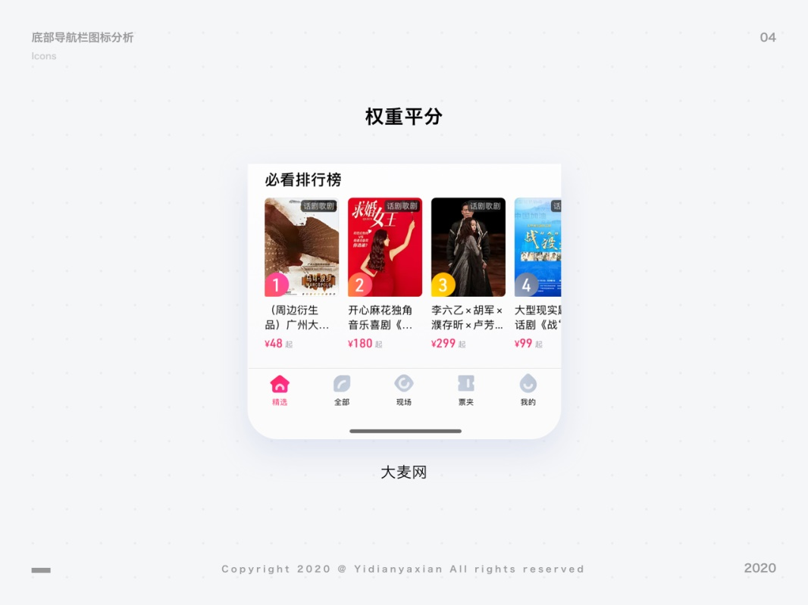

## 底部导航栏图标重要性及维度

### 重要性

底部导航栏的图标是路牌，承担着指路的作用，给用户指明进入产品后可以分别通往什么页面。早期的底部导航栏是单一的指路功能，经过多年的交互设计迭代后，附加了「信息展示」和「引导操作」的作用，这点会在下文中详细阐述。

### 三个重要评估维度

#### 品牌调性

品牌调性决定了图标的体量感、差异化和创意延展。怎样评估图标设计能够体现出品牌调性呢? 最简单直接的方法: 截屏首页，不看顶部栏，仅从底部导航栏能看出来这是什么产品，就算成功体现了品牌调性。

#### 识别度

识别度决定了用户辨识其它页面功能的速度。高识别度的图标能协助用户辨识，低识别度的图标会阻碍用户辨识。在选择做这部分图标的时候，一定要考虑识别度的问题，进行创新要建立在高识别度的基础上。

#### 美观

导航栏图标美观的要义是: 统一、精致。统一不代表绝对统一，精致不代表过于精细。要做到美观，可以遵循以下几点: 大小统一和谐、线条粗细一致、圆角视觉统一、内容繁简平衡。

将三个维度按重要程度来排序，是品牌调性>识别度>美观。有的设计师会选择以美观度作为优先标准。但站在产品的角度来说，应该以体现品牌调性和识别度为重要标准，在这基础上再进行美观设计。下图中，新华书店 APP 的底部导航栏图标略显年代感，图标细节表现不一显得不够统一和精致，然而用户还是能够根据图标一眼区分各个导航入口的功能。它们可能不是设计师眼中好看的图标，但它们是用户眼中好用的图标。

## 底部导航入口的数量

底部导航入口一般在 3-5 个，最常见的是 4-5 个。这个数量由什么决定呢?

### 最高数值由认知心理学决定

::: info

在认知心理学理论中，人的记忆系统由三个储存器组成: 感觉寄存器，短时记忆和长时记忆。来自环境的刺激经过过滤首先进入感觉寄存器，通过选择性直觉，信息被临时传入短时记忆(STM)。它是一个过渡性的记忆缓冲期，容量有限，只能记录 7+-2 个信息组块，且只能保持大约 15-30 秒。

:::

在使用 APP 的时候，底部导航栏使用到的是人记忆系统中的感觉寄存器和短时记忆。考虑到 APP 面对的人群非常广，短时记忆容量不一，选择了 7-2(也就是 5)作为底部导航入口的最高数值。

### 具体数值由产品的框架决定

产品经理会通过项目背景和用户调研，决定产品的功能结构。而功能结构图划分的类别决定了底部导航入口数量。有的产品功能非常单一，结构也单一，三个导航入口已经能够满足需求；有的产品功能复杂，则需要更多的导航入口，用以划分 APP 功能，帮助用户快速识别。

## 底部导航栏模式

底部导航栏有权重平分、强调信息、引导操作这三种模式。本次深度分析采用了 30 个产品作为对象进行研究，其中大部分为知名社交电商类产品。因为这类型的产品比较多，迭代完善，可参考性强。

### 权重平分

当产品的功能结构权重比较平均，不希望突出其中某个结构时，一般采用权重平分的模式，即每个底部入口的分量都是平均的。常规产品会采用这样的形式。

### 强调信息

当产品需要强调某些信息引起用户注意或同一个按钮承担两个功能时，设计便可以选择在某个入口添加明显的信息指示或功能。增加功能的底部导航入口不一定是首页，也可以是其它入口。

::: info

严选的首页按钮承担着「回到顶部/快速定位推荐模块/品牌展示」的功能；淘宝、飞猪的首页按钮承担着「回到顶部/品牌展示」的功能；微博的视频按钮承担着「视频/关注的人更新内容提示」的功能。

:::

### 引导操作

当产品希望用户能够进行某个操作，需要进行强操作提醒时，可以选择引导操作的导航栏模式，在中心突出操作按钮。大众点评、百果园、转转、星巴克、闲鱼等都是采用这种模式。

## 底部导航栏图标表现形式

### 线性图标的优势

从大多数 APP 设计来看，未选中状态下，线性图标占有优势。相对面性图标来说，线性图标有更多可能性，且选中与未选中的区分落差较大，对比明显。

### 其它图标趋势

未选中状态的图标常用线性方式，目前的主要趋势还是在图标表意上下功夫；选中状态的图标常用面性、微质感、立体、插画等方式。

## 图标设计思路与创意

为了直观表现图标设计的思路，我为权重平分模式、强调信息模式、引导操作模式分别设定不同的产品背景，把图标设计的过程写下来供大家参考。

1. 权重平分模式示例

   

1. 强调信息模式示例

   

1. 引导操作模式示例

   
