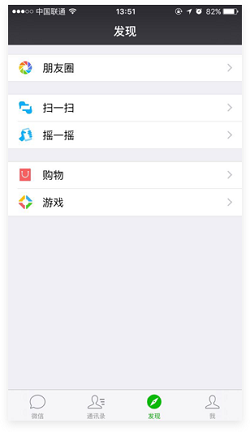

导航分很多类别，如标签导航、抽屉式导航、九宫格导航、混合组合导航、列表式导航、Tab 导航、平铺导航等等。

现在用到更多的导航其实是标签导航(tabbar)，它随处可见，相信目前大部分的 App 用的导航都是标签形式的。

## 理清产品框架

相信很多设计师在设计导航时，一上来就开始 YY 自己的导航要放什么，因为这个时候他已经被标签形式的导航洗脑了，认为自己的 App 就应该用标签导航。然后继续 YY 产品的功能，自己理出个最适合的，放上去就好了。

其实不然。做好一个导航要考虑的问题其实非常多，还要考虑产品后期发展的延展性。必须定好整个产品的框架，把最核心的功能放在第一层页面，再根据产品的深度来设计导航的模式。

## 标签导航的优劣势

先来看个图:

不要看上面的列表，就看下面的标签。是不是特别熟悉? 很多 App 都是用这类标签式导航来引导用户切换功能。

### 优势

1. 简单高效，操作方便

   下面的四个功能可以快速切换，用户在使用的过程中不会迷失方向，且简单清晰，层级明确。

1. 更好的用户体验

   试想一下，一般在使用 App 时，用户更多的会怎么使用手机? 双手还是单手呢? 肯定都有。所以单手使用手机的用户碰到的 App 是标签导航时，可以更方便的操作，不需要一定得使用另一只手。而某些导航如果不用两只手是没办法操作的。

1. 快速了解 App 主要功能

   一般来说，用户第一次使用产品，会关注这个 App 有什么功能，它能帮助自己完成什么任务。所以标签导航可以很好地帮助用户了解产品的主要功能，让用户看到的第一眼就知道自己能做什么。

### 劣势

1. 功能不能过多

   有些产品功能过多，但是却又都是必要的，不能做删减。而一旦超过五个，就不适合用标签导航。因为标签导航不适合做滑动，所以功能多了可点击区域(热区)就变小了，操作上会有一定影响。

1. 占用一定屏幕尺寸

   标签导航占用了屏幕下方不少的位置。

   ::: info

   不过也正是因为顶部和底部的 navbar 与 tabbar 会占据太多的屏幕空间，所以现在屏幕尺寸普遍改为了 2:1 而不是原来的 16:9。

   :::

## 标签导航的延展

有的人会问，如果我的产品很想用标签导航，但是又超过了 5 个功能，那有办法解决么?

当然有，当您的主功能超过 5 个又一定要使用标签导航的话，那知乎的这个解决方案很适合您(最右边的功能是“更多”)。

还有一类情况是:主功能是标签导航，次要功能也是标签导航。这些在资讯 APP 是很常见的，比如主功能是“新闻”，次要功能是顶部的“要闻”、“NBA”等等，如果在某个主功能中，次要功能很多，就可以使用这类方式来解决这个问题。
