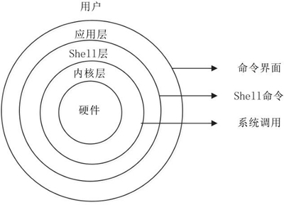

# Linux 和 UNIX

UNIX 与 Linux 之间的关系是一个很有意思的话题。在目前主流的服务器端操作系统中，UNIX 诞生于 20 世纪 60 年代末，Windows 诞生于 20 世纪 80 年代中期，Linux 诞生于 20 世纪 90 年代初，可以说 UNIX 是操作系统中的"老大哥"，后来的 Windows 和 Linux 都参考了 UNIX。

::: tip

现代的 Windows 系统已经朝着“图形界面”的方向发展了，和 UNIX 系统有了巨大的差异，从表面上甚至看不出两者的关联。

:::

## UNIX 的坎坷历史

UNIX 操作系统由肯·汤普森(Ken Thompson)和丹尼斯·里奇(Dennis Ritchie)发明。它的部分技术来源可追溯到从 1965 年开始的 Multics 工程计划，该计划由贝尔实验室、美国麻省理工学院和通用电气公司联合发起，目标是开发一种交互式的、具有多道程序处理能力的分时操作系统，以取代当时广泛使用的批处理操作系统。

::: tip

分时操作系统使一台计算机可以同时为多个用户服务，连接计算机的终端用户交互式发出命令，操作系统采用时间片轮转的方式处理用户的服务请求并在终端上显示结果(操作系统将 CPU 的时间划分成若干个片段，称为时间片)。操作系统以时间片为单位，轮流为每个终端用户服务，每次服务一个时间片。

:::

可惜，由于 Multics 工程计划所追求的目标太庞大、太复杂，以至于它的开发人员都不知道要做成什么样子，最终以失败收场。

以肯•汤普森为首的贝尔实验室研究人员吸取了 Multics 工程计划失败的经验教训，于 1969 年实现了一种分时操作系统的雏形，1970 年该系统正式取名为 UNIX。

想一下英文中的前缀 Multi 和 Uni，就明白了 UNIX 的隐意。Multi 是大的意思，大而且繁；而 Uni 是小的意思，小而且巧。这是 UNIX 开发者的设计初衷，这个理念一直影响至今。

有意思的是，肯•汤普森当年开发 UNIX 的初衷是运行他编写的一款计算机游戏 Space Travel，这款游戏模拟太阳系天体运动，由玩家驾驶飞船，观赏景色并尝试在各种行星和月亮上登陆。他先后在多个系统上试验，但运行效果不甚理想，于是决定自己开发操作系统，就这样，UNIX 诞生了。

自 1970 年后，UNIX 系统在贝尔实验室内部的程序员之间逐渐流行起来。1971-1972 年，肯•汤普森的同事丹尼斯•里奇发明了传说中的 C 语言，这是一种适合编写系统软件的高级语言，它的诞生是 UNIX 系统发展过程中的一个重要里程碑，它宣告了在操作系统的开发中，汇编语言不再是主宰。

到了 1973 年，UNIX 系统的绝大部分源代码都用 C 语言进行了重写，这为提高 UNIX 系统的可移植性打下了基础(之前操作系统多采用汇编语言，对硬件依赖性强)，也为提高系统软件的开发效率创造了条件。可以说，UNIX 系统与 C 语言是一对孪生兄弟，具有密不可分的关系。

20 世纪 70 年代初，计算机界还有一项伟大的发明——TCP/IP 协议，这是当年美国国防部接手 ARPAnet 后所开发的网络协议。美国国防部把 TCP/IP 协议与 UNIX 系统、C 语言捆绑在一起，由 AT&T 发行给美国各个大学非商业的许可证，这为 UNIX 系统、C 语言、TCP/IP 协议的发展拉开了序幕，它们分别在操作系统、编程语言、网络协议这三个领域影响至今。肯•汤普森和丹尼斯•里奇因在计算机领域做出的杰出贡献，于 1983 年获得了计算机科学的最高奖——图灵奖。

随后出现了各种版本的 UNIX 系统，目前常见的有 Sun Solaris、FreeBSD、IBM AIX、HP-UX 等。

## Solaris 和 FreeBSD

我们重点介绍一下 Solaris，它是 UNIX 系统的一个重要分支。Solaris 除可以运行在 SPARC CPU 平台上外，还可以运行在 x86 CPU 平台上。在服务器市场上，Sun 的硬件平台具有高可用性和高可靠性，是市场上处于支配地位的 UNIX 系统。

对于难以接触到 Sun SPARC 架构计算机的用户来说，可以通过使用 Solaris x86 来体验世界知名大厂的商业 UNIX 风采。当然，Solaris x86 也可以用于实际生产应用的服务器，在遵守 Sun 的有关许可条款的情况下，Solaris x86 可以免费用于学习研究或商业应用。

FreeBSD 源于美国加利福尼亚大学伯克利分校开发的 UNIX 版本，它由来自世界各地的志愿者开发和维护，为不同架构的计算机系统提供了不同程度的支持。FreeBSD 在 BSD 许可协议下发布，允许任何人在保留版权和许可协议信息的前提下随意使用和发行，并不限制将 FreeBSD 的代码在另一协议下发行，因此商业公司可以自由地将 FreeBSD 代码融入它们的产品中。苹果公司的 macOS 就是基于 FreeBSD 的操作系统。

FreeBSD 与 Linux 的用户群有相当一部分是重合的，二者支持的硬件环境也比较一致，所采用的软件也比较类似。FreeBSD 的最大特点就是稳定和高效，是作为服务器操作系统的不错选择；但其对硬件的支持没有 Linux 完备，所以并不适合作为桌面系统。

其他 UNIX 版本因应用范围相对有限，在此不做过多介绍。

## Linux 的那些往事

Linux 内核最初是由李纳斯•托瓦兹(Linus Torvalds)在赫尔辛基大学读书时出于个人爱好而编写的，当时他觉得教学用的迷您版 UNIX 操作系统 Minix 太难用了，于是决定自己开发一个操作系统。第 1 版本于 1991 年 9 月发布，当时仅有 10 000 行代码。

李纳斯•托瓦兹没有保留 Linux 源代码的版权，公开了代码，并邀请他人一起完善 Linux。与 Windows 及其他有专利权的操作系统不同，Linux 开放源代码，任何人都可以免费使用它。

据估计，现在只有 2% 的 Linux 核心代码是由李纳斯•托瓦兹自己编写的，虽然他仍然拥有 Linux 内核(操作系统的核心部分)，并且保留了选择新代码和需要合并的新方法的最终裁定权。现在大家所使用的 Linux，我更倾向于说是由李纳斯•托瓦兹和后来陆续加入的众多 Linux 好者共同开发完成的。

李纳斯•托瓦兹无疑是这个世界上最伟大的程序员之一，何况，他还搞出了全世界最大的程序员交友社区 GitHub (开源代码库及版本控制系统)。

关于 Linux Logo 的由来是一个很有意思的话题，它是一只企鹅。企鹅是南极洲的标志性动物，根据国际公约，南极洲为全人类共同所有，不属于世界上的任何国家，任何国家都无权将南极洲纳入其版图。Linux 选择企鹅图案作为 Logo，其含义是: 开放源代码的 Linux 为全人类共同所有，任何公司无权将其私有。

## UNIX 与 Linux 的关系

二者的关系，不是大哥和小弟，"UNIX 是 Linux 的父亲"这个说法更怡当。之所以要介绍它们的关系，是因为要告诉读者，在学习的时候，其实 Linux 与 UNIX 有很多的共通之处，简单地说，如果您已经熟练掌握了 Linux，那么再上手使用 UNIX 会非常容易。

二者也有两个大的区别:

- UNIX 系统大多是与硬件配套的，也就是说，大多数 UNIX 系统如 AIX、HP-UX 等是无法安装在 x86 服务器和个人计算机上的，而 Linux 则可以运行在多种硬件平台上；

- UNIX 是商业软件，而 Linux 是开源软件，是免费、公开源代码的。

Linux 受至旷大计算机爱好者的喜爱，主要原因也有两个:

- 它属于开源软件，用户不用支付可费用就可以获得它和它的源代码，并且可以根据自己的需要对它进行必要的修改，无偿使用，无约束地继续传播；

- 它具有 UNIX 的全部功能，任何使用 UNIX 操作系统或想要学习 UNIX 操作系统的人都可以从 Linux 中获益。

开源软件是不同于商业软件的一种模式，从字面上理解，就是开放源代码，大家不用担心里面会搞什么猫腻，这会带来软件的革新和安全。

另外，开源其实并不等同于免费，而是一种新的软件盈利模式。目前很多软件都是开源软件，对计算机行业与互联网影响深远。

近年来，Linux 已经青出于蓝而胜于蓝，以超常的速度发展，从一个丑小鸭变成了一个拥有庞大用户群的真正优秀的、值得信赖的操作系统。历史的车轮让 Linux 成为 UNIX 最优秀的传承者。

::: tip 总结

Linux 是一个类似 Unix 的操作系统，Unix 要早于 Linux，Linux 的初衷就是要替代 UNIX，并在功能和用户体验上进行优化，所以 Linux 模仿了 UNIX(但并没有抄袭 UNIX 的源码)，使得 Linux 在外观和交互上与 UNIX 非常类似。

:::

相比于 UNIX，Linux 最大的创新是开源免费，这是它能够蓬勃发展的最重要原因；而目前的 UNIX 大部分都是收费的，小公司和个人都难以承受。

正是由于 Linux 和 UNIX 有着千丝万缕的联系，所以人们把 Linux 叫做“类 UNIX 系统”。

## UNIX/Linux 系统结构

UNIX/Linux 系统可以粗糙地抽象为 3 个层次(所谓粗糙，就是不够细致、精准，但是便于初学者抓住重点理解)，如图 3 所示。底层是 UNIX/Linux 操作系统，即系统内核(Kernel)；中间层是 Shell 层，即命令解释层；高层则是应用层。

1. 内核层

   内核层是 UNIX/Linux 系统的核心和基础，它直接附着在硬件平台之上，控制和管理系统内各种资源(硬件资源和软件资源)，有效地组织进程的运行，从而扩展硬件的功能，提高资源的利用效率，为用户提供方便、高效、安全、可靠的应用环境。

1. Shell 层

   Shell 层是与用户直接交互的界面。用户可以在提示符下输入命令行，由 Shell 解释执行并输出相应结果或者有关信息，所以我们也把 Shell 称作命令解释器，利用系统提供的丰富命令可以快捷而简便地完成许多工作。

1. 应用层

   应用层提供基于 X Window 协议的图形环境。X Window 协议定义了一个系统所必须具备的功能(就如同 TCP/IP 是一个协议，定义软件所应具备的功能)，可系统能满足此协议及符合 X 协会其他的规范，便可称为 X Window。

现在大多数的 UNIX 系统上(包括 Solaris、HP-UX、AIX 等)都可以运行 CDE (Common Desktop Environment，通用桌面环境，是运行于 UNIX 的商业桌面环境) 的用户界面；而在 Linux 上广泛应用的有 Gnome、KDE 等。

## 协议

早在 20 世纪 70 年代，UNIX 系统是开源而且免费的，但是在 1979 年时，AT&T 公司宣布了对 UNIX 系统的商业化计划，随之开源软件业转变成了版权式软件产业，源代码被当作商业机密，成为专利产品，人们再也不能自由地享受科技成果。

于是在 1984 年，Richard Stallman 面对于如此封闭的软件创作环境，发起了 GNU 源代码开放计划并制定了著名的 GPL 许可协议。

1987 年时，GNU 计划获得了一项重大突破，即发布了 gcc 编译器，这使得程序员可以基于该编译器编写出属于自己的开源软件。随之，在 1991 年 10 月，芬兰赫尔辛基大学的在校生 Linus Torvalds 编写了一款名为 Linux 的操作系统，该系统因其较高的代码质量且基于 GNU GPL 许可协议的开放源代码特性，迅速得到了 GNU 计划和一大批黑客程序员的支持，随后 Linux 系统便进入了如火如荼的发展阶段。

1994 年 1 月，Bob Young(红帽创始人)在 Linux 系统内核的基础之上，集成了众多的源代码和程序软件，发布了红帽系统并开始出售技术服务，这进一步推动了 Linux 系统的普及。

1998 年以后，随着 GNU 源代码开放计划和 Linux 系统的继续火热，以 IBM 和 Intel 为首的多家 IT 企业巨头开始大力推动开放源代码软件的发展。

到了 2017 年年底，Linux 内核已经发展到了 4.13 版本，并且 Linux 系统版本也有数百个之多，但它们依然都使用 Linus Torvalds 开发、维护的 Linux 系统内核。RedHat 公司也成为了开源行业及 Linux 系统的带头公司。

初步接触 Linux 的读者，或者有这样一个疑问，Windows 系统也很好用，也能满足日常工作需求，为什么要学习 Linux 系统呢?

有些初学者会将“Linxu 系统是开源的”作为这个问题的答案，其实不然。开源的操作系统少说有 100 个，开源的软件至少也有十万个，为什么不去逐个学习? Linux 的开源特性只是一部分优势，并不是学习 Linux 的主要原因。

对于用户来讲，开源精神仅具备锦上添花的效果，真正的原因在于，Linux 系统是一款优秀的软件产品，具有类似 UNIX 的程序界面，而且继承了 UNIX 的稳定性，能够较好地满足工作需求。
