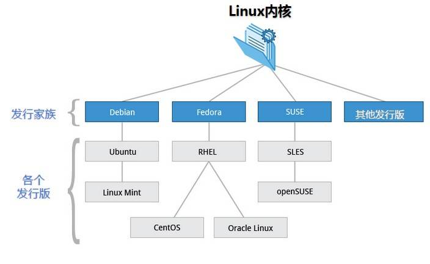

# Linux 简介

Linux 内核最初只是由芬兰人林纳斯·托瓦兹 (Linus Torvalds) 在赫尔辛基大学上学时出于个人爱好而编写的。

Linux 是一套免费使用和自由传播的类 Unix 操作系统，是一个基于 POSIX 和 UNIX 的多用户、多任务、支持多线程和多 CPU 的操作系统。

Linux 能运行主要的 UNIX 工具软件、应用程序和网络协议。它支持 32 位和 64 位硬件。Linux 继承了 Unix 以网络为核心的设计思想，是一个性能稳定的多用户网络操作系统。

Linux 让开展各种实际有用且具有创造性的事情成为可能。例如，您可以在一个 U 盘上装载 Linux 的自生系统引导映像 (live boot image)，启动一台硬盘已经崩溃的计算机，之后査找并解决该问题。或者，因为 Linux 是一个真正的多用户操作系统，它具有非常好的私密性和稳定性，整个团队可以同时从本地或远程登录进行工作。

Linux 的构建采用了一些与 UNIX 操作系统相同的技术，并带有大多数与深度成熟的 UNIX 操作系统相一致的工具，这极大地增加了稳定性与安全性。

Linux 的发行版还提供了复杂的软件包管理系统，可以可靠地安装和维护每一个在线资源库中成千上万的免费软件应用。

Linux 不仅是免费的，更是开源的(open source)，这意味着任何人都可以获得其代码并根据自己的需求进行修改。

## Linux 的发行版

Linux 的发行版说简单点就是将 Linux 内核与应用软件做一个打包。

事实上，已经孵化出专属 Linux 各发行版的巨大生态系统。一个发行版(distribution ，有时缩写为 distro)是一个定制的软件包，它将 Linux 内核以及用户计算机 Linux 运行版的安装工具一起发布。

在 Linux 内核的发展过程中，各种 Linux 发行版本起了巨大的作用，正是它们推动了 Linux 的应用，从而让更多的人开始关注 Linux。因此，把 Red Hat、Ubuntu、SUSE 等直接说成 Linux 其实是不确切的，它们是 Linux 的发行版本，更确切地说，应该叫作“以 Linux 为核心的操作系统软件包”。

Linux 的各个发行版本使用的是同一个 Linux 内核，因此在内核层不存在什么兼容性问题，每个版本有不一样的感觉，只是在发行版本的最外层(由发行商整合开发的应用)才有所体现。

目前市面上较知名的发行版有: Ubuntu、RedHat、CentOS、Debian、Fedora、SuSE、OpenSUSE、Arch Linux、SolusOS 等。

Linux 的发行版本可以大体分为两类:

- 商业公司维护的发行版本，以著名的 Red Hat 为代表；
- 社区组织维护的发行版本，以 Debian 为代表。

很难说大量 Linux 版本中哪一款更好，每个版本都有自己的特点。

### Red Hat Linux

Red Hat(红帽公司)创建于 1993 年，是目前世界上资深的 Linux 厂商，也是最获认可的 Linux 品牌。

Red Hat 公司的产品主要包括 RHEL(Red Hat Enterprise Linux，收费版本)和 CentOS(RHEL 的社区克隆版本，免费版本)、Fedora Core(由 Red Hat 桌面版发展而来，免费版本)。

Red Hat 是在我国国内使用人群最多的 Linux 版本，资料丰富，如果您有什么不明白的地方，则容易找到人来请教，而且大多数 Linux 教程是以 Red Hat 为例来讲解的(包括本教程)。

CentOS 是基于 Red Hat Enterprise Linux 源代码重新编译、去除 Red Hat 商标的产物，各种操作使用和付费版本没有区别，且完全免费。缺点是不向用户提供技术支持，也不负任何商业责任。

### Ubuntu Linux

Ubuntu 基于知名的 Debian Linux 发展而来，界面友好，容易上手，对硬件的支持非常全面，是目前最适合做桌面系统的 Linux 发行版本，而且 Ubuntu 的所有发行版本都免费提供。

Ubuntu 的创始人 Mark Shuttleworth 是非常具有传奇色彩的人物。他在大学毕业后创建了一家安全咨询公司，1999 年以 5.75 亿美元被收购，由此一跃成为南非最年轻有为的本土富翁。作为一名狂热的天文爱好者，Mark Shuttleworth 于 2002 年自费乘坐俄罗斯联盟号飞船，在国际空间站中度过了 8 天的时光。之后，Mark Shuttleworth 创立了 Ubuntu 社区，2005 年 7 月 1 日建立了 Ubuntu 基金会，并为该基金会投资 1000 万美元。他说，太空的所见正是他创立 Ubuntu 的精神之所在。如今，他最热衷的事情就是到处为自由开源的 Ubuntu 进行宣传演讲。

### SuSE Linux

SuSE Linux 以 Slackware Linux 为基础，原来是德国的 SuSE Linux AG 公司发布的 Linux 版本，1994 年发行了第一版，早期只有商业版本，2004 年被 Novell 公司收购后，成立了 OpenSUSE 社区，推出了自己的社区版本 OpenSUSE。

SuSE Linux 在欧洲较为流行，在我国国内也有较多应用。值得一提的是，它吸取了 Red Hat Linux 的很多特质。

SuSE Linux 可以非常方便地实现与 Windows 的交互，硬件检测非常优秀，拥有界面友好的安装过程、图形管理工具，对于终端用户和管理员来说使用非常方便。

### Gentoo

Gentoo 最初由 Daniel Robbins(FreeBSD 的开发者之一)创建，首个稳定版本发布于 2002 年。Gentoo 是所有 Linux 发行版本里安装最复杂的，到目前为止仍采用源码包编译安装操作系统。

不过，它是安装完成后最便于管理的版本，也是在相同硬件环境下运行最快的版本。自从 Gentoo 1.0 面世后，它就像一场风暴，给 Linux 世界带来了巨大的惊喜，同时也吸引了大量的用户和开发者投入 Gentoo Linux 的怀抱。

有人这样评价 Gentoo: 快速、设计干净而有弹性，它的出名是因为其高度的自定制性(基于源代码的发行版)。尽管安装时可以选择预先编译好的软件包，但是大部分使用 Gentoo 的用户都选择自己手动编译。这也是为什么 Gentoo 适合比较有 Linux 使用经验的老手使用。

### 发行版选择

Linux 的发行版本众多，在此不逐一介绍，下面给选择 Linux 发行版本犯愁的朋友一点建议:

- 如果您需要的是一个服务器系统，而且已经厌烦了各种 Linux 的配置，只是想要一个比较稳定的服务器系统，那么建议您选择 CentOS 或 RHEL。

- 如果您只是需要一个桌面系统，而且既不想使用盗版，又不想花大价钱购买商业软件，不想自己定制，也不想在系统上浪费太多时间，则可以选择 Ubuntu。

- 如果您想深入摸索一下 Linux 各个方面的知识，而且还想非常灵活地定制自己的 Linux 系统，那就选择 Gentoo 吧，尽情享受 Gentoo 带来的自由快感。

- 如果您对系统稳定性要求很高，则可以考虑 FreeBSD。

- 如果您需要使用数据库高级服务和电子邮件网络应用，则可以选择 SuSE。
