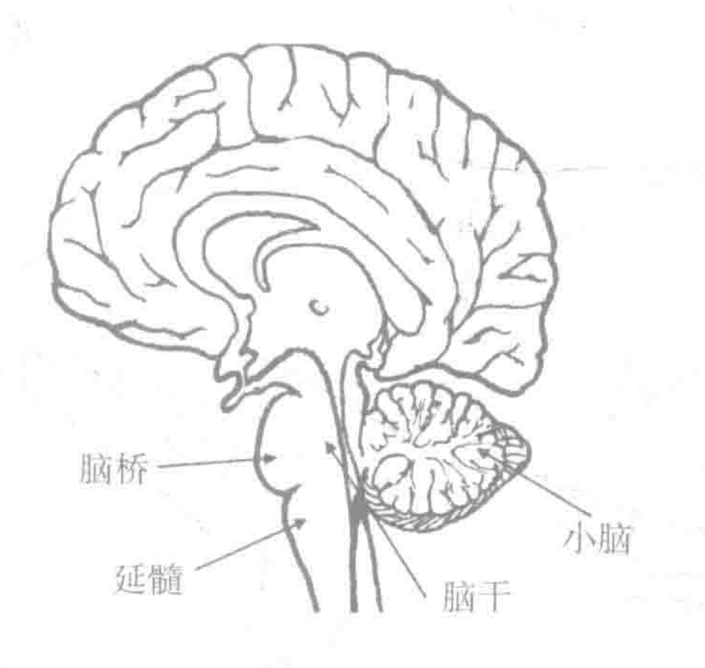
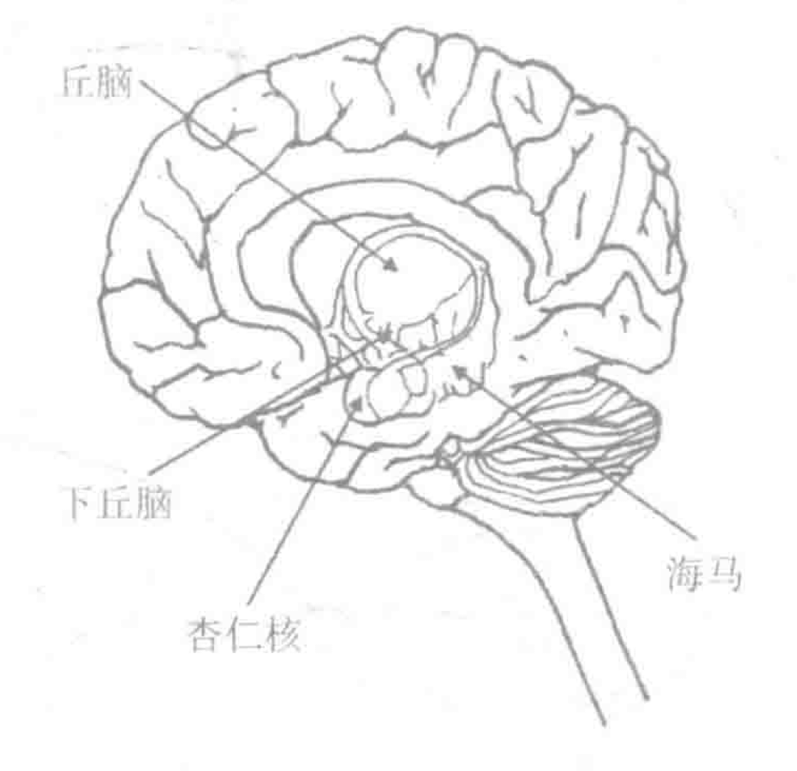

## 教育者应该了解的神经与认知科学知识

### 教育领域中的神经迷思

- 我们中有些是左脑型人，有些是右脑型人
- 听莫扎特的音乐会让你的婴⼉更聪明
- 错过关键期，学习发展就会停滞
- 我们只用了 10% 的大脑
- 我们生而拥有所有的脑细胞，一生都不会改变

### 教育者需要了解的神经和认知科学中的重要话题

- 可塑性

  就像肌肉会因为我们不断地锻炼而得到增强，大脑的网络连接也会因为我们的不断使用而增强。

- 神经生成

  神经生成的发现，即特定脑区中新细胞的生成，代表着我们在理解人类大脑过程中的巨大突破。

- 情绪和压力

  在生物学上，我们其实是‘会思考的感觉动物’

- 学习中注意的作用

  警觉网络允许我们保持警觉状态朝向网络帮助我们注意到感觉事件执行网络在特定事件中维持注意需要意志努力的注意控制从幼年便于始发展一直持续到青少年时期。

- 执行功能

  一组基本认知加工过程，强调对进行中的、目标导向任务的调控以及高级思维技巧的运用。

  执行功能在要求形成新颖连结、要求对信息进行灵活运用的学习情境中变得尤其重要。

- 运动和学习的重要性

  运动可以产生心情愉悦的化学物质，也会影响个体认知发展。

- 艺术与学习

  艺术可以改包括注意力在内的一系列认知能力，可以改变大脑结构。

- 青少年、睡眠与学习

  - 青春期的大脑会发生改变。
  - 青少年的睡眠模式会发生改变。

- 创造性

  高压力导致创造力普遍下降。

## 脑的结构和功能

### 关于脑的基本发现

人的脑看起来像核桃的形状，和西柚差不多大。脑的重量稍稍⼩于3磅，多数重量来自水 (大约78%)、脂肪 (大约10%) 和蛋⽩质 (大约8%)。脑的重量约占身体总重的 2.5%，它的能量消耗大约占全身能量消耗的20%，这个比例是其他身体器官的10倍。

脑是人类神经系统的一部分，它负责接收、处理和存储信息，以协调人的行动。神经系统可以被划分为两个主要部分：中枢神经系统和外周神经系统。中枢神经系统包括脑和脊髓，外周神经系统由遍布全身的感觉和运动神经元组成。中枢神经系统就像一个指挥，负责存储和分析。

从外周神经系统接收到的感觉信息，并且指挥运动和化学的反应。外周神经系统向中枢神经系统发送感觉信号，并且将中枢神经系统发出的运动信号传递给肌肉、腺体和器官。

### 脑细胞:神经元和神经校质细胞

脑由几千亿个细胞组成，其细胞分成两种类型：神经元和神经胶质细胞。

::: info 神经元

神经细胞，也称为神经元，通过电化学途径接收和传送信息到其他细胞

:::

::: info 神经胶质细胞

这些细胞被称作脑⽩质.

- 为神经元提供结构⽀撑
- 髓鞘的形成

:::

### 大脑的组织结构

脑有两半或者称两个半球。

::: info 间脑

间脑由脑桥、延髓和⼩脑组成，被认为是进化中的人脑中最⽼的部分。

:::

::: info 脑桥和延髓

脑桥和延髓控制自主功能，如呼吸，心跳节律，以及觉醒、睡眠等意识状态。它们控制感觉处理，包括听觉和视觉的感觉，控制脸、嘴、咽喉、呼吸系统和心脏的运动。脑桥和延髓位于脑的中线上，因而不是成对出现的。

:::

::: info ⼩脑

尽管⼩脑体型较⼩，有时被称作“⼩大脑”，但它在脑和身体的⼯作中起重要作用。⼩脑只占据整个脑的体积的10%，却拥有大约110亿个细胞，负责控制重要的运动和感觉处理(Pinel，2000)。⼩脑对身体的平衡、姿态、行⾛和动作的协调具有核心作用。

:::

### 边缘系统

边缘系统在间脑上方，由一组对情绪处理、学习和记忆起重要作用的结构组成吗，其结构包括丘脑、下丘脑、海马和杏仁核。

::: info 丘脑

在脑的核心有一个胡桃大⼩的结构，它的⻆色类似于交通警察，负责指挥来自各种感官(除了嗅觉)的信息流向脑的其他部分以进行进一步处理。

:::

::: info 下丘脑

这个结构相当于一个中继站，它监视来自自主神经系统的信息。它调节身体的功能来维持动态平衡。例如，当身体的温度升高时，下丘脑将增加排汗，以降低身体的温度。下丘脑还调节内分泌系统和些情绪的处理。

:::

::: info 海马

这个结构的形状就像大海中的海马。海马可以被想成是记忆系统中的驮马。它保存刚刚发生的记忆，并且将记忆固化到长时记忆系统中。

:::

::: info 杏仁核

这个像杏仁形状的结构主要与情绪状态和情绪的处理有关侭管多种神经系统都参与了情绪信息的处理，海马被认为起了关键作用。海马尤其参与了我们对恐惧情境的响应。有趣的是，从外界环境中提取的感觉信息⾸先到达海马来进行情绪处理，然后才到达进行理性思考的大脑皮层。更具体地讲，海马早于大脑皮层 40 毫秒接收到刺激。这个发现说明对刺激的恐惧反应早于任何有意识的、经过思考的反应。

:::

### 大脑

大脑是脑中最大的区域，具有脑重量的80%以上。它分为两半，被称为大脑半球。左半球和右半球由一捆粗大的神经纤维束连接，这个结构称为胼胝体。胼胝体包含20亿个紧密压缩的神经元轴突，它们是两个大脑半球沟通的桥梁。在每个大脑半球内，大脑皮层被分为4个叶，每个都与特定的脑功能有关。

::: info 枕叶

枕叶位于脑的后部、接受和处理视觉刺激以及它们的属性， 包括颜色、亮度、视觉定向、空间定向和运动。

:::

::: info 颞叶

颞叶位于耳朵附近并稍稍高于耳朵。这个脑叶是初步处理声音刺激的。左侧的颞叶包含维尔尼克区，它是处理口头语言的几个特异化脑区之一。

:::

::: info 顶叶

顶叶位于每侧大脑半球的顶端和边缘，它负责处理诸如痛、身体位置、温度知觉、肢体位置和触觉等感觉信息。

:::

::: info 额叶

额叶被认为是思维的中心，它包括前额叶和运动皮层。前额叶与执行功能有关联，如计划、执行有意识的行动和一致反应。运动皮层位于前额叶和顶叶之间，它含有一些大脑皮层中最大的神经元，这些神经元有长达数英尺的轴突伸向脊髓。

:::

### 大脑半球差异

- 两个半球都参与了多数任务，尽管两者的贡献通常不均等。

## 21世纪学校的以脑为导向的教学模式

::: info 以脑为导向的教学模式总览

- 脑目标1: 为学习营造情绪氛围

  积极的情绪也同样被证实能提升我们的学习成绩。

- 脑目标2: 为学习创造良好的物理环境

  新异刺激能吸引学生们的注意。

- 脑目标3: 设计学习体验

  知识是通过整体的理解和宏观的概念去组织的。

- 脑目标4: 教授掌握内容、技能和概念

  认知科学和心理学的研究揭示了影响长时记忆的各种操作。

- 脑目标5: 教授知识的扩展和应用

  21世纪学习的标志就是展示出创造性及创新性思维的能力。

- 脑目标6: 评估学习

  持续性评估能增强学习和记忆。

:::

## 脑-目标1 为学习营造情绪氛围

BTT模式中，教师通过两个层面来考量情绪氛围。第一、营造班级的基本氛围，从开学的第一天开始追求一种快乐的、充满创造性并且安全的学习环境。第二，有目的地在一个学习计划中设计活动，让学生与内容建立情感连结”，使这一单元与学生自身具有更多联系、更有意义。

- 构成情绪的神经系统

  边缘系统

- 我们如何感知恐惧与威胁

- 压力对学习的影响

  压力和学校环境：拥有高焦虑水平的学生的皮质醇水平很高。当观察到学生的行为问题时，应立即施以适当的⼲预措施。

  压力在行为与生理上对学习会产生影响，我们最应该优先考虑的是如何创造一种学校氛围，促发积极的学习⽓氛。教师应该认真检测“情绪量表”，测定对学生来说是什么触发了压力。

- 积极情绪的影响

  负性情绪对学习有不利的影响，积极情绪同样也会对学习有有利的影响。

  在设定学习的情绪氛围时，另外一个很重要的需要考虑的因素是学习动机，这是因人而异的。

- 情绪与青少年

  同龄人取代了成人的地位，成为青春期孩子认同的重要来源，冒险和寻求刺激的行为在青少年进⼊成年初期时开始增加。

  科技的便利增加了人类在晚上的社交机会，这导致生理性的改变，大家越睡越迟，青少年有睡眠被剥夺的危险。而缺乏睡眠会产生情绪、认知和生理健康的问题。

### 脑目标1的实施: 营造学习的情绪 氛围

脑目标1包含如下的目标:

1. 创建和重温能提升积极情绪的活动
1. 设计活动，让学生与课程内容或者技能建立情感连结。

#### 营造积极的学习氛围的策略

- 积极语言: 表扬和含蓄的命令

  研究告诉我们，比起笼统性的表扬对具体行为的表扬对巩固和塑造行为更为有效。

  对努力的积极评价 (比如，你一定是付出了很多努力来完成这项任务)比对能力的赞美(你很聪明，完成这项⼯作没问题)更有效。

  应避免使用“含蓄的命令”。

- 可预测性: 课堂日常规程、仪式和庆祝

- 情绪事件: 投⼊与脱离

- 测试情绪的温度

- 学校与养育者的连结

- 控制与选择

- 社会性与情绪学习

- 反思和正念训练

- 幽默

- 沉浸于艺术

#### 建立学习目标与客观事物的情感连结

## 脑目标2 为学习创造良好的物理环境

环境对于学生学习的影响是显著的。

- 新异性

  觉醒网络使学生专注于当前的任务，定向网络使注意集中于外界的事件，而不是内在的想法，执行注意网络抑制无关的想法。其中背后的一个主要观点就是脑的注意系统会处理它接收到更有用的和更有吸引力的信息。这样当环境中发生变化，产生新异性的时候，大脑接收到的信息变得丰富了，学生的注意被吸引了，并且学生对内容的记忆能力提高了。因此基于新异性的考虑，特别花出一些时间，有目的的改变，学生身处的物理环境是值得的，这样能够抓仅学生的注意。

环境特征对注意和学习有显著影响。

- 教室的照明与窗外的景色。

  教室的照明能够使学生更加专注，这是因为如果房间缺乏照明的话，会影响松果体合成褪黑激素的活动，这样会使得学生更加疲倦。同时，其他研究也证实了充足且合理的教室照明，可以影响学生的注意和情绪而教室中的窗户能够向学生们提供一种必需的软注意。这种软注意消耗更少的认知资源。

- 学习环境中的声音。

  现有研究证明，环境中的声音会对认知处理进行干扰，对于学校来说，这包括电灯，暖风，空调，音响，电脑噪声，楼道，其他教室以及室外。研究证实，如果这些噪声过大，那么暴露在这些典型环境，噪声中的青少年会在信息回忆和再认任务中表现显著变差。另外关于背景音乐也需要特别注意，即使是很轻松的音乐，也可能会成为一种干扰。对教师来说，可以通过播放背景音乐来使学生达到放松的目的，或者播放一些自然声音的录音，比如海浪瀑布，鸟鸣，海鸥叫声或海豚的声音。这些白噪声能够平衡学生的思绪。缓解学生的焦虑与暴躁感。

- 教室中的气味。

  气味很特殊的原因是因为它是唯一一个绕过丘脑而直接输入到脑的边缘系统的感官信息，由于它可以直接被情绪和记忆相关的脑结构处理，因此气味通常会产生生动的记忆。现有研究已经证实了气味可以影响情绪和表现，因此我们可以在教学中试着提供一种环境要素来增强学生的注意和记忆。

- 运动对注意的作用。

  运动根植于我们的生物基础，并且强烈影响我们的认知；运动的肌肉也会在血液中产生影响学习的蛋白质。从这点来看，保障学生的体育教育和休息时间的体育运动是重要的，同时也要加强对学生身体素质的关注。

- 教室中的秩序与美。

  学生能够在整洁的环境中达到更好的学习效果，因为他们能够在这些环境中得到舒适感与归属感，影响他们在学习中的注意和参与感。

## 脑目标3 设计学习体验。

当学生在学习中可以得到一个更宽广的视野或者是一个整体图的时候，他们能够更好地理解以前的知识与新知识的联系，并且能够更好地体会到学习目标之间的关系，这和大脑的习性是一致的，因为大脑总是寻求最近出现的想法与存储在记忆中信息之间的相似模式与关联。因此在教学，我们应该为学生呈现一种整体的学习图式，并且要确定我们的学习内容，学生已经拥有相关的知识基础。

随着年龄的增长，现有教学的学生会更多从整体上进行识别，这被称为整体思维。因此我们首先要为学生建立所学内容的整体图景，在这个环节中组织图尤其是思维导图是一个很好的工具。并且通过设计活动使学生充分参与学习，并最终长期记忆相关内容，同时我们还要建立合理的评估环节来对学生的表现进行评估。

## 脑目标4 教授掌握内容、技能和概念。

掌握知识是很重要的，但学会思考也是教授的另一要点。在教授知识的同时，我们也应该培养学生利用知识解决其他问题的能力。

### 学习与记忆

学习是对新信息的掌握习得而既允许信息在存储一段时间后唤醒提取。一个广泛熟知的理论叫记忆加工理论。

记忆并不是一个存储信息的容器，而是一个具有多功能系统和加工过程的组合。记忆大致可以分为三种，一种是感觉信息的记忆，第2种是短时记忆和工作机，第3种是长时记忆。

感觉记忆的持续时间是数毫秒至数秒，指人的五官与感受器获得的信息。获得这些信息之后，大脑会过滤掉99%的信息，因为他们无关紧要。但是这些信息会有暂留现象，我们可以在一小段时间之内进行提取，比如尽管我们并没有主动聆听，但是我们通常可以重复刚刚听到的画中的最后的部分。

短时记忆和工作记忆。类似，但是其概念是不同的。短时记忆指对刺激信息存储约20秒的暂时阶段，而工作记忆存在于个体的意识层面，可以通过运算或其他方式来处理信息。工作记忆有三个部分，接收信息，词汇信息与视觉空间信息。工作记忆是存在局限的，导致了人的信息加工容量是有限的。

长时记忆指对记忆的存储可以达到很长时间，分为外显记忆和内隐藏记忆。外显记忆均可描述陈述性记忆，主要描绘知识。情景记忆主要包括对过去的回忆。其主要原因是。人不能像摄像机一样完整记录发生过事情的所有情况，只会记住事情的关键信息来重建体验，这会导致细节上的改变或不准确性。内隐记忆。主要指无需意识就产生学习的体验与经验。一个重要的组成部分就是程序性记忆，它使得我们不用仔细思考，就能够做事。以骑车为例，尽管我们在学习中会通过模仿他人或通过指导来了解如何进行骑车，但经过反复练习后这些骑车的动作会直接存储在我们的记忆中。我们在骑车时并不需要仔细的思考。程序性记忆在教学中是重要的。

日常生活中，我们的这些不同记忆系统会交替性地进行工作。

### 学习与记忆的生物机理

当成群的神经元组同时活跃的产生信号时，神经元之间的连接得到增强。这种神经回路的重复激活，可以使他们以廉洁的形式连合成一起，从而形成系痕迹或印迹的创建。同时这些联结被使用的次数越多，连接越牢固，那么记忆存储的时间越长久，也更容易被提取。生理学已经证明短时记忆系统和长时记忆系统是独立的，它们涉及的脑部区域不同，同时也执行不同的功能。

## 脑目标5 教授知识的扩展和应用

对于学生来说，从教材中获得连续的、书面性的分析性思维模式是必要的，但是这并不是我们的唯一目标。我们应该给予其充分展现创造性的机会，并且在销售过程中要帮助他们发展和培养创新性的思维。这在各个年龄段的教学，甚至是高等教育中都是需要的。

我们应该鼓励通过提升创造性和革新的思维，对知识加以延展和应用。研究证明在接触更多其他人的观点之后，一个人在头脑风暴中产生新想法的能力会提高，并且如果一个人总去考虑如何实施方案使他们也能想出更多的办法。这里有一个常见误解，也就是创造性创新思维和问题解决技能是有才华人的天赋只有高智商或天赋异禀人才能拥有，但实则并不然。对于授课方式来讲，我们应该更多着重于提供促进发散性思维的活动，因为这样能够引导学生思考并改善他们解决问题的能力，而不是使用求同思维，鼓励学生发现唯一正确的问题解决方案。

另外创造力并不等于智力，创造性本质上也不是天生的，它能够通过教学传授。现有研究证明参与创造性活动，能够让大脑在认知测验中发生一系列的变化，比如改变脑容量、改善功能。

### 高级思维与创造力

涉及创造性思维的脑区，特别是发射性思维，主要包括前额叶皮层区域，这个区域经常与高阶认知与执行功能关联。特点是通过使用工作记忆的能力去计划、组织行动和参与问题解决及抽象思维。在认知加工中高级的创造性思维经常有别于传统的思维，因为它部分依赖于发散思维。

研究表明，顿悟是一种对复杂情景很深刻的突然理解。顿悟的瞬间经常会伴随着对传统假释的突破和信息之间的一般关联，这样有助于产生新异的问题解决办法。另外其他研究证实即兴创作可以提高创新和创造性问题解决。

### 教师该做的

在掌握某些领域的知识之后，个体能通过不同的方式重新组合已经学过的知识内容，从而找到解决问题的新办法。教育并不是二元化的教授知识和内容或教授批判性思维技巧。没有坚实的知识和技能做基础学生也并不可能在现实生活情境中创造性的应用知识，所以应该同时培养学生具有创造性思维的能力，以及让他们掌握多学科领域的知识语思维技能。

对于教师，在传授知识之外，应该更多的引导学生参与活动，引导学生思考，改变对唯一正确答案的过度寻求，不要使用一种方法解决一个问题。这些活动应该能够激发发散性思维，也就是产生新的不同方向自由流动的想法。但这种改变是困难的，因为从学生入学开始，他们就被教育，要有逻辑的思考并在考试中回答标准答案，但我们应该让学生深刻体会在世界中，绝大部分问题是没有唯一正确答案的。国家政策、教师培训和学校实践都应该支持教师设计并实施能够提升创新性和学生参与度的教学。

### 活动类型举例

- 引导研究和调查
- 通过设计需要跨学科思考的任务来引导，以问题为导向的学习
- 生成多种问题的解决方案
- 设计实验来验证假说建立以项目为基础的学习模式
- 分析历史人物或文学角色的观点
- 创造项目以开发多维度的艺术性任务
- 询问新奇的，并拥有很多答案的问题
- 与某个问题不常见的方面连接引发某种信息的答案
- 用隐喻和类比来解释概念
- 讨论开放性结尾的问题，探索假设、澄清概念以及因果关系
- 允许学生定期反思自己的学习目标
- 从不同角度重新表述一个问题
- 用视觉呈现的方式将解决办法图表化
- 用故事和叙述的方式来解释概念
- 在班级内和更广泛的学习环境中展开小组合作的学习活动

::: tip 总结

高质量的课堂教学，需要学生成为富有革新精神和创造性的思考者。脑科学的表明研究这种类型的思考需要参与加工的脑区与支持其他类型思考的脑区是不一样的；可塑性的研究告诉我们，不断重复的经历能够塑造我们的大脑。

:::

## 脑目标6 评估学习

### 评估促进学习

研究证实评估提供的反馈，能够告诉和激励学生，并以独特的方式增强他们对内容的记忆。这主要基于3点，第1点是他能给学生提供有效的反馈促进学习，第2点是它能使学生主动地回复信息，第三是间隔特定时间，对相同内容进行多次有益间隔评估，能够进一步增强记忆。

对于效果来说，去解释答案为什么是正确或错误的，或者是持续完成任务，直到正确时，反馈的效果是最强的。单纯提供判断正误的任务，并不能够给予任何反馈。另外在进行评估的过程中，应该提供渐进式的提示，而不是直接提供政治性的答案，这样这种反馈可以成为有效的支架。另外有效的反馈也取决于时间和学生的时间知觉。如果一个学生很快就能收到反馈，那么他会表现得比更长时间收到反馈更好。另外学生并不能够从只能获知正确率的模拟考试和标准考试中获益。因此我们应该在学生错误时保证他们关注正确答案并学习正确答案，我们要确保他们得到及时的反馈，事先告知学生，他们会获得反馈，提供渐进式的反馈，并让学生继续完成学习内容，直至他们理解学习内容。

关于长期记忆的保持，主动从记忆中提取信息，比单纯的学习更有帮助。因此，我们应该鼓励学生通过在练习和自我提问中受益，并让学生理解这一点。如果我们仅把测试当成一种测量学习的方式，那么是失职的。

研究也证实，在学习活动中加入间隔能够更好的完成学习任务，因此我们应该重视对学过内容的复习，具体说来是我们应该间隔一段时间之后，引导他们复习之前学过的内容，并测试这些知识。

### 多种形式评估

::: info 档案袋评价

档案袋是一种展示学习进步能力的有力工具，并且这种可见的进步能够给学生和教师巨大的鼓励。
蛋蛋评价也能促进元认知，允许学生自己设定学习目标，然后追踪进展。

:::

::: info 学生日志

学生创建反思日记记录，是为了思考他们学到的内容，以相对自由的方式探索他们与其他内容的潜在联系，并将他们应用到生活中。反思日记的写作能够促进元认知促进在学习任务中使用更复杂的认知策略。在反思日记中的一个关键是我们要促进学生进行批判性思考，而不是只对事件进行描述性记录，学生很容易陷入描述性记录并且只能从中获得很小的帮助。
学习日记也能提供其他帮助，其目标是让学生清晰地叙述他们在教学后理解的重要知识点。

:::

::: info 表现性评估

主要通过学生在各种活动中的表现来考察学生运用知识的能力。

:::

### 在学校和课堂中实施引导导向的教学模式

应获得来自学校领导的支持，仔细研究教案并获得以下成果

::: tip 脑目标1——学习的情绪氛围

- 成人——包括教师、后勤人员和领导—与学生之间的对话展现出相互尊重。
- 随时表扬针对某种行为的努力。
- 当学生进入教室时，教师在门口与他们打招呼。教师叫出每个学生的名字，与他们进行愉快的对话。
- 课堂常规是明确且公平实施的规则，关注尊重和消除任何形式的欺凌。
- 各类仪式都是令人愉快的，目的是激发和调动学生的参与。
- 整个学校和每节课上随处可见称赞。
- 每个孩子都能在校园内和课堂上得到成人的关心。
- 校园和课堂上随处可见多元主题。
- 每个学习单元都包括一些培养个人情感与学科内容连结的活动。
- 学生有权选择学习活动和评估活动。
- 为了营造一个让人放松的环境，常常在恰当的时候使用幽默。

:::

::: tip 脑目标2——物理环境

- 学校大厅、会议室和教室整洁有序。
- 教室陈列反映了当前的学习单元，展示的是学生们的作品而非商品。
- 整个校园的所有教室有最佳的灯光和声音。
- 座位安排灵活，留出活动空间。
- 合适的时候教室里放着轻音乐，充满适意的芳香。
- 有可安静思考的时间。

:::

::: tip 脑目标3——设计学习体验

- 课程计划中有学科内容标准;范围是多学科的;每个年级的课程计划在重要的学科内容、技能和概念方面逐步推进。
- 学生的学习目标明确。
- 概念图和其他视觉图示随处可见。
- 年级内部及年级之间的协同规划是每周的常规安排之一。
- 有持续的专业发展、辅导和训练来支持课程和教育决策。
- 学习目标和活动对家长和社区也是开放的，开放途径多样化，包括概念图示。
- 教师在一个专业的图书馆分享学习单元。

:::

::: tip 脑目标4——教授掌握内容、技能和概念

- 具体的活动提供了许多经历来强化学习。
- 视觉艺术和行为艺术在教学活动中随处可见。
- 活动反映出需要改进的地方，也可以从中发现出色的学生。
- 教室内和走廊上的学生作品展示了艺术项目的成果，反映了学生对内容的掌握。
- 标准评估和其他测试项目记录了学生对学科内容、技能和概念的掌握。
- 学习活动建立在先验知识上。
- 家庭作业和户外活动强化学习目标。

:::

::: tip 脑目标5—教授知识的扩展和应用:教育中的创造力和创新性

在课堂讨论、课堂活动和项目中鼓励学生发散思维。
课堂活动和学习项目中可见到批判性思维和问题解决的活动。
将学科内容应用到真实世界的活动会纳入每个学习单元。
通过新项目、作业和操作性任务，学生有各种拓展知识和展示创造性思维的机会。

:::

::: tip 脑目标6—评估学习

- 整个课程中都有对学习目标的评估。
- 学生们常有主动提取信息的机会。
- 及时对学生的表现给予反馈，并提前通知他们何时会有反馈。
- 给学生们提供支架式反馈，让他们能自己获得正确答案。
- 给学生建立档案，描述他们的学习成就。
- 间隔进行的评估促使学生对学科内容的常规回顾。
- 自由地使用整体性量规和分析性量规来评估学习。

:::
