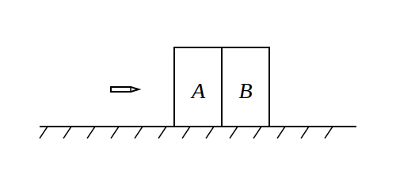

## 题目

> 该题来源于 2005-2006 年东北育才高一期末考试第 10 题。

（多选）如图所示，在光滑的水平面上紧挨着放置两块长方形物块，一颗子弹（可视为质点）沿水平直线射穿物块 A 并停留在物块 B 中。设子弹在两物块内运动时所受阻力大小恒定。已知：A、B 两物块的质量分别为 $M_{\text{A}}$ 和 $M_{\text{B}}$，子弹的质量为 $m$，子弹进入物块 A 之前，其速度为 $v_0$。两物块分离时 A 已移动位移 $s_1$，此后 B 继续移动位移 $s_2$ 后子弹与物块 B 相对静止。物块 A 和 B 水平方向的长度均为 $L$。根据上述已知条件：

**A.** 可以求得物块 A 和 B 的最终速度 $v_{\text{A}}$ 和 $v_{\text{B}}$
**B.** 可以求得子弹在物块 A 和 B 中相对运动的时间 $t_{\text{A}}$ 和 $t_{\text{B}}$
**C.** 可以求得子弹在物块 B 内进入的深度 $d$
**D.** 可以求得子弹在两物块内运动时所受阻力 $f$ 的大小

::: details 答案解析与推导过程

**1. 物理模型与临界分析**

- **第一阶段：子弹射穿 A**  
  子弹在 A 中移动时，受到向后的摩擦阻力 $f$，根据牛顿第三定律，子弹给物块 A 一个向前的摩擦力 $f$。由于 A、B 紧挨着，在 A 受到向前的力时，A、B 之间存在弹力，二者将作为一个整体一起向右做匀加速运动。
- **两物块分离的临界点：**  
  一旦子弹刚穿出 A、进入 B，子弹对 A 的向前作用力突然消失，而开始对 B 施加向前的作用力 $f$。此时，B 的加速度瞬间变大，而 A 在光滑水平面上不再受水平方向的合外力，加速度瞬间变为 $0$ 并开始做匀速运动。因此，**“两物块分离”的瞬间正是“子弹刚好射穿 A、穿入 B”的时刻**。
  - **在分离瞬间：** 物块 A 与 B 具有相同的速度（记为 $v_1$）。此后 A 保持该速度做匀速运动，故 A 的最终速度为 $v_{\text{A}} = v_1$。此时两物块的对地位移均为 $s_1$。
- **第二阶段：子弹在 B 中运动**  
  分离后，B 继续在子弹施加的阻力 $f$ 作用下加速，位移为 $s_2$ 后子弹与物块 B 相对静止，共同速度为 $v_{\text{B}}$。

**2. 列式推导与联立求解**

**（1）利用动量守恒定理：**

- **从开始到分离瞬间（第一阶段）：**  
  对于子弹、A、B 整体，水平方向动量守恒：
  $$m v_0 = (M_{\text{A}} + M_{\text{B}}) v_1 + m v_2 \quad \text{--- (1)}$$
  _(其中 $v_2$ 为分离瞬间子弹的速度)_
- **从分离到最终相对静止（第二阶段）：**  
  对于子弹和物块 B 组成的系统，水平方向动量守恒：
  $$M_{\text{B}} v_1 + m v_2 = (M_{\text{B}} + m) v_{\text{B}} \quad \text{--- (2)}$$

  将 (1) 式变形得到 $m v_2 = m v_0 - (M_{\text{A}} + M_{\text{B}}) v_1$，代入 (2) 式，消去未知量 $v_2$，可得：
  $$m v_0 - M_{\text{A}} v_1 = (M_{\text{B}} + m) v_{\text{B}} \quad \text{--- (3)}$$

**（2）利用动能定理引入位移关系：**

- **对于 A、B 整体在第一阶段：**  
  根据动能定理，摩擦力对整体做正功：
  $$f s_1 = \frac{1}{2} (M_{\text{A}} + M_{\text{B}}) v_1^2 \quad \text{--- (4)}$$
- **对于 B 在第二阶段：**  
  根据动能定理，摩擦力对 B 做正功：
  $$f s_2 = \frac{1}{2} M_{\text{B}} v_{\text{B}}^2 - \frac{1}{2} M_{\text{B}} v_1^2 \quad \text{--- (5)}$$

**（3）求解最终速度 $v_{\text{A}}$ 与 $v_{\text{B}}$（选项 A 正确）：**
联立式 (4) 和式 (5) 消去恒定阻力 $f$，可得：
$$\frac{M_{\text{A}} + M_{\text{B}}}{s_1} v_1^2 = \frac{M_{\text{B}}}{s_2} (v_{\text{B}}^2 - v_1^2)$$
变形可得 $v_{\text{B}}$ 与 $v_1$ 的比例关系：
$$v_{\text{B}} = \sqrt{1 + \frac{s_2(M_{\text{A}} + M_{\text{B}})}{s_1 M_{\text{B}}}} \cdot v_1$$

为使表达式简洁，令无量纲比例常数 $k = \sqrt{1 + \frac{s_2(M_{\text{A}} + M_{\text{B}})}{s_1 M_{\text{B}}}}$（$k$ 完全由已知量决定）。  
则：
$$v_{\text{B}} = k v_1$$

将 $v_{\text{B}} = k v_1$ 代入式 (3)：
$$m v_0 - M_{\text{A}} v_1 = (M_{\text{B}} + m) k v_1 \implies v_1 = \frac{m v_0}{M_{\text{A}} + k(M_{\text{B}} + m)}$$

由此求得 A、B 的最终速度：
$$v_{\text{A}} = v_1 = \frac{m v_0}{M_{\text{A}} + (M_{\text{B}} + m)\sqrt{1 + \frac{s_2(M_{\text{A}} + M_{\text{B}})}{s_1 M_{\text{B}}}}}$$

$$v_{\text{B}} = \frac{m v_0 \sqrt{1 + \frac{s_2(M_{\text{A}} + M_{\text{B}})}{s_1 M_{\text{B}}}}}{M_{\text{A}} + (M_{\text{B}} + m)\sqrt{1 + \frac{s_2(M_{\text{A}} + M_{\text{B}})}{s_1 M_{\text{B}}}}}$$

**（4）求解阻力 $f$ 的大小（选项 D 正确）：**
将求出的 $v_1$ 带回式 (4)，即可得到阻力 $f$：
$$f = \frac{(M_{\text{A}} + M_{\text{B}}) m^2 v_0^2}{2 s_1 \left[ M_{\text{A}} + (M_{\text{B}} + m)\sqrt{1 + \frac{s_2(M_{\text{A}} + M_{\text{B}})}{s_1 M_{\text{B}}}} \right]^2}$$

**（5）求解相对运动时间 $t_{\text{A}}$ 与 $t_{\text{B}}$（选项 B 正确）：**
由于阻力 $f$ 恒定，物块均在做匀变速直线运动，其平均速度等于初末速度之和的一半。

- 在物块 A 中运动的时间 $t_{\text{A}}$：
  $$t_{\text{A}} = \frac{2 s_1}{v_1} = \frac{2 s_1 \left[M_{\text{A}} + (M_{\text{B}} + m)k\right]}{m v_0}$$
- 在物块 B 中运动的时间 $t_{\text{B}}$：
  $$t_{\text{B}} = \frac{2 s_2}{v_1 + v_{\text{B}}} = \frac{2 s_2}{v_1(1+k)} = \frac{2 s_2 \left[M_{\text{A}} + (M_{\text{B}} + m)k\right]}{m v_0 (1+k)}$$

**（6）求解子弹在 B 中的深度 $d$（选项 C 正确）：**
第二阶段中，子弹相对 B 运动的平均相对速度为 $\frac{v_2 - v_1}{2}$，其相对位移即为进入物块 B 的深度 $d$：
$$d = \frac{v_2 - v_1}{2} t_{\text{B}}$$
结合动量守恒式，可得 $v_2 - v_1 = \frac{(M_{\text{B}} + m)(k - 1)}{m} v_1$。
代入上式化简，消去 $v_1$ 即可求得：
$$d = \frac{s_2 (M_{\text{B}} + m) (k - 1)}{m (k + 1)}$$

代入 $k$ 展开后的完整代数解析式为：
$$d = \frac{s_2(M_{\text{B}} + m)}{m} \cdot \frac{\sqrt{1 + \frac{s_2(M_{\text{A}} + M_{\text{B}})}{s_1 M_{\text{B}}}} - 1}{\sqrt{1 + \frac{s_2(M_{\text{A}} + M_{\text{B}})}{s_1 M_{\text{B}}}} + 1}$$

:::
