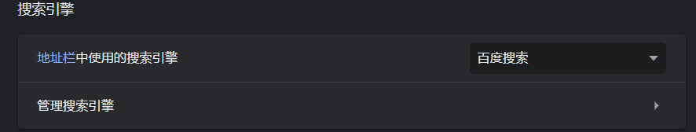
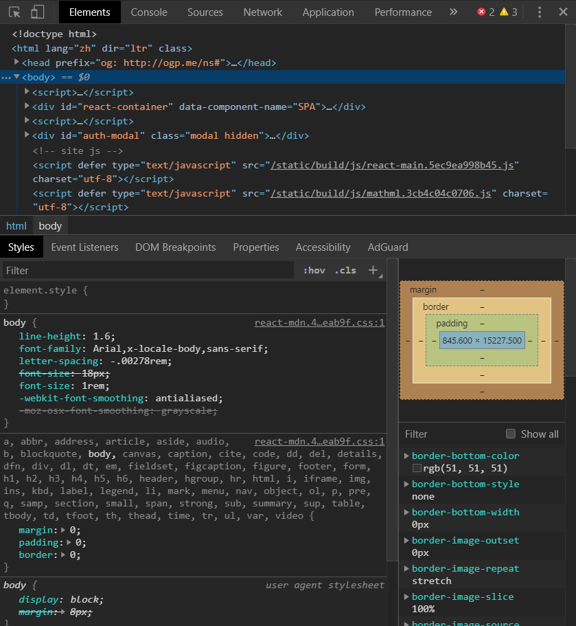

Chrome 是谷歌出品的浏览器。其内核使用 Chromium，基于 JavaScript V8，是全球比例最大的浏览器内核。

<!-- more -->

## 简介

Chrome 如今可以说是一家独大。很多国内浏览器都是基于 Chromium 内核的套壳浏览器。

Chrome 内核更新频繁，速度和安全性高，对新特性支持非常良好。另外谷歌具有十分强大的开发者工具，是前端开发使用的首选浏览器。目前最新的版本是 85。

## 配置

由于 Chrome 是谷歌出品的浏览器，所以搜索栏默认使用 Google 搜索，而在中国无法访问 Google 服务，所以需要在右上角的菜单中选择设置，在搜索引擎设置中改为百度即可正常使用。

## 快捷键

Chrome 具有很多快捷键，熟练掌握后可以大幅减少时间。

- `Ctrl + J`: 打开下载页面；
- `Ctrl + H`: 打开历史页面；
- `Ctrl + T`: 打开新标签页；
- `Ctrl + Shift + T`: 恢复上一个关闭的标签页；
- `Ctrl + N`: 打开新的窗口；
- `Ctrl + W`: 关闭当前标签页；
- `Ctrl + Tab`: 切换标签页；
- `Ctrl + Shift + Tab`: 反向切换标签页；
- `Ctrl + F`: 反向切换标签页；
- `Ctrl + Shift + I` 或 `F12`: 打开开发者工具；

## 开发者工具

使用 `Ctrl + Shift + I` 或 `F12` 即可打开开发者工具，在开发者工具里，您可以自由的对任何网页进行调试。

## Chrome 推荐扩展

- AdGuard: 广告屏蔽；
- Adobe Acrobat: 将当前网页转为 Adobe PDF 文件；
- Betternet Unlimited Free VPN Proxy: 免费的 VPN 代理；
- Checker Plus for Gmail™: Gmail 邮件管理；
- Convertio: 非常强大的文件在线转换；
- Dark Reader: 为网页启用夜间模式；
- Enhanced GitHub: 能够展示仓库大小，文件大小和快速下载按钮；
- Evernote Web Clipper: 印象笔记剪藏，非常好用的保存工具；
- Google 翻译: 谷歌翻译软件；
- ImTranslator: 翻译，字典，声音
- Infinity: 一款非常好的标签页软件；
- Office Online: 在线查看并编辑 Office 文件；
- React Developer Tools: React 开发者工具
- Save to Pocket: 离线网页的最佳插件；
- Vue.js Devtools: Vue.js 的开发者工具；
