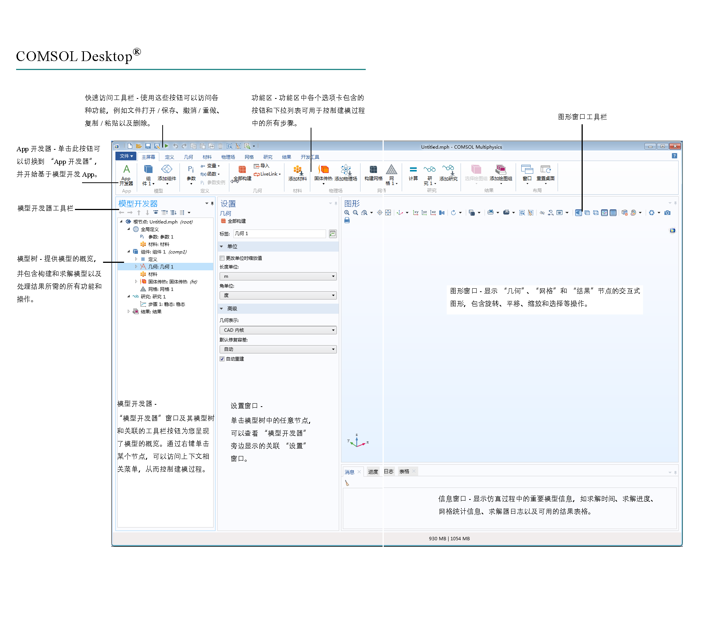

本章简单介绍如何在 COMSOL Multiphysics^®^ 中建立和运行有限元模型。

<!-- more -->

## COMSOL 建模流程

建模工作流程包含以下步骤:

- 建立模型环境
- 构建几何图形
- 指定材料属性
- 定义物理场边界条件
- 创建网格
- 运行仿真
- 结果后处理

## 用户页面

COMSOL Multiphysics^®^ 软件的 COMSOL Desktop^®^ 用户界面提供的建模环境可用于创建、分析以及可视化多物理场模型和 App。这个建模环境中嵌入了许多工具、菜单和窗口，例如 **模型开发器**窗口和节点、功能区、**设置**窗口、**图形**窗口、**信息**窗口以及其他组件。

在 COMSOL Multiphysics 中，COMSOL Desktop 为我们提供了功能强大的建模环境可供我们创建、分析以及可视化模型和 APP.

## 模型开发器和 App 开发器

COMSOL Desktop 环境包含两个主要组成部分: “模型开发器”和“App 开发器”。

“模型开发器”是定义模型及其组件的工具，例如求解方式、结果分析以及创建报告。可以通过构建模型树来实现这些操作。模型树反映了底层数据结构(即模型对象)，其中存储的模型状态包含以下设置: 几何、网格、物理场、边界条件、研究、求解器、后处理以及可视化。

“App 开发器”可供您通过易于使用的专业用户界面，基于在“模型开发器”中创建的模型快速创建 App。

## 模型开发器

“模型开发器”窗口提供的所有功能和操作都用来构建、求解模型以及显示结果。

模型树显示了模型数据结构的概览，可用于控制建模序列。

我们可以右键单击建模序列中的任意节点，访问上下文相关的选项。例如建立模型、创建定义、构建几何、添加材料、定义物理场、构建网格、运行仿真以及对结果进行后处理。

### 快速访问工具栏

“快速访问工具栏”可供您访问各种功能，例如打开、保存、撤消、重做、复制、粘贴以及删除。可以从定制快速访问工具栏列表(工具栏右侧的向下箭头)中定制其内容。

### 功能区

桌面顶部的功能区可供您访问用于完成大多数建模任务的命令。单击 App 开发器按钮可从“模型开发器”切换至“App 开发器”，并开始基于模型构建 App。

“模型开发器”窗口中的所有操作都可以通过功能区执行。这些命令根据每个主要建模步骤来分组和排序，因此我们提供了对应的功能区选项卡: 建立模型、创建定义、几何、材料。每个步骤都是我们刚才在“模型开发器”中看到过的。

::: tip

“功能区”特征在 COMSOL Multiphysics 4.4 及更高版本提供并且只在 Windows 版的 COMSOL Desktop 中提供,macOS 和 Linux 版本中则由其他菜单和工具栏代替。

:::

COMSOL Desktop 环境中的功能区选项卡反映了建模工作流程，并提供了每个建模步骤可用的功能概述，包括基于模型构建仿真 App。

主屏幕选项卡包含的按钮可用于更改模型、运行仿真以及开发和测试 App 等最常用的操作。例如，更改模型参数以执行参数化几何，检查材料属性和物理场，构建网格，运行研究以及将仿真结果可视化。

建模过程中的每个主要步骤均有对应的标准选项卡。按工作流程从左到右依次为: 定义、几何、材料、物理场、网格、研究、结果及开发工具。

::: tip 其他选项卡

上下文选项卡仅在需要时显示，例如三维绘图组选项卡，仅在添加相应的绘图组或在模型树中选择相应节点时显示。

模式选项卡用于某些特定的操作，此时功能区中的其他操作会暂时变得无关紧要。工作平面模式选项卡便是一个例子。在处理工作平面时，不会显示其他无关操作的选项卡。

:::

## 设置窗口

这是用于输入所有模型明细信息的主窗口，包括几何尺寸、材料属性、边界条件、初始条件以及执行仿真时求解器所需的任何其他信息。

我们在模型树中选择的任何节点都可以在右侧的“设置”窗口中查看其关联设置。这个窗口会根据模型树中当前选定的节点更新。这里也是用于输入所有仿真设置的主窗口。例如:

- 创建几何
- 设置任何已添加的材料的属性或任何物理场边界条件

## 绘图窗口

右侧的“图像”窗口用于显示几何、网格以及结果的交互式图像。可执行的操作包括旋转、平移、放大或缩小。图形窗口工具栏中的按钮则根据模型的空间维度以及模型树中当前选定的节点来更新。我们可以使用这些按钮来更新视图。比如选择几何实体、隐藏部分几何元素、更改图形渲染以及其他选项。

这些窗口用于图形输出。除图形窗口外，绘图窗口也用于对结果进行可视化。您可以使用多个绘图窗口同时显示多个结果。收敛图窗口是一个特例，它是
自动生成的绘图窗口，显示模型运行时求解过程收敛的图形表示。

## 信息窗口

绘图窗口下方是“信息”窗口。“消息/进度/日志”窗口用于显示重要的模型信息,例如: 警告消息、解算时间和进度、求解日志，并视情况显示结果表。

这些窗口用于显示非图形信息。包括:

- 消息: 此窗口显示有关当前 COMSOL Multiphysics 会话的各种信息。
- 进度: 显示求解器中的进度信息和停止按钮。
- 日志: 显示求解器中的信息，例如自由度数、求解时间以及求解器迭代数据。
- 表格: 以表格形式显示结果节点中定义的数值数据。
- 外部进程: 提供用于集群、云计算和批处理作业的控制面板。

::: tip 带取消按钮的进度条

在软件中进行解算或执行其他操作时，桌面右下角会出现一个进度条用于表明正当前正在执行的任何操作或计算的状态。进度条旁边有个红色的 “X” 符号，用来取消操作。

:::

## 其他窗口

功能区主屏幕选项卡中的窗口下拉列表可供您访问所有 COMSOL Desktop 窗口。对于 macOS 和 Linux 系统，则位于窗口菜单中。除上述窗口以外，您还
可以访问以下窗口:

- “添加物理场”和“添加多物理场”: 展开模型中的物理场接口。
- 添加研究: 更改研究类型。
- 从库中添加材料和材料浏览器: 访问材料属性库。
- 案例库: 从 MPH 文件(包含教学案例)和可运行 App 及其附属文档的集合中进行选择。
- 零件库: 加载一个预定义的参数化几何模型。
- 选择列表: 显示一组当前可供选择的几何对象、域、边界、边和点。
- 属性: 查看模型树节点属性。
- 调试日志: 显示方法的调试信息。
- 恢复文件: 查看恢复文件。
- 比较结果: 比较两个 MPH 文件的“模型开发器”和“App 开发器”设置。

### 动态帮助

COMSOL Desktop 右上角有个动态帮助按钮可以打开 “帮助” 窗口，您也可以使用 F1 键进行访问。它会提供有关窗口和模型树节点的内容以及相关帮助文本。
所以，这里显示的信息取决于模型树中当前选定的节点。假设我们想了解有关某个物理场边界条件的更多信息，例如选择 “热通量” 节点， “帮助” 窗口会显示相关的文本。

帮助窗口提供有关窗口和模型树节点的上下文相关帮助文本。如果已在 Desktop 中打开帮助窗口(例如按 F1 键)，则在单击某个节点或窗口时，会自动获取动态帮助。您可以从帮助窗口搜索其他主题，如菜单项。

## App 开发器 <Badge text="高级用法" />

一旦创建好模型，您就能基于自己的模型开发一个 APP, 并与同事或客户共享。单击 “App 开发器” 按钮，可以在桌面上切换“App 编辑器” 和 COMSOL Multiphysics。

App 开发器提供两个重要的 App 创建工具: “表单编辑器”和“方法编辑器”。此外， App 还可以包含菜单栏或功能区。“表单编辑器”包含的拖放功能可用于轻松访问用户界面组件并将其加入 App，例如输入框、图形窗口及按钮。“方法编辑器”是一个编程环境，可供您修改以模型对象数据结构表示的模型等。您还可以使用“方法编辑器”将用户界面逻辑和辅助功能添加到 App。“方法编辑器”支持使用 Java 编程语言来编写代码，也就是说，您可以使用所有 Java 语法和 Java 库。“方法编辑器”中的程序代码存储在方法中。“方法”是其他编程语言中所谓的子例程、函数或过程等名称的另一种说法，可用于修改“模型开发器”和“App 开发器”中的模型对象数据结构。方法既可用于修改当前会话的模型对象，也可用于修改正在运行的 App 中的模型对象。

通过使用 COMSOL Compiler 产品，您可以将 App(MPH 文件)编译成支持 Windows、Linux 和 macOS 操作系统的可执行文件，并将编译后的可执行文件自由分发给其他人使用，他们无需任何许可证文件就能运行这些可执行文件。

## 布局

您还可以根据需要定制桌面布局。所有窗口都可以调整大小、来回移动或隐藏。关闭会话时，您对 COMSOL Desktop 所做的任何更改都会保存。默认情况下，下次打开 COMSOL Multiphysics 时会显示这些更改。要恢复 COMSOL Desktop 的默认设置，使用“重置桌面”按钮就可以轻松完成。

## 内置常数、变量和函数

COMSOL Multiphysics 包含许多内置的常数、变量及函数，用户不能重新定义它们的保留名称。如果用户定义的变量、参数或函数使用保留名称，则输入的文本会变为橙色 (警告)或红色 (错误)，并且用户在选择文本字符串时，将看到一条工具提示消息。

以下是一些重要示例:

- 数学常数 (如 `pi` (3.14...))或虚部单位 `i` 或 `j`
- 物理常数，如 `g_const` (重力加速度)、`c_const` (光速)或 `R_const` (通用气体常数)
- 时间变量，`t`
- 因变量 (解)的一阶和二阶导数，其名称派生自空间坐标名称和因变量名称(用户定义的变量)
- 数学函数，如 `cos`、`sin`、`exp`、`log`、`log10` 和 `sqrt`
