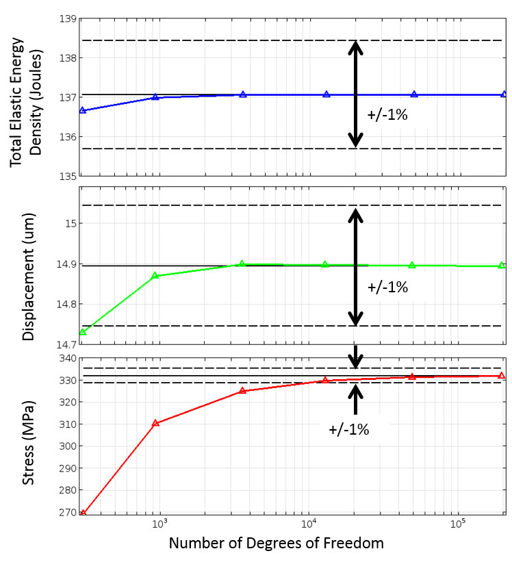
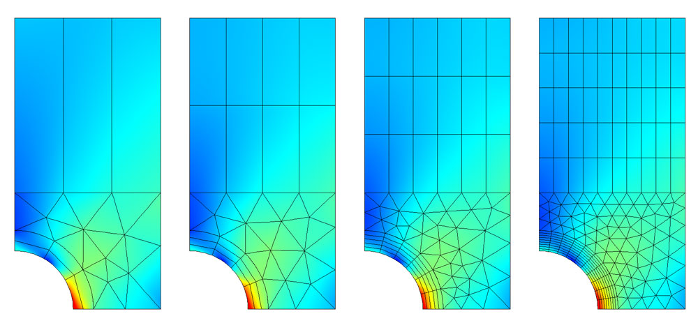

## 有限元网格划分和细化

基于任何有限元分析模型得到的精度都与所用的有限元网格直接相关。有限元网格用于将 CAD 模型分割为很多较小的域，我们称之为单元，然后在这些单元上求解一组方程，这些方程通过在每个单元上定义的一组多项式函数来近似表示所需的控制方程。随着网格的不断细化，这些单元变得越来越小，从而使求解的结果越来越接近真实解。

网格细化过程是我们验证有限元模型，并对软件、模型和计算结果建立信心的关键步骤。

## 网格细化过程

通常，我们首先需要了解所研究的物理系统，以及完整描述这一系统的几何结构，才能成功地进行有限元分析。几何结构可以通过 CAD 模型来表示。典型的 CAD 模型能够准确描述研究对象的形状和结构，但通常也包含一些修饰特征或制造细节；事实证明，这些信息往往与有限元建模无关。仿真分析人员应该对 CAD 模型进行一些工程判断，并决定是否可以在网格划分之前移除或简化这些特征和细节。从简单模型开始并逐渐增加复杂性的做法，往往比从复杂模型开始然后进行简化的做法要容易得多。

::: tip

在我做的流体流动中，如果几何表面具有复杂的不规则凸起或凹进时，对其进行稳态求解是不可能的，这些是一定要移除，或者构建一个新的表面做替代。

换句话说，一个模型的仿真过程，是由一个最基础的模型逐渐添加细节、逐步优化的过程。在第一版模型中，主要还是以可以模拟出合理的结果为其主要目标。在此基础上在进行优化。

:::

分析人员还应该了解与问题相关的所有物理场、材料属性、载荷、约束，以及可能影响分析结果的其他所有因素。这些输入可能存在不确定性。例如，我们并不总是能准确地了解材料属性和载荷。在建模过程中牢记这一点非常重要，因为试图使模型的解析精度超过输入数据的有效精度，并不是明智的做法。

::: tip

换句话说，在考虑模拟的结果时，也要考虑模拟结果的稳定程度及其准确度。

如果整个模型初始条件、或者某些特定的物理场参数，会极大的干扰模型，模型的收敛性很差甚至成混沌状态时(比如最经典的双摆)，得出结果的参考性与准确度就会很差，甚至无法完成模拟。

一定要选择适合的模型进行建模。

:::

一旦将所有这些信息都汇集到有限元分析模型中，分析人员便可以从初步网格开始进行操作。在早期分析过程中，较好的做法是从尽可能粗糙的网格(网格单元非常大)开始。求解粗糙网格所需的计算资源较少，尽管得到的解可能非常不准确，但这仍可以作为一种粗略的验证手段，并能对外加荷载及约束进行检查。

基于粗糙网格完成求解后，便可以开始网格细化过程了。就最简单的网格细化形式而言，这是一个用不断细化的网格来解析模型，并对不同网格下得到的结果进行比较的过程。通过对模型中一个或多个点上的物理场进行分析，或者在某些域或边界上对某个物理场进行积分计算，可以实现结果比较。

基于对这些标量的比较结果，可以判断某种程度的网格细化得到的解的收敛性。在至少比较三个连续得到的解之后，开始出现解的渐近行为，而不同网格得到的解之间的差异也变得越来越小。最终，这些差异将变得足够小，分析人员便可以认为模型已经收敛。具体的判断标准始终由分析人员来确定，因为他/她知道模型输入以及结果中可以接受的不确定性。

::: tip

换句话说，模型输入的精确度和最终模拟结果应当具有的准确度应该进行预估。输入模型精确度会对模拟结果造成一定影响的，在分析结果准确度时也要考虑这一情况。

:::

## 网格细化的不同度量指标

在研究收敛性时，需要选择合适的网格细
化度量指标。这种度量指标可以是局部的，也可以是全局的。也就是说，这一度量指标既可以在模型的某个位置进行定义，也可以是整个模型空间中的场积分。结构分析中某个点的位移或应力便是局部度量指标的一个例子，应变能密度在所有域上的积分则是全局度量指标的一个示例。应力和应变都根据解的梯度和位移场进行计算，而解的梯度总是计算到多项式近似的更低一阶。

在选择度量指标时，重要的是要记住，不同的度量指标会产生不同的收敛行为。下图正说明了这一点: 图中显示使用不同的网格求解同一有限元分析模型的情况。这些网格具有不同的单元尺寸，根据模型中的自由度(DOF)进行比较。自由度与节点 数量有关，“节点”是定义每个有限元形函数的计算点。求解有限元分析模型所需的计算资源与自由度直接相关。

从下图可以看出，某些度量指标的收敛速度相对更快，但需要注意的是，某一特定问题的网格收敛速度取决于所使用的网格划分技术。

> 分别采用全局度量指标(上图)、基于解物理场的局部度量指标(中图)，以及基于解梯度的局部度量指标(下图)的收敛性；并显示与最精确的解相比 1% 的误差条)。三个案例使用了相同的网格。

## 不同的网格细化技巧

就网格细化而言，现在已经发展出一套通用的技术。有经验的有限元分析软件用户应该非常熟悉这些技术，并了解它们各自的优缺点。

### 减小单元尺寸

减小单元尺寸是最简单的网格细化策略，其本质是减小整个建模域的单元尺寸。由于这种方法具有简单易用的优越性，因此非常具有吸引力；但也存在不足之处，对于需要更精细网格的局部区域，却无法选择性地进行网格细化。

### 提高单元阶数

提高单元阶数这一方法的优势在于，无需重新划分网格；您可以使用相同的网格，改变单元阶数。在处理复杂的三维几何时，重新划分网格非常耗时；另一方面，对于从外部来源获取的网格，我们无法进行更改。与其他网格划分技术相比，这一技术的缺点是需要消耗更多的计算资源。

### 全局自适应网格细化

全局自适应网格细化方法通过使用误差估计策略，确定建模域中局部误差最大的点。有限元分析软件随后会根据误差估计信息生成一个全新的网格。软件在兼顾整个模型的局部误差的同时，会在局部误差更显著的区域使用较小的单元。这种方法的优势在于，所有的网格细化工作均由软件完成；其缺点是用户无法对网格进行控制。如此一来，无关紧要的可以接受较大局部误差的区域可能会发生过度的网格细化。

::: tip

COMSOL 搞出的东西，算法还不错，如果只是快速的建模进行一个验证与计算的话，此方法是十分有用的。(如课堂作业，模拟比赛)

但是缺点也很明显，使用了它，您后期无法对网格进行控制和优化。重要研究如学位论文、科研课题慎用。

:::

### 局部自适应网格划分

局部自适应网格细化与全局自适应网格细化的不同之处在于，前者仅根据特定的度量指标，在整个模型空间的部分子集上进行误差估计。例如，可以通过细化网格，更精确地解析孔边界的应力。这种网格划分策略仍然是对整个模型重新划分网格，以达到减少某一区域误差的目的。如果存在一个符合逻辑且适用的局部度量指标来确定可以细化的网格，局部自适应网格细化方法便会优于全局自适应方法。

### 手动调整网格

对仿真分析人员来说，手动操作最频繁的方法是根据特定问题的物理场手动创建一系列不同的有限元网格，并根据直觉判断出哪些位置需要更精细的单元。在处理二维模型时，可以结合使用三角形和四边形单元。如果是三维模型，可以结合使用四面体、六面体(也称为砖型)、三角棱柱和金字塔单元。尽管三角形和四面体单元可用于对任何几何图形进行网格划分，然而在可以确定模型的解是沿一个或多个方向逐渐变化的情况下，使用四边形、六面体、棱柱和金字塔单元会更有帮助。通过在某些方向拉伸或收缩单元，可以调节网格以适应场的变化。

手动网格划分方法对分析人员的要求最高，需要对有限元法和求解的物理场有深刻的理解并具有丰富的实践经验。然而，只要运用得当，可以节省大量的时间和资源。

## 时域和频域网格划分

除了上面提到的各种网格划分技术，在对含有时变载荷的问题进行网格划分时，还需要考虑一些其他因素。具有非线性材料响应或任意时变激励的模型需要在时域内求解。另一方面，如果外加激励为单一频率，或在已知频率范围内，并且材料属性为线性，则首选方案是在频域中进行建模。对于每一种情况，都有相应适用的网格细化策略。

### 时间自适应网格划分

时间自适应网格细化方法是在不同的时间间隔对模型重新划分网格，并将每个时间间隔的解的误差估计作为重新划分模型网格的度量指标。当相关区域需要随着时间的推移保持较高的网格分辨率时，这种方法非常有用。

> 通过两相流模型求解的上升气泡模型的时间自适应网格细化。相边界附近的有限元网格更精细。

### 波长自适应网格划分

在频域中建模时，我们预先确定了激励频率的范围和材料属性。因此，便能够预测所有建模域中的波长。单元的尺寸必须远小于波长，其多项式基函数才能对波进行解析。

> 带介电负载的微波波导(剖视图)。波长自适应网格细化根据频率和材料属性改变单元尺寸。

## 有限元网格细化的挑战与发展趋势

就上述所有方法而言，要记住的关键一点是: 对于适定问题，无论使用哪种方法，都应当收敛到同一个解。这些不同方法之间的区别仅仅在于它们的收敛速度 不同。不过，这是一个明显的实际差异。根据问题的不同，一种技术的收敛速度可能比其他方法要快得多；但没有一种细化策略可以适用于所有情况。每个问题在网格划分方面都存在特定的技术难题，这不断给分析人员带来了挑战。

正在发生的一些变化将有助于应对这些困难。在过去的几年中，人们越来越容易获取价格低廉的云计算资源，这是最重要的进展之一，从而为并行运行多个不同的仿真实例创造了条件。正因如此，分析人员可以在更短的时间内研究各种不同的模型和网格划分方案，从而能够快速消除所有不确定因素。

网格生成算法本身也在不断的改进之中，越来越多地利用了多核计算带来的优势。除此之外，求解器也变得越来越高效，能够在集群计算机上求解大型模型。所有这些变化都将能在更短的时间内获得更精确的求解结果，加快分析和设计进程。

::: tip

在使用家用电脑(i7,i9)与服务器(至强 E5,E7)进行模拟中，无论是网格计算还是结果计算，都需要注意这一点。

有的求解器更加适用于几个左右的线程，大量使用矩阵迭代，新的迭代运算依赖旧的运算结果，这种情况下适合使用家用电脑(核数少主频高)

有的求解器可以拆分成数十个线程并行计算，这种情况下适合使用服务器(核数多主频不高)。

有关于这一情况的具体介绍，请查阅 [高性能计算(HPC)](http://cn.comsol.com/multiphysics/high-performance-computing)

:::
