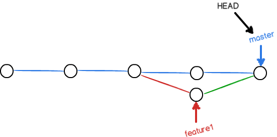
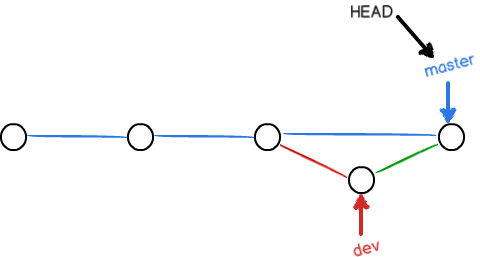

## 概述

分支就是科幻电影里面的平行宇宙，当您正在电脑前努力学习 Git 的时候，另一个您正在另一个平行宇宙里努力学习 SVN。

如果两个平行宇宙互不干扰，那对现在的您也没啥影响。不过，在某个时间点，两个平行宇宙合并了，结果，您既学会了 Git 又学会了 SVN!


分支在实际中有什么用呢? 假设您准备开发一个新功能，但是需要两周才能完成，第一周您写了 50% 的代码，如果立刻提交，由于代码还没写完，不完整的代码库会导致别人不能干活了。如果等代码全部写完再一次提交，又存在丢失每天进度的巨大风险。

现在有了分支，就不用怕了。您创建了一个属于您自己的分支，别人看不到，还继续在原来的分支上正常工作，而您在自己的分支上干活，想提交就提交，直到开发完毕后，再一次性合并到原来的分支上，这样，既安全，又不影响别人工作。

其他版本控制系统如 SVN 等都有分支管理，但是用过之后您会发现，这些版本控制系统创建和切换分支比蜗牛还慢，简直让人无法忍受，结果分支功能成了摆设，大家都不去用。

但 Git 的分支是与众不同的，无论创建、切换和删除分支，Git 在 1 秒钟之内就能完成! 无论您的版本库是 1 个文件还是 1 万个文件。

## 创建与合并分支

在版本回退里，您已经知道，每次提交，Git 都把它们串成一条时间线，这条时间线就是一个分支。截止到目前，只有一条时间线，在 Git 里，这个分支叫主分支，即 `master` 分支。`HEAD` 严格来说不是指向提交，而是指向 `master`，`master` 才是指向提交的，所以，`HEAD` 指向的就是当前分支。

一开始的时候，`master` 分支是一条线，Git 用 `master` 指向最新的提交，再用 `HEAD` 指向 `master`，就能确定当前分支，以及当前分支的提交点:


每次提交，`master` 分支都会向前移动一步，这样，随着您不断提交，`master` 分支的线也越来越长:

当我们创建新的分支，例如 dev 时，Git 新建了一个指针叫 `dev`，指向 `master` 相同的提交，再把 `HEAD` 指向 `dev`，就表示当前分支在 dev 上:


您看，Git 创建一个分支很快，因为除了增加一个 `dev` 指针，改改 `HEAD` 的指向，工作区的文件都没有任何变化!

不过，从现在开始，对工作区的修改和提交就是针对 dev 分支了，比如新提交一次后，`dev` 指针往前移动一步，而 `master` 指针不变:


假如我们在 dev 上的工作完成了，就可以把 dev 合并到 master 上。Git 怎么合并呢? 最简单的方法，就是直接把 master 指向 dev 的当前提交，就完成了合并:


所以 Git 合并分支也很快! 就改改指针，工作区内容也不变!

合并完分支后，甚至可以删除 dev 分支。删除 dev 分支就是把 dev 指针给删掉，删掉后，我们就剩下了一条 master 分支:


下面开始实战。首先，我们创建 dev 分支，然后切换到 dev 分支:

```sh
$ git checkout -b dev
Switched to a new branch 'dev'
```

`git checkout` 命令加上 `-b` 参数表示创建并切换，相当于以下两条命令:

```sh
$ git branch dev
# nothing
$ git checkout dev
Switched to branch 'dev'
```

然后，用 `git branch` 命令查看当前分支:

```sh
$ git branch
* dev
  master
```

`git branch` 命令会列出所有分支，当前分支前面会标一个 `*` 号。

然后，我们就可以在 dev 分支上正常提交，比如对 `readme.txt` 做个修改，加上一行:

```md
Creating a new branch is quick.
```

然后提交:

```sh
$ git add readme.txt
# nothing
$ git commit -m "branch test"
[dev b17d20e] branch test
 1 file changed, 1 insertion(+)
```

现在，dev 分支的工作完成，我们就可以切换回 master 分支:

```sh
$ git checkout master
Switched to branch 'master'
```

切换回 master 分支后，再查看一个 `readme.txt` 文件，刚才添加的内容不见了! 因为那个提交是在 dev 分支上，而 master 分支此刻的提交点并没有变:


现在，我们把 dev 分支的工作成果合并到 master 分支上:

```sh
$ git merge dev
Updating d46f35e..b17d20e
Fast-forward
 readme.txt | 1 +
 1 file changed, 1 insertion(+)
```

`git merge` 命令用于合并指定分支到当前分支。合并后，再查看 readme.txt 的内容，就可以看到，和 dev 分支的最新提交是完全一样的。

注意到上面的 `Fast-forward` 信息，Git 告诉我们，这次合并是 “快进模式”，也就是直接把 master 指向 dev 的当前提交，所以合并速度非常快。当然，也不是每次合并都能 `Fast-forward`。合并完成后，就可以放心地删除 dev 分支了:

```sh
$ git branch -d dev
Deleted branch dev (was b17d20e).
```

删除后，查看 `branch`，就只剩下 `master` 分支了:

```sh
$ git branch
* master
```

因为创建、合并和删除分支非常快，所以 Git 鼓励您使用分支完成某个任务，合并后再删掉分支，这和直接在 `master` 分支上工作效果是一样的，但过程更安全。

### 分支小结

- 查看分支: `git branch`

- 创建分支: `git branch <name>`

- 切换分支: `git checkout <name>`

- 创建+切换分支: `git checkout -b <name>`

- 合并某分支到当前分支: `git merge <name>`

- 删除分支: `git branch -d <name>`

---

## 冲突

人生不如意之事十之八九，合并分支往往也不是一帆风顺的。

准备新的 `feature1` 分支，继续我们的新分支开发:

```sh
$ git checkout -b feature1
Switched to a new branch 'feature1'
```

修改 readme.txt 最后一行，改为:

```md
Creating a new branch is quick AND simple.
```

在 `feature1` 分支上提交:

```md
git add readme.txt

\$ git commit -m "AND simple"
[feature1 14096d0] AND simple
1 file changed, 1 insertion(+), 1 deletion(-)
```

切换到 `master` 分支:

```sh
$ git checkout master
Switched to branch 'master'
Your branch is ahead of 'origin/master' by 1 commit.
  (use "git push" to publish your local commits)
```

Git 还会自动提示我们当前 `master` 分支比远程的 `master` 分支要超前 1 个提交。

在 `master` 分支上把 readme.txt 文件的最后一行改为:

```md
Creating a new branch is quick & simple.
```

提交:

```sh
git add readme.txt
$ git commit -m "& simple"
[master 5dc6824] & simple
 1 file changed, 1 insertion(+), 1 deletion(-)
```

现在，`master` 分支和 `feature1` 分支各自都分别有新的提交，变成了这样:


这种情况下，Git 无法执行“快速合并”，只能试图把各自的修改合并起来，但这种合并就可能会有冲突，我们试试看:

```sh
$ git merge feature1
Auto-merging readme.txt
CONFLICT (content): Merge conflict in readme.txt
Automatic merge failed; fix conflicts and then commit the result.
```

果然冲突了! Git 告诉我们，`readme.txt` 文件存在冲突，必须手动解决冲突后再提交。`git status` 也可以告诉我们冲突的文件:

```sh
$ git status
On branch master
Your branch is ahead of 'origin/master' by 2 commits.
  (use "git push" to publish your local commits)

You have unmerged paths.
  (fix conflicts and run "git commit")
  (use "git merge --abort" to abort the merge)

Unmerged paths:
  (use "git add <file>..." to mark resolution)

    both modified:   readme.txt

no changes added to commit (use "git add" and/or "git commit -a")
```

我们可以直接查看 readme.txt 的内容:

```diff
Git is a distributed version control system.
Git is free software distributed under the GPL.
Git has a mutable index called stage.
Git tracks changes of files.
<<<<<<< HEAD
Creating a new branch is quick & simple.
=======
Creating a new branch is quick AND simple.
>>>>>>> feature1
```

Git 用 `<<<<<<<`，`=======`，`>>>>>>>` 标记出不同分支的内容，我们修改如下后保存:

```md
Creating a new branch is quick and simple.
```

再提交:

```sh
$ git add readme.txt
# nothing
$ git commit -m "conflict fixed"
[master cf810e4] conflict fixed
```

现在，`master` 分支和 `feature1` 分支变成了下图所示:



用带参数的 `git log` 也可以看到分支的合并情况:

```sh
$ git log --graph --pretty=oneline --abbrev-commit
*   cf810e4 (HEAD -> master) conflict fixed
|\
| * 14096d0 (feature1) AND simple
* | 5dc6824 & simple
|/
* b17d20e branch test
* d46f35e (origin/master) remove test.txt
* b84166e add test.txt
* 519219b git tracks changes
* e43a48b understand how stage works
* 1094adb append GPL
* e475afc add distributed
* eaadf4e wrote a readme file
```

最后，删除 feature1 分支:

```sh
$ git branch -d feature1
Deleted branch feature1 (was 14096d0).
```

### 冲突小结

- 当 Git 无法自动合并分支时，就必须首先解决冲突。解决冲突后，再提交，合并完成。解决冲突就是把 Git 合并失败的文件手动编辑为我们希望的内容，再提交。

- 用 `git log --graph` 命令可以看到分支合并图。

## 分支管理策略

通常，合并分支时，如果可能，Git 会用 `Fast forward` 模式，但这种模式下，删除分支后，会丢掉分支信息。

如果要强制禁用 `Fast forward` 模式，Git 就会在 merge 时生成一个新的 commit，这样，从分支历史上就可以看出分支信息。

实战一下 `--no-ff` 方式的 `git merge`。首先，仍然创建并切换 `dev` 分支:

```sh
$ git checkout -b dev
Switched to a new branch 'dev'
```

修改 readme.txt 文件，并提交一个新的 `commit`:

```sh
$ git add readme.txt
# nothing
$ git commit -m "add merge"
[dev f52c633] add merge
 1 file changed, 1 insertion(+)
```

现在，我们切换回 `master`:

```sh
$ git checkout master
Switched to branch 'master'
```

准备合并 `dev` 分支，请注意 `--no-ff` 参数，表示禁用 `Fast forward`:

```sh
$ git merge --no-ff -m "merge with no-ff" dev
Merge made by the 'recursive' strategy.
 readme.txt | 1 +
 1 file changed, 1 insertion(+)
```

因为本次合并要创建一个新的 `commit`，所以加上 `-m` 参数，把 `commit` 描述写进去。

合并后，我们用 `git log` 看看分支历史:

```sh
$ git log --graph --pretty=oneline --abbrev-commit
*   e1e9c68 (HEAD -> master) merge with no-ff
|\
| * f52c633 (dev) add merge
|/
*   cf810e4 conflict fixed
...
```

可以看到，不使用 `Fast forward` 模式，`merge` 后就像这样:



### 分支管理惯例

在实际开发中，我们应该按照几个基本原则进行分支管理:

首先，`master` 分支应该是非常稳定的，也就是仅用来发布新版本，平时不能在上面干活；

那在哪干活呢? 干活都在 `dev` 分支上，也就是说，`dev` 分支是不稳定的，到某个时候，比如 `1.0` 版本发布时，再把 `dev` 分支合并到 `master` 上，在 `master` 分支发布 `1.0` 版本；

您和您的小伙伴们每个人都在 `dev` 分支上干活，每个人都有自己的分支，时不时地往 `dev` 分支上合并就可以了。

所以，团队合作的分支看起来就像这样:

```git-graph
commit
branch hotfix
checkout hotfix
commit
branch develop
checkout develop
commit id:"ash" tag:"abc"
branch featureB
checkout featureB
commit type:HIGHLIGHT
checkout main
checkout hotfix
commit type:NORMAL
checkout develop
commit type:REVERSE
checkout featureB
commit
checkout main
merge hotfix
checkout featureB
commit
checkout develop
branch featureA
commit
checkout develop
merge hotfix
checkout featureA
commit
checkout featureB
commit
checkout develop
merge featureA
branch release
checkout release
commit
checkout main
commit
checkout release
merge main
checkout develop
merge release
```

### 分支管理小结

- Git 分支十分强大，在团队开发中应该充分应用。

- 合并分支时，加上 `--no-ff` 参数就可以用普通模式合并，合并后的历史有分支，能看出来曾经做过合并，而 `fast forward` 合并就看不出来曾经做过合并。

---

## Bug 分支

软件开发中，bug 就像家常便饭一样。有了 bug 就需要修复，在 Git 中，由于分支是如此的强大，所以，每个 bug 都可以通过一个新的临时分支来修复，修复后，合并分支，然后将临时分支删除。

当您接到一个修复一个代号 101 的 bug 的任务时，很自然地，您想创建一个分支 `issue-101` 来修复它，但是，等等，当前正在 dev 上进行的工作还没有提交:

```sh
$ git status
On branch dev
Changes to be committed:
  (use "git reset HEAD <file>..." to unstage)

    new file:   hello.py

Changes not staged for commit:
  (use "git add <file>..." to update what will be committed)
  (use "git checkout -- <file>..." to discard changes in working directory)

    modified:   readme.txt
```

并不是您不想提交，而是工作只进行到一半，还没法提交，预计完成还需 1 天时间。但是，必须在两个小时内修复该 bug，怎么办?

幸好，Git 还提供了一个 `stash` 功能，可以把当前工作现场“储藏”起来，等以后恢复现场后继续工作:

```sh
$ git stash
Saved working directory and index state WIP on dev: f52c633 add merge
```

现在，用 `git status` 查看工作区，就是干净的(除非有没有被 Git 管理的文件)，因此可以放心地创建分支来修复 bug。

首先确定要在哪个分支上修复 bug，假定需要在 master 分支上修复，就从 master 创建临时分支:

```sh
$ git checkout master
Switched to branch 'master'
Your branch is ahead of 'origin/master' by 6 commits.
  (use "git push" to publish your local commits)

$ git checkout -b issue-101
Switched to a new branch 'issue-101'
```

现在修复 bug，需要把“Git is free software ...”改为“Git is a free software ...”，然后提交:

```sh
git add readme.txt
$ git commit -m "fix bug 101"
[issue-101 4c805e2] fix bug 101
 1 file changed, 1 insertion(+), 1 deletion(-)
```

修复完成后，切换到 `master` 分支，并完成合并，最后删除 `issue-101` 分支:

```sh
$ git checkout master
Switched to branch 'master'
Your branch is ahead of 'origin/master' by 6 commits.
  (use "git push" to publish your local commits)

$ git merge --no-ff -m "merged bug fix 101" issue-101
Merge made by the 'recursive' strategy.
 readme.txt | 2 +-
 1 file changed, 1 insertion(+), 1 deletion(-)
```

太棒了，原计划两个小时的 bug 修复只花了 5 分钟! 现在，是时候接着回到 `dev` 分支干活了!

```sh
$ git checkout dev
Switched to branch 'dev'

$ git status
On branch dev
nothing to commit, working tree clean
```

工作区是干净的，刚才的工作现场存到哪去了? 用 `git stash list` 命令看看:

```sh
$ git stash list
stash@{0}: WIP on dev: f52c633 add merge
```

工作现场还在，Git 把 stash 内容存在某个地方了，但是需要恢复一下，有两个办法:

一是用 `git stash apply` 恢复，但是恢复后，`stash` 内容并不删除，您需要用 `git stash drop` 来删除；

另一种方式是用 `git stash pop`，恢复的同时把 `stash` 内容也删了:

```sh
$ git stash pop
On branch dev
Changes to be committed:
  (use "git reset HEAD <file>..." to unstage)

    new file:   hello.py

Changes not staged for commit:
  (use "git add <file>..." to update what will be committed)
  (use "git checkout -- <file>..." to discard changes in working directory)

    modified:   readme.txt

Dropped refs/stash@{0} (5d677e2ee266f39ea296182fb2354265b91b3b2a)
```

再用 `git stash list` 查看，就看不到任何 stash 内容了。您可以多次 stash，恢复的时候，先用 `git stash list` 查看，然后恢复指定的 stash，用命令:

```sh
git stash apply stash@{0}
```

### 暂存小结

- 修复 bug 时，我们会通过创建新的 bug 分支进行修复，然后合并，最后删除；

- 当手头工作没有完成时，先把工作现场 `git stash` 一下，然后去修复 bug，修复后，再 `git stash pop`，回到工作现场。

---

## Feature 分支

软件开发中，总有无穷无尽的新的功能要不断添加进来。

添加一个新功能时，您肯定不希望因为一些实验性质的代码，把主分支搞乱了，所以，每添加一个新功能，最好新建一个 `feature` 分支，在上面开发，完成后，合并，最后，删除该 `feature` 分支。

现在，您终于接到了一个新任务: 开发代号为 `Vulcan` 的新功能，该功能计划用于下一代星际飞船。

于是准备开发:

```sh
$ git checkout -b feature-vulcan
Switched to a new branch 'feature-vulcan'
```

5 分钟后，开发完毕:

```sh
git add vulcan.py

$ git status
On branch feature-vulcan
Changes to be committed:
  (use "git reset HEAD <file>..." to unstage)

    new file:   vulcan.py

$ git commit -m "add feature vulcan"
[feature-vulcan 287773e] add feature vulcan
 1 file changed, 2 insertions(+)
 create mode 100644 vulcan.py
```

切回 `dev`，准备合并:

```sh
git checkout dev
```

一切顺利的话，feature 分支和 bug 分支是类似的，合并，然后删除。

但是!

就在此时，接到上级命令，因经费不足，新功能必须取消!

虽然白干了，但是这个包含机密资料的分支还是必须就地销毁:

```sh
$ git branch -d feature-vulcan
error: The branch 'feature-vulcan' is not fully merged.
If you are sure you want to delete it, run 'git branch -D feature-vulcan'.
```

销毁失败。Git 友情提醒，feature-vulcan 分支还没有被合并，如果删除，将丢失掉修改，如果要强行删除，需要使用大写的 `-D` 参数。。

现在我们强行删除:

```sh
$ git branch -D feature-vulcan
Deleted branch feature-vulcan (was 287773e).
```

终于删除成功!

### 删除小结

- 开发一个新 feature，最好新建一个分支；

- 如果要丢弃一个没有被合并过的分支，可以通过 `git branch -D <name>` 强行删除。

---

## 多人协作

当您从远程仓库克隆时，实际上 Git 自动把本地的 `master` 分支和远程的 `master` 分支对应起来了，并且，远程仓库的默认名称是 `origin`。

要查看远程库的信息，用 `git remote`:

```sh
$ git remote
origin
```

或者，用 `git remote -v` 显示更详细的信息:

```sh
$ git remote -v
origin  git@github.com:Hope-Studio/learngit.git (fetch)
origin  git@github.com:Hope-Studio/learngit.git (push)
```

上面显示了可以抓取和推送的 `origin` 的地址。如果没有推送权限，就看不到 push 的地址。

### 推送分支

推送分支，就是把该分支上的所有本地提交推送到远程库。推送时，要指定本地分支，这样，Git 就会把该分支推送到远程库对应的远程分支上:

```sh
git push origin master
```

如果要推送其他分支，比如 `dev`，就改成:

```sh
git push origin dev
```

但是，并不是一定要把本地分支往远程推送，那么，哪些分支需要推送，哪些不需要呢?

`master` 分支是主分支，因此要时刻与远程同步；

`dev` 分支是开发分支，团队所有成员都需要在上面工作，所以也需要与远程同步；

`bug` 分支只用于在本地修复 bug，就没必要推到远程了，除非老板要看看您每周到底修复了几个 bug；

`feature` 分支是否推到远程，取决于您是否和您的小伙伴合作在上面开发。

总之，就是在 Git 中，分支完全可以在本地自己藏着玩，是否推送，视您的心情而定!

### 抓取分支

多人协作时，大家都会往 `master` 和 `dev` 分支上推送各自的修改。

现在，模拟一个您的小伙伴，可以在另一台电脑 (注意要把 SSH Key 添加到 GitHub) 或者同一台电脑的另一个目录下克隆:

```sh
$ git clone git@github.com:Hope-Studio/learngit.git
Cloning into 'learngit'...
remote: Counting objects: 40, done.
remote: Compressing objects: 100% (21/21), done.
remote: Total 40 (delta 14), reused 40 (delta 14), pack-reused 0
Receiving objects: 100% (40/40), done.
Resolving deltas: 100% (14/14), done.
```

当您的小伙伴从远程库 clone 时，默认情况下，您的小伙伴只能看到本地的 `master` 分支。不信可以用 `git branch` 命令看看:

```sh
$ git branch
* master
```

现在，您的小伙伴要在 `dev` 分支上开发，就必须创建远程 `origin` 的 `dev` 分支到本地，于是他用这个命令创建本地 `dev` 分支:

```sh
git checkout -b dev origin/dev
```

现在，他就可以在 `dev` 上继续修改，然后，时不时地把 `dev` 分支 push 到远程:

```sh
git add env.txt

$ git commit -m "add env"
[dev 7a5e5dd] add env
 1 file changed, 1 insertion(+)
 create mode 100644 env.txt

$ git push origin dev
Counting objects: 3, done.
Delta compression using up to 4 threads.
Compressing objects: 100% (2/2), done.
Writing objects: 100% (3/3), 308 bytes | 308.00 KiB/s, done.
Total 3 (delta 0), reused 0 (delta 0)
To github.com:Hope-Studio/learngit.git
   f52c633..7a5e5dd  dev -> dev
```

您的小伙伴已经向 `origin/dev` 分支推送了他的提交，想要获取他的工作，您可以执行 `git fetch origin dev`。

如果这时碰巧您也对同样的文件作了修改，并试图推送:

```sh
$ cat env.txt
env

git add env.txt

$ git commit -m "add new env"
[dev 7bd91f1] add new env
 1 file changed, 1 insertion(+)
 create mode 100644 env.txt

$ git push origin dev
To github.com:Hope-Studio/learngit.git
 ! [rejected]        dev -> dev (non-fast-forward)
error: failed to push some refs to 'git@github.com:Hope-Studio/learngit.git'
hint: Updates were rejected because the tip of your current branch is behind
hint: its remote counterpart. Integrate the remote changes (e.g.
hint: 'git pull ...') before pushing again.
hint: See the 'Note about fast-forwards' in 'git push --help' for details.
```

推送失败，因为您的小伙伴的最新提交和您试图推送的提交有冲突，解决办法也很简单，Git 已经提示我们，先用 `git pull` 把最新的提交从 `origin/dev` 抓下来，然后，在本地合并，解决冲突，再推送:

```sh
$ git pull
There is no tracking information for the current branch.
Please specify which branch you want to merge with.
See git-pull(1) for details.

    git pull <remote> <branch>

If you wish to set tracking information for this branch you can do so with:

    git branch --set-upstream-to=origin/<branch> dev
```

`git pull` 也失败了，原因是没有指定本地 `dev` 分支与远程 `origin/dev` 分支的链接，根据提示，设置 `dev` 和 `origin/dev` 的链接:

```sh
$ git branch --set-upstream-to=origin/dev dev
Branch 'dev' set up to track remote branch 'dev' from 'origin'.
```

再 pull:

```sh
$ git pull
Auto-merging env.txt
CONFLICT (add/add): Merge conflict in env.txt
Automatic merge failed; fix conflicts and then commit the result.
```

这回 `git pull` 成功，但是合并有冲突，需要手动解决，解决的方法和分支管理中的解决冲突完全一样。解决后，提交，再 push:

```sh
$ git commit -m "fix env conflict"
[dev 57c53ab] fix env conflict

$ git push origin dev
Counting objects: 6, done.
Delta compression using up to 4 threads.
Compressing objects: 100% (4/4), done.
Writing objects: 100% (6/6), 621 bytes | 621.00 KiB/s, done.
Total 6 (delta 0), reused 0 (delta 0)
To github.com:Hope-Studio/learngit.git
   7a5e5dd..57c53ab  dev -> dev
```

因此，多人协作的工作模式通常是这样:

首先，可以试图用 `git push origin <branch-name>` 推送自己的修改；

如果推送失败，则因为远程分支比您的本地更新，需要先用 `git pull` 试图合并；

如果合并有冲突，则解决冲突，并在本地提交；

没有冲突或者解决掉冲突后，再用 `git push origin <branch-name>` 推送就能成功!

如果 `git pull` 提示 `no tracking information`，则说明本地分支和远程分支的链接关系没有创建，用命令 `git branch --set-upstream-to <branch-name> origin/<branch-name>`。

这就是多人协作的工作模式，一旦熟悉了，就非常简单。

### 多人协作小结

- 查看远程库信息，使用 `git remote -v`；

- 本地新建的分支如果不推送到远程，对其他人就是不可见的；

- 从本地推送分支，使用 `git push origin branch-name`，如果推送失败，先用 `git pull` 抓取远程的新提交；

- 在本地创建和远程分支对应的分支，使用 `git checkout -b branch-name origin/branch-name`，本地和远程分支的名称最好一致；

- 建立本地分支和远程分支的关联，使用 `git branch --set-upstream branch-name origin/branch-name`；

- 从远程拉取分支，使用 `git fetch`。

- `git pull`，相当于 `git fetch` + `git merge`，如果您的修改并没有和远程的修改发生冲突，两者会自动合并到您的本地，您可以直接推送上去。如果有冲突，要先处理冲突。

---

## Rebase

在上一节我们看到了，多人在同一个分支上协作时，很容易出现冲突。即使没有冲突，后 `push` 的童鞋不得不先 `pull`，在本地合并，然后才能 `push` 成功。

每次合并再 `push` 后，分支变成了这样:

```sh
$ git log --graph --pretty=oneline --abbrev-commit
* d1be385 (HEAD -> master, origin/master) init hello
*   e5e69f1 Merge branch 'dev'
|\
| *   57c53ab (origin/dev, dev) fix env conflict
| |\
| | * 7a5e5dd add env
| * | 7bd91f1 add new env
| |/
* |   12a631b merged bug fix 101
|\ \
| * | 4c805e2 fix bug 101
|/ /
* |   e1e9c68 merge with no-ff
|\ \
| |/
| * f52c633 add merge
|/
*   cf810e4 conflict fixed
```

总之看上去很乱，有强迫症的童鞋会问: 为什么 Git 的提交历史不能是一条干净的直线? 其实是可以做到的!

Git 有一种称为 `rebase` 的操作，有人把它翻译成“变基”。

先不要随意展开想象。我们还是从实际问题出发，看看怎么把分叉的提交变成直线。

在和远程分支同步后，我们对 `hello.py` 这个文件做了两次提交。用 `git log` 命令看看:

```sh
$ git log --graph --pretty=oneline --abbrev-commit
* 582d922 (HEAD -> master) add author
* 8875536 add comment
* d1be385 (origin/master) init hello
*   e5e69f1 Merge branch 'dev'
|\
| *   57c53ab (origin/dev, dev) fix env conflict
| |\
| | * 7a5e5dd add env
| * | 7bd91f1 add new env
...
```

注意到 Git 用 `(HEAD -> master)` 和 `(origin/master)` 标识出当前分支的 `HEAD` 和远程 `origin` 的位置分别是 `582d922 add author` 和 `d1be385 init hello`，本地分支比远程分支快两个提交。

现在我们尝试推送本地分支:

```sh
$ git push origin master
To github.com:Hope-Studio/learngit.git
 ! [rejected]        master -> master (fetch first)
error: failed to push some refs to 'git@github.com:Hope-Studio/learngit.git'
hint: Updates were rejected because the remote contains work that you do
hint: not have locally. This is usually caused by another repository pushing
hint: to the same ref. You may want to first integrate the remote changes
hint: (e.g., 'git pull ...') before pushing again.
hint: See the 'Note about fast-forwards' in 'git push --help' for details.
```

很不幸，失败了，这说明有人先于我们推送了远程分支。按照经验，先 pull 一下:

```sh
$ git pull
remote: Counting objects: 3, done.
remote: Compressing objects: 100% (1/1), done.
remote: Total 3 (delta 1), reused 3 (delta 1), pack-reused 0
Unpacking objects: 100% (3/3), done.
From github.com:Hope-Studio/learngit
   d1be385..f005ed4  master     -> origin/master
 * [new tag]         v1.0       -> v1.0
Auto-merging hello.py
Merge made by the 'recursive' strategy.
 hello.py | 1 +
 1 file changed, 1 insertion(+)
```

再用 `git status` 看看状态:

```sh
$ git status
On branch master
Your branch is ahead of 'origin/master' by 3 commits.
  (use "git push" to publish your local commits)

nothing to commit, working tree clean
```

加上刚才合并的提交，现在我们本地分支比远程分支超前 3 个提交。

用 `git log` 看看:

```sh
$ git log --graph --pretty=oneline --abbrev-commit
*   e0ea545 (HEAD -> master) Merge branch 'master' of github.com:Hope-Studio/learngit
|\
| * f005ed4 (origin/master) set exit=1
* | 582d922 add author
* | 8875536 add comment
|/
* d1be385 init hello
...
```

对强迫症童鞋来说，现在事情有点不对头，提交历史分叉了。如果现在把本地分支 `push` 到远程，有没有问题?

有!

什么问题?

不好看!

有没有解决方法?

有!

这个时候，rebase 就派上了用场。我们输入命令 `git rebase` 试试:

```sh
$ git rebase
First, rewinding head to replay your work on top of it...
Applying: add comment
Using index info to reconstruct a base tree...
M    hello.py
Falling back to patching base and 3-way merge...
Auto-merging hello.py
Applying: add author
Using index info to reconstruct a base tree...
M    hello.py
Falling back to patching base and 3-way merge...
Auto-merging hello.py
```

输出了一大堆操作，到底是啥效果? 再用 `git log` 看看:

```sh
$ git log --graph --pretty=oneline --abbrev-commit
* 7e61ed4 (HEAD -> master) add author
* 3611cfe add comment
* f005ed4 (origin/master) set exit=1
* d1be385 init hello
...
```

原本分叉的提交现在变成一条直线了! 这种神奇的操作是怎么实现的? 其实原理非常简单。我们注意观察，发现 Git 把我们本地的提交“挪动”了位置，放到了 `f005ed4 (origin/master) set exit=1` 之后，这样，整个提交历史就成了一条直线。`rebase` 操作前后，最终的提交内容是一致的，但是，我们本地的 commit 修改内容已经变化了，它们的修改不再基于 `d1be385 init hello`，而是基于 `f005ed4 (origin/master) set exit=1`，但最后的提交 `7e61ed4` 内容是一致的。

这就是 `rebase` 操作的特点: 把分叉的提交历史“整理”成一条直线，看上去更直观。缺点是本地的分叉提交已经被修改过了。

最后，通过 `push` 操作把本地分支推送到远程:

```sh
Mac:~/learngit michael$ git push origin master
Counting objects: 6, done.
Delta compression using up to 4 threads.
Compressing objects: 100% (5/5), done.
Writing objects: 100% (6/6), 576 bytes | 576.00 KiB/s, done.
Total 6 (delta 2), reused 0 (delta 0)
remote: Resolving deltas: 100% (2/2), completed with 1 local object.
To github.com:Hope-Studio/learngit.git
   f005ed4..7e61ed4  master -> master
```

再用 `git log` 看看效果:

```sh
$ git log --graph --pretty=oneline --abbrev-commit
* 7e61ed4 (HEAD -> master, origin/master) add author
* 3611cfe add comment
* f005ed4 set exit=1
* d1be385 init hello
...
```

远程分支的提交历史也是一条直线。

## Rebase 小结

- `rebase` 操作可以把本地未 `push` 的分叉提交历史整理成直线；

- `rebase` 的目的是使得我们在查看历史提交的变化时更容易，因为分叉的提交需要三方对比。
