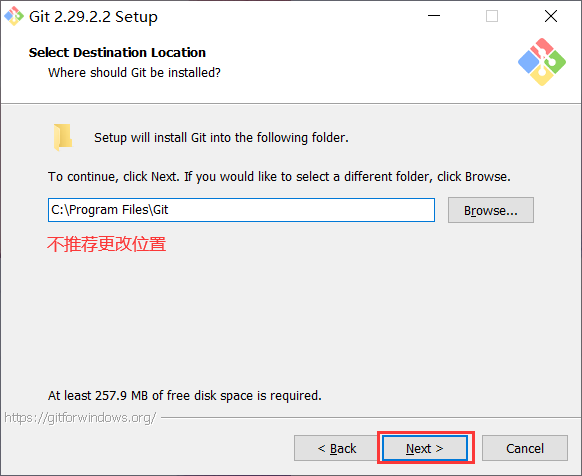

## Git 下载

官网在国外，网速较慢。在安装 Git 前推荐安装好 [VS Code](../vscode/readme.md)。

- [官网下载](https://git-scm.com/downloads/)

## Git 的安装

1. 点击 “next”。

   

1. 按照图示勾选。

   

1. 选择使用 VS Code 作为 git 的默认编辑器。

   

1. 选择第二项。

   

1. 选择默认选中的第一项。

   

1. 选择最后一项，直接检查与提交换行。

   

1. 选择第二项，使用 Windows 默认的控制台窗口。

   

1. 勾选全部特性，开始安装。

   

安装完成后，在开始菜单里找到 “Git” -> “Git Bash” (Mac 上叫 Git Shell)，蹦出一个类似命令行窗口的东西，就说明 Git 安装成功!


## Git 的初次配置

1. 为 Git 全局配置用户名和密码。

   ```bash
   git config --global user.name "Your Name"
   git config --global user.email "email@example.com"
   ```

   将上方的字符串换成您自己的名字和邮箱。

   如:

   ```bash
   git config --global user.name "Mr.Hope"
   git config --global user.email "zhangbowang1998@gmail.com"
   ```

   ::: info
   由于 Git 是一个多人协作的版本控制系统，首先你应当设置你的身份。
   :::

1. 创建 SSH Key。打开 Shell (Windows 下打开 cmd)，创建 SSH Key:

   ```bash
   ssh-keygen -t rsa -C "youremail@example.com"
   ```

   您需要把邮件地址换成您自己的邮件地址，然后一路回车，使用默认值即可，由于这个 Key 也不是用于军事目的，所以也无需设置密码。

   如果一切顺利的话，可以在用户主目录里找到 .ssh 目录，里面有 id_rsa 和 id_rsa.pub 两个文件，这两个就是 SSH Key 的秘钥对，id_rsa 是私钥，不能泄露出去，id_rsa.pub 是公钥，可以放心地告诉任何人。

   ::: tip

   - 这一步是生成你的身份识别信息，你可以放心的把公钥交给别人，留下自己的私钥。

   - .ssh 目录是默认隐藏的。Win10 查看隐藏文件详见 [显示隐藏的文件](../../code/windows/hidden-file.md)

   :::

   ::: info RSA
   RSA 是一种不对称加密，公钥的加密只能通过私钥解开，反之私钥的加密只能由公钥解开。也就是说当你给别人自己的公钥的时候，他们也无法冒充你。
   :::

1. 打开 [GitHub](https://github.com) 并选择 "Sign in" 注册自己的账号。

   

   登陆 GitHub 后，点击右上角头像，进入设置。

   进入 "安全设置" 下的 "SSH 公钥" 界面。

   

   在标题中填写公钥的备注名称，把 id_rsa.pub 文件的内容粘贴到底下的输入框中，设置一个标识此电脑的备注。
