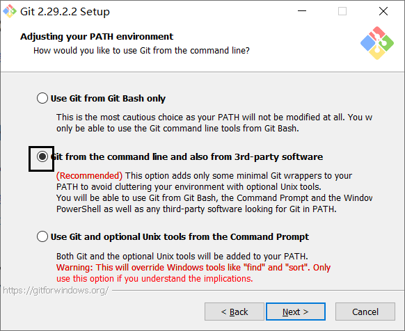
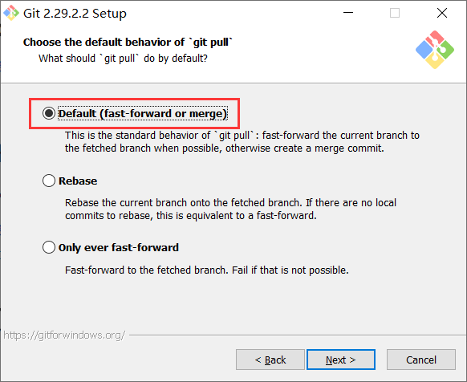

## Git 下载

官网在国外，网速较慢。在安装 Git 前推荐安装好 [VS Code](../vscode/README.md)。

- [官网下载](https://git-scm.com/downloads/)

## Git 的安装

1. 同意协议并选择安装位置 (不建议更改安装位置)

   

   

1. 启用 LFS 支持，其他随意 (影响不大)

   

1. 自行决定是否创建启动菜单

   

1. 选择使用 VS Code 作为 git 的默认编辑器。

   

1. 选择 Git 使用的默认分支名，GitHub 已经将默认分支名称改为 main。

   

   :::info

   在 2020 年的黑人运动中，部分黑人认为 master 这个词是对它们的冒犯。

   :::

1. 选择第二项，这将允许您在第三方工具中使用 Git，同时不会覆盖默认的 Windows 命令。

   

1. 使用 OpenSSL Library

   

   :::tip

   如果自己公司有 CA，或者在开发中需要 Git 承认某些自签 CA，则需要选择第二项。

   :::

1. 务必选择最后一项 “原样检出与提交”

   

1. 选择 Git 终端

   

   ::: tip

   如果您对 VS Code 和 PowerShell 还不熟悉，建议选择 MinTTY，以方便您接下来在学习中对 Git Bash 的临时使用。

   :::

1. 选择 `git pull` 的默认行为，保持默认不要改动

   

1. 选择凭据储存管理器，请选择第一个跨平台管理器

   

1. 额外的选项确认，均勾选即可

   

1. 一些实验性的功能，通常不太稳定或有 bug，不同 Git 版本会有差异，可根据自身情况确定

   

## Git Bash

安装完成后，您可以通过搜索找到“Git Bash” (Mac 上叫 Git Shell)，这是一个 Git 提供的命令窗口，您可以在这里运行 Git 命令。


::: tip

如果您对 VS Code 和 PowerShell 还不熟悉，您可以在接下来的学习与操作中使用 Git Bash。

否则，你可以:

- 在 Linux 上直接通过终端来使用 Git。
- 在 Windows 上安装最新的 PowerShell，并在终端中使用 Git。

:::

## Git 的初次配置

1. 为 Git 全局配置用户名和邮箱。

   ```bash
   git config --global user.name "Your Name"
   git config --global user.email "email@example.com"
   ```

   将上方的字符串换成您自己的名字和邮箱。

   如:

   ```bash
   git config --global user.name "Mr.Hope"
   git config --global user.email "mister-hope@outlook.com"
   ```

   ::: info

   由于 Git 是一个多人协作的版本控制系统，首先您应当设置您的身份。

   :::

1. 创建 SSH Key。打开 Shell (Windows 下打开 cmd)，创建 SSH Key:

   ```bash
   ssh-keygen -t rsa -C "youremail@example.com"
   ```

   您需要把邮件地址换成您自己的邮件地址，然后一路回车，使用默认值即可，由于这个 Key 也不是用于军事目的，所以也无需设置密码。

   如果一切顺利的话，可以在用户主目录里找到 .ssh 目录，里面有 id_rsa 和 id_rsa.pub 两个文件，这两个就是 SSH Key 的秘钥对，id_rsa 是私钥，不能泄露出去，id_rsa.pub 是公钥，可以放心地告诉任何人。

   ::: tip

   - ssh-keygen 用来生成一堆密钥，作为您的身份识别信息，您可以放心的把公钥交给别人，留下自己的私钥。

   - `.ssh` 目录是默认隐藏的。Win10 查看隐藏文件详见 [显示隐藏的文件](../../code/windows/hidden-file.md)

   :::

   ::: info RSA

   RSA 是一种不对称加密，公钥的加密只能通过私钥解开，反之私钥的加密只能由公钥解开。也就是说当您给别人自己的公钥的时候，他们也无法冒充您。

   :::

1. 打开 [GitHub](https://github.com) 并选择 "Sign in" 注册自己的账号。

   

   登陆 GitHub 后，点击右上角头像，进入设置。

   进入 "安全设置" 下的 "SSH 公钥" 界面。

   

   在标题中填写公钥的备注名称，把 id_rsa.pub 文件的内容粘贴到底下的输入框中，设置一个标识此电脑的备注。
